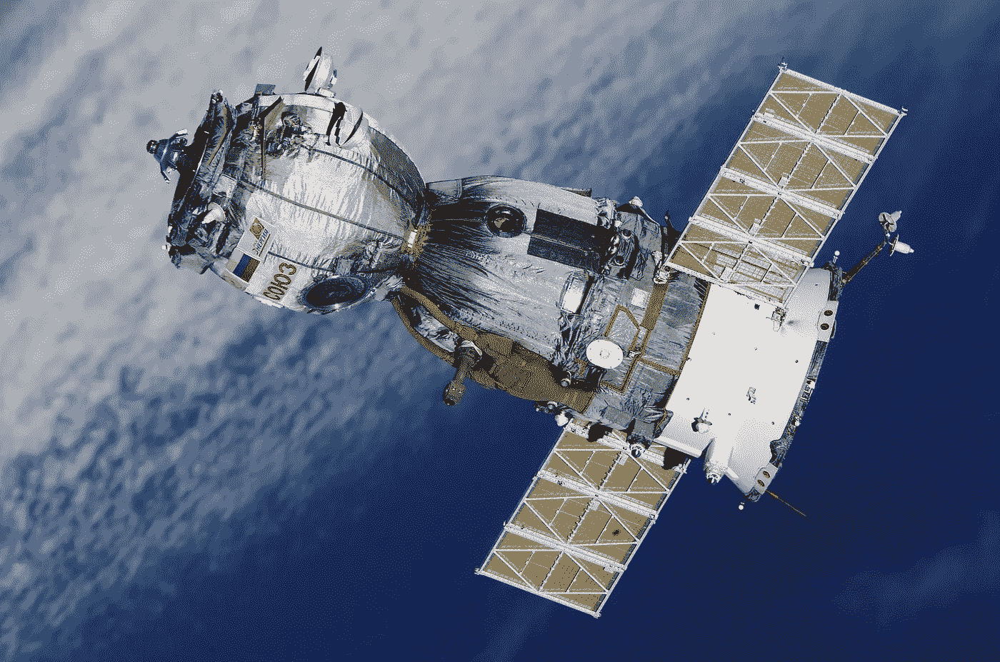

# 人工智能是如何为了更大的利益升级太空技术的？[五大领域]

> 原文：<https://towardsdatascience.com/how-ai-is-upgrading-space-technologies-for-a-greater-good-top-5-areas-e5f2245f8d3b?source=collection_archive---------39----------------------->

Credits: [Canva](https://www.canva.com)

人工智能和空间技术有着密切的关系。太空研究和探索是第一批在日常操作中实施人工智能的领域之一。

在太空探索中使用 AI 的一个关键原因是因为它必须处理大量数据。有如此多的数据要处理，人们不能完全依靠人类的智慧。人工智能正在帮助我们减少人为错误，并使估计接近现实。

让我们看看人工智能是如何通过对太空探索和研究做出贡献来造福人类的。

# #1 地球观测

我们一直在利用卫星进行通讯、导航、遥感等。近半个世纪以来。人工智能一直在帮助我们更高效、更有效地使用这项技术。

卫星的主要任务之一是收集数据并把数据传回给我们。在其整个生命周期中，卫星收集了大量的数据。大部分是无用的。AI 有利于搞清楚哪些数据有意义。

机器学习算法被用于分析大量的数据。这些算法可以在几分钟内分析数据，这有助于我们快速获得重要信息。

一个很好的例子是在移徙领域采取的保障措施。除此之外，人工智能还有许多其他应用，可以帮助我们更好地了解我们的地球。

# #2 城市规划

由于人工智能已经在帮助我们以更好的方式绘制地球地图，它帮助我们以最好的方式规划和设计城市区域。卫星被用来拍摄土地的照片以便绘图。

此外，卫星和人工智能还可以用于管理整个城市或城镇的交通。AI 可以提供一个管理密集交通区域交通的建议。

由于世界正在转向可再生能源，这也有助于我们确定放置风力涡轮机、水轮机或太阳能电池板的最佳位置，以获得最佳效果。

基于这些数据，我们可以相应地规划我们的城市，为更可持续的未来铺平道路。最终，人工智能将帮助我们创造一个更好的环境，确保我们工作和生活的地方能够满足今天的需求。

# #3 可再生能源预测

人工智能通过帮助天气预报部门提前识别天气模式来帮助他们。使用卫星作为主要输入设备，人工智能正在帮助我们预测天气模式。

例如，它帮助我们识别世界上哪个地方的潮汐强度更高。根据这些信息，我们可以最大限度地利用潮汐能，将其转化为电能。

我们对可再生能源了解得越多，我们就越能利用它们来使我们的地球更加可持续发展。越来越多的国家开始利用人工智能来优化可再生能源的使用。

# #4 污染监测

人工智能以许多不同的方式帮助减少污染。它帮助我们的最新方法之一是，如果某个港口拥挤或堵塞，就向附近的其他港口和船只发送信号。

这不仅有助于管理港口的交通，也有助于减少港口和城市附近的污染。利用卫星，它可以帮助减少航运带来的负面后果。

在卫星图像的帮助下，人工智能可以计算出最安全、最快的运输路线。这将有助于我们优化全球运输流程。

# #5 运输

AI 和 GPS 位置跟踪可以彻底改变公共交通。例如，人工智能可以在公共汽车站检测到人类，并通知公共汽车司机他/她应该在特定的车站预计有多少乘客。

它还可以通过检测途中的恶意活动来帮助士兵进行运输。除此之外，列车维护也是一个可以带来巨大利益的领域。

机器学习算法可以帮助我们通过查看卫星图像来确定需要特别注意的车厢。总的来说，人工智能和空间技术将简化任何东西或人的运输。

# 结论

公司和创新者可以继续受益于人工智能、人工智能和空间技术相结合带来的商业机会。随着技术的进步，由于这些和新的进步，我们的日常生活将继续进步。

*作者 Sandeep Agarwal，一家* [*iPhone 应用开发公司*](https://www.credencys.com/iphone-app-development/) *。*