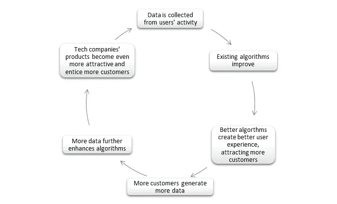

# 人工智能时代资本主义的未来。

> 原文：<https://towardsdatascience.com/how-ai-will-force-us-to-redefine-capitalism-2e8360f7aae0?source=collection_archive---------8----------------------->

Image by [Pexels](https://pixabay.com/ru/users/Pexels-2286921/?utm_source=link-attribution&utm_medium=referral&utm_campaign=image&utm_content=1853262) on [Pixabay](https://pixabay.com/ru/?utm_source=link-attribution&utm_medium=referral&utm_campaign=image&utm_content=1853262)

## 人工智能、数据和经济学

## 前景令人不安；然而，如果我们采取必要措施，挑战是可以克服的

资本主义是有史以来世界上最具弹性和最有效的经济意识形态，尽管它有缺点，因为没有可行的替代方案。资本主义不仅经受住了共产主义的挑战，成功地经受住了工业革命的负面影响，而且已经成为希望以可持续和有效的方式发展的国家的几乎普遍的经济政策。

但今天，许多政策制定者谈到需要改革资本主义，以确保其未来的活力和灵活性，并解决迫在眉睫的挑战，如不断加剧的不平等、无力应对环境退化和气候变化、金融体系的内在弱点(这在 2008 年金融危机中达到高潮)，以及越来越有吸引力的自由市场资本主义和中央集权、政府控制的经济的中国组合。

## 集中式与分布式

与共产主义曾经构成的威胁相比，资本主义目前面临的挑战相形见绌。然而，尽管有资本主义制度最终灭亡的不祥预测，但事实证明，是共产主义无法适应不断变化的现实，最终崩溃了，而资本主义在冷战后占据了至高无上的地位。这为所谓的华盛顿共识铺平了道路，即全球普遍采用资本主义原则，并通过国际货币基金组织和世界银行等国际机构得到美国和欧盟的支持。

资本主义打败共产主义的[原因](https://medium.com/datadriveninvestor/capitalism-vs-communism-from-data-sciences-perspective-d8d53e04eba5?source=---------10------------------)是分布式数据处理系统比集中式更有效。如果一个有多个数据处理器的系统出现错误，其他参与者会很快利用这个错误，使系统恢复平衡(这就是市场看不见的手的工作方式)。

另一方面，在中央数据处理系统中，决策是由单个处理器作出的，如果出现错误，将会产生灾难性的后果，因为没有人去纠正它。这一优势使得资本主义在冷战中击败了共产主义。

然而，人工智能可能会抵消资本主义的决定性优势，并使天平向有利于中央集权的经济体系倾斜。

毕竟罗马帝国以中央集权的数据处理方式存在了几个世纪，而延续了几百年的中国王朝也是依靠中央集权的官僚机器。

这意味着，如果 21 世纪的条件再次发生变化，资本主义的分布式数据处理系统在人工智能时代可能变得无关紧要。

众所周知，为了改进人工智能算法，可用数据的质量和数量成为一个重要因素。

如果政府拥有足够多的高质量数据，它们可以使用先进的人工智能算法来预测市场力量，然后评估潜在的选择，以应对挥之不去的危机或更有效地分配资源。那么，自由市场资本主义的意义何在？

以前，自我调节的市场力量确保了比中央经济计划好得多的效率。然而，一个拥有足够的经济活动数据的国家——中央系统在收集大量数据方面比资本主义国家好得多，资本主义国家的数据分散在各种行为者手中——将比其竞争对手拥有相当大的优势。

想象一下，在一个国家，甚至在崩溃的第一个迹象出现之前，就能发现并解决可能引发经济危机的漏洞。不会有商业周期这种东西:只有经济扩张，没有任何衰退。

那么，自由市场资本主义的意义何在？

## 人工智能驱动的垄断

资本主义的到来，人工智能的到来将挑战资本主义的另一个支柱——自由市场竞争。

人工智能驱动的经济的主要问题是，由于人工智能对数据的依赖所产生的正反馈循环，行业自然倾向于[垄断](/ai-powered-monopolies-and-the-new-world-order-1c56cfc76e7d) 。

如果一家使用人工智能的特定公司胜过其竞争对手，将很难抵制垄断的自我延续循环。这样的公司，得益于已经庞大的数据集，将拥有先进的算法。先进的算法意味着更好的用户体验和更多的功能，从而吸引更多的客户。更多的客户，反过来，产生更多的数据，这进一步改善了现有的算法，使公司的产品更有吸引力，最终导致更大的客户群，无止境。

Credit: Author

垄断的问题在于，资本主义的基石、其成功和效率的秘诀——自由竞争——可能会成为历史。

没有政府的干预，资本主义的发展引擎将会终结。

## “无用”类

由于算法和机器人取代了工作岗位，前所未有的社会动荡也对资本主义体系构成了威胁。

尽管研究表明，在短期内，人工智能创造的就业机会将多于淘汰的就业机会，但从长远来看，取代大部分就业机会在技术上是可行的。此外，尽管会出现新的工作，但它们大多是白领工作，需要非常高的知识水平和多年的大学培训。人工智能时代所谓的 [*技能偏见*](/implications-of-the-replacement-of-blue-collar-jobs-9029bc618ec6?source=---------13------------------) 将创造有史以来最不平等的社会。

一个新的“无用”人阶层将会形成，他们只会在由人工智能算法和机器人操作的经济中变得无关紧要和多余。他们对富人的不满可能会导致社会的严重动荡和不稳定的后果。

在工业革命之后，实业家的利润飙升，而受压迫的工人阶级的生活质量仍然很低。因此，社会主义和共产主义意识形态应运而生，它们试图迎合工人阶级的情绪，从而通过直接挑战资本主义的基础，对其构成有史以来最大的威胁。

世界各地的民主政府将如何应对这些挑战？就目前而言，西方政府未能减轻 ICT 革命远不那么严重的后果，比如不断加剧的不平等。当“政府变得对这些目标具有破坏性”时，也就是说，当政府无法为人民提供“生命、自由和对幸福的追求”时，“人民建立新政府的权利”会占上风吗？

## 资本主义将继续存在——尽管形式不同

尽管如此，令人怀疑的是，资本主义的西方将不可避免地崩溃，而共产主义的中国由于其集中的数据处理将不可避免地获得绝对的经济优势。

毕竟，正是灵活性、适应性和韧性定义了民主，并帮助它们长期存在，而不像独裁政权那样，因为无力和不愿适应变化和实施紧急改革而经常停滞不前和无法发展。

正如外交事务文章《自由世界》的作者所说，

> 美国第一届国会马萨诸塞州代表费希尔·艾姆斯(Fisher Ames)曾将专制比作一艘商船，“它航行得很好，但有时会触礁，沉入海底。”他说，一个共和国“是一只永远不会沉没的木筏，但是你的脚永远在水里。”自由秩序及其民主将会盛行，因为不自由主义的庄严航船很容易在动荡的时代搁浅，而自由主义的坚韧木筏则缓慢前行。

人类发展过程的独特之处在于，它受到对它的预测的影响。正如 g .索罗斯所说，

> …现实是一个移动的目标，因为它受我们理解的影响。我们习惯于认为事件是一系列事实:一系列事实接踵而至，永无止境。当一个情境有思考的参与者时，这个链条不会直接从一个事实引向另一个事实。它将一个事实与参与者的思维联系起来，然后将参与者的思维与下一组事实联系起来。

因此，马克思在《资本论》中对资本主义灭亡和无产阶级必然胜利的悲观预言并没有实现。

正如里根所说，

> 你怎么告诉一个共产主义者？嗯，是读马克思列宁的人。你怎么告诉一个反共产主义者？是懂马克思列宁的人。

这句话有更深的含义:里根不仅说共产主义者误解了 k·马克思；他还指出，因为反共产主义者理解 T2 和列宁，并采取措施改善工人阶级的状况，从而将潜在的叛乱扼杀在摇篮中，从而相应地改变了他们的行为。结果，革命没有发生，资本主义仍然存在

同样，今天关于人工智能引发的剧变将导致资本主义体系崩溃的不祥预测可能会迫使政策制定者改革这一体系，使其符合大多数人的期望并反映他们的需求。

此外，尽管自由市场可能会因为人工智能算法在经济决策中的实施而变得过时，但这并不意味着资本主义的美国将不可避免地输给共产主义的中国。美国的优势在于它拥有大量高质量的经济数据，这要归功于负责任地收集信息的悠久传统。

对于美国和其他资本主义国家来说，最好的方法是将人工智能无法取代的资本主义优势——如自由竞争和私营部门在处理可投资资源时的固有效率——与新技术结合起来并加以保留。它们可以用来识别系统中的潜在弱点，让市场这只看不见的手不是为市场的最佳利益服务，而是为最优秀的人服务。

我们可以通过减轻不受监管的自由放任资本主义的负面影响——不平等、垄断形成、欺诈和腐败——的措施来实现这一目标。

然而，这将要求西方政府控制大型科技，以防止垄断和维护自由竞争，同时设计更有效的税收制度，并实施一系列措施来降低不平等水平和巩固社会稳定。

为此，我们需要政府、民间社会、非政府组织和企业之间的互动与合作。只有通过共同努力，我们才能拯救资本主义，并促进向新时代相关的新型社会秩序的和平过渡。

> ……正是灵活性、适应性和复原力定义了民主，并帮助它们长期存在，而不像独裁政权那样，由于没有能力和不愿意适应变化和实施紧急改革，独裁政权往往停滞不前，无法发展。

正如共产主义和社会主义的意识形态因工人阶级的贫困状况而在工业革命后出现一样，如果我们不能克服机器人、人工智能和大数据的出现对资本主义构成的挑战，当前的秩序可能会因为全新的运动、信仰和理想的出现而终结。