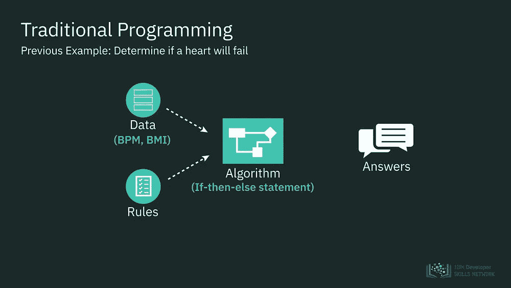
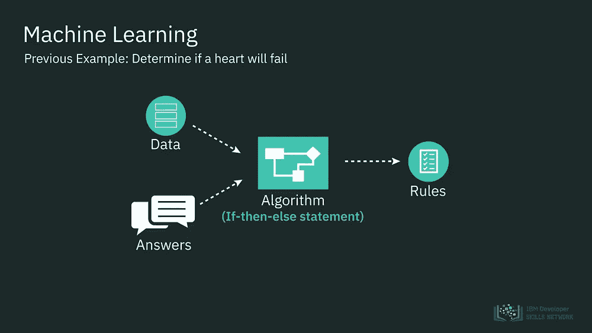

# 人工智能将如何重新定义经济学

> 原文：<https://towardsdatascience.com/how-ai-will-redefine-economics-ec305e3cb687?source=collection_archive---------2----------------------->

Photo by [M. B. M.](https://unsplash.com/@m_b_m?utm_source=medium&utm_medium=referral) on [Unsplash](https://unsplash.com?utm_source=medium&utm_medium=referral)

## 人工智能将使经济学更接近一门真正的科学

人工智能正以前所未有的方式改变着世界，并重新定义了人类努力的几乎所有领域。到目前为止，经济学一直抵制人工智能的采用，它将经历巨大的变革——可以说是自亚当·斯密创立这门科学以来最大的变革——从而帮助人类更好地解决问题。

简单地说，人工智能是一套技术，它允许我们分析数据，做出推断，预测，并在总体上做出更好的决定。机器学习是人工智能的一个子集，它能够自己不断学习，而不必由人类预先编程。

理解人工智能和机器学习如何改变该领域对于设定正确的优先事项和解决现有问题至关重要，这些问题不允许经济学被视为真正的科学。

Conventional programming versus machine learning. Source: IBM

## 为什么经济学不像自然科学——以及人工智能将如何纠正这一点

经济学和政治学的主要问题在于，它们并不构成真正的“科学”，如物理或数学。换句话说，自然科学和社会学科之间存在着明显的区别，这使得传统的科学方法不适用于社会学科。

正如诺贝尔经济学奖得主保罗·萨缪尔森[所说](https://www.aubreydaniels.com/blog/economics-not-science)，“经济学从来就不是一门科学——现在甚至不如几年前。”

> 经济学家坚持他们的理论模型，其中大多数在现实世界中几乎没有价值，因为他们无法考虑不可预测和内在不理性的人类行为对事态的影响。

人类是非理性的；他们的偏见、成见、误解和谬误决定了他们的行动。因此，在社会事件中，人们基于有缺陷的知识做出决定。

然而，尽管社会事件具有固有的不确定性，但大多数经济学家都坚信市场反映了人们的理性预期(导致了理性预期和完全竞争等理论的产生)。顺便说一下，正是由于无法认识到我们的非理性，导致了新自由主义经济学范式的出现和 2008 年的危机。

经济学家坚持他们的理论模型，其中大多数在现实世界中几乎没有价值，因为他们无法考虑人类感知对事态的影响以及随之而来的不确定性。

与物理学不同，经济学研究的是人、人的感知和非理性。由于玩家情绪的快速变化，某一天有效的模式下一次就不再有效了。

行为经济学已经认识到传统的经济理论是建立在错误的假设之上的。然而“由于缺乏对其研究数据的复制，缺乏对科学和行为科学(行为分析)的理解，经济学教授们只是根据他们的经验进行猜测。”显然，行为经济学虽然旨在更好地感知世界，但迄今为止还无法科学地做到这一点。

然而，人工智能和信息技术在经济学中的普遍应用可能会更好地改变这种情况。通过模拟人类行为，我们可以潜在地估计它对现实世界的影响。这将更容易识别金融泡沫和经济中的潜在脆弱性，并做出更好的预测。

Photo by [Element5 Digital](https://unsplash.com/@element5digital?utm_source=medium&utm_medium=referral) on [Unsplash](https://unsplash.com?utm_source=medium&utm_medium=referral)

## 经济学的政治化

由于人类思维的介入，经济学不能声称符合自然科学的标准。但经济学的问题超出了对世界的错误理解。

科学家的首要目标是追求真理。他们努力拥抱一种不偏不倚的态度，这种态度允许他们以可能的最佳方式分析现实世界。理论上，社会科学的学者也致力于获得真理。然而，在实践中，这很少成立。

政治家的主要目标不是通过更好地理解现实来获得真理，而是追求权力，这往往是通过操纵现实来实现的。经济学虽然远非真正的科学，但在当今日益党派化的环境中，它仍然是清晰和客观的源泉。

然而，政治经常干扰经济。

据*大西洋*报道，

> 自 2016 年大选以来，党派经济预期差距(即共和党人和民主党人对经济方向的评估之间的差异)已经扩大到前所未有的水平，从罗纳德·里根、乔治·w·布什和巴拉克·奥巴马总统时期的大约 20 点扩大到今天的 56 点。民主党人现在预计衰退即将到来，而共和党人预计强劲的增长将持续下去。“差距太大了，”密歇根大学社会研究所的理查德·科廷告诉我。

经济辩论经常变成政治辩论，经济学家不是致力于追求真理，而是成为其政党纲领的倡导者，歪曲或故意曲解和忽视现有证据。

为了避免经济学的政治化，我们可能会利用人工智能来分析所有关于经济的信息，并给出公正客观的基于证据和数据驱动的建议。人工智能将结束无休止的充满政治色彩的经济辩论，并将为我们提供如何应对经济挑战的平衡建议。

Photo by [Markus Spiske](https://unsplash.com/@markusspiske?utm_source=medium&utm_medium=referral) on [Unsplash](https://unsplash.com?utm_source=medium&utm_medium=referral)

## 经济预测—现在有了人工智能

当预测经济状况时，唯一确定的就是不确定性。经济学家在[预测](https://www.businessinsider.com/8-charts-prove-economic-forecasting-doesnt-work-2016-1)时[可怕](https://www.bloomberg.com/news/articles/2019-03-28/economists-are-actually-terrible-at-forecasting-recessions)。

例如，Prakash Loungani(国际货币基金组织)的分析显示，在过去的 150 次衰退中，经济学家未能预测到 148 次。

有效的经济预测面临许多障碍。一是几乎不可能预测消费者情绪的大幅波动。

> 增加的复杂性并不是唯一的问题——由于反馈循环，预测也变得不太可信。因此，如果气象学家说会下雨，你带伞出门并不会影响天气。但是，如果一位经济学家预测通货膨胀将上升 3%,而我们的反应是要求工资至少增加 3%,我们就改变了预测的基础。通货膨胀率现在可能会上升 3%以上。预测存在的事实改变了它试图预测的现实。
> 
> 为什么经济预测一直是一门有缺陷的科学？

人工智能驱动的预测分析将克服经济预测中存在的一些挑战。通过在行为经济学中实施人工智能技术，经济学家将能够更精确地估计人类感知和行为对实际事态的影响。预测分析的使用将结合经典的统计分析和人工智能的新世界。

人工智能算法还可以分析媒体标题如何影响对经济的看法。事实上，摩根大通已经[使用](https://www.cnbc.com/2019/09/08/donald-trump-is-tweeting-more-and-its-impacting-the-bond-market.html)一种算法来跟踪特朗普总统的推文对金融市场的影响。

央行和财政当局知道衰退何时到来，将更有效、更迅速地实施货币和财政工具，从而减轻商业周期的影响。

我们甚至可以预测供给和需求的变化，以实施必要的改变，从而避免经济衰退。

正如约翰·索内尔在 [*金融时报*](https://www.ft.com/content/6250e4ec-8e68-11e7-9084-d0c17942ba93) 所写的，

> 我们所有的联网设备都在输出大量关于我们实时经济活动、需求和欲望的数据。如果利用得当，这些数据可以模仿价格机制，作为一种匹配供需的手段。

## 人工智能驱动的决策

D. Esty 和 R. Rushing 在 [*Issues*](https://issues.org/esty-2/) *中写道:“联邦政府在使用信息技术以创新的方式收集、分析和使用数据方面还只是皮毛。*

正如我在《人类事件》**的文章中所写的，“决策者可以依赖数据和人工智能算法，而不是依赖个人经验、非理性本能、误导的教条或有害的偏见。”**

> *理论上，社会科学的学者也致力于获得真理。然而，在实践中，这很少成立。*

*人工智能将使政府官员不再依赖传统的有缺陷的数据收集方法，而是将他们的决策建立在数据基础上。信息技术将使数据驱动的监测、政策评估和分析成为可能。*

## *经济学重新定义*

*多亏了循证经济决策的出现，我们将能够结束无休止的经济辩论，找到基于数据的共同点。*

*AI 将做出更好的预测，并将人类感情(即反身性)对实际事态的影响纳入考虑。总之，这些变化将使经济学更接近一门真正的科学。*

*人工智能的出现是经济学史上一个最重要的事件。我们的目标应该是有效地利用人工智能的力量来改善我们所有人都能繁荣发展的经济条件。*

**进一步:**

* [## 人工智能将标志着政治史上的一个转折点。人类事件

### 科技如何让世界变得更加民主？科技对政治的影响力无处不在。在…

humanevents.com](https://humanevents.com/2019/10/23/a-i-will-mark-a-turning-point-in-the-history-of-politics/)  [## 人工智能时代资本主义的未来

### 前景令人不安；然而，如果我们采取必要措施，挑战是可以克服的

towardsdatascience.com](/how-ai-will-force-us-to-redefine-capitalism-2e8360f7aae0)*