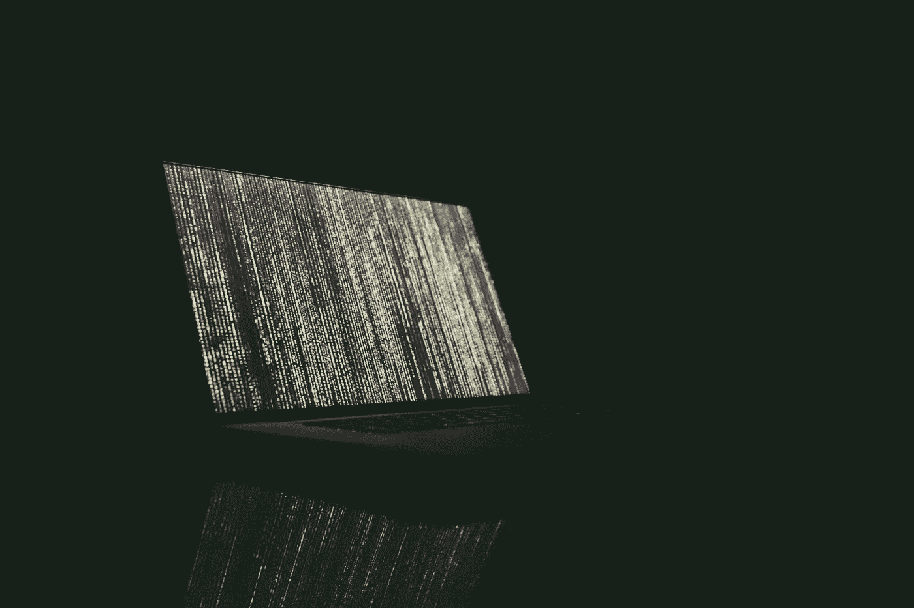

# 算法如何塑造另一种现实——鲍德里亚式的分析

> 原文：<https://towardsdatascience.com/how-algorithms-are-shaping-an-alternative-reality-a-baudrillardian-analysis-76e68f6dad56?source=collection_archive---------25----------------------->

Photo by [Markus Spiske](https://unsplash.com/@markusspiske?utm_source=unsplash&utm_medium=referral&utm_content=creditCopyText) on [Unsplash](https://unsplash.com/?utm_source=unsplash&utm_medium=referral&utm_content=creditCopyText)

有偏见。有偏见。种族主义者。

通常，当我们谈论算法时，我们采用拟人化的语言。将人类特征归因于本质上无生命的代码是我们理解算法本质的方式。

虽然这为我们提供了一种表达方式，但它并没有抓住辩论的细微差别。给一个算法贴上有偏见的标签，意味着它是一个自主的实体。这意味着是代码本身存在偏见，而不是编写代码的开发人员或认可代码的组织。

从本体论方法(关注什么算法*是*)转移到目的论方法(关注什么算法*做什么*)允许问题的微妙之处浮出水面。

# 算法做什么

算法产生现实的模型或表示，然后用于推断大量的决策。

这些范围从网上购物的产品推荐到高中教师的绩效评估；医院出院的贷款申请批准；从保险费风险评估到社交媒体新闻排名。

我们可以把这些模型看作是模拟的类型。

这些模拟不仅构建了我们的虚拟生活，也构建了我们的现实生活，影响着我们日常生活中的社会、经济和政治领域。

> 算法不是简单地反映现实，而是积极地创造现实。

# 鲍德里亚式分析

为了充分理解这些模拟的深层影响，我们可以求助于法国哲学家、社会学家和文化理论家让·波德里亚。

鲍德里亚写了大量关于**模拟**(真实的副本)如何逐渐演变成**拟像**(真实的)，与原作几乎没有相似之处。

他用来阐明他的概念的一个例子是地图，一个人工产生的抽象，代替实际的地理地形。

今天，这与我们和数字地图的互动产生了共鸣。我们认为现实不是我们看得见的，而是像谷歌地图这样的导航应用所描绘的那样。

另一个更现代的例子是 Instagram，在那里，大量经过严格过滤的图像和精心策划的信息聚合成一个虚构的现实。一个人的网络身份取代了他们现实生活中的身份。

将这个概念与算法联系起来，让我们探索算法创建的模型最终如何取代现实。

作为一个例子，我将使用在美国广泛使用的累犯模型来确定监狱判决，如凯茜·奥尼尔的*数学毁灭武器:大数据如何增加不平等和威胁民主中所详述的。*

根据鲍德里亚的说法，模拟(鲍德里亚称之为图像)如何转变为拟像有四个阶段。

> “这将是图像的连续阶段:它反映了深刻的现实；它掩盖和改变了深刻的现实；它掩盖了深刻现实的缺失；它与任何现实都没有关系；它是自己纯粹的拟像。”

(来源:拟像与仿真，p6)

让我们进一步打开包装。

## 1.模拟反映了现实

该算法的目的是建立一个犯罪人的准确图像，然后可以用来推断相应的累犯风险——他们重新犯罪的可能性有多大。

这里的意图完全没有恶意——它旨在创造真实的现实反映。

## 2.模拟扭曲了现实

随着算法的开发，它需要访问数据点来运行风险评估。当特定的数据不容易获得时(大多数情况下不容易获得)，开发人员求助于代理。

这可能意味着使用间接数据点，如一个人的家乡和相应的犯罪率，作为其重新犯罪风险的指标。因此，一个出生在高犯罪率地区的人会被自动认定为高危人群。

其他的“替身”包括从一个人被警察拦下搜查的次数中得出相关性。这明显忽略了一个事实，即在英国和美国，黑人不成比例地受到统一卫生系统法律的约束。

通过将相关性与因果性混为一谈，算法模型输出了一个扭曲的现实版本。

## 3.模拟掩盖了现实的缺失

由于自我延续的反馈循环，几乎不可能检测到算法是基于虚假的现实而工作的。

通过认定一名罪犯极有可能再次犯罪，该算法不只是简单地做出预测，而是积极创造实现预测的物质条件。

考虑一个在等待判决的人，他住在一个高犯罪率的社区。他很有可能来自这样一个地区，他的朋友或家庭成员有前科。利用这一标准，该算法给所述人分配高风险分数，导致最长的监禁时间。

这个人在监狱里呆的时间越长，一旦被释放，他们的工作前景就越渺茫，尤其是如果被释放到同一个高犯罪率的街区。在绝望的尝试中，如果这个人确实犯了另一个罪行，这就转化为算法表面上的胜利。

## 4.模拟变成了现实

对于观察者来说，情况的真实情况是完全模糊的。

无论一个人是否有可能再次犯罪，都要感谢算法产生的模拟模型，无论如何，他都被视为高风险。

正如鲍德里亚所说，

> 所有的越轨行为，不管是模拟的还是真实的，都有相同的后果。

我们现在踏上了超现实的土地，在这里现实和想象之间的区别毫无意义。这听起来可能很抽象，但正如我们上面提到的，它有着严重的现实后果。数学模型、数据结构和统计系统现在发号施令。

> "现实本身仅仅开始模仿模型，而模型现在领先于并决定着现实世界."

([来源](https://www.cla.purdue.edu/academic/english/theory/postmodernism/modules/baudrillardsimulation.html)

# 那么我们能做什么呢

为了有效地根除算法偏差，我们需要审计算法。

通过大规模仔细检查算法的输入和输出，我们可以辨别它所依赖的潜在假设、前提和相关性。纠正这些错误可以作为改善自动化系统造成的不公正的起点。

以替代事实为特征的替代现实的前景正在迅速成为现实。除非我们接受算法透明性、问责制和审查，否则我们几乎没有机会抵御这一迫在眉睫的威胁。