# 分析如何帮助企业

> 原文：<https://towardsdatascience.com/how-analytics-can-help-business-84ae8ca76a6d?source=collection_archive---------26----------------------->

这篇文章的目的是解释如何以简单的方式使用 Python 来帮助你的**公司成长**。

如果你想自己使用这个方法，你可以在我的 [github](https://github.com/FahimehK/The-Data-Driven-Business/blob/master/Data_Exploration%20for%20customer%20segmentation.ipynb) 访问我的代码。你所需要的只是关于[蟒蛇](https://www.kaggle.com/learn/python)和[熊猫](https://www.kaggle.com/learn/pandas)的基本知识。

你可以在 [Kaggle 在线零售数据](https://www.kaggle.com/vijayuv/onlineretail)找到我要用的数据。

理解手头数据的第一步是理解不同变量之间如何相互作用。

像往常一样，我们需要使用 pandas 从 CSV 读取数据:

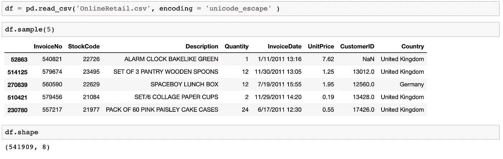

正如您在上面看到的，我们的功能有限，但是我们可以使用数学和统计学从可用的功能中创建功能。

我们将使用的可用功能有:

> 量
> 
> 发票日期
> 
> 单价
> 
> CustomerID
> 
> 国家

根据这些特性，我们将创建:

> 收入
> 
> 百分比增长
> 
> 用户类型(新客户和现有客户)
> 
> 保留率

# 清理数据:

在删除空值和重复值、缩小范围到仅英国数据(因为它有最多的记录)、删除 2011 年 12 月的月份(因为 12 月的数据不完整)并将“InvoiceDate”对象更改为 DateTime 之后，我们得到以下结果:

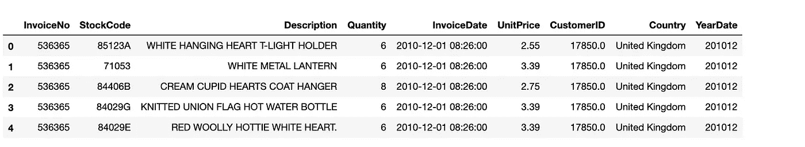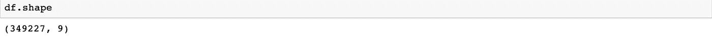

现在，我们的数据从 541909 行 8 列减少到 349227 行 9 列。我们在删除空值和重复值时需要小心，因为我们不希望丢失太多数据，但是因为我们这里有足够的数据，所以我们可以承受丢失一些数据。

既然我们已经清理了数据，是时候写下清晰客观的 KPI 了，这些 KPI 根据每个企业的目标而有所不同。出于本文的目的，我决定选择每月的总收入作为 KPI。让我们来计算一下**月**收入。

# **月收入:**

***收入*** *=单价*数量*

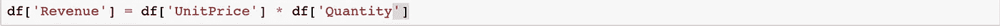

使用熊猫来寻找每个月的收入。

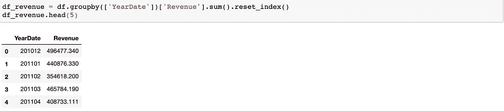

现在有趣的部分，我使用[来可视化数据。](https://plot.ly/)

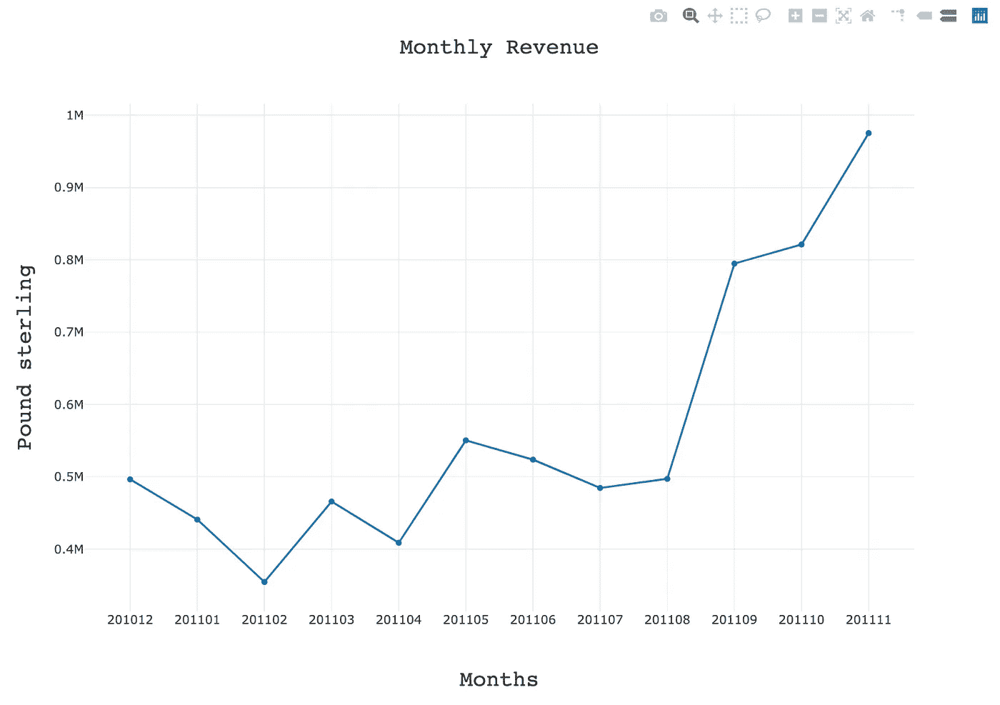

正如你在上面看到的，收入从 2011 年 8 月开始上升。然而，2 月和 4 月显示出下降趋势。

计算**月增长**也很有用，你可以在下面找到。

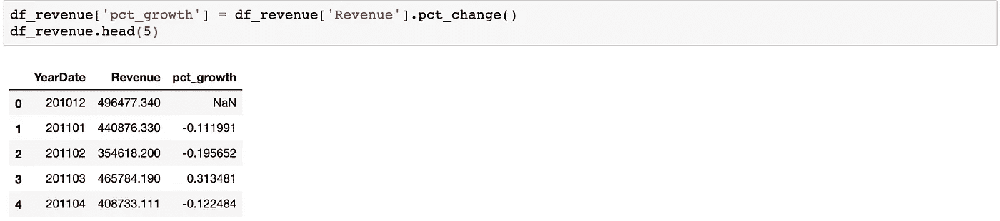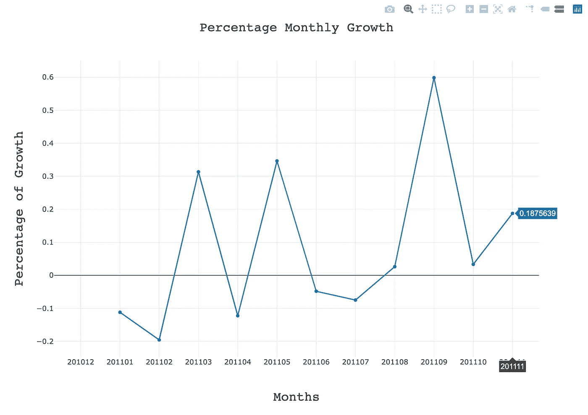

上图显示，2011 年 11 月的收入增长了近 19%,最大的增长发生在 9 月，增长了近 60%。正如我们之前看到的，增长在二月和四月下降。让我们多评估，多了解数据。

# 每月订单数量:

我们使用与查找月收入相同的方法来查找月订单数。

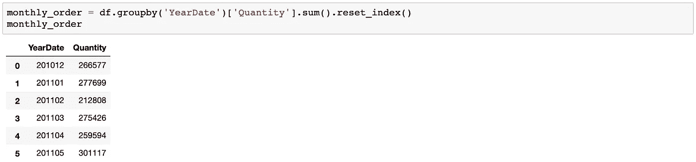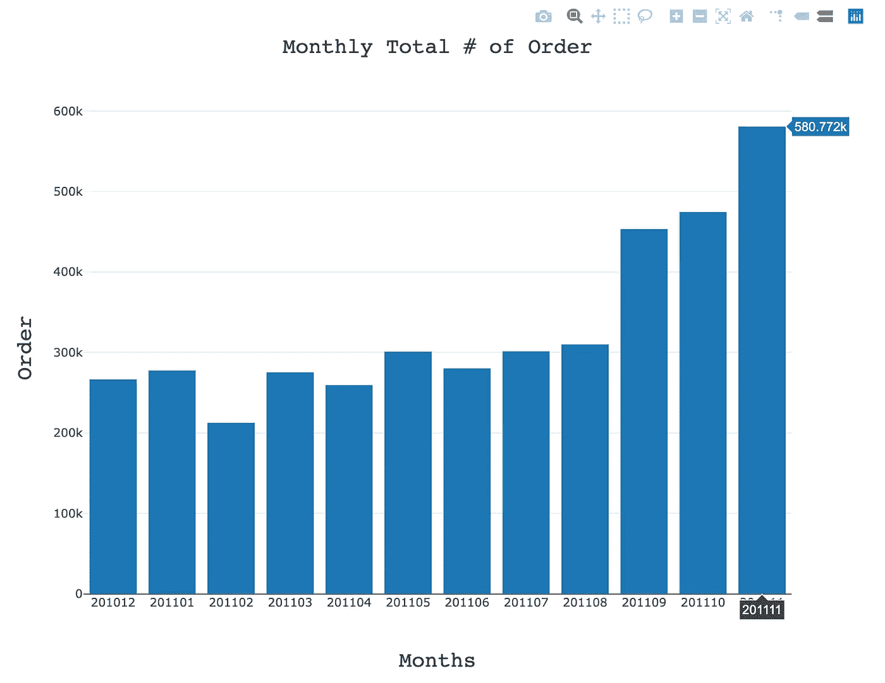

正如我们所料，月订单数在 2 月(从 277k 下降到 212k)和 4 月(从 275k 下降到 259k)有所下降。但是 11 月份的月订单增加到了 58 万。

到目前为止，我们评估的所有指标都在 2 月和 4 月下降。这是一个回顾你的业务并找出收入下降的原因的时候，是因为不太活跃的客户还是客户订购较少？或者许多其他原因……我们应该继续调查其他一些重要指标，如**新客户和现有客户**，以便更多地了解数据，并能够评估**保留率** **率**。

# 新客户:

谁是新客户？对于每个企业来说，这可能会有不同的答案，就本文而言，我将新客户定义为以前从未购买过产品的客户。所以，我用**。min()** 函数查找第一次购买的客户。

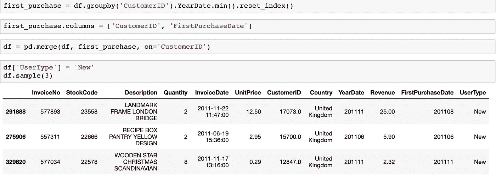

# 现有客户:

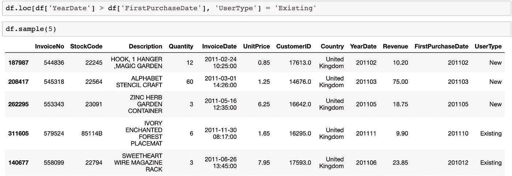

既然我们计算了新客户和现有客户，我们就根据现有客户和新客户评估每月**的收入**。

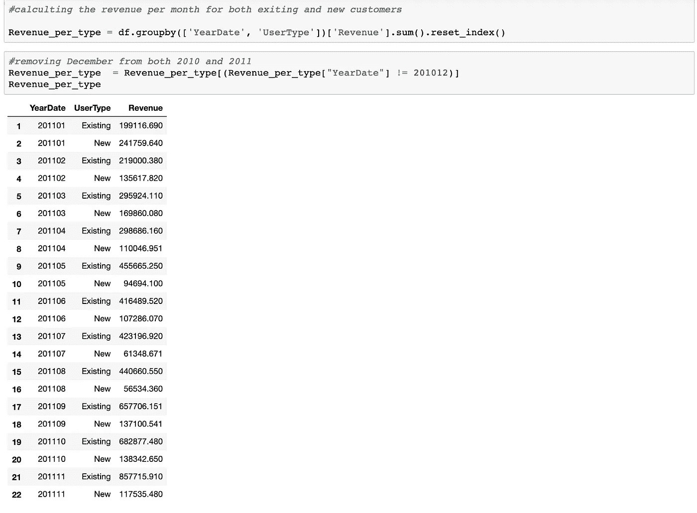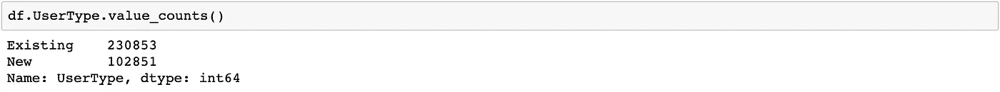

现有客户呈现积极趋势，企业现有客户多于新客户。

一如既往，良好的可视化使分析更有趣，感谢 Plotly，我们可以做出漂亮的图形。

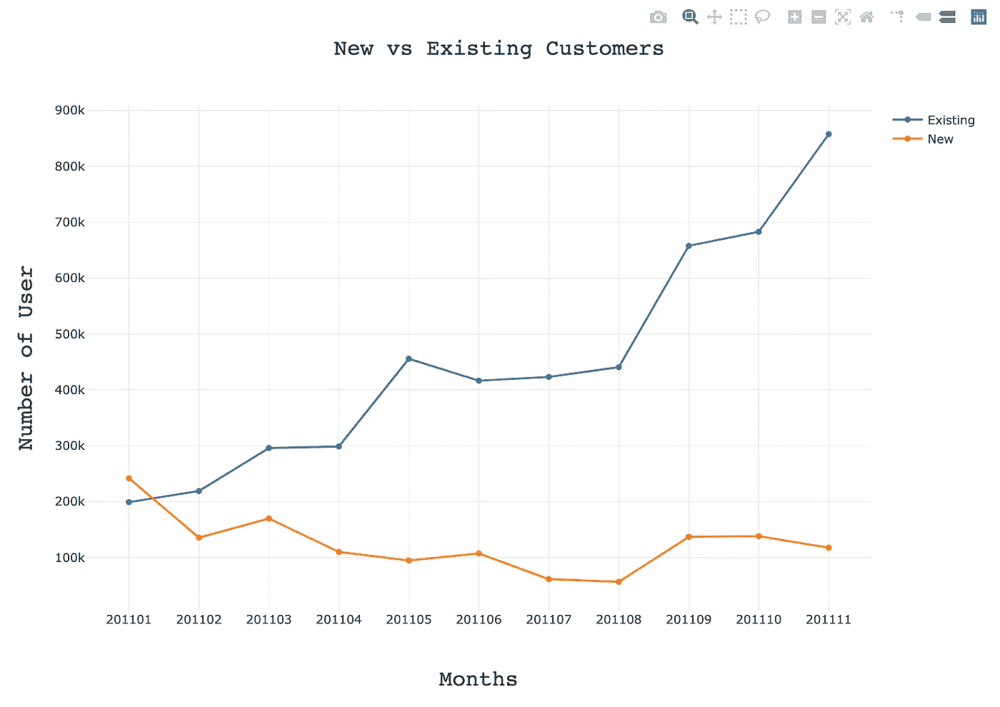

该公司似乎在 2011 年 1 月获得了新客户，但随着时间的推移，新客户的数量呈下降趋势。再次，这是一个时间来审查你的 KPI，看看你是否在轨道上，如果需要改变目标，并问这样的问题:企业在 2011 年初获得新客户是由于巨大的促销活动，还是新产品？为什么企业没有获得更多的新客户？

现在我们有足够的信息来评估**的保留率**。

# **保留率:**

[**客户保留率**](https://blog.hubspot.com/service/customer-retention) 表示公司在给定时间段内保留的客户百分比。**保留率**是**流失率**的反面，它显示了一个公司在特定时期内失去的客户的百分比。

Pandas 为分组和汇总数据提供了几个选项，为了本文的目的，我使用了 [**crosstab**](https://pbpython.com/pandas-crosstab.html) 函数，它构建了一个交叉制表表，可以显示特定数据组出现的频率。下表中的数字 **1** 表示该客户在该月**活动**，而 **0** 表示该客户在该月没有购买。

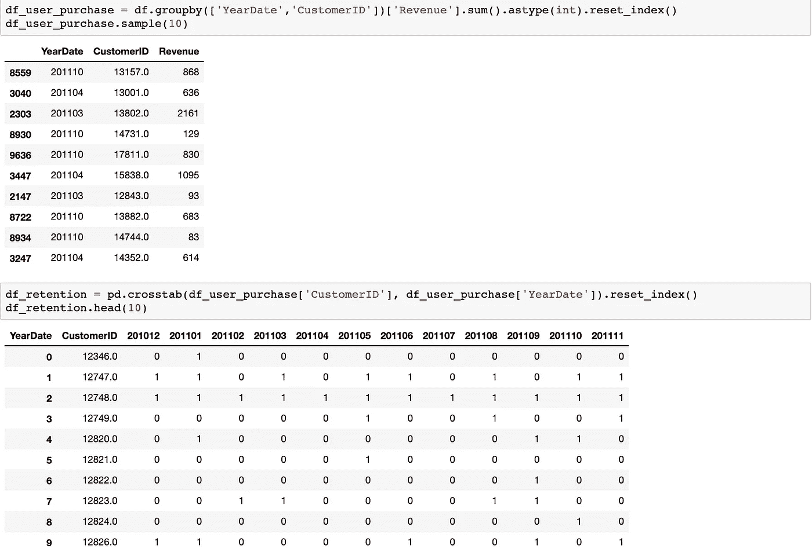

在 Python 的帮助下，我们可以通过计算**上个月**的**留存客户数**和**总客户数来计算留存率。**

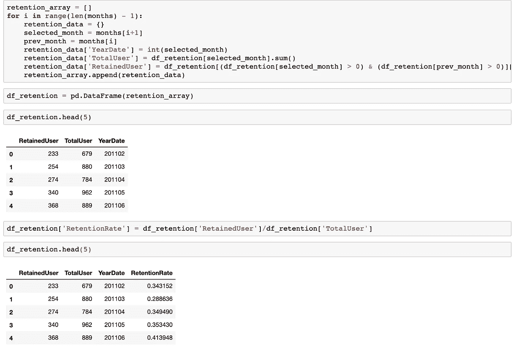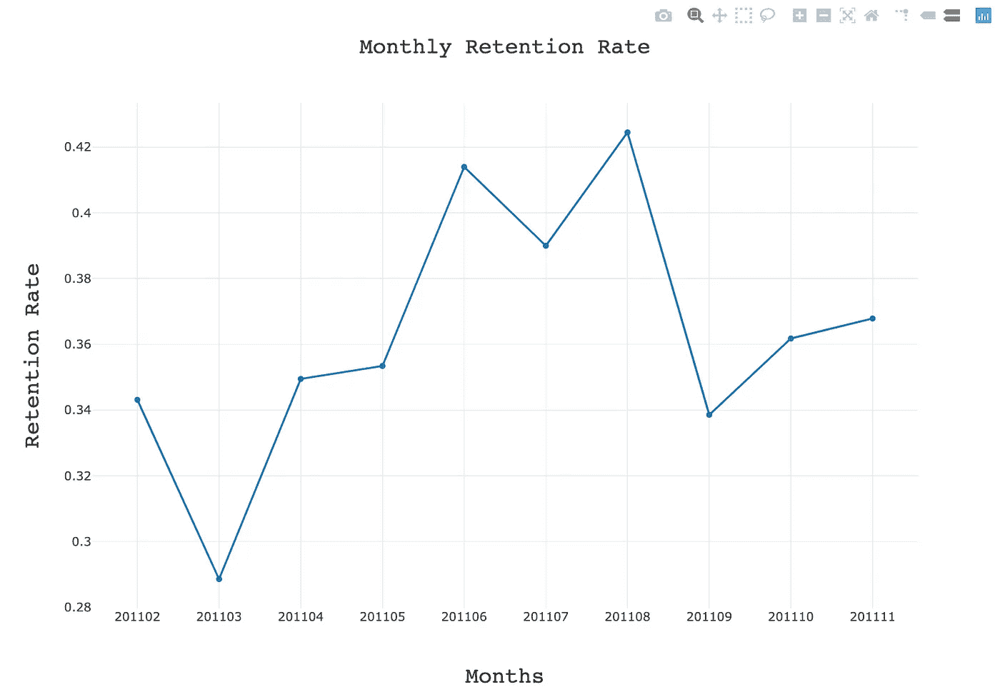

我们可以看到，2011 年 11 月，只有 37%的客户被保留。

但是我们如何利用所有这些信息来做决定。正如彼得·德鲁克所说:

使用数据来了解您业务中的问题，从而在问题变成问题之前找到解决问题的策略。例如，在这种情况下，我们可以看到收入在 4 月份下降，因此如果我们诊断出问题，我们就可以在问题变成问题之前解决它。我们还观察到，2011 年 3 月和 9 月的保留率较低，而 8 月的保留率非常高，因此有必要了解客户没有与我们一起购物的原因。这是由于新产品的推出，糟糕的客户服务，还是缓慢的市场？

所有这些信息对于帮助企业发展都很重要，使用数据科学来分析这些信息有助于企业有效应对不断变化的业务环境，并回答以下问题:

*   问题的原因是什么？(报告)
*   为什么会这样？(诊断)
*   未来会怎样？(预测)
*   最好的前进方式是什么？(建议)

在下一篇文章中，我将更多地介绍数据科学如何帮助您的业务增长，以及如何预测客户流失。