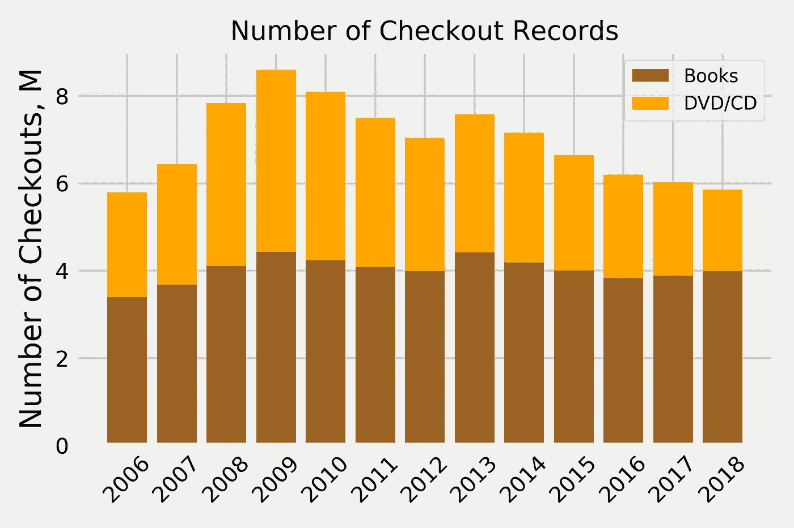
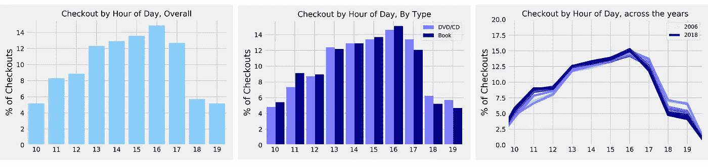

# 人们如何以及何时使用公共图书馆

> 原文：<https://towardsdatascience.com/how-and-when-people-use-the-public-library-1b102f58fd8a?source=collection_archive---------25----------------------->

## 西雅图公共图书馆历年来的借阅趋势。

**2018 年 1 月 6 日更新:** *西雅图公共图书馆的伙计们指出，我使用了一个过时的库存数据集来制作这篇帖子旧版本中发布的列表。该错误导致我的分析忽略了自 2017 年 9 月以来添加到库中的所有项目。我已经更新了数据集，下面的分析也是最新的。！非常感谢来自 SPL 的大卫发现了这个错误！*

*公共图书馆什么时候最忙？退房高峰是在一月份阅读决议时还是在夏天海滩度假时？*

Image from [pexels.com](https://www.pexels.com/photo/ancient-antique-architectural-design-architecture-442420/)

公共图书馆是社会的伟大机构之一。它们为任何有兴趣阅读、学习和与社区交往的人提供了一个机会。

人们从公共图书馆借出什么、如何借出以及借出多少可以提供一个有趣的视角来观察社区的感受和行为。

## 数据

我使用[这个数据集](https://www.kaggle.com/seattle-public-library/seattle-library-checkout-records#Library_Collection_Inventory.csv)以及数据的[原始来源](https://data.seattle.gov/dataset/Checkouts-by-Title-Physical-Items-/3h5r-qv5w)来探索来自[西雅图公共图书馆](https://www.spl.org/)的结帐。我使用的最终数据集包括从 2006 年**到 2018 年 12 月 26 日的所有结账项目。**除了结帐记录之外，数据集还包括详细的库存和数据字典，以便将结帐记录转换回物理项目标题、类型和作者。

如果你错过了，我使用相同的数据集创建了从 2006 年到 2018 年每年的“最多检出”项目列表。你可以在这里找到那个帖子。

## 方法学

**所有的检出加在一起**(从 2006 年到 2018 年)达到了大约 6700 万条记录，这对于一次加载所有记录进行分析来说是相当大的规模(特别是因为这些记录附有它们的元数据)。这些文件是按年份分开的，因此人们可以一个接一个地加载每年的数据集，但是我希望能够一次完成跨年份的分析。我使用的解决方案是从每年的结帐记录中随机抽取 10%的样本，并创建一个包含所有这些样本的文件。这给我留下了一个具有代表性的数据集，包含所有可获得年份的约 670 万条记录。

我还创建了一个数据集，其中包含所有的**唯一项**以及它们被检出的次数(这是从整个数据集创建的，而不是样本)。我用这个数据集得到了每年最常结账的清单。

让我们深入分析一下结果。

# 历年结帐

我们观察到图书借阅数量总体上呈稳定趋势(同样，不包括续借)，每年不超过 400 万次。

视听借阅量在 2009 年达到高峰，此后呈缓慢但稳步下降的趋势。这可能是因为流媒体服务(如网飞的电视和 Spotify 的音乐)的崛起，这些服务可以轻松(有点)负担得起地点播大量电视和音乐，无需等待时间。

由于这个数据集只针对实体图书，我想知道图书借阅量是否会保持稳定，但越来越多的用户会借阅电子书。

# 检验时间趋势

让我们探索一下人们从图书馆借阅图书时表现出的趋势。我研究了一天中的**时间**、一周中的**日期**和一年中的**月份的趋势。**

## 一天中的时间

让我们从最微观的时间趋势开始，一天中的时间。西雅图公共图书馆通常从上午 10 点到晚上 8 点开放。它在周五和周六下午 6 点关门，周日减少了营业时间(主要是下午 1 点至 5 点)。

我们在数据中看到，下午 4 点是最受欢迎的结账时间。对于书籍和 DVD/CD 来说都是如此。我们还发现，尽管这一趋势在过去几年中略有变化，但在数据集中，**下午 4 点一直是每年最受欢迎的结账时间。**但我们看到，下午 1 点至 5 点之间的时间也不远了。

我们还看到，数字产品(DVD 和 CD)的趋势几乎与书籍相同。即使我们观察一周中的某一天和一年中的某一月的趋势(见下文),这一观察仍然成立，它表明人们不会为了他们的图书和数字需求而单独去图书馆。

Figure 1\. **Checkouts by Time of Day.** On the far right plot, darker lines represent more recent years.

## 星期几

看了一天中的时间趋势，让我们看看一周中的一天。就像我上面提到的，西雅图公共图书馆每天开放，周五和周六的开放时间略有减少，周日的开放时间大幅减少。

我们看到周六是最受欢迎的借阅日，无论是书籍还是 DVD/CD。我们再次看到，尽管 2009 年出现了趋势变化，**周六仍然是数据集中所有年份中最受欢迎的一天。此外，周五和周日是最不受欢迎的日子。**

当我们观察这些年的趋势时，我们发现在 2009-2010 年左右发生了变化，星期五变得越来越不受欢迎。这可能是由于图书馆开放时间的变化引起的吗？趋势改变后，周一和周二似乎恢复了周五之前“下降”的退房率，周六保持相对稳定。

Figure 2\. **Checkouts by Day of Week.** On the far right plot, darker lines represent more recent years.

## 一年中的月份

最后，让我们看看月份的时间趋势。当人们去度假并需要一本好书阅读时，或者当人们开始新的决心时，也许在新年前后，退房会达到高峰吗？

似乎两者都有一点，即使没有主要的趋势，最高值出现在 7 月，最低值出现在 2 月和 9 月。考虑到并非所有月份都有相同的天数，趋势会变得更加稳定。然而，年初和夏季似乎是最受欢迎的退房月份，九月和十二月最不受欢迎。

我们再次看到，DVD/CD 和书籍的趋势基本相似，但我们确实看到，12 月图书借阅量比视听产品下降得多。相反，我们看到**书籍在夏季的几个月里比视听产品表现更好。**

Figure 3\. **Checkouts by Month of Year.** On the far right plot, darker lines represent more recent years.

现在你知道了:下午 4 点，周五和 1 月& 7 月是西雅图公共图书馆最繁忙的借阅时间，主要是图书和 DVD/CD。尽管我们观察到了一些变化，如从 2009 年起周五退房率下降，但这些趋势在数据集中的所有年份(2006 年至 2018 年)也基本保持不变。

就像我上面提到的，这个数据集只针对实体物品，毫无疑问，这是一个向更多数字物品的转变，尤其是在西雅图这样的科技城市。为了对趋势有一个全面的了解，看看数字结账也是非常有趣的。

这个数据也只针对西雅图的公共图书馆。你知道任何其他公开他们数据来源的公共图书馆吗？调查不同城市的趋势是否不同会很有趣。

*感谢阅读。*

*你可以在这里* *找到我关于西雅图 PL(使用相同数据源)* [*最多检出商品的故事。*](/the-most-checked-out-books-from-the-public-library-63f147c04df3)