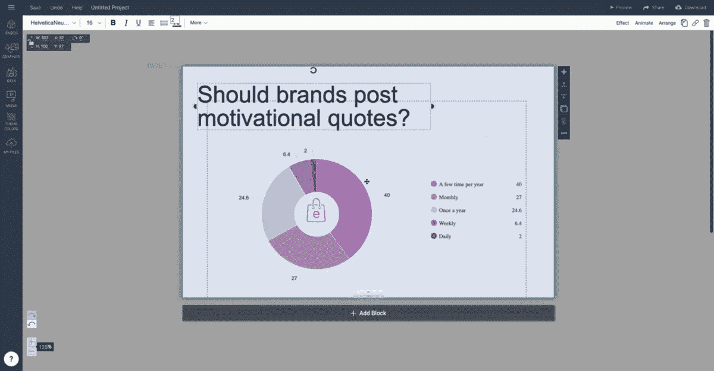
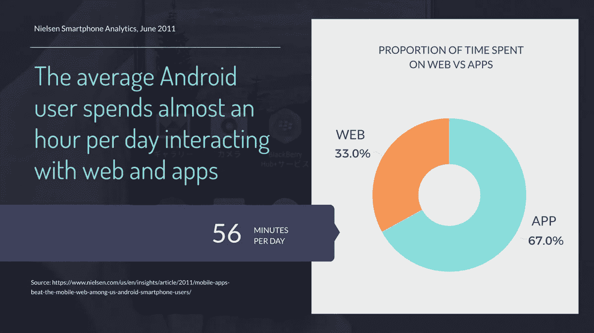
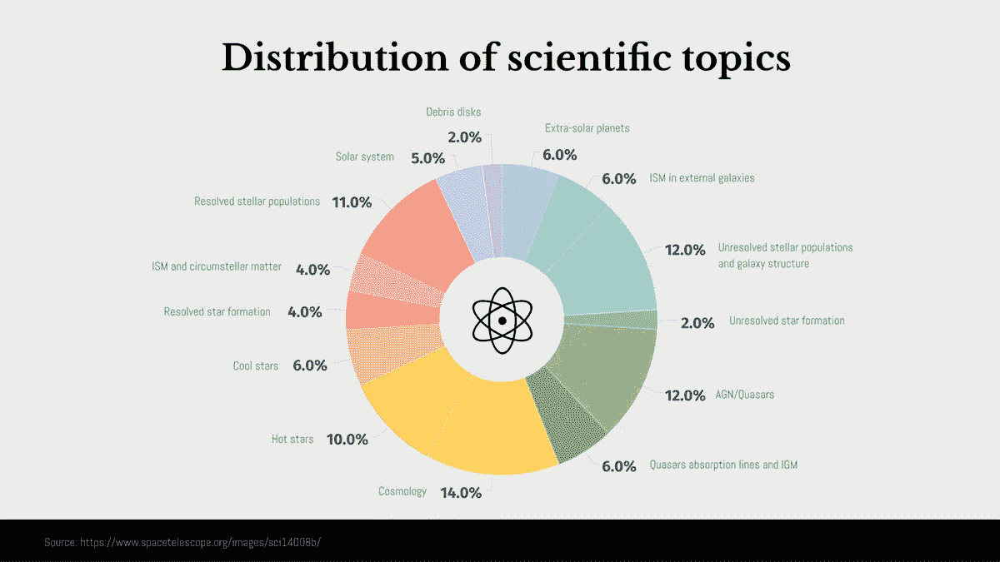
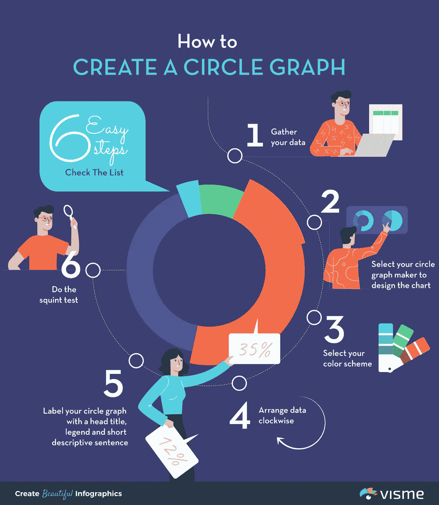
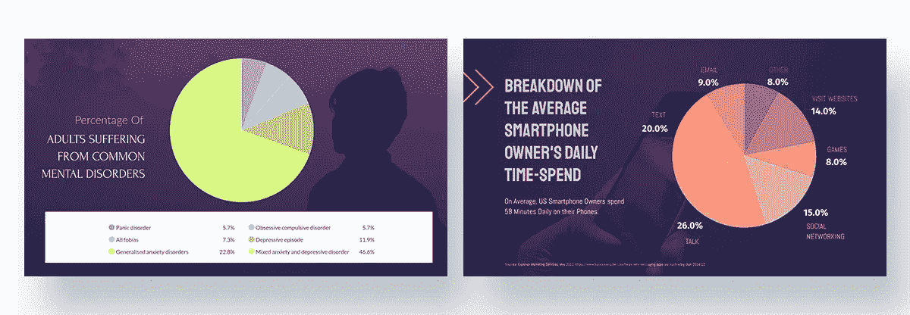
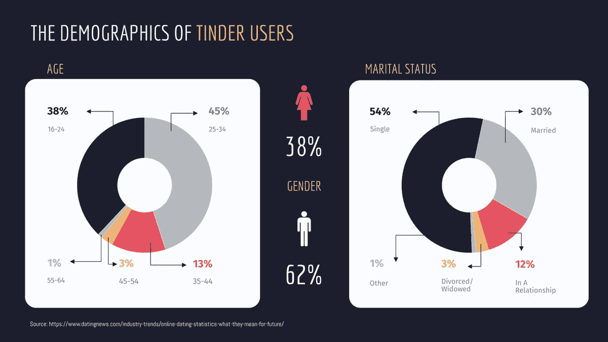
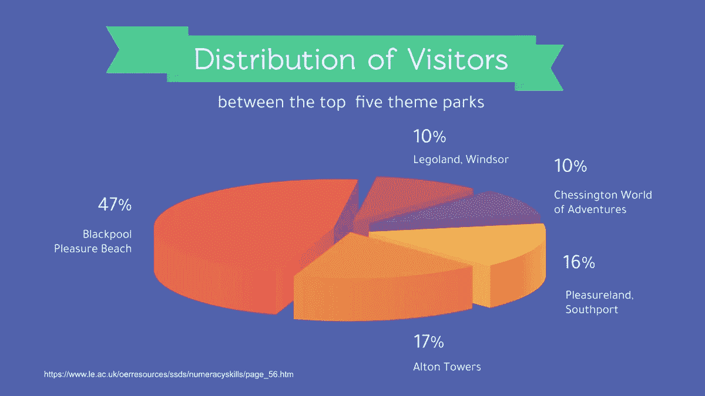
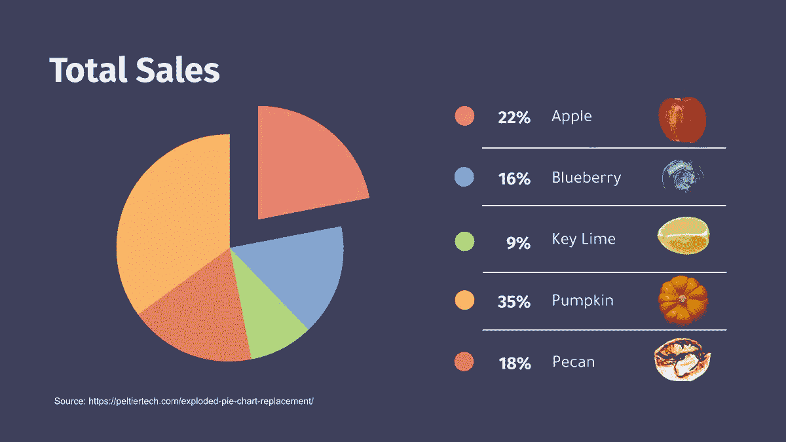

# 如何以及何时使用圆形图

> 原文：<https://towardsdatascience.com/how-and-when-to-use-a-circle-graph-b91f6910cc63?source=collection_archive---------24----------------------->

你知道吗，一个圆，是的一个 ***圆***——一个圆图形的基础，曾经是一个神。或者，至少在公元前五世纪，古希腊哲学家恩培多克勒将它[标记为一个。](https://www.telegraph.co.uk/men/the-filter/qi/8593855/QI-Quite-interesting-facts-abouts-circles.html)

很神奇，对吧？

在希腊，圆是无限的象征，但是对于我们当中的技术人员来说，圆是一些最有用的发明的灵感来源，比如轮子。

同样，圆也是圆图的基础。

圆形图，通常也称为饼图(听起来很熟悉吧？)是一个简单的、视觉上很吸引人的图表，它分为几个楔形，每个楔形代表一个数据值。

这是显示统计数据最常用的图表之一，所以我们当然不能想当然地认为它受欢迎。

这就是为什么我们把这篇文章献给圆形图。我们将从圆图的定义开始，跳到它的重要性，最后深入探讨如何以及何时使用它。我们走吧。

# 什么是圆图？

你可以把圆图想象成一个比萨饼。所有的比萨饼切片都是数据的代表，就像饼图中的切片一样。如果你不均匀地切比萨饼，你会得到不同的数据切片。

有道理吗？

所以让我们从圆图的经典定义开始。圆形图是数据的圆形表示，不同的切片表示总的百分比。圆圈中的每一个楔形都与它所代表的数量成正比。

因为它的每个切片都是一个数据代表，所以圆形图在向不知情的读者有效地传达数据方面起着至关重要的作用。

# 使用圆形图的优势

饼图是大众媒体和商业展示的宠儿，也是市场营销和销售中常见的数据代表。他们还偷偷溜进社交媒体源，在那里他们可以用赏心悦目的方式分享无聊的数据。

圈图如此广泛的应用归功于它的优点。就是这么简单易懂。最重要的是，圆形图在信息可视化方面胜出。

这里有一个饼状图的优点。

# 圆形图以易于理解的方式展示数字信息。

“等等，让我去拿我的老花镜，”从来没有饼状图读者说。

这是因为信息以圆形图的方式呈现，这很简单，很容易理解。相比之下，大多数其他[图形类型](https://visme.co/blog/types-of-graphs/)需要解释其轴任一侧的数字。

# 圆圈是信息可视化的专家。

信息可以大致以两种图形类型呈现——统计图形和信息可视化。统计学家 Anthony Unwin 和 Andrew Gelman [指出了两者的区别](http://stat-computing.org/newsletter/issues/scgn-22-1.pdf)。

据他们说:

*   **统计图**是数据迷的一种，因为他们的主要目标是准确地传递数据。
*   **信息可视化**关注的是抓住观众的注意力，这也是饼状图的卑微原因。

简而言之，圆形图是营销人员用来讲故事的合适的视觉辅助工具。然而，如果目标是呈现准确的数据，企业家们可能不得不依赖其他图表。您可以在后面的章节中了解更多信息。

# 圆形图是圆形的。

事实是，我们人类喜欢圆圈。正如多项研究证实的那样，这是因为我们将弯曲的形状与健康和生命联系在一起，将尖锐的形状与危险联系在一起。

[众所周知，棱角分明的形状也会引发恐惧](https://www.ncbi.nlm.nih.gov/pmc/articles/PMC4024389/)，进而引发厌恶和厌恶。自然地，这有利于曲率和随后的饼状图。

# 饼图很容易构建。

虽然我们已经讨论了饼状图是如何给你的观众带来视觉娱乐的，但是现在我们也该看看它们对你有多大的帮助了。

自从图形出现以来，圆图很容易构建，只需要数据、指南针和铅笔。

然而，随着技术的进步，量角器和笔的组合被 Excel 和其他电子表格程序边缘化了，这些程序帮助开发了饼状图。

但是说实话，这些图表在视觉上远不如使用 Visme 这样的设计工具制作的圆形图表丰富。

使用 Visme 时，您只需将数据记录到中，并根据您的喜好进行定制。例如，在 Twitter 上，纽约证券交易所社交媒体负责人 Matthew Kobach 进行了一项有趣的调查。

我们使用这个现成的 Visme 模板将数据转换成饼状图。我需要做的唯一工作就是编辑模板以添加数据并更改配色方案，我的圆形图已经准备好了:

# 何时使用圆形图

这是一个棘手的问题。您应该将它用于所有类型的可用数据吗？还是应该将其指定为所选数据类型的数据代表？简而言之，圆图只适用于特定的情况。

让我们从什么时候可以**使用圆图**开始。

# 当数据变化时，使用圆形图。

您需要不同的数据值，然后才能将它们可视化到饼图中。假设你有 67%和 33%的值。这些在如下所示的饼图中会很好看:

但是，如果您有两个相等的数据值，例如 50%和 50%,您可能不希望使用圆形图进行数据可视化。

想想地球的南北半球就是一个恰当的例子。他们把我们的星球分成相等的两部分，用饼状图来表示它们是没有意义的。

对于等值数据，您宁愿写下数字，然后在饼图中显示它们。或者，使用 Visme 制作一个视觉上吸引人的图形。

# 当您最多有 7 个数据片段时，请使用圆形图。

其次，当您有 2-7 个数据条目时，使用圆形图。有 7 个以上楔形的饼图最终看起来很混乱，如下例所示。在这种情况下，你的大脑开始[将楔形感知为一个，](https://visme.co/blog/data-storytelling-tips/#wQSkz24gvALIpIMm.99)扼杀了图形的整个目的。

换句话说，圆形图中的数据切片越多，其可读性或易理解性就越差。所以养成坚持最多吃七片的习惯。

# 当你比较整体的各个部分时，使用圆形图。

最后，当你从整体上比较数据时，使用圆形图是合适的。例如，比较一家公司的不同部门就是比较整体的各个部分。

然而，比较不同的公司导致比较不同的整体。所以你没有资格使用饼状图，因为不同的公司不能构成一个有意义的整体。

# 何时不使用圆形图

现在你知道了什么时候使用圆形图是最好的，让我们来看看什么时候创建圆形图是没有意义的。

# 当你有相似的数据值时，不要使用圆形图。

饼图不适用于数据条目之间差异很小的时候。例如，数据显示为 23%、25%和 26%。当您在圆形图上绘制它们时，代表每个值的切片在大小上是相似的。

如果你有这样的可用数据，[用一个条形图](https://www.visme.co/templates/infographics/bargraph/)让微小的差异变得明显。

# 当你有相似的数据值时，不要使用圆形图。

饼图不适用于数据条目之间差异很小的时候。例如，数据显示为 23%、25%和 26%。当您在圆形图上绘制它们时，代表每个值的切片在大小上是相似的。

# 当准确性是游戏的名称时，不要使用圆形图。

虽然圆形图本质上很醒目，但它们在显示精确值时并不十分准确。

原因？饼图中的数据很容易操作。例如，使用 3D 效果。这些会误导读者认为切片比实际要宽。

研究人员说，正如他们得出的结论一样，我们不能像比较长度一样估计角度的相对大小(例如，在条形图的情况下)。这使得阅读饼图不准确。

我们也[倾向于低估](https://www.mathwarehouse.com/topic/characteristics-pie-charts/)锐角(小于 90 度的角)，而高估钝角(90 到 180 度之间的角)。

# 当你需要显示一段时间内的模式、原因、结果或变化时，不要使用圆形图。

另一个不能依赖饼图的情况是当你需要显示一段时间内的模式或变化时。普通的舍入无法像具有精确数值的图表那样显示比较。

首先，它不擅长显示精确的值。第二，它很容易操作。

因此，在绘制跟踪更改的数据时，最好选择折线图，而对于跟踪更改以及不同组之间比较的数据，最好选择条形图。

毫不奇怪，Visme 可以帮助您实现这两个目标。这里有[线图模板](https://www.visme.co/line-graph-maker/)和[条形图模板](https://www.visme.co/bar-graph-maker/)供你入门。

# 如何创建圆形图

开始使用圆图并不那么具有挑战性，即使你没有注意你的数学老师。多亏了 Visme 这样的饼状图制作工具，你可以在几分钟内设计出一个圆形图。

但是怎么做呢？让我们用 6 个简单的步骤来回答这个问题。

# 1.收集您的数据。

快速回顾一下，您需要至少两个不相似的数据变量。此外，确保您的饼图最多包含 7 个楔形。

# 2.选择您的圆形图表生成器来设计图表。

使用电子表格创建饼图的日子已经一去不复返了。你现在能做的就是尝试 Visme 这样高效易用的工具。

下面是该过程的视频演示:

# 3.选择你的配色方案。

饼图对每个楔形使用不同的颜色和对比度，唯一的目的是增强可读性。这是因为我们的视觉大脑能够迅速注意到差异和对比。因此，添加颜色可以帮助事物脱颖而出。

为此，[最终确定不屏蔽数据的颜色](https://blog.hubspot.com/marketing/color-combination-data-visualization)。你还需要小心选择正确的颜色对比。选择不相配的颜色会使图表看起来令人厌恶。

一个专业建议是[挑选从暗到亮色调变化的颜色](https://www2.le.ac.uk/offices/ld/resources/numerical-data/pie-charts)，并从图形的开始部分到最后一点调整它们。或者，更深入一点，根据[色彩心理学](https://visme.co/blog/color-psychology-in-marketing-the-ultimate-guide/)选择色调，以吸引观众的注意力。

# 4.顺时针排列数据。

现在你已经选好了颜色，开始整理数据。你可以简单地把所有的数据放在一个图表里，然后你就可以开始了。对吗？

除了它不完全像那样工作。当你把所有的数据随机放在一起时，它看起来没有吸引力。为什么？因为每个切片大小不一。

为了打破图表中的某种风格，你需要按大小顺序顺时针排列不同的数据扇区。因此，您得到的是一个包含数据值的切片图，当您顺时针开始并完成该圆时，数据值会减少。

至于不属于某个特定类别的数据，你可以将它们集中在一个类别中，如果是调查，就将切片命名为“其他答案”,如果是你收集的数据，就将其命名为“其他类型”。

# 5.用标题、图例和简短的描述性句子来标记你的圆形图。

没有标签的饼图是不完整的。因此，您需要添加三个描述:

*   标题:暗示你的图表是关于什么的标题。
*   **图例**:解释圆形图中每种颜色代表什么的按键。它出现在图表的两边(图表 A)。或者，根据 Tufte 的[数据墨水比率](https://www.vis4.net/blog/2012/06/doing-the-line-charts-right/)标记数据切片(图表 B ),建议用数据标签替换图例以简化图表。
*   **底部的一个短句**:这有助于描述你的圆图或解释你的数据来源。

# 6.最后，做斜视测试。

斜视测试需要你部分闭上眼睛来模糊你面前的图像。目的是创造出一个突出的设计。斜视测试适用于所有设计工作，包括圆图。事实上，这是制作图表的一个[至关重要的练习。](https://visme.co/blog/dos-and-donts-chart-making/#oKTmBUs7Mm7XjTOj.99)

斜视测试在以下方面有所帮助:

*   允许您删除多余的行
*   有助于做出客观的设计
*   确保数据被恰当地突出显示给读者

另外，如果你是设计新手，这里有一个避免常见设计错误[的资源](https://visme.co/blog/graphic-design-rules/)。

# 使用圆形图的提示

我们已经走了很长一段路，但在我们结束之前，让我们快速讨论一下你需要记住的三个圈图最佳实践。

开始了。

# 如果需要表示两组相关数据，请使用多个饼图。

这最适合于比较两个或多个相同类别但变量不同的数据集。一个恰当的例子是年龄和婚姻状况变量的差异，其余数据保持不变。

不过这里有一点需要注意——图表的颜色和顺序保持不变。这背后的原因很简单。这有助于比较。

# 3D 和爆炸效果很酷，但并不总是如此。

3D 效果不言自明。你给你的图表添加三维效果。类似地，爆炸效果与图形的爆炸切片相关，因此它们是分开的。

这两种效应听起来都很有趣，但它们并不是在所有情况下都有效。

这是因为 3D 和爆炸效果使得在圆形图中比较不同的数据类别具有挑战性。此外，他们还夸大了数据的真正价值。这一切都要归功于[的最佳效果，从而诞生视觉插图](https://www.verywellmind.com/optical-illusions-4020333)，进而欺骗你的视觉。

在下面的例子中，当看起来后者比前者更宽时，很难区分 Chessington World of Adventures 或 Legoland，Windsor 是相同大小的切片。

幸运的是，如果你是这种设计效果的粉丝，那么我们有一些好消息。爆炸效果可以在某些情况下使用，例如当您想要强调一个切片中的信息时，如下所示:

# 您可以制作圆形图的动画。

动画在吸引观众的同时也让解释数据变得容易。在动画可视化和静态图形的比较中，动画得分最高。

胜利的功劳归于动画在吸引注意力、帮助观众解读数据和进行价值比较方面发挥的作用。

但是你不需要成为一个 Photoshop 专家来制作动画。改为使用 [Visme 创建动画图表](https://visme.co/blog/create-animated-charts/)。

# 今天就开始设计圆形图

饼图一直是读者的最爱，以一种可抓取的格式呈现数据。

如果你还没有画出一个圆形图，今天就开始注册 Visme 吧。您可以创建视觉上令人惊叹的图表，而不必担心从头开始设计。

如果你已经是一个饼状图爱好者，使用 Visme 上的[饼状图模板来提升你的设计水平。那么，你找到你的圆形图的完美模板了吗？](https://www.visme.co/templates/infographics/piechart/)

*本帖* [*原版*](https://visme.co/blog/circle-graph/) *最早出现在 Visme 的* [*视觉学习中心*](http://blog.visme.co/?source=post_page---------------------------) *。*