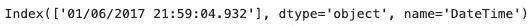

# 我如何以及为什么获得 75Gb 的免费外汇“滴答”数据。

> 原文：<https://towardsdatascience.com/how-and-why-i-got-75gb-of-free-foreign-exchange-tick-data-9ca78f5fa26c?source=collection_archive---------4----------------------->

## 通过完整的 Python 代码来抓取、提取、转换并加载到 HDF5 数据存储中，以满足未来的自己。

Photo by [Robson Hatsukami Morgan](https://unsplash.com/@robsonhmorgan?utm_source=medium&utm_medium=referral) on [Unsplash](https://unsplash.com?utm_source=medium&utm_medium=referral)

在完成数据科学硕士课程的最后，我开始想象自己用机器学习和自动化交易做聪明的事情。如果你和我一样，碰到过***【我如何获得历史自由分笔成交点数据】***connudrum，那么这篇帖子就是为你准备的。

我把我的文章分为三个部分:

1.  一些背景知识。
2.  故事时间——如何失败然后成功。
3.  将所有这些放在一起—完整的代码

请随意跳到你最感兴趣的部分。

# 1.一些背景知识

正如我之前提到的，这一切都始于我对应用一些机器学习(ML)来预测市场价格或者更简单的市场方向的问题感兴趣。也就是说，我想使用 ML 来分析给定货币对的一些历史数据，然后告诉我未来某个特定点的价格。然后我会用这个预测价格来决定如何投资我的钱。因为我只需要知道目标货币的价值是增加还是减少，我可以简化我的算法来简单地预测市场方向(正或负)。当然，这是对交易盈利所需条件的过分简化，但是准确预测市场的未来状态(准确率高于 50%)是关键的第一步。

在使用 ML 建立市场模型之前，我首先需要一些关于市场的数据。这些数据有多种形式。通常情况下，数据可以在所谓的“蜡烛数据”或基于时间的“棒线”中自由传播。蜡烛数据以基于时间的增量(频率)出现。这可以是 1 分钟、5 分钟、1 天、每月等等。以下是来自 FXCM 的日蜡烛线数据示例:

Example using FXCM RestAPI to download daily candle data.

输出如下所示:

FXCM daily candle data.

对于给定的货币对(本例中为 USD/JPY ),每一行代表单日数据的一根*蜡烛线*。它告诉你的是蜡烛线开始时的价格，蜡烛线结束时的价格，蜡烛线窗口期间的最高价格和最低价格。它为市场的两个方面做这件事，出价和要价。

这些值共同代表时间和价格值的边界，在此边界内所有价格变化(称为分笔成交点)都会发生。除了蜡烛线边界之外，数据还包括刻度数量值。该值表示在蜡烛线边界内发生的价格变化的数量。但是，它不会告诉您何时发生了变化，或者变化有多大或多小。

下图直观地展示了蜡烛的样子:

Diagram showing the structure of a single data candle.

通过查看上图，打开和关闭边界之间的空间是由蜡烛大小指定的。在 USD/JPY 示例中，这个空格代表一整天。然而，它可能是 1 分钟，1 小时或任何蜡烛数据供应商可以为您提供。

本质上，蜡烛线是原始基础分笔成交点数据的一个样本，结合了关于样本本身的一些描述性统计信息(分笔成交点计数)。事实上，人们可以认为蜡烛数据实际上是关于发生了什么的有限的元数据，而不是事件的实际记录。

## 为什么使用蜡烛数据作为 ML 的主要数据源是不好的。

那么蜡烛数据有什么问题呢？显然每个人都喜欢它..首先，蜡烛数据是低分辨率的，不能描述产生蜡烛“盒子”的潜在价格变化。第二，标准蜡烛使用基于时间的采样，这进一步模糊了潜在的事件。Marcos Lopez De Prado 在他的书[“金融机器学习的进步”](https://www.amazon.com/Advances-Financial-Machine-Learning-Marcos/dp/1119482089)中详细解释了这些问题。

反对基于时间的蜡烛线的一个简单论点是，市场活动不会在一天中均匀发生。这样，大量产生交易机会的价格变化，当它们存在于蜡烛内部时，就变得模糊不清了。这反过来使得 ML 算法不可能学习关于这些自主时间的任何东西，因此不能识别交易机会，因为所需的指标在时间蜡烛数据中不存在。

De Prado 确实提出了替代类型的蜡烛线采样，但是要创建这些类型的蜡烛线数据集，您需要有基础的分笔成交点数据。替代采样的一个示例是基于规则的分笔成交点数量对分笔成交点数据进行采样。换句话说，不管市场有多活跃，都要根据固定的交易量来制作蜡烛线。

最终，轻松访问原始数据使我能够通过使用各种数据集构建概念来进行自己的特征工程，这些概念专门旨在获得更好的机器学习结果。此外，我热衷于在这种需要大量训练数据的问题上尝试一些深度学习技术。

# 2.故事时间——如何失败然后成功

足够的背景..这里的要点是告诉您如何获得大量免费分笔成交点数据的技术故事。我将向您介绍我是如何做到这一点的，以及我遇到的挑战和如何克服它们。

我将向您展示我如何为 21 个货币对收集 2 年(2017 年和 2018 年)的分笔成交点数据，并将其加载到一个[分层数据文件(HDF5)](https://www.hdfgroup.org/solutions/hdf5/) 。数据来自 [FXCM](https://www.fxcm.com/) ，最初使用它们的 [RestAPI](https://github.com/fxcm/RestAPI) 。我最终放弃了他们的 api，采用了不同的方法。

## 版本 1 -> API 失败:

首先，这里是我第一次尝试使用的库:

FXCM 提供了一个名为`fxcmpy_tick_data_reader`(这里也称为`tdr`)的函数，它将返回关于哪些货币对可用的信息，但也允许您下载一个目标货币。

How to use FXCM RestAPI to get available tick data currency pairs (symbols).

输出将如下所示:

FXCM available symbols with some duplicates.

计算符号的数量显示有 24 个，但是这里有一些重复，所以让我们创建一个没有任何重复的新列表:

script that creates a list of symbols without duplicates.

如您所见，我们现在只有 21 种货币对:

FXCM available symbols without duplication.

要获取一些数据，您需要指定该范围的开始和结束日期，然后调用函数来要求目标货币对，如下所示:

FXCM tick_data_reader() output when request 5 weeks of data.

事实证明，无论您是否只需要 1 天，数据都是以 1 周为单位提供的。所以当你看 URL 的时候，我们可以看到上面的代码已经返回了一个 2017 年第 1 周的 gzip 文件。如果您更改日期并自己运行代码，您将看到 URL 遵循相同的模式，只需根据您请求的日期范围更改年份或周数。如果您请求超过一周的数据，它只是返回更多的 gzip 文件。

要查看数据，您需要对下载的数据调用一些方法，这些方法将提取文件并将包含的 csv 转换为 pandas 数据帧。根据您使用的方法，它还会将索引从类型`object`更新为类型`DataTimeIndex`。

如下图所示，`get_data()`方法将索引从`object`(又名`str`)转换为`DatetimeIndex:`

Output showing index has been converted to type = DatetimeIndex.

在`get_raw_data()`的情况下，索引保持为`object``类型。

Output showing the index type has not been changed.

## 慢速索引转换:

当调用`get_data()`时，您会注意到它比`get_raw_data()`要长得多。这是由于从`object`到`DatetimeIndex`的指数转换。`get_data()`和`get_raw_data()`都产生一个熊猫数据帧，但是`get_data()`更新索引以使用日期时间列作为索引，并将其转换为类型`DatetimeIndex`。我后来发现，在没有 [srftime 格式指令](http://strftime.org/)的情况下，包含微秒字段的 [Pandas](https://pandas.pydata.org/) 在转换为`DatetimeIndex`时表现不佳。参见 stackoverflow 上的[“为什么 pandas.to_datetime 对于‘2014/12/31’等非标准时间格式较慢”](https://stackoverflow.com/questions/32034689/why-is-pandas-to-datetime-slow-for-non-standard-time-format-such-as-2014-12-31/32034914#32034914)了解更多信息。

这里的底线是需要一个 srftime 指令来加速(索引转换)。我稍后将回到这一点。

你可能会问为什么拥有一个`DatetimeIndex`很重要？..这很重要，因为我们希望以后能够根据时间对数据进行切片。为此，应该从一开始就将数据正确加载到 HDF5 数据存储中。我们不希望以后不得不转换索引。

## 继续前进…

为了自动下载，我们需要提供触发下载每周文件的日期范围。为了防止下载超时，我决定一次下载一个月的文件。为了做到这一点，我创建了一个短列表，我称之为`periods`，它包含了这段时间内每个星期一的日期。

下面的脚本计算出一年中每个星期一的正确日期，并将它们组织成 4 个一组的列表(一个周期),并将所有列表放在一个大列表中。稍后，我使用这个列表来自动下载。

Script that creates a list of shorter lists that contain the sequential dates of four Mondays each.

如果我的描述看起来令人困惑，下面的示例输出显示了 2 个短列表，每个短列表包含 4 个按顺序排列的星期一日期，并从前面的列表开始。

List of lists containing 4 Mondays each.

接下来，我创建了一个函数，它执行以下操作:

*   下载文件。
*   提取数据。
*   将索引更新为`DatetimeIndex`。
*   将数据追加到正确的表中。
*   刷新 HDF5 文件中的表格。

我还附上了一些打印声明，以帮助我跟踪下载、提取和上传的内容。

然后，我在一个小程序中使用该函数，打开 HDF5 文件，使用 ETL 函数，最后关闭 HDF5 文件。

Small program that uses the FXCM RestAPI to fetch FX data and then loads it into a HDF5 database

## 为什么上面的代码不够好:

所以在运行脚本之后，很快就清楚这将需要一段时间。当我说一会儿..我是说几天！！..真的是几天！！

显然这还不够好，因为我不知道为什么它会这么慢，我只是假设这是互联网问题引起的太空猴子。这个过程的缓慢给我带来了各种各样令人沮丧的问题。

1.  由于下载时间太长，我会离开我的电脑，最终导致睡眠模式，并中断了下载过程。这导致脚本失败。
2.  最恼人的是，由于数据的大小，我决定将数据写入外部硬盘。即使我取消了所有的节电盒，我的笔记本电脑仍然会偶尔断开和重新连接硬盘。如果这发生在 HDF5 文件关闭之前，整个数据存储将会损坏！

在做了一番调查后，我意识到太空猴子不应该受到指责。相反，前面提到的指数转换是整个过程花费这么长时间的原因。我还发现我下载的文件是 gzip 文件，每个大约 5Mb。一旦提取出来，它们会膨胀到 80Mb 左右。

这为加速整个过程提供了一些机会..

## 版本 2 ->成功

在多次尝试下载所有可用的分笔成交点数据后，由于超时、文件损坏和必须重启而失败..我决定采取不同的方法。

如前所述，每个 gzip 文件只有几兆字节。我决定首先抓取所有文件，并将它们存储在一个目录中，稍后我将提取这些文件。这样我就可以避免每次出错时都要重新下载文件。

版本 2 需要的库:

## 刮刀

如果在代码中不清楚，我正在做的是构造遵循 FXCM 格式的 url，然后我使用`requests`库在构造的 URL 下载每个文件。为了确保每个文件正确下载，我决定流式下载文件，并在`chunks`中将数据写入磁盘。以下是抓取脚本:

Python script that downloads FXCM gzip files that contain FX data.

尽管每个文件只有 5-10mb 大小，但值得注意的是，它们有 2000 多个，下载它们确实需要一些时间。你可能会发现自己走开去吃烤面包或看网飞的一个节目。

## 检查点

当你回到你的电脑，你可能要检查你下载了每种货币的所有文件。您可以费力地手动检查这些文件，或者…您可以使用下面的代码来检查它们:

Python script that counts files by matching the first 6 characters.

假设您成功下载了所有内容，上面的脚本输出应该如下所示:

Output from file counting script.

现在您已经下载了所有文件，下一步是提取并加载到我们的数据库中(HDF5 文件)。此时，我还没有解决索引更新缓慢的问题。因此，我按货币对创建了批处理文件夹，这样我就可以监控数据到数据库的提取、转换和加载(ETL ),而不用一次呆在电脑前好几天。每批大约需要 3-4 个小时完成。

## 定量

在本文结束时，您不需要创建批处理，但是如果出于某种原因您想创建批处理，您可以使用下面的脚本。

它为每种货币创建一个文件夹，然后通过将前 6 个字符与其所属的文件夹名称进行匹配来查找属于该文件夹的文件，然后将文件复制到目标文件夹中。最后，您将拥有 21 个文件夹，每个文件夹包含 104 个文件。

Python script that copies gzip files to folders by matching files to folders.

## ETL 脚本解释

现在的目标是解压缩 gzip 文件，将数据转换为正确的格式，然后将其加载到 HDF5 数据库中。如果你喜欢阅读代码，可以直接跳到最后，但是如果你对代码是如何组合在一起的故事感兴趣，请继续阅读..

所以现在我决定放弃 FXCM api 来解包这些文件，我需要手动提取它们。我不能再使用`tick_data_reader()`函数了，因为它调用 web 服务器寻找与我请求的日期相关的文件。所有的文件现在都在我的硬盘上，所以我需要写我自己的提取代码。

由于编解码器的问题，提取数据比我预期的更具挑战性。最后，我查阅了 FXCM api 源代码，找到了执行提取的[函数(见第 181 行)](https://github.com/fxcm/RestAPI/blob/master/fxcmpy/fxcmpy/fxcmpy_data_reader.py)。我稍微修改了一下代码，然后就去参加比赛了。

Python snippet that extracts FXCM gzip files.

接下来，我遇到了一个更模糊的问题。我的脚本将运行良好，直到它遇到日期时间毫秒字段不包含所需的 6 个小数位的数据。

四舍五入到六位以下的数字不包括零，这在其他任何情况下都是完全合理的。例如，`.123000`会显示为`.123`。不幸的是，当您指定`srftime`指令(`format="%m/%d/%Y %H:%M:%S.%f"`)时，这会破坏您的代码。

幸运的是，有一种奇妙的方法`dataframe.DateTime.str.pad()`可以让你用任何你想要的字符或数字填充字符串。所以我需要做的就是在字符串长度与要求的 26 个字符不匹配的地方用零填充*“DateTime”*列。更棒的是，它只用了一行代码就实现了。

Python snippet that pads the microsecond field with zeroes to ensure consistent formatting.

接下来是将索引从类型`object`转换为类型`DatetimeIndex`的问题，这个过程相当缓慢。

在向一些老同学提出这个问题后，他们中的一个(谢谢 Alex)建议这可能与我让`pd.to_datetime()`推断格式有关。在 Pandas 文档中，它特别提到推断 datetime 格式可能会将转换速度提高 10 倍。因为我要处理大约 20 亿行数据，所以我很感激我能获得的任何加速。

然而，事实证明，当包含微秒时，推断 datetime 格式实际上并不好用。参见 stackoverflow 上的[“为什么 pandas.to_datetime 对于‘2014/12/31’等非标准时间格式很慢”](https://stackoverflow.com/questions/32034689/why-is-pandas-to-datetime-slow-for-non-standard-time-format-such-as-2014-12-31/32034914#32034914)了解更多信息(感谢分享链接 Davide)。

有了这个技巧，我尝试用一个 [srftime 格式指令](http://strftime.org/)指定格式，例如:`format="%m/%d/%Y %H:%M:%S.%f"`。这大大缩短了执行时间。使用`"infer"`规范只需要几分钟就可以转换一个文件。通过指定格式，转换实际上只需要几秒钟！！。

不幸的是，我的麻烦还没有结束。在转换和加载“EURCHF”文件的中途，我的代码再次中断。事实证明，并非所有文件都遵循相同的日期时间格式。也就是说，有些文件将日期格式化为月/日/年，而其他文件可能是日/月/年甚至年/月/日。

为了处理这个问题，我决定对数据集中的第一个和最后一个记录进行采样，因为每个文件包含 5 个工作日的数据。然后，在使用正确的 srftime 指令转换索引之前，我使用了一个 for 循环和一些嵌套的 if 语句来判断给定文件中每一行的格式。脚本的这一部分允许我在不到 2 个小时的时间内提取并加载所有文件(2184)，而在此之前，仅加载 104 个文件就需要 3-5 个小时。

下面是将索引转换为`Dtaetimeindex`的代码:

最后但同样重要的是将数据加载到数据库中。幸运的是，这其实很容易。 [PyTables](https://www.pytables.org/) 让这一步超级简单。所需要的是:

*   打开文件。
*   将数据追加到正确的表中(如果不存在，则创建一个)
*   将更新写入磁盘(通过“刷新”文件)
*   关闭文件

虽然没有我的脚本，但你会注意到我正在打印一些摘要信息。你不需要这样做。我用这种方法来跟踪脚本运行到了哪里，并了解数据在哪里出了问题。

最后但并非最不重要的一点是，因为我是成批进行 ETL 的。一旦一批完成，我想要某种声音通知，所以我从[realpython.com](https://realpython.com/playing-and-recording-sound-python/)那里借了一些代码，从头开始构建一个 440 赫兹的正弦波并播放 2 秒钟。我只是在我的剧本结尾照原样使用了它。

Python script that generates and plays a tone at 440Hz.

# 3.把所有的放在一起

正如所承诺的，这里是您需要的所有代码:

*   收集 21 种货币对两年的分笔成交点数据
*   提取数据
*   将索引转换为 DatetimeIndex
*   将其加载到 HDF5 数据库中

**重要提示:**记得在运行代码之前更新您的环境的目录位置。

List of libraries required for the final script.

第 1 部分—收集数据并检查下载

Python script that downloads all the gzip files from FXCM and then counts them.

第 2 部分—提取、转换文件并将其加载到 HDF5 数据存储中。

Python script that extracts, transforms and loads FXCM gzip tick data files into a HDF5 file.

我希望这篇文章对你有用。下一次，我将讲述/演示使用这么多分笔成交点数据可以带来的一些乐趣。

感谢阅读。