# 卷积实际上是如何进行的？

> 原文：<https://towardsdatascience.com/how-are-convolutions-actually-performed-under-the-hood-226523ce7fbf?source=collection_archive---------5----------------------->

## PyTorch & TensorFlow 用来加速卷积的两个简单技巧。


Photo by [Hosea Georgeson](https://unsplash.com/@thekidnamedhosea?utm_source=unsplash&utm_medium=referral&utm_content=creditCopyText) on [Unsplash](https://unsplash.com/s/photos/under-the-hood?utm_source=unsplash&utm_medium=referral&utm_content=creditCopyText)

卷积已经成为现代神经网络的一个基本部分，因为它们能够捕捉局部信息并通过权重共享减少参数的数量。由于几乎所有基于视觉的模型(和一些 NLP 模型)都使用这种或那种形式的卷积，显然我们希望尽可能快地进行这些运算。

为了强调对快速卷积的需求，下面是一个简单网络的分析器输出，该网络具有一个 2D 卷积层，后跟一个全连接层:

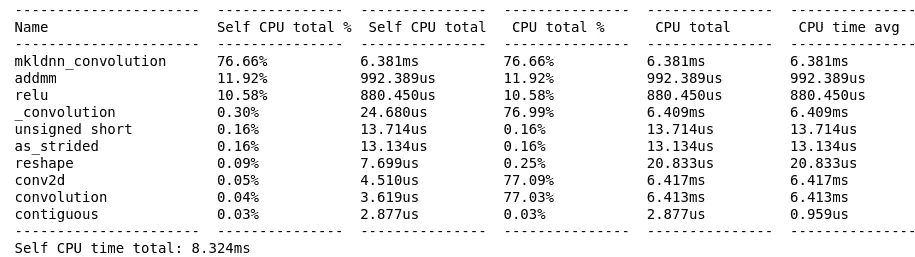

Profiler Output for a Simple Conv Network

线性层(`addmm`)后面的卷积层负责大约 90%的总执行时间。因此，开发一些技巧来尽可能加快计算速度也就不足为奇了。

在这篇博客中，我们将看看 PyTorch 和 TensorFlow 用来显著提高卷积速度的两个技巧。我们将使用 2D 卷积，因为这是最容易可视化的，但完全相同的概念适用于 1D 和三维卷积

# 朴素卷积实现

让我们从 2D 卷积的一个简单实现开始。我们将使用一个简单的 2x2 内核和一个 3x3 输入矩阵(带一个通道):

```
**input_matrix** array([[3., 9., 0.],
       [2., 8., 1.],
       [1., 4., 8.]], dtype=float32)**kernel** array([[8., 9.],
       [4., 4.]], dtype=float32)**bias**
array([0.06], dtype=float32)
```

Naive 2D Convolution

简单的实现很容易理解，我们简单地遍历输入矩阵并拉出与内核形状相同的“窗口”。对于每个窗口，我们对内核进行简单的元素级乘法，并对所有值求和。最后，在返回结果之前，我们将偏差项添加到输出的每个元素中。

通过用 PyTorch 自己的`conv2d`层检查输出，我们可以快速验证我们得到了正确的结果。

```
naive_conv_op = conv_2d(input_matrix, kernel, bias)
print(naive_conv_op)torch_conv = nn.Conv2d(1, 1, 2)
torch_conv_op = torch_conv(input_matrix)
print(torch_conv_op)**Output:
naive_conv_op** array([[145.06, 108.06],
       [108.06, 121.06]])**torch_conv_op** tensor([[[[145.07, 108.07],
          [108.07, 121.07]]]])
```

这是它们的执行时间:

```
%%timeit
conv_2d(input_matrix, kernel, bias)%%timeit
torch_conv(input_matrix)**Output:
Naive Conv:** 26.9 µs ± 1.34 µs per loop (mean ± std. dev. of 7 runs, 10000 loops each)**Torch Conv:** 59.5 µs ± 935 ns per loop (mean ± std. dev. of 7 runs, 10000 loops each)
```

现在让我们检查当内核大小保持不变，输入矩阵的大小缓慢变化时，执行时间是如何变化的。

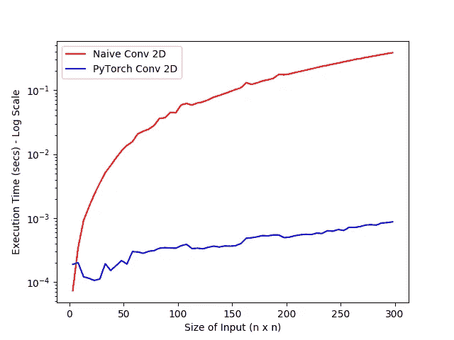

Naive Convolution vs PyTorch Convolution

我们实现中的 2 个 for 循环负责 O(n)执行时间，当输入大小增加到 250 x 250 以上时，朴素 Conv 每个矩阵需要 1-3 秒。如果我们有一个像 Inception Net 这样的巨大网络，有数百个卷积和数千个大型输入矩阵，朴素卷积将是一个绝对可怕的想法。

但是，请注意 PyTorch 自己的实现可以很好地适应输入矩阵的大小。显然，PyTorch 做卷积的方式不同。

# 招数 1 : im2col

在将每个窗口与内核相乘时，我们执行了两个操作:

1.  增加了条款
2.  把它们加在一起。

….我们对输入矩阵中的每个窗口都这样做。

现在这里要问的重要问题是:*我们能对整个操作进行矢量化吗？*

答案是肯定的，这正是`im2col`帮助我们做的(代表图像块到列)

简单地说，`im2col`是一种技术，我们将每个窗口展平，然后将它们堆叠成矩阵中的列。现在，如果我们将内核展平为一个行向量，并在两者之间进行矩阵乘法，我们应该会在对输出进行整形后得到完全相同的结果。

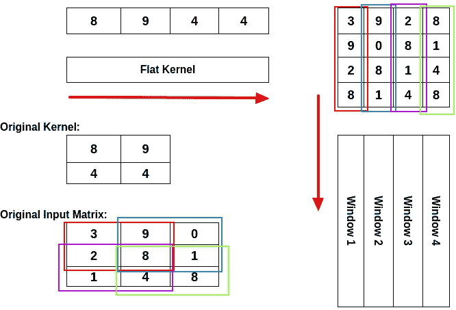

Im2Col

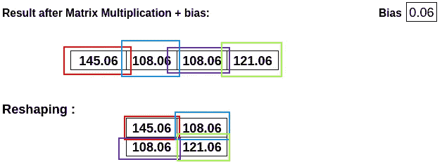

Im2Col-Reshaping

让我们试一试:

Naive Implementation of Im2Col

```
im2col(input_matrix, kernel)**Output:** array([[3, 9, 2, 8],
       [9, 0, 8, 1],
       [2, 8, 1, 4],
       [8, 1, 4, 8]])
```

现在我们展平内核并进行矩阵乘法:

```
output_shape = (input_matrix.shape[0] - kernel.shape[0]) + 1im2col_matrix = im2col(input_matrix, kernel) 
im2col_conv = np.dot(kernel.flatten(), im2col_matrix) + bias
im2col_conv = im2col_conv.reshape(output_shape,output_shape)
print(im2col_conv)torch_conv = nn.Conv2d(1, 1, 2)
torch_conv_op = torch_conv(input_matrix)
print(torch_conv_op)**Output:
im2col_conv** array([[145.06, 108.06],
       [108.06, 121.06]])**torch_conv_op** tensor([[[[145.07, 108.07],
          [108.07, 121.07]]]])
```

现在我们来看看它是如何扩展的:

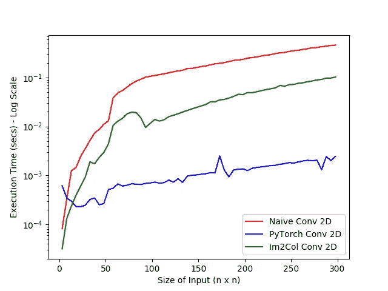

矢量化无疑有所帮助，但仍有改进的空间。在我们进入下一个技巧之前，让我们看看为什么矢量化会有帮助。

## 为什么会这样？

所有现代 CPU 和 GPU 都带有优化的矩阵代数库，允许代码利用硬件加速。这些库归入 [BLAS](https://en.wikipedia.org/wiki/Basic_Linear_Algebra_Subprograms) 或基本线性代数子程序的总称。当我们对代码进行矢量化并调用`np.dot()`时，它允许 numpy 使用 BLAS 库，从而提高执行速度。

事实上，在早期的探查器输出中，您可能会看到:

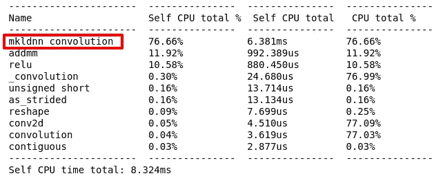

MKLDNN 代表深度神经网络的数学内核库，这是英特尔的 BLAS 库。自从我在英特尔 i7 上运行 PyTorch 模型后，PyTorch 自动调用了英特尔的 BLAS 库。如果你在 Nvidia GPU 上运行这个，PyTorch 会使用 cuBLAS (Nvidia 的 BLAS 库)。

下一个技巧是去除 2- for 循环，高效地创建`im2col`矩阵。

# 诀窍 2:记忆跨越

在`im2col`中创建窗口时，我们仍然使用 2 for 循环来索引输入矩阵，这会降低执行速度。为了理解如何改进这一点，我们需要看看 numpy 数组是如何存储在内存中的。

就像所有其他数组一样，numpy 数组作为连续的块存储在内存中。每个 numpy 数组还有一个`.strides`属性，告诉我们需要跳转多少字节来访问下一个元素。

例如:

```
x = np.arange(10, dtype = 'int64')
print(x)
print(x.strides)**Output:
x** array([0, 1, 2, 3, 4, 5, 6, 7, 8, 9])**x.strides** (8,)
```

每个元素都是`int64`，即 64 位或 8 字节，这就是为什么`x.strides`告诉我们需要跳跃 8 字节来访问数组中的下一个元素。

当处理 2D 数组时，我们得到两个步幅值，告诉我们在列方向和行方向跳跃多少字节。

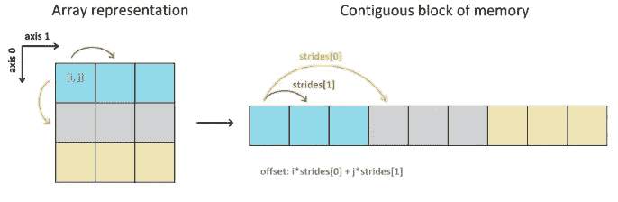

Credit: AndyK [on StackOverflow](https://stackoverflow.com/questions/53097952/how-to-understand-numpy-strides-for-layman)[2]

```
x = np.array([[1,2,3], [4,5,6], [7,8,9]])
print(x)
print(x.strides)**Output:
x** array([[1, 2, 3],
       [4, 5, 6],
       [7, 8, 9]])**x.strides** (24,8)#Jump 24bytes to access next row, 8bytes to access next column
```

现在有趣的部分来了，numpy 让我们能够通过使用一个叫做`np.lib.stride_tricks.as_strided`的函数来改变任何 numpy 数组的步长。基于我们提供的跨距值，这个函数简单地改变了我们在内存中查看数组的方式，并生成了一个新的“视图”。

这里有一个例子:

```
x = np.array([[1,2,3], [4,5,6], [7,8,9]])
print(x)x_newview = np.lib.stride_tricks.as_strided(x, shape = (5, 4), strides = (8,8))
print(x_newview)**Output:****X**
array([[1, 2, 3],
       [4, 5, 6],
       [7, 8, 9]])**X_newview** array([[1, 2, 3, 4],
       [2, 3, 4, 5],
       [3, 4, 5, 6],
       [4, 5, 6, 7],
       [5, 6, 7, 8]])
```

当开始下一行时，我们使用`as_strided`仅跳转 8 个字节(1 个元素),而不是跳转 24 个字节(3 个元素)来开始下一行。使用`shape`参数，我们也可以根据需要设置输出形状。

注意:如前所述，`as_strided`改变了我们看待内存中数组的方式。这意味着如果我们改变“视图”中的值，它将改变内存中的值，从而改变原始矩阵中的元素。

```
X_newview[1,3] = -99
print(X_newview)
print(X)**Output:
X_newview** array([[  1,   2,   3,   4],
       [  2,   3,   4, -99],
       [  3,   4, -99,   6],
       [  4, -99,   6,   7],
       [-99,   6,   7,   8]])**X** array([[  1,   2,   3],
       [  4, -99,   6],
       [  7,   8,   9]])
```

由于`as_strided`不使用任何循环来创建这些“视图”,我们可以使用它来有效地生成卷积窗口。我们需要做的就是计算正确的步幅值和输出形状，剩下的工作由`as_strided`来完成。

然而，如果我们提供了错误的步幅值，`as_strided`将访问数组之外的内存位置并返回垃圾值。幸运的是，`scikit-images`库中的`view_as_windows`函数通过在后台使用`as_strided`自动计算形状和步幅值，为我们完成了所有繁重的工作:

```
from skimage.util.shape import view_as_windowsinput_matrix = np.array([[3,9,0], [2, 8, 1], [1,4,8]])
print(input_matrix)kernel = np.array([[8,9], [4,4]])
print(kernel)windows = view_as_windows(x, kernel.shape)
print(windows)**Output:
input_matrix** array([[3, 9, 0],
       [2, 8, 1],
       [1, 4, 8]])**kernel** array([[8, 9],
       [4, 4]])**windows** array([[[[3, 9],
         [2, 8]], [[9, 0],
         [8, 1]]], [[[2, 8],
         [1, 4]], [[8, 1],
         [4, 8]]]])
```

现在我们只是重塑:

```
output_shape = (input_matrix.shape[0] - kernel.shape[0]) + 1
windows = windows.reshape(output_shape**2, kernel.shape[0]*2)
print(windows)**Output:
windows** array([[3, 9, 2, 8],
       [9, 0, 8, 1],
       [2, 8, 1, 4],
       [8, 1, 4, 8]])
```

下面是完成所有这些工作的最后一个函数:

Im2Col with Memory Strides

现在我们可以做矩阵乘法，方法和之前一样:

```
output_shape = (input_matrix.shape[0] - kernel.shape[0]) + 1
mem_strided_mat = memory_strided_im2col(input_matrix, kernel) 
mem_strided_conv = np.dot(kernel.flatten(), mem_strided_mat) + biasmem_strided_conv = mem_strided_conv.reshape(output_shape, output_shape)
print(mem_strided_conv)torch_conv = nn.Conv2d(1, 1, 2)
torch_conv_op = torch_conv(input_matrix)
print(torch_conv_op)**Output:
mem_strided_conv** array([[145.06, 108.06],
       [108.06, 121.06]])**torch_conv_op** tensor([[[[145.07, 108.07],
          [108.07, 121.07]]]])
```

让我们看看它与迄今为止所有其他实现相比如何:

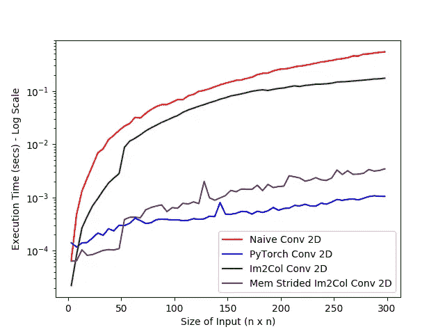

Plot for Mem Strided Im2Col

使用`as_strided`大大提高了我们的实现速度！事实上，它几乎和 PyTorch 一样快。

此外，如果您在分析器输出中注意到，PyTorch 在卷积之前使用自己的`as_strided`函数:

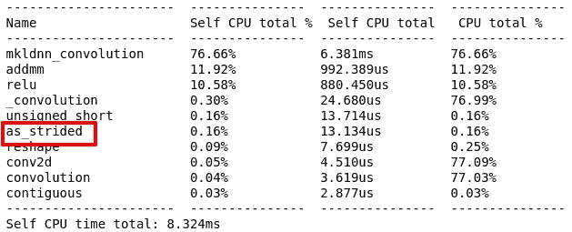

# 内存权衡

因为我们需要为输入矩阵的每个窗口创建列，所以 im2col 矩阵最终会比简单的实现消耗更多的内存。

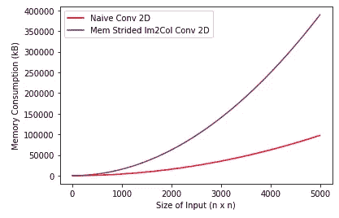

Memory Consumption of Strided Im2Col

然而，速度上的提升(*见下表*)远远超过了内存消耗增加带来的困难。

# 摘要

这里总结了所有实现的执行时间。当输入大小改变时，内核大小(2 x 2)保持不变。我在英特尔 i7 处理器上运行了所有这些程序。

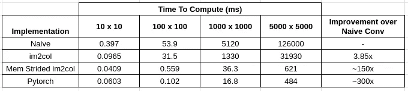

Final Results Table

令人难以置信的是，仅用两个简单的技巧，我们就能获得比简单卷积快 150 倍的性能提升。PyTorch 实现仍然比我们的内存步进式 im2col 实现快 2 倍。这很可能是因为 PyTorch 有自己的张量实现，可能会针对更大的矩阵进行优化。事实上，对于 50 x 50 以下的矩阵，我们的实现比 PyTorch 更快。

虽然我们在这里只使用 PyTorch， [TensorFlow](https://www.tensorflow.org/api_docs/python/tf/nn/conv2d) 在执行卷积( [docs](https://www.tensorflow.org/api_docs/python/tf/nn/conv2d) )时也执行完全相同的一组操作。

最后，当使用填充、步长或 1D/3D 卷积时，我们的实现会发生怎样的变化:

**填充**:如果我们添加填充，对我们的实现没有影响，因为填充通常在卷积之前应用。然而，必须正确计算输出形状。

**步幅**:这里我们假设步幅为 1。更大的步幅只会以更大的跳跃滑动窗口，这意味着必须重新计算`as_strided`中的`strides`。然而，概念是相同的。(*事实上，* `*view_as_windows*` *有一个* `*step*` *参数，它也可以处理步幅。)*

**更多过滤器**:在我们的例子中，我们假设内核只有一个过滤器。如果我们有更多的过滤器，每个过滤器将被拉平，给我们一个矩阵，而不是向量。接下来，我们将这个矩阵乘以 im2col 矩阵。这意味着我们将把矩阵*乘以矩阵*而不是矩阵乘以向量*来获得输出。*

**1D 或 3D 卷积**:im2 col 矩阵中的列会变得更短或更高，因为窗口的大小会改变(也取决于内核)。

我希望你喜欢并发现这很有用！如有任何问题或意见，请随时与我联系。

**Gist with all code:**[https://Gist . github . com/anirudhshenoy/089 a 70 deed 944d 0 ca 7 ab 0 b 6 a5 e b5 a 7 f 1](https://gist.github.com/anirudhshenoy/089a70deed944d0ca7ab0b6a5eb5a7f1)

**参考文献:**

[1]第 11 讲 CS231N:费-李非&安德烈·卡帕西&贾斯廷·约翰逊[http://cs 231n . Stanford . edu/slides/2016/winter 1516 _ Lecture 11 . pdf](http://cs231n.stanford.edu/slides/2016/winter1516_lecture11.pdf)

[2][https://stack overflow . com/questions/53097952/how-to-understand-numpy-stamps-for-lender](https://stackoverflow.com/questions/53097952/how-to-understand-numpy-strides-for-layman)

[3] TensorFlow Conv2D 文档: [https://www.tensorflow.org/api_docs/python/tf/nn/conv2d](https://www.tensorflow.org/api_docs/python/tf/nn/conv2d)