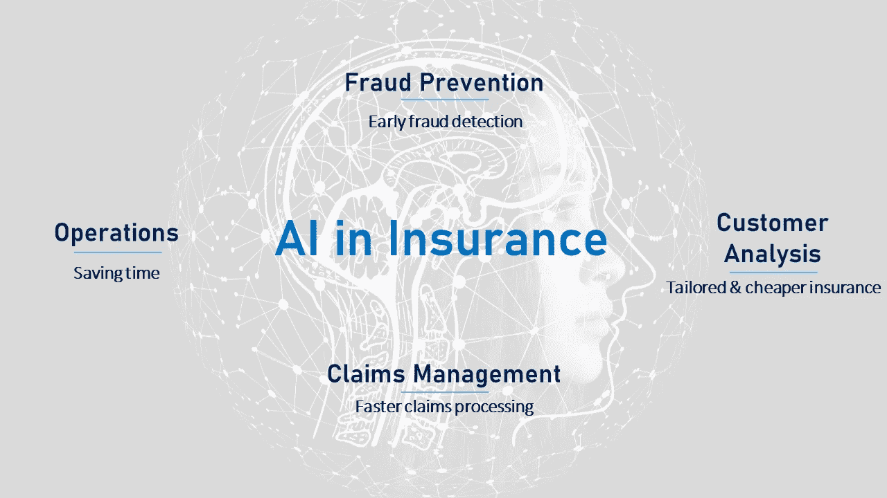

# 保险公司是如何实施人工智能(AI)的？

> 原文：<https://towardsdatascience.com/how-are-insurance-companies-implementing-artificial-intelligence-ai-aaf845fce6a7?source=collection_archive---------11----------------------->

## 保险公司正在使用人工智能为客户提供更好、更快、更便宜的服务。

Image by [Gerd Altmann](https://pixabay.com/users/geralt-9301/?utm_source=link-attribution&utm_medium=referral&utm_campaign=image&utm_content=3382507) from [Pixabay](https://pixabay.com/?utm_source=link-attribution&utm_medium=referral&utm_campaign=image&utm_content=3382507)

人工智能(AI)已经成为保险行业的热门词汇。尽管如此，该行业在人工智能实施方面已经取得了重大进展，尽管我们仍处于早期阶段。在本文中，我们将了解:

*   *为什么保险行业需要人工智能解决方案*
*   *保险公司已经在这方面做了什么，以及；*
*   在可预见的未来，人工智能将如何影响行业。

# 人工智能概述

最简单地说，人工智能(AI)是一套计算机化的工具，旨在实现通常需要人类智能才能实现的目标。

从商业角度来看，人工智能可以用来以更快、更便宜和更准确的方式进行操作。人工智能可以帮助自动化劳动密集型流程，从而降低成本和节省时间。人工智能还可以用来更好地了解客户——公司可以使用人工智能来分析他们掌握的客户数据，以预测客户行为，了解偏好，优化价格和产品供应。

人工智能由许多相关技术组成，其中包括:

*   **机器学习**:涉及训练计算机识别数据模式和/或预测结果。其他 AI 技术都是机器学习的应用。机器学习通常用于制定量化交易策略。
*   **深度学习**:机器学习的一种应用，模型可以从数据中分析并得出结论，在没有经过训练或给出明确指令或框架的情况下解决问题。这些模型自己学习。
*   **神经网络**:设计用来模仿人脑并识别数据模式的算法。他们可以识别、分类和分析不同的数据，并可以发现对人类程序员来说太复杂而无法编写代码的模式。深度学习和神经网络的一个有趣例子是 Goolge 的 [QuickDraw](https://quickdraw.withgoogle.com/#) ，这是一个草图游戏，它使用用户草图的大规模数据库来准确猜测你在画什么。
*   **自然语言处理**:帮助计算机理解、解释和回应书面文本或语音。聊天机器人通常使用这项技术。

人工智能还有更多的子集，但关键的要点是:

*   人工智能算法用于分类和研究数据，并识别关系
*   当应用于数据集时，人工智能可以用于模式识别、优化和预测
*   AI 可以对不同格式的数据进行分类和分析:文本、语音、图像、视频等。它还可以处理结构化(即标记数据)和非结构化数据。
*   机器学习算法通过输入大量带标签的数据集进行学习。一旦他们能够从已知的数据集中识别出正确的结论，他们就可以应用于现实世界的问题。

# 保险业对人工智能的需求

保险业是一个古老且高度监管的行业。或许正因为如此，与其他行业相比，保险公司接受技术变革的速度一直较慢。保险业仍然沉浸在缓慢且需要人工干预的手动纸质流程中。即使在今天，客户在获得理赔或签署新保单时，仍面临耗时的文书工作和官僚作风。客户也可能最终支付更多的保险费，因为保单不是为他们的独特需求量身定制的。在我们大多数日常活动都是在线、数字化和便捷的时代，保险并不总是一种愉快的客户体验。

也就是说，我们开始看到保险公司在全球范围内推动增强其技术能力，以便他们能够更快、更便宜、更安全地开展业务。在过去的几年里，有一些保险公司大举投资人工智能解决方案的突出例子。

麦肯锡[估计](https://www.mckinsey.com/business-functions/mckinsey-analytics/our-insights/the-executives-ai-playbook?page=industries/insurance/)如果人工智能技术完全应用于保险业，每年的潜在价值高达 1.1 万亿美元。其中，受益最大的业务领域是:

*   **销售和营销**:机器学习可以用来更有竞争力和相关性地为保单定价，并向客户推荐有用的产品。保险公司可以根据个人需求和生活方式为产品定价，这样客户只需支付他们需要的保险费用。这增加了保险对更广泛的客户的吸引力，其中一些客户可能是第一次购买保险。
*   **风险**:神经网络可用于识别欺诈模式，减少欺诈索赔。根据联邦调查局的数据，美国非健康保险欺诈估计每年超过 400 亿美元，这可能会使家庭每年额外花费 400-700 美元。机器学习还可以用于改善保险公司的风险和精算模型，这可能会导致更有利可图的产品。
*   **操作**:使用神经网络的聊天机器人可以被开发来理解和回答客户通过电子邮件、聊天和电话提出的大量问题。这可以为保险公司释放出大量的时间和资源，使其能够投入到更有利可图的活动中。

# 保险公司如何采用人工智能？

Four areas where AI can help the Insurance industry. Image by author, with background by [Gerd Altmann](https://pixabay.com/users/geralt-9301/?utm_source=link-attribution&utm_medium=referral&utm_campaign=image&utm_content=4389372) from [Pixabay](https://pixabay.com/?utm_source=link-attribution&utm_medium=referral&utm_campaign=image&utm_content=4389372)

世界各地的保险公司如何实施人工智能来改善他们的底线和客户体验的例子很多。还有许多初创公司正在为保险公司和客户提供人工智能解决方案。我将在这里介绍几个有趣的案例。

## 健康保险

在健康保险的成本和复杂性不断增加的世界里，[**Accolade Inc .**](https://www.accolade.com/)的 Maya 智能平台使用机器学习来帮助患者和雇主[选择最相关的](https://emerj.com/ai-sector-overviews/artificial-intelligence-in-health-insurance-current-applications-and-trends/?zd_source=hrt&zd_campaign=3159&zd_term=chiradeepbasumallick)和最具成本效益的健康保险覆盖范围。据报道，Accolade 为超过 110 万客户提供服务。

英国公司 [**Kirontech**](https://www.kirontech.com/) 声称其软件 KironMed [使用机器学习](https://emerj.com/ai-sector-overviews/artificial-intelligence-in-health-insurance-current-applications-and-trends/?zd_source=hrt&zd_campaign=3159&zd_term=chiradeepbasumallick)来分析医疗索赔，并检测可能意味着医疗保险欺诈或浪费(未充分利用的服务)的模式。据报道，该公司已经筹集了 350 万美元的首轮融资。

2018 年， **SwissRe** 和 **Max Bupa Health** [与印度健身科技初创公司 GOQii Health 达成合作](https://www.the-digital-insurer.com/dia/max-bupa-partners-goqii-swiss-re-health-offerings/)。GOQii 使用来自可穿戴设备和他们自己的人工智能驱动的“健康引擎”的数据来跟踪健康指标，并向个人用户提供健康生活建议和风险报告。当与这些人工智能和技术驱动的创业公司合作或收购它们时，保险公司押注这将导致更少的索赔支出，并为健康保险客户带来更具吸引力的保费。

## 汽车保险

早在 2017 年，美国保险公司 **Liberty Mutual** 通过其创新孵化器 [Solaria Labs](https://www.solarialabs.com/) 推出了一个[新开发者门户](https://www.greencarcongress.com/2017/01/20170104-solaria.html)。这个开放的 API 门户将公共数据与专有保险数据结合起来，为客户创造更好的保险产品。据报道，其中一个产品是一个移动应用程序，允许发生事故的司机使用智能手机摄像头实时评估他们的汽车受损情况。该应用程序还将提供维修成本估计。驱动该应用程序的人工智能将使用数以千计的车祸图像进行训练。

****，**中国金融科技公司中国巨头**阿里巴巴集团的一部分，**发布了一款名为[丁孙保](https://www.antfin.com/family.htm)的软件，用于分析车祸损失并处理索赔。丁孙宝使用机器视觉，使司机能够使用智能手机摄像头拍摄他们受损的汽车。然后，该应用程序将照片与其图像数据库进行比较，以确定损坏的严重程度，估计维修成本，并分析事故对司机未来保险费的影响。重要的是，蚂蚁金服声称该应用程序在*6 秒内评估损害并处理索赔，而据报道，人类索赔理算员需要大约 6 分 48 秒。***

## **经营效率**

**美国保险公司好事达(Allstate)与厄尔利信息科学(EIS)机构合作开发了一款名为 ABIe(发音为“陈细洁”)的虚拟助理。ABIe 旨在回答好事达保险代理人的常见问题，这些代理人从销售一种保险产品转向销售另一种保险产品。ABIe 使用自然语言处理每月处理 25，000 个查询。**

**当在产品线之间切换时，许多销售代理面临着陡峭的学习曲线，好事达发现其呼叫中心被他们自己的销售代理关于新产品的问题所淹没。这导致实际客户在呼叫中心等待的时间很长，从而导致潜在的商机损失。像 ABIe 这样的解决方案可能会带来巨大的变化。**

# **人工智能在保险业的未来**

**人工智能有可能将客户的保险体验从令人沮丧和官僚主义转变为快速、按需和更实惠的方式。量身定制的保险产品将以更公平的价格吸引更多的客户。如果保险公司将人工智能技术应用于他们所掌握的海量数据，我们将很快开始看到更灵活的保险，如按需付费保险，以及根据事故、客户健康等情况自动调整的保费。**

**我们将看到保险变得更加个性化，因为使用人工智能技术的保险公司将能够更好地了解他们的客户需要什么。保险公司将能够通过加快工作流程来实现成本节约。随着人工智能驱动的分析开辟新的业务和交叉销售机会，他们还将发现新的收入来源。**

**最重要的是，上述人工智能解决方案可以让客户更容易与保险公司互动。这可能导致人们更有可能购买保险。**