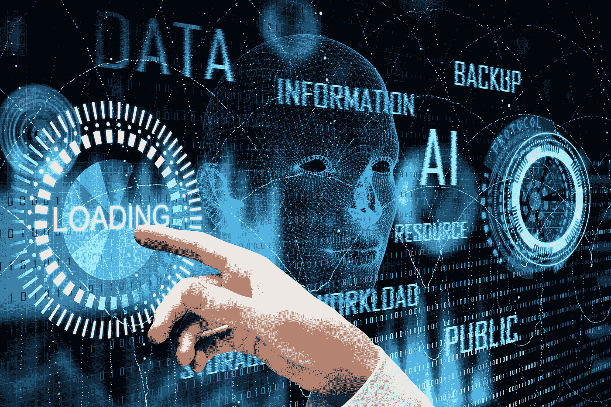

# 人工智能(AI)如何为网络安全解决方案增添新视野？

> 原文：<https://towardsdatascience.com/how-artificial-intelligence-ai-is-adding-new-horizons-to-cybersecurity-solutions-f9e01473330c?source=collection_archive---------9----------------------->

AI For Cybersecurity

麦卡锡和明斯基将人工智能描述为由机器执行的任务，如果由人类执行，将需要大量的智能。做出精确的决策需要所有行为品质的集合数据。这些行为品质是计划、解决问题、推理和操纵。

# **对人工智能的大规模投资**

[丰田为 AI](https://www.bloombergquint.com/technology/toyota-invests-100-million-in-fund-for-ai-robotics-startups#gs.aCaQ1gn7) 投入 1 亿美元资金；瑞银试图将人工智能引入其投资银行的运营，而风投则梦想用人工智能取代所有人，以降低价格。许多人经常因为从未使用过人工智能或缺乏相关知识而感到尴尬。

许多网络安全供应商使用这个术语，以便通过给客户留下深刻印象来增加销售额。在本文中，我们将共同探讨更多关于网络安全和人工智能的内容。

人工智能对商业有许多 [**好处**](https://digitalizetrends.com/benefits-of-artificial-intelligence-for-business/) 人工智能可以大致分为两种类型。下面给出了两个宽泛的分类:

**狭义人工智能**

狭义的人工智能是指如今我们在计算机中随处可见的“[智能系统](/what-is-intelligence-a69cbd8bb1b4)，它们被教会了完成特定任务的方法，但没有被编程来完成这些任务。”与人类不同，这些系统只学习正确的方法来完成特定的任务，这就是为什么它们也被称为“苗条人工智能”。

**通用人工智能**

通用人工智能是将通用人类能力存储到软件中，以便它在遇到问题时可以找到解决方案。它有时被称为“强人工智能”，因为它可以一次性存储和处理大量数据，并提供解决方案。它就像人脑一样工作，因为它通过处理可用的信息来做出决定。

# 网络安全:概述

网络安全是指旨在保护网络和信息免受破坏或未经授权访问的技术和做法。随着政府、企业和军事组织在计算机上收集、处理和存储大量信息，网络安全至关重要。

这些数据中的相当一部分可能是敏感的；它可以是知识产权、财务数据、个人信息或任何其他类型的数据，未经授权的访问或暴露可能会给人们带来严重的后果和问题。

组织在全球范围内将大量数据传输到不同的系统。存储在系统中的这些数据很容易被攻击并从系统中提取出来。这会导致超出我们想象的问题。近年来，我们发生了一些数据盗窃案件，这些案件的发生是因为本组织本身采取的网络安全措施不足。网络安全确保这种规模的数据盗窃不会发生。因此，它有助于个人隐私。

# 人工智能在网络安全中的作用

网络攻击者正在投资自动化以发起攻击，而许多组织仍在探索手动工作，以结合内部安全发现并将其与外部威胁信息联系起来。对于我们目前部署的这种安全系统，发现入侵可能需要更长的时间，在此期间，攻击者将利用漏洞危害系统并获取知识。

为了应对这些挑战，许多组织正在探索在其常规网络风险运营中使用人工智能。不能否定人工智能在网络安全中的作用。

通过人工智能，可以快速识别和分析新的漏洞和弱点，以帮助减轻进一步的攻击。它有能力最小化对人类的压力。一旦检测到入侵，当需要他们干预时，他们就会收到警报。

# 人工智能在网络安全中的优势

**人工智能可以变得更聪明**

一个有用的类比是思考为你的组织工作的最好的专业人士。如果你用这个员工来训练你的机器学习和人工智能程序，那么 AI 就会像你的明星员工一样聪明。现在，如果你花时间用你的 100 名最好的员工来训练你的机器学习和人工智能程序，结果将是一个像 100 名最好的员工的大脑加在一起一样聪明的解决方案。[人工智能 vs 机器学习](https://technostacks.com/blog/ai-vs-ml)也是近年来的热门话题。

**艾从不休息**

人工智能在网络安全方面为数不多的优势之一是，AI 从不休息一天，也不会在连续工作数小时后感到疲劳。因此，我们可以在这里得出结论，人工智能有助于以最高的效率、最高的速度和最高质量的产品完成工作。

预防网络威胁和避免攻击是理想的，但阻止这些事件的发生几乎是不可避免的。一旦他们这样做，快速反应是至关重要的，无论是在尽量减少攻击造成的伤害，还是从其影响中恢复过来。有了“思考机器”，快速反应可能会被写入它的系统。

人工智能迅速发现威胁

致力于发现潜在威胁的算法可能会实时执行，以提供对攻击的即时响应。现有的安全软件系统数据库和算法具有有限的范围，并且通常无法跟上新威胁媒介的快速发展和突变的步伐。

设计到智能安全系统中的自适应或[机器学习算法](/a-tour-of-the-top-10-algorithms-for-machine-learning-newbies-dde4edffae11)，有可能在威胁发生时发现并应对威胁——甚至是动态威胁。这些智能安全设备可能具有持续学习的内在能力，以检查当前的数据池并从中进行推断，预测未来的威胁和可接受的响应。

# 人工智能对网络安全的影响

**扩大阻力**

人工智能也有可能增加系统对持续攻击的抵抗力。如果一家公司使用大量的硬件设备，如台式机和手机来交流和传输信息，那么通过网络攻击从系统中获取信息的可能性就非常高。

**能够应对每一个外来威胁**

为了应对这种攻击，可以部署由人工智能支持的机器驱动机制来应对每一个到来的威胁，因为它会实时呈现自己并采取应对措施。观察到人工智能对网络安全的一些影响。

**策划应对威胁的有效策略**

在通常的安全设置中，对威胁的实时响应通常会受到速度的限制，有时还会受到攻击本身不断变化的性质的限制。因此，需要分析大量数据，以便制定应对措施和制定适当的策略。

# 人工智能在网络安全中的意义

人类安全分析师通常无法单独处理这些任务，他们的网络威胁响应系统需要一定程度的自动化。如今，人工智能系统及其机器学习算法和实时反制措施是保证不断发展的安全格局的第一阶段。

世界各国政府基于人工智能采取了许多措施。如今，政府在他们的系统中使用人工智能组件来检查并消除任何威胁。这是用人工智能完成的。

虽然这听起来很简单，但这是一个非常复杂的过程，需要数百人参与这个项目。从事该项目的大量人员让人们了解了人工智能在网络安全中的重要性。这确保了国家安全不受威胁。

# 网络安全中人工智能的例子

2016 年 10 月，白宫发布了一份关于“[为人工智能](https://obamawhitehouse.archives.gov/sites/default/files/whitehouse_files/microsites/ostp/NSTC/preparing_for_the_future_of_ai.pdf)的未来做准备”的报告。这份报告谈到了我们应该采取的管理人工智能的策略。组织了一些活动来讨论这项技术，以便让越来越多的人了解这项技术，并让新技术不断涌现。

这些会议极大地帮助了许多以前不知道这个话题的人，现在他们对这个话题有了全面的了解。这也导致了许多人工智能的[实际应用，被视为世界的未来。](https://www.forbes.com/sites/robertadams/2017/01/10/10-powerful-examples-of-artificial-intelligence-in-use-today/)

由于技术相对较新，我们不太确定它的未来。科学家不知道将来会出现什么问题，也不知道他们会如何处理。即使世界已经看到了如此多的人工智能在网络安全中的例子，这种困惑仍然存在。

在未来，人工智能将需要某种高科技监控，以确保它执行它应该执行的建设性任务，而不是成为破坏的工具。人工智能应该以这样一种方式发展，它们很容易受到网络攻击。

# **一位首席科学家的话**

一位首席科学家曾经在采访中说过，一个 AV 研究者，在他的整个职业生涯中，曾经看到过一万个病毒。然而，这些天他们每天遇到 50 多万个。他说，他的安全公司采用人工智能来防止这种攻击。除此之外，人工智能作为一种安全工具，在目前网络安全行业面临人力资源缺乏的情况下，可以证明是有帮助的。全球超过 40%的组织声称，他们正面临着 web 安全领域专业人才短缺的问题。

# **向前移动**

我们在处理人工智能时面临许多问题，为了实施人工智能，每个组织都必须需要强大的人工智能解决方案。有伦理和法律问题需要考虑，例如谁将为自主机器的行为负责，自主机器自己决定它将要采取的行动。

然而，凭借其提供的各种优势，人工智能在网络安全方面的未来看起来很有希望。要想知道未来几天它会如何改变世界，我们还得等上几年，也许几十年。