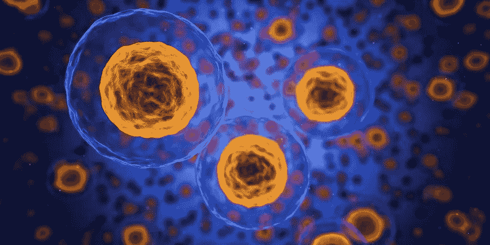

# 人工智能如何加速药物发现

> 原文：<https://towardsdatascience.com/how-artificial-intelligence-is-accelerating-drug-discovery-931047f6ea9a?source=collection_archive---------27----------------------->

[人工智能](https://en.wikipedia.org/wiki/Artificial_intelligence) (AI)正在接管每一个行业。我们有了电，我们有了互联网，现在，我们有了人工智能。

# 艾在现代

人工智能的目标是使用计算机模拟人类智能。人类(至少到目前为止)比计算机聪明得多。我们可以解决复杂的问题，比如造桥。我们可以通过观察一个人的肢体语言来理解对方的感受和情绪。计算机做不到这一点，至少，用几百万行代码给它编程是做不到的。

计算机非常擅长快速进行计算。你可以在商场花 1000 美元买到的现代个人电脑或 Macbook 将包含一个运行速度为 3.0 GHz 的处理器。那就是*每秒三十亿次*运算。

这些天来，通过*教*计算机新概念，计算能力正被用来构建人工智能，就像我们可以教人类新技能一样。现代人工智能是数据驱动的，这意味着人工智能通过消耗数据来积累知识。

为了教会现代人工智能系统汽车是什么样子，我们可以给它看几张不同型号、形状和颜色的汽车照片。然后，人工智能*将从这些例子中学习*组成汽车的特征——汽车的形状、车身、零件、整体*外观*。当它看到一辆新车时，它会知道这是什么，因为它以前见过类似的东西。

这种通过展示大量例子来教授人工智能系统的概念，正被应用于几乎每一个现代行业。人工智能正在接受训练，以浏览法律文件，为潜在客户撰写完美的销售计划，并预测股票。我们所要做的就是向人工智能展示各种案件的大量法律文件、对客户的推销以及股票市场数据，让它学会如何使用它们。

# 药物发现的科学

[药物研发领域](https://en.wikipedia.org/wiki/Drug_discovery)涉及新药的搜索、发现和实验。通常，这可以通过以下两种方式之一实现:

(1)在天然方法中科学地鉴定活性成分，该活性成分执行与我们希望我们的药物相同的功能。例如，Advil 中的活性成分是[布洛芬](https://en.wikipedia.org/wiki/Ibuprofen)，它可以减少导致体内炎症和疼痛的激素

(2)侥幸心理。当苏格兰科学家亚历山大·弗莱明度假回来后，发现他不小心把一个细菌留在了实验室一个敞开的培养皿中时，青霉素被偶然发现了。当他检查培养皿时，他发现在细菌中间形成了一个完美的圆形霉菌，完全没有被污染。这种霉菌后来被归类为青霉素，并拯救了数百万人的生命。

药物发现的方法(2)是好的。我们希望这样的幸运事故每天都发生在我们身上！但是方法(1)是我们唯一可以依靠的解决方案。做一个真正的，科学的寻找解决方案。这就是人工智能可以帮助的地方。

# 人工智能可以帮助药物研发

众所周知，科学可能很复杂。尤其是像药物发现这样的实验性研究。科学家们对体内不同的化学物质如何反应和协同工作有了很好的了解。但是对于药物来说，我们面对的是风险更高的人体，实验的成本也更高。

一个从事药物发现的科学家可能会在多年的工作中进行数百次有计划的精心设计的实验。它始于实验室，在那里化学物质与其他化学物质在类似培养皿或试管中进行测试。一旦这些测试“通过”,实验就会继续在啮齿动物身上进行——通常是小鼠和大鼠。然后是狗和黑猩猩。最后但同样重要的是，人体试验。

这些程序非常严格，通常需要数年才能完成。成本可能高达数十亿美元，而且很有可能失败。其中任何一个阶段的失败都会让我们回到原点。有成千上万种化学组合，大部分工作是实验性的，一些成功的基础来自经验证据。

人体试验中的病人经常暴露在无法预测的副作用下。即使试验最终成功，也要经过监管部门的批准。它可能会也可能不会获得在美国来自[美国食品和药物管理局](https://www.fda.gov/home) (FDA)的批准。

现代人工智能在有大量数据和/或大量重复动作的应用中特别有效。这使得药物研发成为首选。多年来收集的大量测试数据和进行的大量重复实验。

药物发现最具挑战性和最耗时的部分之一是，实际的发现。以完全正确的比例获得正确的化合物是一个巨大的挑战。如果能解决这个问题，就能节省多年的实验、测试和人体试验。

这是大多数药物研发公司的人工智能关注的焦点。使用人工智能来检查药物的组合，*学习关于它们的*。对于这种应用，什么是好的药物？糟糕的一个？如果我这样使用这种药物，会发生什么？在某种程度上，人工智能可以进行科学家通常会进行的完全相同的实验，只是在计算机模拟中。这样，它可以在很短的时间内经历多次实验。这对科学家、社会、时间、金钱和健康都是一个巨大的节约。

# 展示用于药物发现的人工智能

[Atomwise](https://www.atomwise.com/our-technology/) 开发[卷积神经网络](https://en.wikipedia.org/wiki/Convolutional_neural_network)(CNN)对某些药物进行大规模基于实验的搜索。为正确的应用开发正确的药物是一种微妙的平衡，既有效又安全，没有副作用。通常，这需要许多实验，但我们仍然不能 100%确定这种药物永远是 100%安全的。Atomwise 通过训练 CNN 自动进行实验，有效地将这项工作转移到计算机和人工智能系统中。这使得科学家们可以进行更多的实验，数百万次，以选择更可靠的可行药物子集。

与 Atomwise 相似的著名创业公司有 [Deep Genomics](https://www.deepgenomics.com/) 、 [Schrodinger](https://www.schrodinger.com/) 和 [Recursion AI](https://www.recursionpharma.com/) 。

[PathAI](https://www.pathai.com/) 专注于疾病的精准诊断。[病理学家](https://en.wikipedia.org/wiki/Pathology)在医疗保健中发挥着非常重要的作用。他们将从本质上分析像组织样本这样的东西，以便进行诊断并确定下一步的行动，特别是在潜在疾病存在的情况下。由于这样的过程需要一个专家——病理学家，它很快变得昂贵、耗时，甚至在某些情况下容易出现人为错误。

PathAI 提出的解决方案是训练人工智能进行这种诊断。人工智能甚至不需要能够完美地诊断每一个组织。但它能做的是大大减少病理学家的工作量。让人工智能检查所有的组织样本。由于它是在计算机上运行的，它在工作量方面受到的限制较少，可以进行非常复杂的分析。然后，AI 系统可以传递组织样本的**子集**，这些样本被认为是“感兴趣的”，并且不会用它对其诊断非常有信心的样本来打扰病理学家。人工智能也可以被训练来指出组织内的“感兴趣区域”，它认为病理学家应该给予额外的关注。所有这些确实有助于简化科学家和病人的流程。

与 PathAI 相似的著名创业公司有 [Paige。艾](https://paige.ai/)和[野山羊](https://ibex-ai.com/)。

有几家初创公司致力于增强和优化临床试验，旨在使整个过程更加有效。Athelas 公司正在开发一种设备，可以从一滴血中分析癌症的生物标记，从而可以快速分析疾病状态。 [Imagia](https://www.imagia.com/2019/) 的软件分析放射图像，以预测患者疾病的进展和对潜在治疗的反应。 [WinterLight Labs](https://winterlightlabs.com/) 有一个通过分析简短的语音样本来评估和监控认知健康的系统。它可以用于在整个临床试验和实验过程中跟踪患者的认知状态。

关于将人工智能应用于药物发现的公司的更多信息，请查看 BenchSci 关于药物发现的文章[初创公司](https://blog.benchsci.com/startups-using-artificial-intelligence-in-drug-discovery)和[制药公司](https://blog.benchsci.com/pharma-companies-using-artificial-intelligence-in-drug-discovery)。

# 喜欢学习？

在 Twitter 上关注我，我会在这里发布所有最新最棒的人工智能、技术和科学。我也很乐意在 LinkedIn 上与你联系。

***注来自《走向数据科学》的编辑:*** *虽然我们允许独立作者根据我们的* [*规则和指导方针*](/questions-96667b06af5) *发表文章，但我们不认可每个作者的贡献。你不应该在没有寻求专业建议的情况下依赖一个作者的作品。详见我们的* [*读者术语*](/readers-terms-b5d780a700a4) *。*