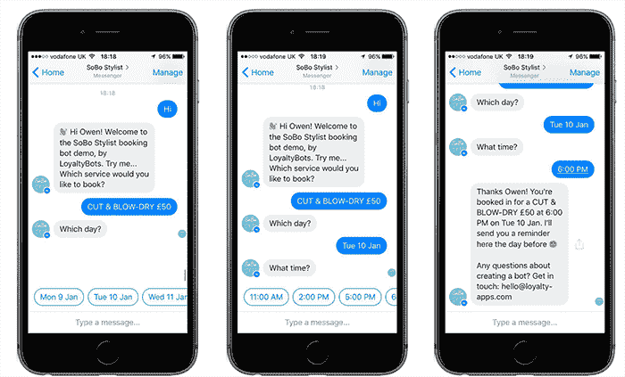
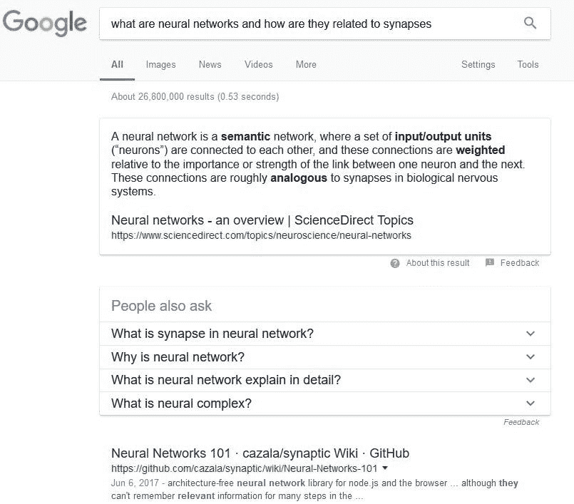
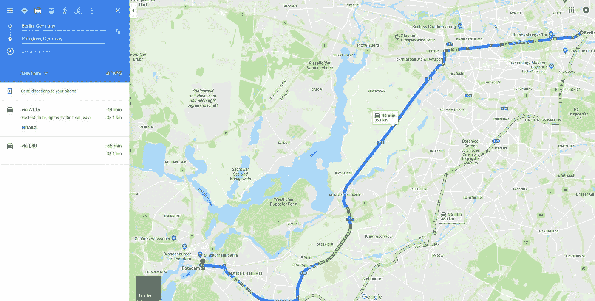

# 人工智能如何影响我们的日常生活

> 原文：<https://towardsdatascience.com/how-artificial-intelligence-is-impacting-our-everyday-lives-eae3b63379e1?source=collection_archive---------0----------------------->

## 以及你每天是如何遇到它的

Photo by [Franki Chamaki](https://unsplash.com/@franki) on [Unsplash](https://unsplash.com/?utm_source=medium&utm_medium=referral)

人工智能和机器学习在幕后被用来影响我们的日常生活的方式多得惊人。

人工智能在我们生活的每个领域都有帮助，无论我们是试图阅读电子邮件，获取驾驶方向，获得音乐或电影推荐。

在本文中，我将向您展示人工智能在日常活动中的应用示例，例如:

*   社会化媒体
*   数字助理
*   自动驾驶和停车车辆
*   电子邮件通信
*   网络搜索
*   商店和服务
*   离线体验

# 人工智能如何改善社交媒体

人工智能使用户更容易找到朋友和商业伙伴并与之交流。

# 推特

从推文推荐到打击不当或种族主义内容，以及增强用户体验，Twitter 已经开始在幕后使用人工智能来增强他们的产品。他们通过深度神经网络处理大量数据，随着时间的推移了解用户的偏好。

# 脸谱网

深度学习正在帮助脸书从其非结构化数据集的更大部分中获取价值，这些数据集是由近 20 亿人每分钟更新状态 293，000 次创建的。它的大部分深度学习技术都建立在 Torch 框架上，该框架专注于深度学习技术和神经网络。

# 照片墙

Instagram 还利用大数据和人工智能来定向广告，并打击网络欺凌和删除攻击性评论。随着平台中内容数量的增长，人工智能对于能够向用户显示他们可能喜欢的平台信息、打击垃圾邮件和增强用户体验至关重要。

# 聊天机器人

聊天机器人识别单词和短语，以便(希望)向有常见问题的客户提供有用的内容。有时候，聊天机器人非常准确，就好像你在和一个真人说话一样。

例如，下图中的聊天机器人对话显示了人工智能正被用于安排美发师约会。

Chatbot conversation. Photo by the author

# 人工智能如何通过数字助手每天帮助你

# 数字助理

苹果的 Siri、Google Now、亚马逊的 Alexa 和微软的 Cortana 都是数字助手，可以帮助用户执行各种任务，从查看他们的日程安排和在网络上搜索一些东西，到向另一个应用程序发送命令。人工智能是这些应用如何工作的重要组成部分，因为它们从每一次用户交互中学习。

# 人工智能如何通过停车和驾驶每天帮助你

# 自动驾驶和停车车辆

自动驾驶和停车汽车使用深度学习(人工智能的一个子集)来识别车辆周围的空间。技术公司英伟达(Nvidia)利用人工智能赋予汽车“观看、思考和学习的能力，因此它们可以在几乎无限的可能驾驶场景中导航”。该公司的人工智能技术已经在丰田、奔驰、奥迪、沃尔沃和特斯拉生产的汽车上使用，肯定会彻底改变人们的驾驶方式，使车辆能够自动驾驶。

# 人工智能如何改善电子邮件通信

# Gmail 中的智能回复

智能回复为用户提供了一种回复电子邮件的方式，只需简单地说一句“是的，我正在努力。”或者“不，我没有。”只需点击一下按钮。智能回复是根据每封电子邮件的内容定制的。用户可以通过键入手动回复来回复，也可以选择一键智能回复。

例如，如果你向某人发送一封关于即将到来的游戏的电子邮件，而他们回复让你知道他们有兴趣去看游戏，Gmail 提供了“智能回复”选项。

# Gmail 中的电子邮件过滤器

谷歌使用人工智能来确保你收件箱里几乎所有的邮件都是真实的。他们的过滤器试图将电子邮件分为以下几类:

*   主要的
*   社会的
*   促销
*   更新
*   论坛
*   罐头猪肉

该程序可以帮助你的电子邮件变得有条理，这样你就可以更快地找到重要的通信方式。例如，Gmail 将电子邮件分为 4 个不同的类别，并将垃圾邮件发送到单独的文件夹。

# 人工智能如何帮助网络搜索

人工智能被用来帮助谷歌搜索已经有一段时间了。

# 谷歌预测搜索:

当你开始输入一个搜索词，谷歌会推荐给你选择，这就是人工智能在发挥作用。

Google Predictive Searches. Photo by the author

预测性搜索基于 Google 收集的关于您的数据，如您的位置、年龄和其他个人信息。使用人工智能，搜索引擎试图猜测你可能试图找到什么。

# 谷歌的算法

谷歌搜索引擎通过研究搜索中使用的语言学随着时间的推移而发展。它的人工智能从结果中学习，并随着时间的推移进行调整，以更好地满足用户的需求。

例如，搜索“什么是神经网络，它们与突触有什么关系”，谷歌会在顶部突出显示“最佳答案”，然后是回答该问题的来源列表。

Photo by the author

谷歌算法的目的是向搜索者提供尽可能好的结果。为了做到这一点，谷歌使用 AI 来尝试确定内容的质量，并将其与用户的查询进行匹配。

# 人工智能如何改善你在网上商店和服务的体验

# 产品推荐

亚马逊和其他在线零售商使用人工智能来收集关于你的偏好和购买习惯的信息。然后，他们通过推荐适合你习惯的新产品来个性化你的购物体验。

下面是一个人工智能推荐 Amazon.com 的例子。

AI-powered recommendations on Amazon.com. Photo by the author

# 音乐推荐

音乐服务使用人工智能来跟踪你的收听习惯。然后，他们利用这些信息推荐你可能喜欢听的其他歌曲。

例如，Spotify 会根据你的收听习惯，为你的新发现、新作品和老作品提供建议。

Google Play 还提供个性化的音乐推荐。它的人工智能建议考虑了天气和时间等因素，以提供可以为活动设定情绪的音乐。例如，你可能会在周五晚上收到一个舞曲播放列表，或者在下雨天收到一个轻音乐播放列表。

# 地图和方向

当像谷歌地图这样的应用程序计算交通和建筑，以便找到到达目的地的最快路线时，这就是人工智能在工作。

在下面的例子中，谷歌地图根据通常的交通情况，根据从柏林到波茨坦的最快路线提供方向。路线上的橙色部分表示交通较慢的地方。

Photo by the author

# 商业航班

你可能会惊讶地发现，你友好的飞行员在驾驶舱里实际上很少飞行。2015 年对航空公司波音 777 飞行员的一项调查报告称，在一次典型的飞行中，人工驾驶飞机仅花费 7 分钟，其余大部分时间由人工智能技术完成。

据《连线》杂志报道，波音公司正致力于建造完全由人工智能驾驶的喷气式飞机——没有人类飞行员掌舵。

# 结论

人工智能让我们的生活每天都更有效率人工智能为许多程序和服务提供动力，帮助我们做日常事情，如与朋友联系，使用电子邮件程序，或使用拼车服务。

如果你对人工智能的使用持保留态度，那么知道我们大多数人多年来一直在日常生活中使用人工智能可能会令人欣慰。

**如果你想联系我，顺便说一句，你知道一个好笑话，你可以在** [**Twitter**](https://twitter.com/ikac_Ilija) **或** [**Linkedin 上联系我。**](https://www.linkedin.com/in/ilijamihajlovic/)

感谢阅读！😄 🙌