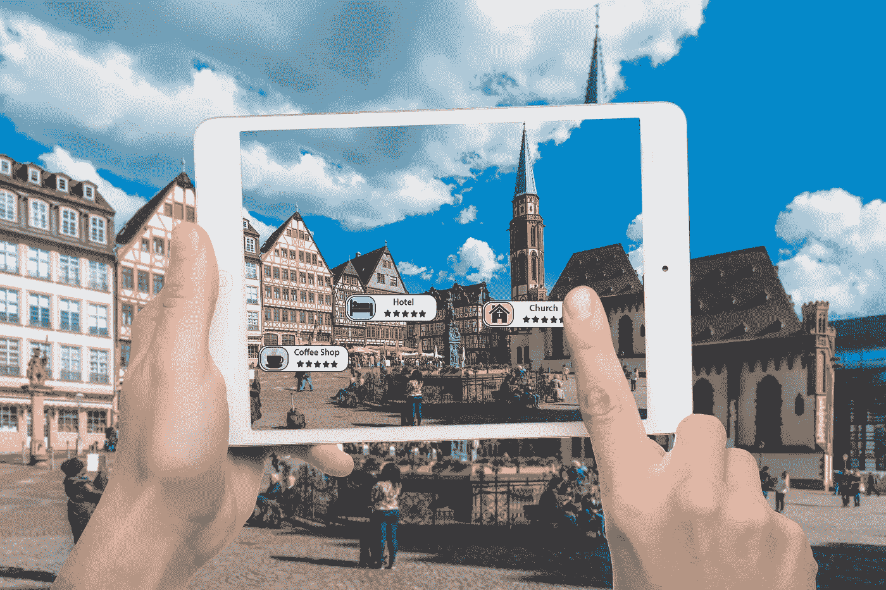

# 增强现实(AR)如何改变旅行和旅游业

> 原文：<https://towardsdatascience.com/how-augmented-reality-ar-is-changing-the-travel-tourism-industry-239931f3120c?source=collection_archive---------4----------------------->

根据 Statista 的报告，到 2025 年，全球增强现实 AR 市场预计将培育 59.1 亿至 1980 亿美元。 [**增强现实趋势**](/augmented-reality-ar-trends-the-past-present-future-predictions-for-2019-8e1148345304) 已经物化为不同业务的建设性工具。这让他们改变了顾客观察周围环境的方式。

AR 是最新兴的[类型技术](https://digitalizetrends.com/types-of-technology/)之一，在未来几年将会更有帮助。这种技术创新对那些在旅游行业工作的人来说是非常有益的。增强现实或 AR 提供了出色的销售体验和增强环境，这可以在旅游部门以多种方式得到增强。在这篇博客文章中，你将更好地了解 AR 在旅游行业中的影响。

## **AR 在旅行中的重要性**

凭借吸引人类思维的力量，AR 正在改变营销人员的游戏，我们将探索 [**增强现实解决方案**](https://technostacks.com/augmented-reality) 如何帮助旅游行业。这项技术为旅游业打开了创新之门，以改善他们的客户体验。然而，旅行和旅游领域已经显示出增强现实的重大转变。

旅行和旅游业务是一个高度研究的部分。旅游业的顾客总是通过广泛的研究来计划他们的旅程、停留或要探索的食物地方。对于顾客来说，对数据和信息的追求不会停止，即使是在他到达他们的旅游目的地之后。此外，所有这些信息都在一系列移动设备中进行探索。

## **旅游业的增强现实**

这就是 AR 为旅游业带来变革的地方。AR 能够通过提供互动广告吸引信息来增加搜索体验。通过开创性的移动应用程序，这些增强的体验可以通过简化旅行搜索和建立信任而广泛传播给旅行者。

甚至，旅游专家估计，通过接受 AR 的力量，可以建立不同的用户体验，这可能成为旅游领域和旅游业的福音。

# **增强现实如何应用于旅游和旅行领域**

增强现实和旅游业是天生的一对。游客的主要活动是什么？旅行和抓住信息的每一部分，他们可以找到与目的地有关的信息。

当你去一个充满吸引力的城市旅游时，比如罗马或威尼斯，你可能会错过一个迷人的地方。增强现实移动应用程序可以作为现实生活中的导游。旅游领域的增强现实应用程序可以让旅行者通过相机取景器功能探索更多的目的地。当相机捕捉该地区的风景时，移动应用程序标记重要的地方并提供关于它的附加信息。

## **增强现实旅游体验**

如今，客人们知道他们想去哪里旅游。人们有一种目的地感，可以使用智能手机准确地将他们带到他们想去的地方。然而，AR 可以有效地增强人们对交互式地图的旅行体验，使其更加贴合。当旅行者开始使用一种引人入胜的、易于使用的、有帮助的导航方式时，他们就不得不这样做。以下是增强现实在旅游和酒店行业的应用。

# **增强现实在旅游业的光明前景**

旅游行业就是要创造独特的体验，而 AR 有望支持这一业务领域。这项技术可以用新的客户服务方式来支持旅游业。据推测，在未来的时间里，增强现实将彻底改变旅游业的商业模式。以下是增强现实如何为最终客户和旅游业带来价值的最新列表。

## **增强现实缩小语言差异**

如果没有翻译为你带路，去外国旅游既困难又有吸引力。然而，通过 AR 技术，可以利用智能手机为不同类型的用户翻译外语。

## **AR 应用确保没有旅客迷路**

在一个陌生的城市里发现自己的路是一件具有挑战性的事情。然而，AR 通过添加箭头等数字组件和其他适用的细节，让导航应用变得更加智能。通过将智能手机摄像头与谷歌地图集成和结合，AR 可以改善在新地方导航的旅行体验。

## **使用 AR 移动应用提高旅行便利性**

由于缺乏正确及时的信息，旅行可能会变得混乱。通过 AR，旅游品牌正在扩大游客的移动应用，以改善他们的旅游体验。

# **旅游和酒店住宿的增强现实**

酒店业是利用 AR 技术的最重要的领域之一。你可能会猜测酒店可以以何种方式使用 AR，并对各种选项感到惊讶。

## **酒店营销和广告中的 AR**

通过使用 AR，您可以在探索酒店时建立包含住宿细节和价格的全方位房间游览。这是营销和宣传您的酒店的好方法，可以吸引目标客户探索全面的酒店服务。这就把曾经的客人变成了忠实的客人。

假设你在酒店房间里，需要搜索客房服务、要看的目的地、到目的地的距离以及其他旅游服务。因此，您可以立即获得您的智能手机或平板电脑，解锁酒店移动应用程序，指向标记，并访问所需的信息。

轻松自如，这实际上是旅游业的增强现实。例如，一些酒店在房间里有一个互动的挂图，客人可以用他们的手机浏览附近地区的旅游景点。

## **通过 AR 检测酒店的创新方法**

今天的游客不会理会直截了当的小册子。AR 通过从印刷的小册子中获得 3D 动画，使得在新的层面上找到信息成为可能。酒店与基于内容的公司和营销机构合作，在杂志上创建和发布基于 AR 的广告。此外，酒店移动应用程序用户还可以扫描广告，打开演示视频。

## **沟通&使用 AR 与酒店互动**

Pokemon Go 刺激了许多其他行业使用 AR，包括旅游和酒店业。增强现实应用程序有助于想象这种游戏化如何说服和吸引人们入住挑剔的酒店，尤其是最年轻的酒店。了解一些酒店如何为其客人提供移动应用程序，该应用程序通过辅助 AR 对象展示酒店的每个角落。

## **餐厅、酒吧、&咖啡馆**的 AR

保持简洁，餐馆和酒吧可以在很多方面利用 AR 解决方案。通过 AR 应用程序，餐厅可以拥有引人入胜的 360 度互动菜单，展示每一道菜及其配料。几家餐厅的 AR 游戏使用 Pokémon Go 来吸引客户，并在移动应用程序的帮助下使用 AR 来提供餐厅、咖啡馆和附近酒吧的详细信息。

## **运输领域的 AR**

想象你的飞机刚刚着陆，或者你在一个未知的地方走出一辆公共汽车、火车或汽车，你不知道从那里去哪里。然而，在这种情况下，如果你有一个带 AR 的旅行移动应用程序，你可以指向交通工具，以获得最佳方向、旅行路线、下一个目的地和旅行地点。

特别是对外国游客来说，这可能是相当愉快的，而他们的旅游和旅行。通过 AR，你可以将地铁地图变成多种语言的迷人指南。

## **游览中的 AR&旅游景点**

利用增强现实发现旅游目的地和短途旅行，让传统的城市旅游变得更加神奇。我们可以回到过去，牢记时间观中地标的进步，从 3D 模型中获得乐趣，并获得有趣的导游。最好的例子是主题公园、花园和动物园。

根据华特·迪士尼首席执行官 Bob Iger 的说法，他们选择 AR 到 VR 耳机。根据他的说法，增强现实还具有社会性、互动性和关怀性。公园或动物园中的 AR 可以实现更好的游戏化、导航、感知和有趣的问答。博物馆中的 AR 使游客能够根据灭绝动物的结构骨骼，观看它们的完整现场演示。

## **关键要点**

旅行总是一种创新和学习的经历。随着现代化的设备和工具，旅行和旅游中的增强现实对于酒店旅游、预订支持信息、无语言障碍以及高级导航来说非常有用。通过创新的移动应用程序提升旅行体验，增强现实已经令人赏心悦目。

## **作者简介:**

Mrudul Shah 是 Technostacks Infotech 的首席技术官，techno stacks Infotech 是一家位于印度 &美国 [**的移动应用程序开发公司。他正在帮助他的整个开发团队和全球客户接触新技术，学习和分享 IT 技术新闻趋势的兴趣。**](https://technostacks.com/mobile-app-development)