# 银行如何管理风险

> 原文：<https://towardsdatascience.com/how-banks-manage-risk-26557d782477?source=collection_archive---------11----------------------->

## 风险价值、预期短缺和风险加权资产


大致来说，金融机构面临三种风险，监管机构试图对其进行监管。首先是市场风险，包括股票价格、利息、外汇、波动性等。然后是信用风险/交易对手风险或融资风险，最后是运营风险。我们在这里要考察的风险度量主要集中在前两个方面。开发风险价值(VaR)和预期短缺(ES/CVaR)是为了量化这些类型的风险。

如果你喜欢这篇文章并想了解更多，请务必关注我的简介 ！

# 风险价值

首先，我们将有兴趣观察损失巨大的场景，即我们对可能损失分布的*尾部*感兴趣。在金融波动之后，最常见的风险度量是 VaR。VaR 是衡量市场风险的单一指标，即资产价值的变化，旨在帮助做出冒险的实际决策。这是在给定 1 — *α* %的概率和一定的时间范围 *T* 的情况下，最大预期损失的度量。
风险经理使用 VaR 来衡量和控制金融风险暴露的水平，这可以是在公司内部，由任何类型的资产或特定头寸组成的投资组合，因此可用于衡量弥补可能损失所需的资产价值。
上世纪 90 年代，美国证券交易委员会(SEC)规定，企业必须在财务报表中纳入市场风险的量化指标，而风险值(VaR)成为了这样做的主要工具。巴塞尔委员会甚至表示，银行可以依靠自己内部的风险值计算来设定资本要求。事实证明，这种对风险值的广泛依赖是错误的。VaR 度量的风险不包括所有风险中最大的风险；金融危机的可能性。

如果 *L* 是一个损失分布或潜在损失，具有某个范围 *T* 和连续分布函数 F_L，那么 VaR( *α，T* )度量由下式给出:

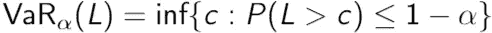

这只是一种比较花哨的说法，VaR 测度是最大的下限 *c* ，其中损失 *L* 大于这个 *c* 的概率小于或等于 1 — *α* 。对于连续损失分布，这相当于:

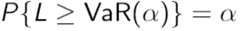

也就是说，我们在概率为 *α的情况下，*的损失不会超过 VaR( *α* )。

计算 VaR 时，必须考虑三个步骤。首先，必须指定分位数 *α* 。通常水平为 1%-5%，但更高的分位数可能用于投资银行的交易大厅进行日常风险评估，而更低的分位数可能用于养老基金的长期风险分析。二、持有期 *T* 。对于活跃的交易者来说，这主要是一个单日风险值。最后，必须确定概率分布。这是最重要的部分，我将在稍后回到这一点。一个典型的结论是“*在 95%的概率下，投资者损失不会超过
VaR(α= 0.95)*。

风险价值有利有弊。最大的缺点是不确定如果超过风险值度量将会发生什么——如果我们最终“在最后 5%”这使得风险值成为风险管理的可疑指标。这是一个分位数度量，实际上是一个描述最坏情况下最好情况的值，因此低估了潜在的损失。这似乎不适合用来衡量风险。另一种思考方式是，VaR 是“正常”市场日和极端事件之间的界限，这使得在金融危机期间或接近金融危机时使用 VaR 变得非常糟糕。VaR 通常是每天测量的，因为它是非常短期的测量，所以它假设明天或多或少会像今天一样。

在 2008 年的《全球风险专业人员协会评论》中，Einhorn 将 VaR 比作“*一个安全气囊，除了发生车祸的时候*，当它的使用在高管中产生一种虚假的安全感时，它可能是灾难性的。一个叫纳西姆·塔勒布的人也曾在国会作证，要求禁止 VaR。


那么为什么还要使用它呢？
首先，风险值之所以如此吸引人，是因为它是唯一普遍使用的风险衡量指标，几乎可以应用于任何类型的资产，而且它考虑了许多变量，例如多样化、杠杆和波动性，这些构成了公司每天都会遇到的风险。其次，这是一个优势，它可以衡量个人风险(单个投资组合)和公司范围的风险，这是一个净数字。高管通常在收盘后几分钟内就知道公司的风险值。

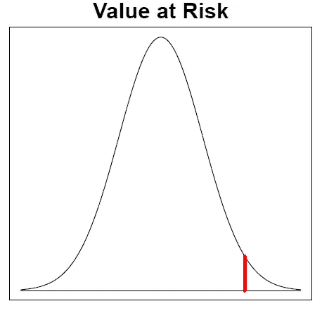

Simple illustration of VaR

上面的简单图示显示了带有红色 VaR 阈值的损失分布。例如，如果我们有一周的时间跨度 *T* ，95%的置信系数(即 *α* = 0.05)和 VaR(*α*= 0.05)= 500 万美元，那么在接下来的一周，损失超过 500 万美元的可能性只有 5%，我们损失不超过 500 万美元的可能性为 95%。请注意，它始终表示亏损，但 VaR 值报告为正数。负风险值意味着投资组合有很高的盈利概率。它没有告诉我们我们将在分布的右尾多远着陆，因此也没有告诉我们损失会有多严重。


那么在这种充满风险的情况下，有什么方法可以改善这种情况呢？

# 预期短缺

关于 VaR，大多数人关心的是“在过去的 5%”(或 1%)发生了什么，在之前的正态分布曲线的极端边缘。事实上，你在 95%的时间里不可能损失超过一定的数额，这并不能告诉你在另外的 5%的时间里会发生什么。你可能会损失 5000 万美元——没什么大不了的。它发生了。你也可能损失数十亿美元并破产。风险值无法衡量它会是什么。造成极端损失的原因是纳西姆·塔勒布所说的“肥尾”或“黑天鹅”事件(他写过几本关于这个主题的书)。这意味着我们不知道黑天鹅可能会在何时或如何出现，这是一个观察者无法预料的令人惊讶的事件；就像 90 年代末的网络泡沫或 2007-2008 年的金融危机。
风险值的替代方法是预期短缺。

预期短缺被定义为超出α-VaR 估计的尾部预期损失:

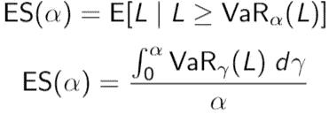

后者是 VaR_ *γ* ( *L* )对所有小于或等于 *α* 的 *γ* 的平均值。与上面的典型风险值结论相关，人们可以改为问"*在期限 T 内，α最坏情况下发生的预期损失是多少？*”。这个问题意味着 es 在计算时考虑了整个尾部分布。ES 恭维 VaR。如果将这两种风险度量结合起来，我们可以很好地估计资产或投资组合的风险。VaR 告诉我们边界在哪里，ES 告诉我们如果达到这个边界会有多糟糕，如下图所示。

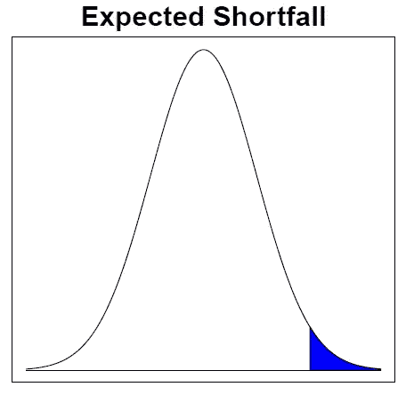

Simple illustration of ES

风险度量很少为人所知，取而代之的是必须进行估计，这给了我们更多的风险和不安全感。正态损失分布和 t 损失分布可能有相同的 VaR 但不同的 ES，这意味着尾部很重要。
我们将看看两种方法。首先，一种非参数方法(意味着非正态分布或 t 分布)。这里我们对收益分布没有任何假设。历史回报的观察值从最小到最大排序，VaR_ *α* ( *L* )由该排序分布的分位数 *α* 确定。ES 将被计算为所有大于 VaR 的损失的平均值:


S 是某项资产头寸的当前规模，^q( *α* 是收益分布的估计上限*α*-分位数。因此，ES 估计值是所有超过 VaR 的 L_i 的平均值。
非参数方法非常简单，其优势在于我们没有任何分布假设。然而，这只有在未来看起来足够像过去的情况下才会起作用。

参数方法是基于某种分布的假设。一个投资组合的分布可以通过 3 种方法确定:
1。分析
建立一个模型，找到同时分布，并将模型与数据相匹配。例如，您可以从对数正态分布函数中找到 VaR。
2。模拟市场模型的结果，评估每种结果的投资组合，并估计分布。这通常是用蒙特卡罗模拟来完成的。方法很慢，但可能是最厉害的方法。它足够灵活，可以包括历史观测值，并且可以通过所谓的方差缩减方法进行改进。
3。基于数据模拟结果，评估每个结果中的投资组合，并估计分布。当数据量不是很大时很有用。它很耗时，但它的主要优势是捕捉到了最近的市场崩盘，这对风险衡量非常重要。

参数和非参数方法都有可批评的假设。对于小的 *α* 来说，非参数估计是不准确的，但是这可以通过假设一个多项式来改善，我在这里不包括它。此外， *α* 可以使用 Hill 估计器进行估计，这是一种最大似然估计:

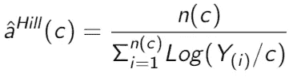

其中 *n* ( *c* )为返回次数 Y_i ≤ *c* 。 *c* 被选择，但是它有一个偏差/方差的权衡。如果 *n* ( *c* )大，我们有更多的偏差，如果 *n* ( *c* )小，我们有高的方差。我们可以用一个小山图来描绘^a 和 n 的对比。然后，我们可以找到一个“稳定区域”,并粗略估计希尔估计值:

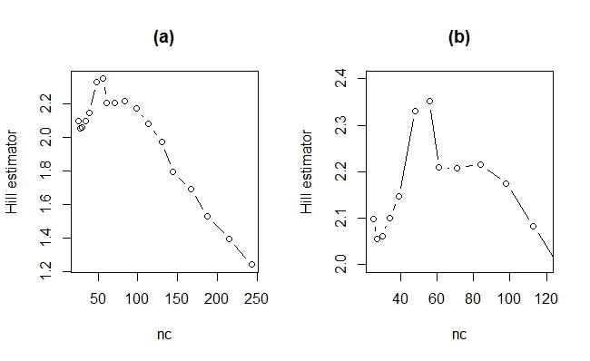

Hill plot

在本例中，(b)是(a)的特写，我们将选择 60 到 100 之间的 *n* ( *c* )的希尔估计值约为 2.2。

对于旧 S&P500 数据集，R 中的可变尾部分布示例如下所示:

```
data(SP500,package="Ecdat")
library("fGarch")# number of observations : 2783
# daily return S&P500 (change in log index)
n = 2783
## grab last 1000 obs.
SPreturn = SP500$r500[(n-999):n]
year = 1981 + (1:n)* (1991.25-1981)/n
year = year[(n-999):n]
n = length(SPreturn)
# fit t-distr to SPreturn
fitt = fitdistr(SPreturn,"t")
param = as.numeric(fitt$estimate)
mean = param[1]
df = param[3]
sd = param[2]*sqrt( (df)/(df-2) )
lambda = param[2]
x=sort(SPreturn)
q = quantile(x,.1)
a= 1.975## vector of alphas for plotting VaR
alpha = seq(.002,.2,.0001)
qalpha = qt(alpha,df=df)
VaR_par = -20000*(mean + lambda*qalpha)
VaR_norm = -20000*(mean(x)+ sd(x)* qnorm(alpha))par(mfrow=c(1,1))
plot(alpha, -20000*q * (.1/alpha)^(1/a),type="l",lwd=2,
     xlab=expression(alpha),ylab=expression(paste("VaR(",alpha,")")),
     ylim=c(0,1700),log="x" )
a.hill=2.2
lines(alpha, -20000*q * (.1/alpha)^(1/a.hill),lty=2,lwd=2)
lines(alpha,VaR_par,lty=5,lwd=2)
lines(alpha,VaR_norm,lty=3,lwd=2)
legend("topright",c("polynomial tail: regression",
                    "polynomial tail: Hill","t","normal"),lwd=2,lty=c(1,2,5,3))
```

情节是:

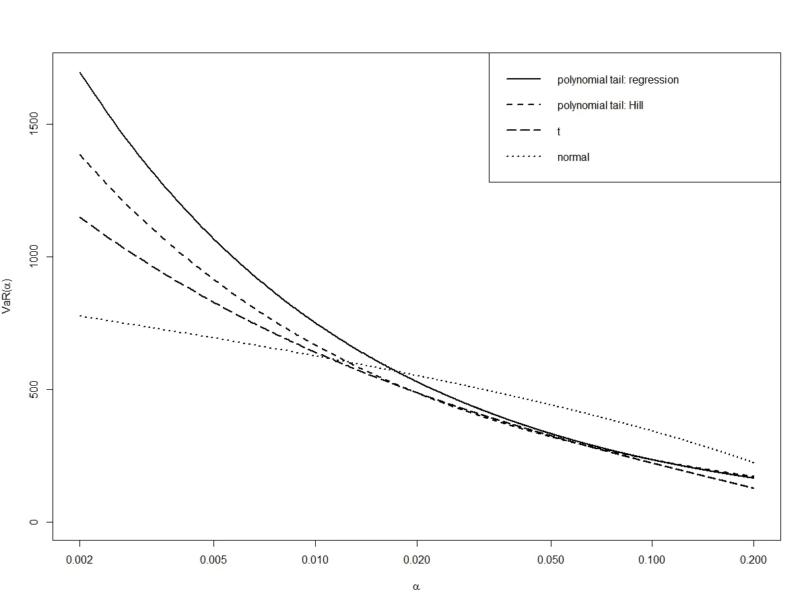

我不会在这里解释所有的细节，我也决定不解释多项式尾部，但它明确显示了尾部分布在查看不同的 *α* 时的重要性。

# 一致的风险措施

Artzner 等人(1999 年)定义了一个风险度量应该如何运作才能被认为是一致的。通过四个不同的公理，他们使用对风险本质的精确陈述，成功地形成了一致风险度量的概念。从而将复杂的现实转化为更简单的数学框架。
设 X 和 Y 是描述两个投资组合损失的随机变量。那么，如果一个风险度量ρ()(对资本的要求或“风险性”)满足 4 个约束，则称它是相干的。比例:

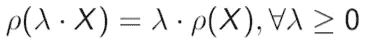

如果你的仓位翻倍，你的风险也会翻倍。
2。一神论:

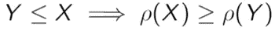

如果损失 *Y* 总是小于或等于损失 X，则 Y 的风险一定小于或等于 X 的风险。翻译:

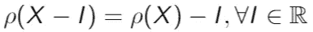

简单地说，现金可以从资本要求中扣除。
4。次可加性:

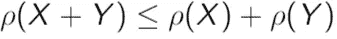

两个投资组合的风险度量应该小于或等于两个投资组合各自的风险度量，因为组合创造了多样化。例如，如果您为一家公司设定了资本要求和次可加性约束，该公司可以通过拆分资产来降低资本要求。上面列出的原则被视为正确风险度量的指南。
VaR 不考虑次可加性。
例如，假设一个投资组合的损失分布如下，VaR(0.5) = 50:

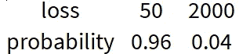

那么两个独立的投资组合将有损失分布:

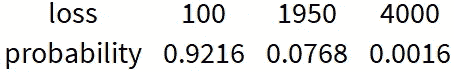

这样就会有 VaR(0.5) = 1950 > 2×50，这显然与次可加性相矛盾。这两个投资组合在一起的风险大于这两个投资组合单独的风险。
对于 ES 不是这样的，它会是这样的:
ES(P1)= ES(p2)= 1590 og ES(P1+p2)= 2015.6<2×1590

ES 是一个连贯的风险度量。作为 es 满足次可加性的结果，你可以说不可能建立 ES 违反一致风险度量定义的例子。它对重尾、对尾分布的错误估计和异常值也更敏感，而且不像 VaR 那样容易解释。


A risk manager happily using VaR

## 关于 VaR 和 ES 的结束语

VaR 用一个数字概括了投资组合的风险，因此比其他风险衡量指标(如希腊指标)更肤浅。如果我们将 VaR 和 ES 结合起来，我们将有一个更可靠的风险度量，VaR 和 ES 非常依赖于参数的选择。尽管 ES 在理论上优于 VaR，但后者比 ES 更受青睐。这可能是因为计算 ES 首先涉及计算 VaR，因此潜在地给出了可能使结果无效的两个误差源。巴塞尔委员会在 2012 年提议从 VaR 转移到 es，因为:
*与 VaR 不同，ES 通过考虑超过特定阈值的损失规模和可能性来衡量工具的风险……这样，ES 以更全面的方式考虑尾部风险*。
及以后:
*尽管批评集中在与 es 相关的复杂性、计算负担和回测问题上，但最近的文献表明，许多问题已经得到解决，或者已经被确定为不如最初预期的严重*。
关键要素是 ES 将能够捕捉尾部事件。然而，今天它仍然不是那么简单。正如风险值一样，ES 将无法捕捉信贷和流动性风险，因为它与风险值相似。专家系统的验证过程要复杂得多，因此模型可能很难解释，很难知道模型何时何地出现故障。总而言之，金融风险及其监管极其复杂，也许过于复杂…

# 资本要求—风险加权资产(RWA)

在监管中，风险度量的使用可以帮助确定一些投资组合或公司在最坏情况下的资本要求。在信贷业务中，损失时有发生——总有一些借款人违约。某一年实际经历的损失每年都不一样。下图显示了一段时间内已实现的损失如何导致银行的损失分布。

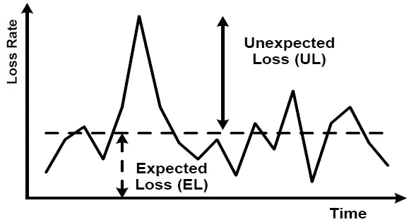

银行永远不可能确定他们未来的损失，但他们可以预测他们预期经历的信贷损失的平均水平。在这个设置中，我们将预期损失(EL)定义为您预期在有 *n* 项资产的投资组合中得到的损失，如虚线所示。金融机构将 EL 视为开展业务的成本组成部分。
银行资本的功能之一是提供缓冲，以保护银行的债务持有人免受超过 EL 的峰值损失。上图中虚线上方的尖峰说明了这些峰值。峰值损失不会经常发生，但一旦发生，损失可能会非常大。高于 EL 的损失通常被称为意外损失(UL)。机构知道它们会不时发生，但它们无法提前知道发生的时间或严重程度。需要资本来覆盖这种峰值损失的风险。

银行必须仔细权衡持有资本的风险和回报。在最坏的情况下，尽管可能性极小，银行会失去整个信贷组合，但持有资本来抵御这一事件在经济上是无效率的。他们也有动机将资本最小化，因为这样可以释放资源，用于有利可图的投资。然而，银行持有的资本越少，其无法履行自身义务的概率就越大。
现在我们可以回到 VaR 了。

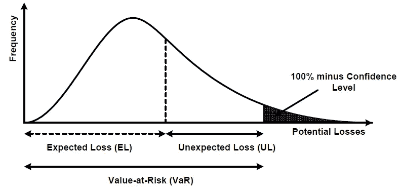

这看起来像我们以前见过的东西。看到预期损失的可能性更大，VaR 阈值是我们已经知道的。如果资本是根据 EL 和 VaR 之间的差额设定的，并且如果 EL 被收入所覆盖，那么银行在一年内保持偿付能力的可能性等于置信水平(1- *α* )。
预期损失可以写成:
EL = PD×EAD×LGD
或者如果表示为 EAD 的百分比，则为:
EL = PD*LGD
这里的三个因素是违约概率(PD)、违约风险敞口(EAD)和违约损失率(LGD)。PD 是债务人在一年内违约的平均百分比，EAD 是借款人违约时未偿金额的估计值，LGD 是借款人违约时银行可能损失的风险百分比，通常表示为 EAD 的百分比。

现在我们可以看看风险加权资产(RWA)。这是一个你可能遭受损失的资产价值的表达式，根据风险进行加权。它用于推导 UL 的监管资本费用，并基于巴塞尔委员会开发的特定模型。它用于确定银行为降低破产风险而必须持有的最低资本额。在 2008 年金融危机期间，许多金融机构损失了大量资本，一些机构破产。巴塞尔协议 III 设定了一些指导方针，以避免未来出现这种情况。每家银行必须按照风险类别将其资产组合在一起，以便要求的资本金额与每种资产类型的风险水平相匹配。资产风险越大，RWA 越高，所需的监管资本也越多。
看起来是这样的:
RWA = 12.5×*K*×EAD
K 是资本要求，给出为:

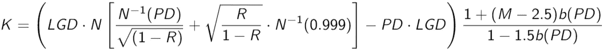

其中:

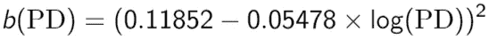

它乘以 EAD 和最低资本比率 8%的倒数，即乘以系数 12.5。

那是很多…但是它有四个组成部分。渐近单风险因子(ASRF)模型，这是第一部分，直到-PD LGD。
它是根据大数定律从“普通”信贷组合模型中得出的，可以证明这些 ASRF 模型是组合不变的，这意味着任何给定贷款所需的资本应仅取决于该贷款的风险，而不得取决于它所加入的组合。这是一项标准措施，鼓励银行使用最适合其内部风险管理需求的信贷风险模型。此处，LGD 作为 ASRF 模型的一部分包含在内。 *N* 是累积正态分布， *N* 是其逆。 *R* 为相关性，其固定置信水平为 99.9%。

2.相关性，r。资产相关性表明一个借款人的资产价值(例如一个公司所有资产价值的总和)如何依赖于另一个借款人的资产价值。主管已经推导出资产相关性函数为:

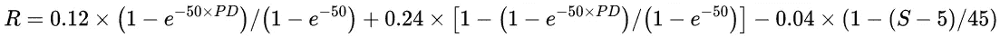

它由非常高和非常低的 PDs(分别为 100%和 0%)的 12%和 24%的两个极限相关性构成。这些限值之间的相关性通过指数加权函数建模，该函数显示了对 PD 的依赖性。其速度由一个所谓的“*k*-因子”设定，对于企业风险敞口，该因子被设定为 50。它也是由公司规模(最后一部分)调整的，公司规模是由年销售额衡量的。它影响年销售额在€500 万到€5000 万之间的借款人。对于€5000 万以上的借款人，规模调整为零，而对于€5000 万以下的借款人，其值为 0.04，从而将资产相关性从 24%降至 20%(非常高的违约概率)或从 12%降至 8%(非常低的违约概率)。它决定了风险权重公式的形式。相关性取决于资产类别，因为不同的借款人和/或资产类别对整体经济的依赖程度不同。

3.贷款的预期损失占违约损失率的百分比，即-PD LGD。LGD 在这里是预期损失的一部分。巴塞尔框架决定，银行只需持有针对 UL 的资本。在上面的 VaR、EL 和 UL 图中，风险权重现在只与 VaR 和 EL 之间的距离有关。在图中，由于 ASRF 模型将从原点到 VaR 的全部资本量交付，因此 el 必须从资本要求中剔除。这是通过采用 PD 和低迷 LGD 的乘积完成的，并产生“仅 UL”的资本要求。

4.到期调整，即最后一个括号后的分数。请注意，PD 是正常情况下的平均概率，LGD 处于经济低迷时期。 *M* 是成熟期。
资本要求在到期日不断增加，因为通常情况下，长期信贷比短期信贷风险更大，长期内更有可能出现衰退。b(PD)是一个用于到期调整的“平滑”统计回归模型。

好吧，那是很多。恭喜你通过了。
请注意，这并不意味着详尽或结论性的描述。我可能遗漏了很多信息。如果我错过了什么或者做错了什么，请随时纠正我(我可能就是这样)。金融风险是一个巨大而复杂的话题，风险管理远远超出了本文的范围。我不是风险经理，这纯粹是从我学生时代的课程中收集的。

如果你喜欢这篇文章并想看更多，请务必关注我的简介。