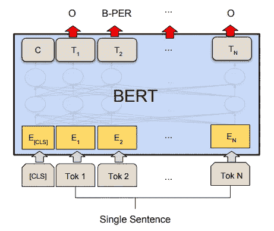

# BERT 如何利用注意机制和转换器学习单词上下文关系

> 原文：<https://towardsdatascience.com/how-bert-leverage-attention-mechanism-and-transformer-to-learn-word-contextual-relations-5bbee1b6dbdb?source=collection_archive---------12----------------------->

## 伯特简介


Photo by [Ambitious Creative Co. - Rick Barrett](https://unsplash.com/@weareambitious?utm_source=medium&utm_medium=referral) on [Unsplash](https://unsplash.com?utm_source=medium&utm_medium=referral)

在 [ELMo](/elmo-helps-to-further-improve-your-word-embeddings-c6ed2c9df95f) (来自语言模型的嵌入)和开放 AI [GPT](/combining-supervised-learning-and-unsupervised-learning-to-improve-word-vectors-d4dea84ec36b) (生成式预训练转换器)之后，谷歌发布了一份新的最先进的 NLP 论文。他们将这种方法称为 BERT(来自变压器的双向编码器表示)。

开放人工智能 GPT 和伯特都使用变压器架构来学习文本表示。其中一个区别是 BERT 使用双向转换器(从左到右和从右到左方向)而不是双向转换器(从左到右方向)。另一方面，两者都使用双向语言模型来学习文本表示。然而，ELMo 使用浅层连接层，而 BERT 使用深层神经网络。

看完这篇帖子，你会明白:

*   伯特设计与建筑
*   模特培训
*   实验
*   履行
*   拿走

# 伯特设计与建筑

## 输入表示

BERT 使用三种嵌入来计算输入表示。它们是标记嵌入、片段嵌入和位置嵌入。“CLS”是表示序列开始的保留标记，而“SEP”是分隔片段(或句子)的标记。这些输入是

*   令牌嵌入:一般单词嵌入。简而言之，它用向量来表示 token(或 word)。你可以查看这个[故事](/3-silver-bullets-of-word-embedding-in-nlp-10fa8f50cc5a)的细节。
*   另一个词中的句子嵌入。如果输入包括两个句子，相应的句子嵌入将被分配给特定的单词。如果输入只包括一个句子，将使用一个且只有一个句子嵌入。在计算 BERT 之前学习片段嵌入。对于句子嵌入，你可以查看这个[故事](/transforming-text-to-sentence-embeddings-layer-via-some-thoughts-b77bed60822c)的细节。
*   位置嵌入:指输入的标记序列。即使有 2 句话，也会累积位置。


BERT Input Representation (Devlin et al., 2018)

## 培训任务

说完输入表示，我就来介绍一下 BERT 是怎么训练的。它使用两种方式来实现它。第一个训练任务是掩蔽语言模型，而第二个任务是预测下一句话。

> 掩蔽语言模型

第一个预训练任务是利用掩蔽语言模型(Masked LM)。与传统的方向模型不同，BERT 使用双向作为预训练目标。如果使用传统的方法来训练一个双向模型，每个单词将能够间接地看到“它自己”。因此，伯特使用了掩蔽语言模型(MLM)方法。通过随机屏蔽一些标记，使用其他标记来预测那些被屏蔽的标记以学习表示。与其他方法不同，BERT 预测屏蔽令牌而不是整个输入。

因此，实验随机抽取 15%的令牌进行替换。然而，也有一些缺点。第一个缺点是掩码标记(实际标记将被该标记替换)在微调阶段和实际预测中不会出现。因此，Devlin 等人，所选择的用于屏蔽的令牌不会总是被屏蔽

*   答:80%的时候，它会被替换为[MASK] token
*   B: 10%的时候，它会被其他实际的代币代替
*   C: 10%的时间，它会保持原样。

比如原句是“我在学 NLP”。假设“NLP”是用于屏蔽的选定令牌。然后 80%的时候会表现为“我在学【面具】(场景 A)。”我用 10%的时间学习 OpenCV(场景 B)。其余 10%的时间，它将显示为“我正在学习 NLP”(场景 C)。尽管随机替换(场景 B)会发生并可能损害句子的意思。但是它只有 1.5%(仅屏蔽了整个数据集中的 15%的标记和这 15%中的 10%)，作者认为它不会损害模型。

另一个缺点是每批只有 15%的令牌被屏蔽(预测),训练需要更长的时间。

> 下一句预测

第二个预训练任务是预测下一句话。这种方法克服了第一个任务的问题，因为它不能学习句子之间的关系。目标很简单。只区分第二句是不是下一句。举个例子，

输入 1:我正在学习 NLP。

输入 2: NLG 是 NLP 的一部分。

预期的输出是 isNextSentence 或 notNextSentence。

在为该任务生成训练数据时，将随机选择 50%的“notNextSentence”数据。

# 模特培训

在 BERT 中采用两阶段训练。使用通用数据集执行第一次训练，并通过提供领域特定数据集对其进行微调。

## 训练前阶段

在预训练阶段，从图书语料库(800 万字)(朱等，2015)和英文维基百科(2500 万字)中提取句子。

*   屏蔽 LM:每个序列将使用 512 个标记(2 个连接的句子)，每批有 256 个序列。设定大约 40 个时期来训练模型。该配置是:
*   学习率为 1e-4 的 Adam，β1 = 0.9，β2 = 0.999
*   L2 重量衰减 0.01
*   所有层的压差为 0.1
*   使用 gelu 进行激活

如前所述，选择两个句子用于“下一句预测”预训练任务。另一个句子被随机选取并标记为“不是下一个句子”的概率为 50%,而另一个句子实际上是下一个句子的概率为 50%。

这一步由谷歌研究团队完成，我们可以利用这个预先训练的模型，根据自己的数据进一步微调模型。

***微调阶段***

在预训练阶段，仅改变了一些模型超参数，如批量大小、学习速率和训练次数，大多数模型超参数保持不变。在实验过程中，以下数值范围适用于各种任务:

*   批量:16 个，32 个
*   学习率:5e-5，3e-5，2e-5
*   历元数:3，4

微调程序不同，取决于下游任务。

> 分类


Single Sentence Classification Task (Devlin et al., 2018)

对于[CLS]令牌，它将作为最终隐藏状态被馈送。标签(C)概率用 softmax 计算。之后，对其进行微调，以最大化正确标签的对数概率。

> 命名实体识别



NER Task (Devlin et al., 2018)

令牌的最终隐藏表示将被馈送到分类层。预测时将考虑周围的单词。换句话说，分类只关注令牌本身，而没有条件随机场(CRF)。

# 实验


Photo by [Louis Reed](https://unsplash.com/@_louisreed?utm_source=medium&utm_medium=referral) on [Unsplash](https://unsplash.com?utm_source=medium&utm_medium=referral)

到目前为止，与其他最先进的 NLP 模型相比，BERT 提供了最好的结果。


Experiment Result on GLUE dataset (Devlin et al., 2018)


Experiment Result on SQuAD (Devlin et al., 2018)

# 履行

## 微调模型(再现实验)

在微调特定领域的数据集之前，我更喜欢先重现实验结果。你可以访问[官方页面](https://github.com/google-research/bert#sentence-and-sentence-pair-classification-tasks)或者跟随它的指示

*   执行这个[脚本](https://gist.github.com/W4ngatang/60c2bdb54d156a41194446737ce03e2e)来下载数据集
*   下载[预培训的](https://storage.googleapis.com/bert_models/2018_10_18/uncased_L-12_H-768_A-12.zip)型号(选定的“BERT-Base，Uncased”型号)
*   分配环境变量

```
export BERT_BASE_DIR=/downloaded_model_path/bert
export GLUE_DIR=/downloaded_data_path/glue
export BERT_OUTPUT_DIR=/trained/model/bert/
```

*   执行以下命令开始微调

```
python run_classifier.py \
  --task_name=MRPC \
  --do_train=true \
  --do_eval=true \
  --data_dir=$GLUE_DIR/MRPC \
  --vocab_file=$BERT_BASE_DIR/vocab.txt \
  --bert_config_file=$BERT_BASE_DIR/bert_config.json \
  --init_checkpoint=$BERT_BASE_DIR/bert_model.ckpt \
  --max_seq_length=128 \
  --train_batch_size=32 \
  --learning_rate=2e-5 \
  --num_train_epochs=3.0 \
  --output_dir=$BERT_OUTPUT_DIR
```

*   我用了一台 20 核 CPU 的机器来重现它，花了大约一个小时来完成微调。

```
INFO:tensorflow:***** Eval results *****
INFO:tensorflow:  eval_accuracy = 0.84313726
INFO:tensorflow:  eval_loss = 0.5097478
INFO:tensorflow:  global_step = 343
INFO:tensorflow:  loss = 0.5097478
```

## 提取固定向量

而不是针对特定数据集微调预训练模型。我们还可以为下游任务提取一个固定的向量，这样更容易。这类似于埃尔莫所做的。

您可以访问[官方页面](https://github.com/google-research/bert#using-bert-to-extract-fixed-feature-vectors-like-elmo)或跟随其指示

*   生成一个样本文件到当前方向

```
echo 'Who was Jim Henson ? ||| Jim Henson was a puppeteer' > input.txt
```

*   执行以下命令提取字符向量

```
python extract_features.py \
  --input_file=input.txt \
  --output_file=$BERT_OUTPUT_DIR/output.jsonl \
  --vocab_file=$BERT_BASE_DIR/vocab.txt \
  --bert_config_file=$BERT_BASE_DIR/bert_config.json \
  --init_checkpoint=$BERT_BASE_DIR/bert_model.ckpt \
  --layers=-1,-2,-3,-4 \
  --max_seq_length=128 \
  --batch_size=8
```

*   输出文件包含以下对象

```
- features
  - token: Token value (e.g. Who)
  - layers
    - index: Layer number (from -1 to -4) per token
    - values: Vector values. Default model dimension is 768
```

## 参数

如果我们更多地了解如何改变参数，这将是有益的。以下是一些有用的参数解释:

`data_dir`:数据方向

`task_name`:具体用什么任务。特定任务处理器已准备就绪。可能的`task_name`有“可乐”、“mnli”、“mrpc”、“xnli”。您可以通过扩展`DataProcessor`类来实现自己的数据处理器。

`do_train`:包含训练步骤。必须启用`do_train`、`do_eval`或`do_test`中的任何一个。

`do_eval`:包含评估步骤。必须启用`do_train`、`do_eval`或`do_test`中的任何一个。

`do_test`:包含测试步骤。必须启用`do_train`、`do_eval`或`do_test`中的任何一个。

# 关于我

我是湾区的数据科学家。专注于数据科学、人工智能，尤其是 NLP 和平台相关领域的最新发展。你可以通过[媒体博客](http://medium.com/@makcedward/)、 [LinkedIn](https://www.linkedin.com/in/edwardma1026) 或 [Github](https://github.com/makcedward) 联系我。

# 参考

Devlin J .，Chang M. W .，Lee K .，Toutanova K .，2018 年。 [BERT:用于语言理解的深度双向转换器的预训练](https://arxiv.org/pdf/1810.04805.pdf)

[张量流中的伯特](https://github.com/google-research/bert)(原创)

[伯特在 PyTorch](https://github.com/huggingface/pytorch-pretrained-BERT)

[伯特在链器里](https://github.com/soskek/bert-chainer)

[word2vec，glove 和 fastText Story(单词嵌入](/3-silver-bullets-of-word-embedding-in-nlp-10fa8f50cc5a))

[跳过思想故事(句子嵌入)](/transforming-text-to-sentence-embeddings-layer-via-some-thoughts-b77bed60822c)

[ELMo 的故事](/elmo-helps-to-further-improve-your-word-embeddings-c6ed2c9df95f)

[NER 的故事](/named-entity-recognition-3fad3f53c91e)

[变压器详解](http://peterbloem.nl/blog/transformers)