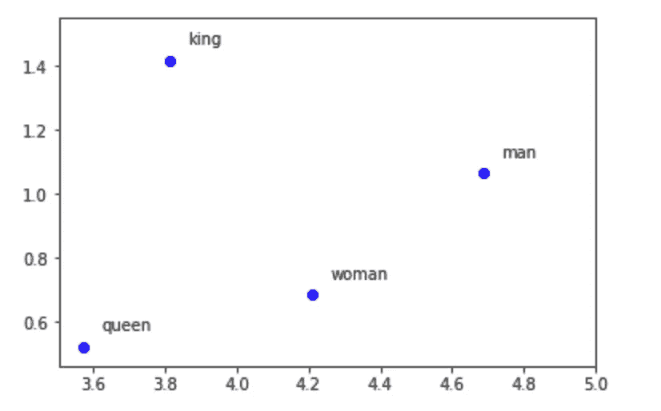
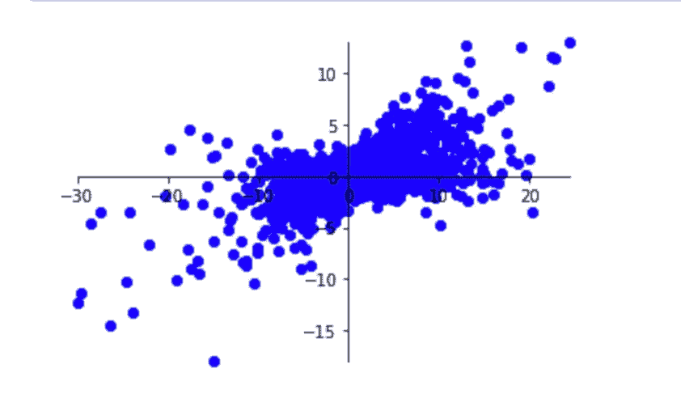
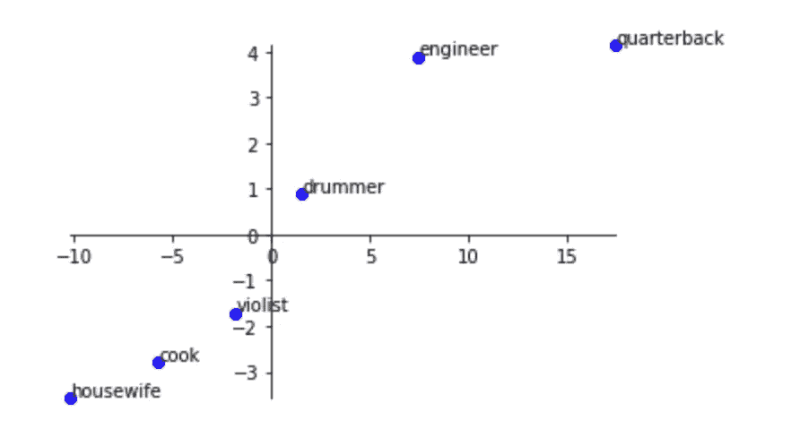

# 技术是如何让语言偏见永久化的

> 原文：<https://towardsdatascience.com/how-biases-in-language-get-perpetuated-by-technology-b4edc5532f3f?source=collection_archive---------22----------------------->

## *探索单词嵌入的数据集*

Photo by [Markus Spiske](https://unsplash.com/@markusspiske?utm_source=medium&utm_medium=referral) on [Unsplash](https://unsplash.com?utm_source=medium&utm_medium=referral)

尤其是在今年，科技行业因其对人工智能(AI)研发的不懈追求而受到广泛批评。这是因为该领域的主导范式被称为*机器学习*，其中计算机依赖于识别现有数据中的模式来执行特定任务。在机器学习中，许多算法通过接受一组数据、创建模型和生成预测来工作。

然而，当这些方法所依据的数据有偏差时会发生什么？我们时常在新闻中看到面部识别技术对[少数民族、](https://www.media.mit.edu/articles/facial-recognition-software-is-biased-towards-white-men-researcher-finds/)或推特机器人[发表种族主义言论](https://www.nytimes.com/2016/03/25/technology/microsoft-created-a-twitter-bot-to-learn-from-users-it-quickly-became-a-racist-jerk.html?_r=0)失败的故事。但事实是，我们不断听到偏见和人工智能，却没有广泛了解这些偏见是如何在我们使用的技术中编码的。

因此，我将解释被称为*单词嵌入、*的工具的一些缺点，因为它们被用于涉及计算机和人类语言或自然语言处理(NLP)的各种各样的任务，并且因为在不使用大量复杂的技术术语的情况下，探索和解释这些工具如何会有问题是相对容易的。首先，让我们了解更多关于 NLP 和单词嵌入是如何适应的，然后我们将了解嵌入本身如何有助于产生有偏差的结果。

NLP 领域依赖于一个关键范式:将*文本视为数据。*这种文本可以来自任何来源——电影评论、古诗，甚至是口语——并且可以用于任何任务，无论是检测文章是积极还是消极的语气，将短语翻译成另一种语言，甚至是进行在线搜索。然而，NLP 系统用于的所有任务都包括创建文本的数学模型。为了做到这一点，关键是要用数字表示输入文本中的每个单词，以便模型可以根据提供的文本生成输出，如相关网站的列表或准确的翻译。

单词嵌入本质上增加了在这些数字表示中捕获的每个单词的信息。最著名的算法之一的名字“Word2Vec”很好地体现了这一思想，其中一个单词被表示为一个*向量*，或者一组数字，它本身是由机器学习工具生成的。虽然 NLP 方法在 2010 年代初引入单词嵌入之前已经存在多年，但这些技术真正革新了该领域，使得本十年后期出现了一些重要发现。

单词嵌入如此有效的原因是它们能够编码文本中每个单词与每个其他单词之间的关系；这在以前的词语表达中是没有的。具体来说，这是通过一个概念来实现的，即*一个词是由它周围的词来定义的。*如果在训练语料库(从其“学习”嵌入的文本主体)中，两个单词在相似的上下文中被提及(例如“好”和“棒”)，那么它们对应的向量也将是相似的。

为了找出为什么单词嵌入会有问题，我们需要看看它们所基于的模型是如何被评估的。拥有一种可靠的方法来评估机器学习模型与模型本身一样重要。查看单词嵌入是否准确的最常见方法是使用它们来评估类比。这是因为任务相当简单；从数学上来说，就是矢量的加减。

就拿*的例子来说男人*是为了*女人*如同*的国王*是为了 ______。给定这样一组输入，数据的快速转换将导致 *queen 的嵌入。我画出了下面四个词的向量。*

The vectors for “king” and “queen” have a similar relationship to the vectors for “man” and “woman.”

除了这些类比，简单的加减向量的步骤还可以捕捉语法关系，如单词是单数还是复数，甚至是关于世界的事实，如国家和首都。

然而，如果我们给我们的程序一个查询“男人对于女人就像医生对于 ______？”它最终输出“护士”这种偏见不仅限于性别，因为该系统认为“警察对于白人就像罪犯对于黑人一样”，以及“合法对于基督教就像恐怖分子对于伊斯兰教一样。”

因为单词嵌入会被输入到其他算法中，它们固有的偏见可能会导致特别有问题的情况——一名人力资源专业人员在 LinkedIn 等网站上搜索“工程师”，会看到男性工程师的排名可能高于他们同样有才华的女性同事，或者更危险的是，如果一个警察部门根据书面犯罪报告受命在一个主要是黑人的社区进行大量巡逻。

我们可以期望嵌入所“学习”的文本，维基百科和新闻文章，是相对公正的，但是单词本身可能在类似的上下文中被提及。例如，像“她”这样的女性代词可能更频繁地出现在“护士”一词周围，只是因为我们的文本可能更多地谈论女护士而不是男护士。然而，允许这些协会管理大规模的软件系统是相当危险的。

至此，我们得出了一个严肃的结论。如果我们不能有效地评估现代 NLP 的构建模块，我们如何能够信任使用它们的算法？

现在让我们更详细地看看数据集。我已经在几本 [Python 笔记](https://github.com/sathvikn/word_embedding_bias/blob/master/biased_embeddings_1.ipynb)中做了这些分析，作为这篇文章的同伴，所以如果你想的话，请随意跟随！我也写了一篇关于前面讨论的更技术性的文章。如果你已经熟悉了这个概念，请查看 Github repo 中的[阅读列表](https://github.com/sathvikn/word_embedding_bias/tree/master)。

首先，我们比较一个单词和一对单词的向量。当我们将“工程师”与“男人”和“女人”进行比较时，我们发现“工程师”的向量更类似于“男人”的向量，而不是“女人”的向量。差别不是太大，但相当明显。然而，当我们将“工程师”与“亚洲人”和“非裔美国人”进行比较时，我们会发现“亚洲人”比“非裔美国人”更类似于“工程师”。

接下来，我们取一对向量，比如“男人”和“女人”，并查看代表与他们最亲近的人的向量。与“女人”最相似的向量也表示一个人，对应于单词“受害者”，其他与“女人”接近的向量表示职业，如“教师”和“妓女”，而与“男人”最相似的向量表示像“士兵”和“英雄”这样的词。当我们看“公民”和“移民”的向量时，与“公民”最相似的向量通常是专业职业，如“律师”和“商人”，但“农民”和“劳动者”更接近于“移民”。最后，当比较“基督教”和“伊斯兰教”的向量时，我们发现这两个向量都接近许多宗教术语，但“伊斯兰教”的向量更接近“激进”、“原教旨主义”和“极端主义”的向量。

我们进行的最后一项分析可能是最有趣的。向量不仅仅是数字的集合；它们也是在空间中表示这些数字的一种方式。因此，这依赖于人类的偏见来转换我们数据集所在的向量空间。我们着眼于量化特定类型偏差的向量。例如，对应于“他”和“她”之间的差异的向量可以表示“性别成分”这是因为向量的数值反映了“男性”和“女性”向量在数值上的不同。如果我们转换数据集，根据“他”和“她”之间的差异为每个向量分配一个分数，我们会发现与体育和军事有关的词得分较高，而描述表演艺术以及女性家庭成员的词得分较低。我画出了所有的向量，然后做了转换，得到了下面的结果。

Points to the right represent more “male” vectors and points to the left represent more “female” vectors.

让我们来看看这张图上的几个点。

“engineer,” “quarterback,” and “drummer” are in the “male” quadrant, while the “cook”, “violist,” and ”housewife”are in the “female” quadrant.

事实上，试图“去偏差”单词嵌入，使它们不包含有问题的关系是 NLP 研究的一个主要领域，将偏差转化为向量空间上的操作是这类工作的一个关键范式。

概括地说，我们已经学习了单词嵌入，以及它们如何在自然语言处理领域实现了许多发现，因为它们以数字形式编码了关于单词的重要信息。我们还讨论了对它们的评估方式是如何从根本上存在缺陷的，因为它们推断了单词之间的关系，这种关系延续了我们使用的语言中的偏见。最后，我们已经分析了数据集，并对导致这些推论的原因有了基本的了解。

当我们看到使用 NLP 技术的系统时，从网络搜索到虚拟助理，了解这些系统是根据人类生成的数据进行训练的，这对我们来说至关重要。这是因为技术经常被描绘成一种客观的理想，通过在白板上写计算来解决世界问题。然而，一旦我们的技术系统在应该由人类使用的产品中使用人类生成的数据，我们就需要意识到这些系统强化的偏差，以及如何修复它们。