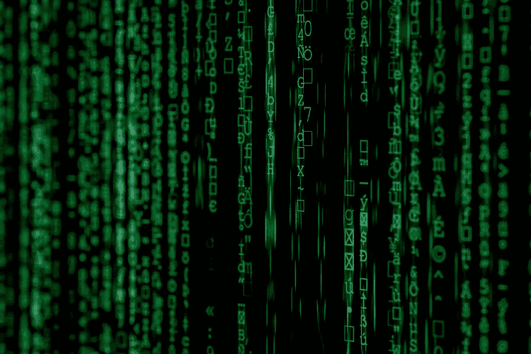

# 区块链将如何颠覆数据科学:大数据中的 5 个区块链用例

> 原文：<https://towardsdatascience.com/how-blockchain-will-disrupt-data-science-5-blockchain-use-cases-in-big-data-e2e254e3e0ab?source=collection_archive---------3----------------------->

区块链和大数据是最热门的新兴技术之一，有望彻底改变几个行业，从根本上改变企业和组织的运营方式。人们可能会认为这些技术是相互排斥的——每一种都形成了独特的路径，并且彼此独立地应用。

但那会离题。

区块链——就像数据科学一样——正在逐渐改变几个行业的运营方式。虽然数据科学侧重于利用数据进行适当的管理，但区块链通过维护分散的分类账来确保数据的可靠性。

问题是，**这两个概念有没有相交的地方？**

**当这两种技术同时应用时，会有什么样的结果？**

简单地说，**区块链怎么能扰乱数据科学？**

要回答这些问题，更好地理解区块链和数据科学是有帮助的。

Photo by [Markus Spiske](https://unsplash.com/@markusspiske) on [Unsplash](https://unsplash.com)

# 什么是区块链？

区块链基本上是一个不可信的账本，记录经济交易，使其无法被操纵。这项技术的出现源于人们对比特币和加密货币的普遍兴趣，但后来发现它不仅适用于记录加密货币交易，还适用于记录任何有价值的东西。了解了这项新兴技术的能力，开发人员和技术爱好者已经开始为区块链设计一个又一个的用例。

# 对区块链开发者的高需求

在过去的几年里，对区块链开发者的需求激增，就像开发区块链不同应用的项目一样。来自 UpWork 等自由职业平台的报告显示，区块链技能仍然是最受欢迎的技能。类似地，法律研究等其他领域的专业人士如果拥有区块链技能，或者至少对该技术有所了解，据说会有很大优势。

# 什么是数据科学？

数据科学寻求从结构化和非结构化数据中提取知识和见解。该领域包括统计学、数据分析、机器学习和其他用于理解和分析使用数据的实际过程的高级方法。

在经济学术语中，数据经常被描述为新的石油，这也是包括著名的 GAFAs(谷歌、亚马逊、脸书和苹果)在内的领先企业控制着大量数据的原因。数据科学的一些常见应用见于互联网引擎协议、数字广告和推荐服务。数据分析是数据科学的一个关键方面，已经发现它与医疗保健行业跟踪患者治疗和设备流程相关；在旅游中，通过游戏来改善消费者体验；用于能源管理以及许多其他部门。

# 对数据科学家的高需求

对能够提供更多数据见解并帮助解决更多问题的数据科学家的需求似乎永无止境。当考虑大数据时，这一点更加明显，大数据是数据科学的一个高级方面，它处理传统数据处理方法无法处理的海量数据。

# 区块链和数据科学的关系

与区块链现在非常熟悉的金融科技、医疗保健和供应链等领域不同，这项技术在数据科学方面尚未得到广泛探索。对一些人来说，概念之间的关系如果不是不存在的话，也是不清楚的。

首先，区块链和数据科学都处理数据——数据科学分析数据以获得可操作的见解，而区块链记录并验证数据。两者都利用了为管理与各种数据段的交互而创建的算法。你很快就会注意到的一个常见主题是，“预测的数据科学；数据完整性的区块链。”

# 区块链对数据的影响

数据科学，就像任何技术进步一样，有其自身的挑战和限制，当解决这些挑战和限制时，将释放其全部能力。数据科学面临的一些主要挑战包括不可访问的数据、隐私问题和脏数据。

脏数据(或错误信息)的控制是区块链技术可以对数据科学领域产生不小积极影响的一个领域。根据 2017 年对 16，000 名数据专业人员的调查，包含重复或不正确的数据等脏数据被视为数据科学的最大挑战。通过分散共识算法和加密技术，区块链验证数据，使其几乎不可能被操纵，因为这将需要巨大的计算能力。

再次通过其分散系统，区块链技术确保数据的安全性和隐私性。大多数数据存储在中央服务器上，而这些服务器往往是网络攻击者的目标；几份关于黑客和安全漏洞的报告显示了威胁的程度。另一方面，区块链将数据的控制权恢复到生成数据的个人手中，使网络犯罪分子大规模访问和操纵数据成为一项艰巨的任务。

# 区块链如何帮助大数据？

Janexter 的 Maria Weinberger 说，如果数量大，区块链就是质量。这遵循了这样一种理解，即区块链专注于验证数据，而数据科学或大数据涉及从大量数据中做出预测。

区块链带来了一种全新的管理和操作数据的方式——不再是将所有数据集中在一起的集中方式，而是一种分散的方式，可以在单个设备的边缘对数据进行分析。区块链与其他先进技术相结合，如云解决方案、人工智能(AI)和物联网(IoT)。

此外，通过区块链技术生成的经过验证的数据是结构化的、完整的，而且像我们前面提到的那样是不可变的。区块链生成的数据成为大数据推动力的另一个重要领域是数据完整性，因为区块链通过其链接链确定了数据的来源。

# 大数据中的 5 个区块链用例

总体而言，区块链数据至少可以在五个方面帮助数据科学家。

*   **确保信任(数据完整性)**

区块链上记录的数据是可信的，因为它们必须经过验证过程，以确保其质量。它还规定了透明度，因为在区块链网络上进行的活动和交易可以被追踪。

去年，联想展示了区块链技术检测欺诈性文件和表格的使用案例。PC 巨头们使用区块链技术来验证用数字签名编码的物理文档。数字签名由计算机处理，文件的真实性通过区块链记录核实。

大多数情况下，当涉及数据块的来源和交互的详细信息存储在区块链上并在采取行动之前自动验证(或确认)时，数据完整性得到了保证。

*   **防止恶意活动**

因为区块链使用共识算法来验证交易，所以单个单元不可能对数据网络构成威胁。开始异常运行的节点(或单元)可以容易地被识别并从网络中删除。

因为网络是如此的分散，这使得一方几乎不可能产生足够的计算能力来改变验证标准并允许系统中不需要的数据。为了改变区块链规则，必须将大多数节点汇集在一起以创建共识。这对于一个糟糕的演员来说是不可能的。

*   **做出预测(预测性分析)**

区块链数据，就像其他类型的数据一样，可以通过分析来揭示对行为和趋势的宝贵见解，因此可以用来预测未来的结果。此外，区块链提供从个人或个人设备收集的结构化数据。

在预测分析中，数据科学家基于大量数据，以较高的准确度确定社会事件的结果，如与业务相关的客户偏好、客户终身价值、动态价格和流失率。然而，这不仅限于商业洞察力，因为几乎任何事件都可以通过正确的数据分析来预测，无论是社会情绪还是投资指标。

由于区块链的分布式特性和通过它获得的巨大计算能力，即使在较小的组织中，数据科学家也可以承担广泛的预测分析任务。这些数据科学家可以使用连接在区块链网络上的数千台计算机的计算能力，作为一种基于云的服务，来分析大规模的社会结果，否则这是不可能的。

*   **实时数据分析**

正如金融和支付系统所展示的那样，区块链有利于实时跨境交易。几家银行和金融科技创新者现在正在探索区块链，因为它提供快速——实际上是实时——的巨额结算，而不受地理障碍的影响。

同样，需要对大规模数据进行实时分析的组织可以借助支持区块链的系统来实现。借助区块链，银行和其他组织可以实时观察数据变化，从而快速做出决策，无论是阻止可疑交易还是跟踪异常活动。

*   **管理数据共享**

在这方面，从数据研究中获得的数据可以存储在区块链网络中。这样，项目团队就不会重复其他团队已经完成的数据分析，或者错误地重用已经使用过的数据。此外，区块链平台可以帮助数据科学家将他们的工作货币化，可能是通过交易平台上存储的分析结果。

# 结论

正如已经指出的那样，区块链正处于萌芽阶段，尽管由于该技术在短时间内得到的大肆宣传，它可能不会出现。人们可以预期，随着技术的成熟和围绕它的更多创新，将会发现和探索更多具体的用例——数据科学是将从中受益的一个领域。

也就是说，它在数据科学方面的影响已经引发了一些挑战，特别是在需要处理异常大量数据的大数据方面。一种担心是，在这方面申请区块链将非常昂贵。这是因为与传统方式相比，区块链上的数据存储非常昂贵。与每秒钟为大数据和其他数据分析任务收集的大量数据相比，块处理相对少量的数据。

区块链如何发展以解决这一问题并进而扰乱数据科学领域将特别有趣，因为正如我们所见，该技术具有改变我们管理和使用数据的巨大潜力。