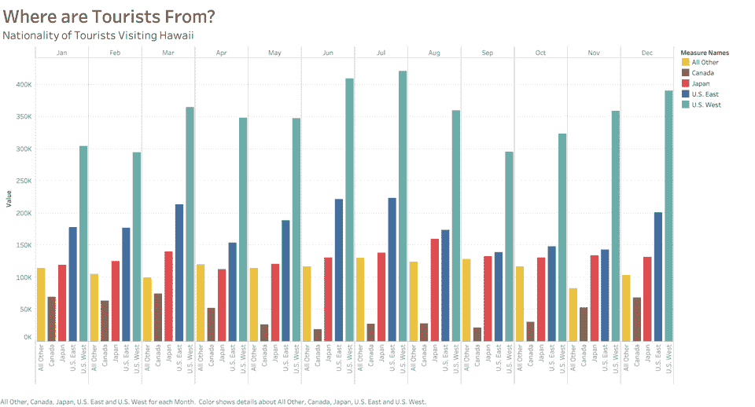
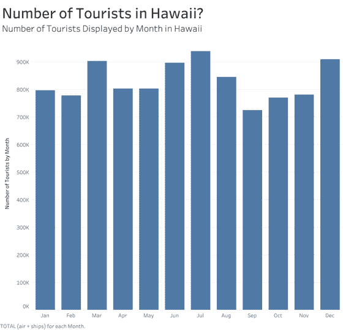
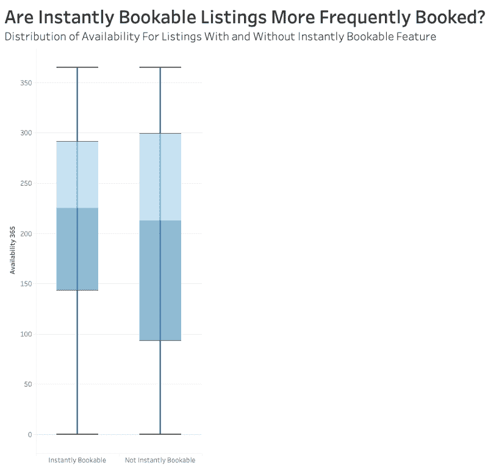
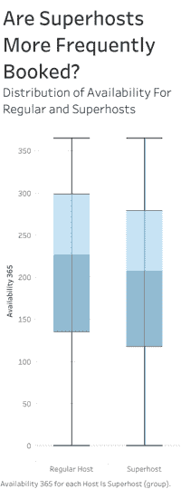
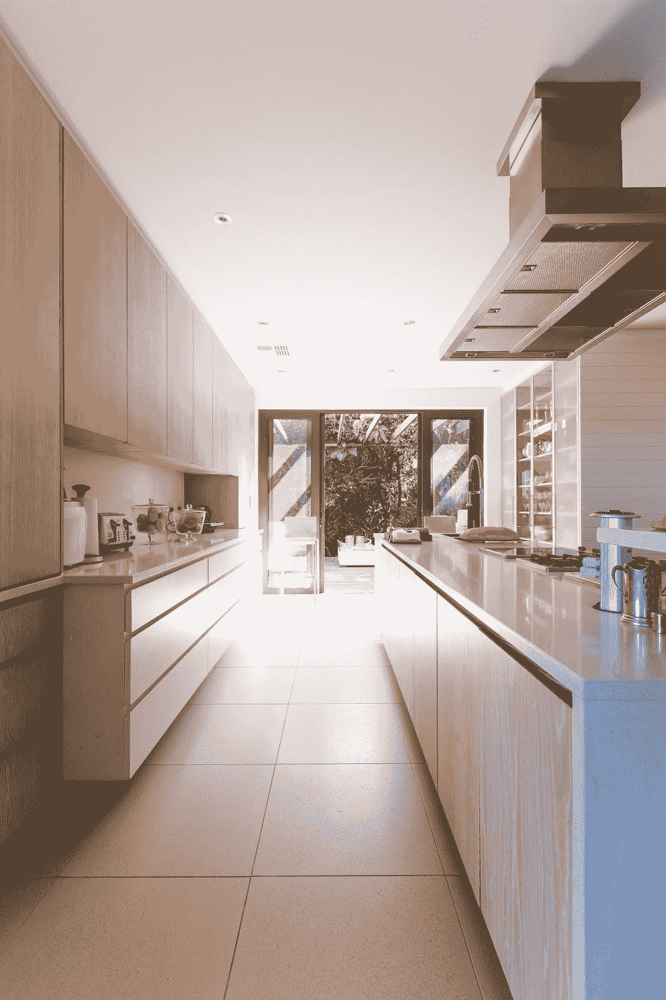
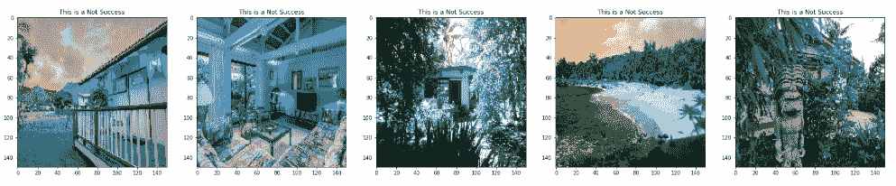
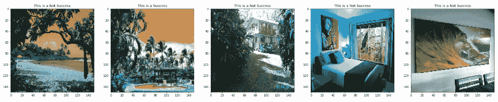

# Airbnb 主机如何提高在 Airbnb 上的体验？

> 原文：<https://towardsdatascience.com/how-can-airbnb-hosts-improve-their-experience-on-airbnb-dbc34059ae3c?source=collection_archive---------22----------------------->

## 对 Airbnb 在夏威夷的数据进行探索性分析，以找到主机可以提高入住率和改善整体体验的方法

Credits to [Abigail Lynn](https://unsplash.com/@shmabbss)

## 介绍

2007 年，Airbnb 的创始人布莱恩·切斯基(Brian Chesky)和乔·格比亚(Joe Gebbia)第一次在 airbedandbreakfast.com 接待客人时，Airbnb 是一家小型托管服务公司。从那以后，Airbnb 呈指数级增长，在全球 10 万多个城市有超过 600 万个房源。自诞生以来，Airbnb 已经成为酒店行业的强有力竞争对手。事实上，Airbnb 的估值在 2016 年超过了每一家主要的连锁酒店。[(来源:图集)](https://www.theatlas.com/charts/HyjvbqfD)

Airbnb 作为一家公司的成功取决于它独特而热情的主机和房源。令人惊叹的主机和列表让 Airbnb 发展到今天的样子，让旅行者在世界各地有更多有趣、亲密和个性化的访问。因此，帮助他们的东道主取得成功最符合 Airbnb 的利益。以下是对房东的 5 条建议，以改善他们在 Airbnb 上的体验和房源。所有的推荐都是基于 Airbnb 的夏威夷数据中的*。*

# 1.包容各民族！

“Airbnb 的存在是为了创造一个任何人都可以属于任何地方的世界，提供当地、真实、多样和可持续的健康旅行。”[(来源:Airbnb)](https://press.airbnb.com/about-us/) 接受这一价值将允许主办方提高其入住率，原因如下。

从[夏威夷商业、经济发展和旅游部](https://dbedt.hawaii.gov/visitor/)收集的数据中，我们可以观察到游客来自哪些国家。从上图中，我们可以观察到大多数游客是国内的。然而，应该注意到日本和加拿大游客的数量，每月有超过 100，000 名日本游客和大约 50，000 名加拿大游客访问夏威夷。

由于大量国际游客涌入夏威夷，如果主持人用多种语言提供细节和说明，他们的列表将吸引更广泛的市场。包容每一个人不仅能提高入住率，也是认识来自世界各地的客人的宝贵经历。

# 2.定价应该随着需求而变化

酒店业是动态的，价格和需求不断波动。每个月，主机应该评估和考虑他们的竞争对手的价格，基于当月游客数量的列表需求，以及他们的列表在搜索排名中的位置。

2018 年夏威夷每月游客数量

9 月，游客人数比平均数字下降了约 10 万人。游客数量的下降在统计上并不显著。但是，有 87.7%的几率，9 月的游客数量低于夏威夷的平均游客数量。

因此，东道主应该降低价格，以满足对房源的较低需求，因为价格是客人搜索房源甚至酒店的一个重要因素。因此，通过评估市场趋势并相应地改变价格，主机可以在不断变化的市场中保持竞争力。

# 3.即时预订不是必须的，但推荐使用

主持人不一定要开启即时可预订功能，尽管如此，还是推荐这个功能。正如我们在图 2 中看到的，夏威夷不能立即预订的列表被更频繁地占用。但是，需要注意的是，分析的数据仅代表夏威夷，这是一个具有特定特征的热门旅游目的地。每个城市和环境不同，预订的原因也不同。这一建议可能不适用于所有情况。例如，如果列表位于与商务旅行相关的区域，如纽约，则即时预订功能可能非常有益。此外，Airbnb 的搜索算法通过即时预订功能提高了房源的排名。

然而，如果列表位于旅游目的地，例如夏威夷，主人可能不需要特意使他们的列表立即可预订。Airbnb 表示，在其他预订体验因素上表现良好的房源在搜索排名中也会表现良好。主人的安全和舒适应该是第一位的，有时间批准他们的客人可能更可取。

图二。

# 4.不要给自己太多压力去成为超级主持人

Airbnb 声明，为了成为超级房东，你必须:

*   完成至少 10 次旅行或 3 次预订，总计至少 100 晚
*   保持 50%或更高的审核率
*   回复率达到 90%或更高
*   0 次取消，但属于某个 poly 的情况除外
*   维持 4.8 的综合评分。

超级房东对他们的列表充满热情，并投入大量精力来改善客人的体验。事实上，夏威夷的 superhosts 在 2018 年的平均回复率为 100%。

尽管成为超级主持人需要很大的承诺，超级主持人的称号对主持人的入住率影响很小。对于夏威夷的房源，超级寄宿者和普通寄宿者之间只有大约 25 天的入住时间差异。

此外，Airbnb 表示，超级主机的称号不会增加房源。事实上，正是这些因素让你赢得了超级主播的地位，提高了你的搜索排名。这里有一篇 Airbnb 的文章，提供了更多关于 Airbnb 搜索算法的信息。[(链接)](https://www.airbnb.com/help/article/39/what-factors-determine-how-my-listing-appears-in-search-results)

# 5.拍出很棒的照片！

拍出很棒的照片可以说是任何 Airbnb 最重要的因素。一张好照片是由明亮的灯光和构图要素组成的。建议主持人在白天拍摄照片，所有的灯都开着。主持人还应该考虑三分法，并有视觉队列来保持眼球运动。考虑右边的照片，照片遵循三分法，地板上的瓷砖和台面代表每三分之一。此外，桌子的边缘让视线移向露台。这里有一篇 Airbnb 提供的文章，强调了明星房源的 5 个拍照技巧 [(Airbnb 博客)](https://blog.atairbnb.com/top-5-photo-tips-for-a-stellar-listing/)。

在 Airbnb 上，大多数客人通过查看照片来决定他们选择的房源。甚至 Airbnb 也表示，主持人的收入可能会增加 40%,预订量增加 24%,仅通过专业拍摄照片，主持人就可以收取高达 26%的费用。

因此，请专业摄影师拍摄房源照片将是一项巨大的投资。

Airbnb 认识到这些图像的重要性。事实上，他们有一个网站，可以为你找到你所在地区的专业摄影师。 [(Airbnb Photography)](https://www.airbnb.com/professional_photography) 使用他们网站的额外好处是，雇佣摄影师的费用将从主办方的下一笔支出中扣除。

如果主持人决定选择这条路线，他们将有每个房间的 2 至 3 张照片。在这里，主持人可以选择他们认为最成功的照片。我还创建了一个机器学习算法，它查看了夏威夷成功和不太成功的 100 张不同的图片。该算法将通过查看图像来预测上市是否会成功。(链接)该算法仍处于非常早期的原型阶段，因此，它的输出应该持保留态度。

以下是机器学习算法预测的 10 个例子。通过机器学习算法，我发现有海景的图片和考虑构图的照片经常被预测为更成功。我注意到夏威夷的多个列表中包含了遮挡房屋视线的树木图片，比如第一排和第二排的第三张照片。这些上市都被预测不会成功。因此，我会建议主人在视线清晰的地方给他们的房子拍照。

总之，这里有一些方法可以改善主人在 Airbnb 上的体验。以上建议完全基于夏威夷的数据。虽然我很想通过 A/B 测试进一步分析价格变化和包容性的影响，但我希望这些建议能够改善 Airbnb 的入住率和体验。 *Inside Airbnb* 收集了其他主要城市的数据，我将继续探索这些建议在不同城市如何转化。

*对于这些建议的更深入的分析，探索性的数据分析，以及机器学习算法的源代码，请随时查看我的网站* [*。*](http://jongmp.github.io)