# 新手如何打造一个很棒的仪表盘？

> 原文：<https://towardsdatascience.com/how-can-beginners-create-a-great-dashboard-cf48c0f68cd5?source=collection_archive---------12----------------------->

在当前大数据的趋势下，[数据可视化](http://www.finereport.com/en/features/data-visualization?utm_source=medium&utm_medium=media&utm_campaign=blog&utm_term=How%20Can%20Beginners%20Create%20a%20Great%20Dashboard%3F)已经成为大家推崇的交互展示方式。仪表板广泛用于显示企业的业务绩效。如果能早点了解和掌握这项技术，相信对我们的职业生涯会有很大的帮助。

那么如何才能打造一个好的仪表盘呢，尤其是对于新手来说？

下图是 2012 年仪表板平面设计大赛中 Stephen Few 列举的优秀仪表板的特点。

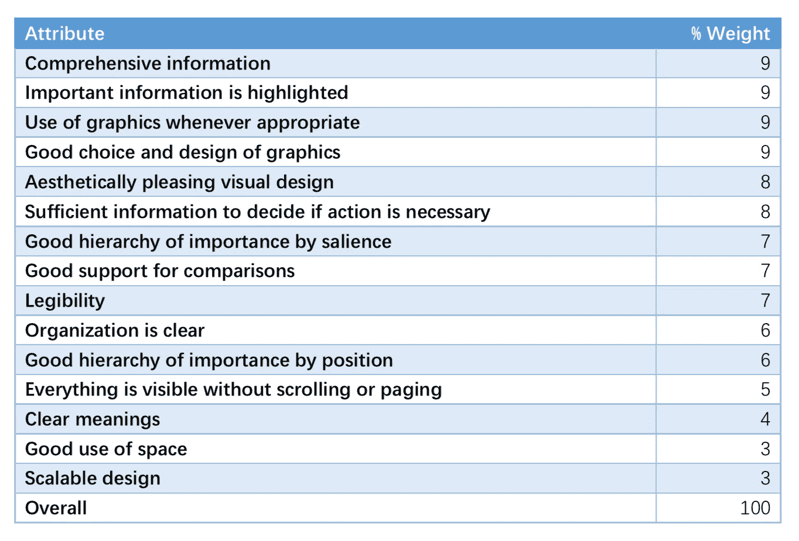

根据以上评分标准，你的仪表盘设计能达到多少分？

如果您想要 dashboard 的完美呈现，您需要技术人员、UI 设计人员和业务人员来协调工作。但是对于数据可视化的新手来说，我们也可以用合适的数据可视化工具自己制作很酷的仪表板。如果你们中的一些人读过我在 Medium 上的帖子，你可能会发现我写了许多关于数据可视化和仪表板的[指南](/what-is-data-visualization-for-large-screen-and-how-to-implement-it-1d79cf07783)。上次分享了一个教程，教你如何制作[销售仪表盘](/a-step-by-step-guide-to-making-sales-dashboards-34c999cfc28b)。有读者告诉我，仪表盘制作教程对初学者来说有点难，因为那个销售仪表盘比较高级。

因此，今天我将给出一个更详细的教程，为初学者创建一个伟大的仪表板。我会把每一步都写下来，我敢打赌没有人的教程比我的更全面。

现在，让我们开始吧！

# 1.效果显示

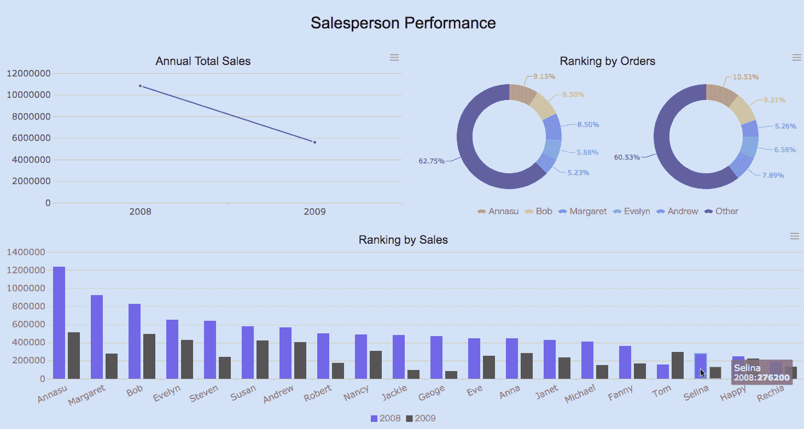

这次我计划创建一个简单的销售人员绩效仪表板。上图是最终效果的演示。我们可以查看总销售额，每个销售人员的销售排名，以及销售人员的订单排名。在这个仪表板中，我还将实现图表的交互功能，如下所示。也就是说，观众可以点击图表了解更多信息。

# 2.准备数据可视化工具

这里我用来设计仪表盘的可视化工具是 [**FineReport**](http://www.finereport.com/en/?utm_source=medium&utm_medium=media&utm_campaign=blog&utm_term=How%20Can%20Beginners%20Create%20a%20Great%20Dashboard%3F) 。其界面类似于 Excel。用户可以通过简单的拖放操作设计出色的仪表板。新手入门很容易。而且它的个人版是完全免费的。可以直接从官网 [**下载**](http://www.finereport.com/en/download-2?utm_source=medium&utm_medium=media&utm_campaign=blog&utm_term=How%20Can%20Beginners%20Create%20a%20Great%20Dashboard%3F) 。

工具的选择影响数据可视化的最终结果。用户可以根据不同的需求和喜好选择最适合自己的数据可视化工具。如果你在寻找更有用的工具，可以参考这篇文章[*2019*](/9-data-visualization-tools-that-you-cannot-miss-in-2019-3ff23222a927)你不能错过的 9 个数据可视化工具。

# 3.设置仪表板主体

下载 [**FineReport**](http://www.finereport.com/en/?utm_source=medium&utm_medium=media&utm_campaign=blog&utm_term=How%20Can%20Beginners%20Create%20a%20Great%20Dashboard%3F) 后，打开设计器界面。点击**文件>新建仪表板**创建新的仪表板模板:

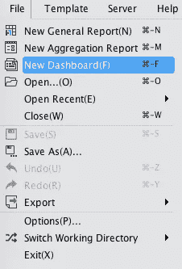

在 widget 列表中，点击**主体**，将**布局类型**设置为**自适应布局**，将**组件比例**设置为**双向自适应**。您还可以使用颜色来自定义仪表板背景:

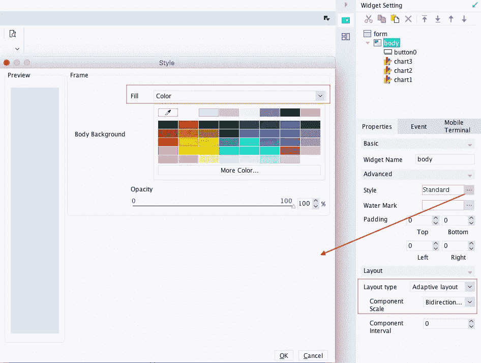

# 4.拖动和排列组件

可以通过拖放操作将组件添加到主体中并进行排列。使用自适应布局，每个组件的大小和位置将自动相对于其他组件进行更改。

让我们拖动折线图、饼图和柱形图来显示数据，并添加一个按钮作为仪表板标题:

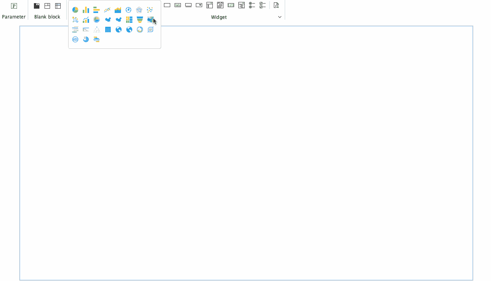

# 5.准备数据

FineReport 中的数据集专门用于存储通过**数据连接**从数据库中检索的数据。数据集是 2D 数据表，您可以在 designer 中直接查看字段和值。

在左下方的面板中，有一个模板数据集窗口，列出了所有可用的数据集。单击按钮+添加新数据集。

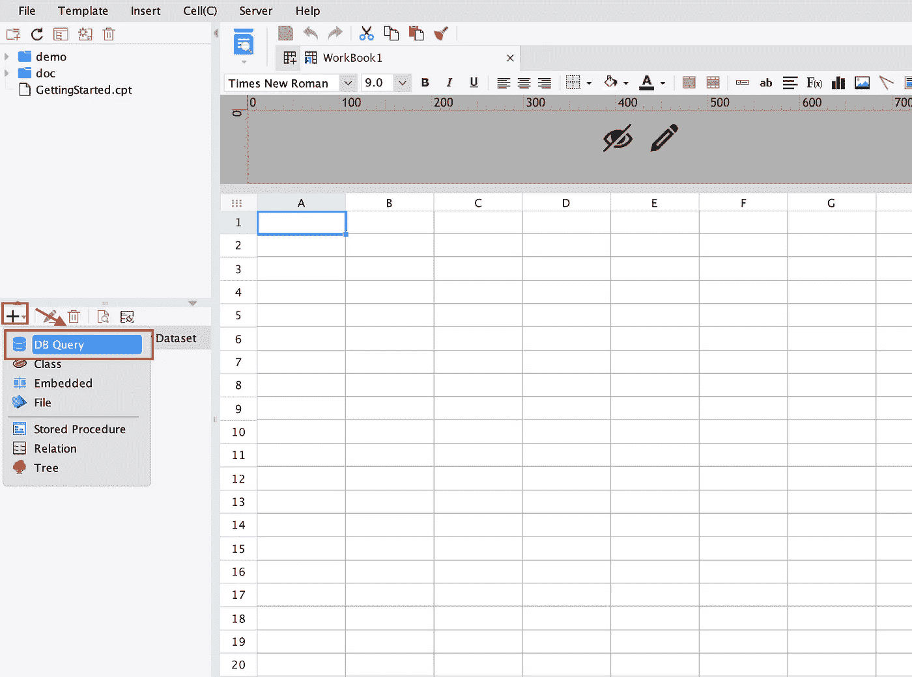

然后我们可以编写 SQL 语句。

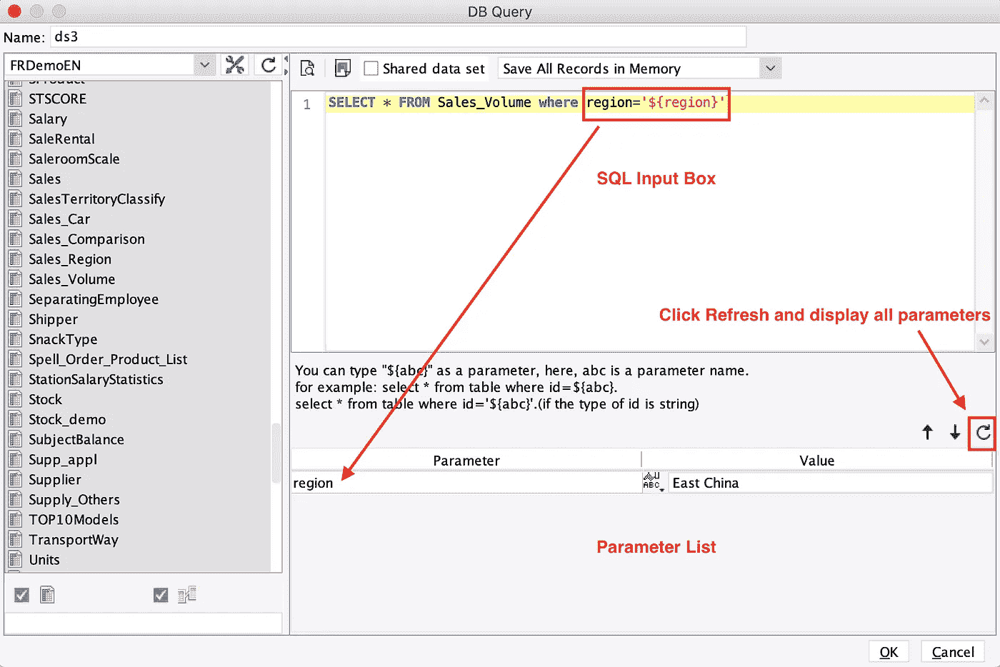

这里，我们使用 SQL 语句创建 3 个数据集，从不同的角度显示销售业绩。(在这个仪表板中，我们使用 FineReport 的内置数据集。 [FineReport](http://www.finereport.com/en/?utm_source=medium&utm_medium=media&utm_campaign=blog&utm_term=How%20Can%20Beginners%20Create%20a%20Great%20Dashboard%3F) 还支持从各种数据库导入数据。)

数据集**按员工排序**按降序汇总了每个员工的年度订单总数:

数据集**按雇员的销售额**按降序总结了每个雇员的年总销售额:

数据集**总销售额**汇总了公司的年度总销售额:

# 6.编辑组件

## 6.1 折线图—趋势

折线图[图表](http://www.finereport.com/en/data-visualization/top-16-types-of-chart-in-data-visualization.html?utm_source=medium&utm_medium=media&utm_campaign=blog&utm_term=How%20Can%20Beginners%20Create%20a%20Great%20Dashboard%3F)很好地代表了数据背后的趋势，例如，年销售额的变化趋势。双击折线图开始编辑。

在**数据**选项卡中，使用数据集**总销售额**设置**数据源**。使用**年**定义**类别**，使用**总销售额**定义**系列**:

*   折线图中的类别可以被视为沿 x 轴的每个标签。它决定了数据分组的方式。
*   系列对应一行。如果有其他绩效指标，如总成本，可以添加该字段来创建另一个系列。

切换到**风格>系列**，从左到右、从上到下依次点击每个彩色方块，定制每个系列的颜色。添加标记来表示线条上的数据点:

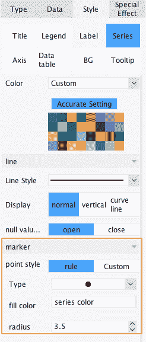

将图表标题定义为**年总销售额**:

因为只有一个系列，并且标题已经暗示了绩效指标，所以可以禁用图例:

## 6.2 饼图—比例

饼状图可以有效地展示构成和相应的比例。您可以用它来显示每个销售人员对年度订单的贡献。

使用员工的**订单定义**数据集**。用**年**作为**类别**， **EMPNAME** 作为**系列名称**， **total_orders** 作为**值**。如果显示所有员工的数据，饼图将被分成大量的切片，但小切片的意义不如大切片。因此，您可以在**数据过滤器**中保留前 5 个订单贡献者，并将其他订单贡献者合并为一个切片:**

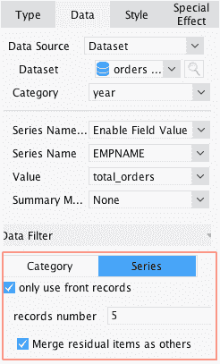

*   类别对应于一个单独的饼图，因此每年将生成一个饼图。
*   系列对应于饼图中的每个切片，因此数据是基于系列进行筛选的。

在**样式>系列**中，为 6 系列定制颜色。将**内半径**设置为 **70%** 使饼状图看起来像一个圆环。

使用饼图外部的标签以百分比表示每个切片的比例:

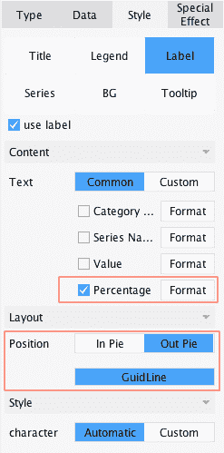

启用图例来指示每个系列的名称，即每个员工的姓名:

*   系列名称使用图例而不是标签显示，因为不同年份有多个饼图，但所有饼图都共享相同的系列名称。

将标题设置为**按顺序排序**。

## 6.3 柱形图—对比

列的高度是一种直观的比较度量。您可以使用柱形图来可视化每个销售人员的年销售额，以便进行人与人之间以及年与年之间的比较。

使用员工的**销售额定义**数据集**。使用 **EMPNAME** 作为**类别**，使用 **year** 作为**系列名称**，使用 **total_sales** 作为**值**。考虑到员工人数众多，请过滤数据，仅显示前 20 名卖家:**

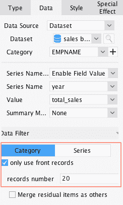

x 轴可能太短而无法显示所有类别名称，因此您可以设置轴标签的旋转以完全显示它们:

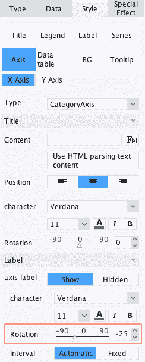

在底部显示图例，表示每个系列所代表的年份，自定义每个系列的颜色，并将标题定义为**按销售额排名**。

## 6.4 按钮—标题

在**按钮名称**后输入仪表盘标题，设置背景为透明，编辑字体:

# 7.预览图表并与之互动

点击**预览**查看效果，并可与图表互动:

销售人员绩效仪表板已经完成。希望这篇教程对你有帮助。如果你想做一个更高级的仪表盘，可以看看这篇文章: [*制作销售仪表盘的一步一步指南*](/a-step-by-step-guide-to-making-sales-dashboards-34c999cfc28b) 。

# **你可能也会对…** 感兴趣

[*什么是大屏幕的数据可视化，如何实现？*](/what-is-data-visualization-for-large-screen-and-how-to-implement-it-1d79cf07783)

[*新手如何设计酷炫的数据可视化？*](/how-can-beginners-design-cool-data-visualizations-d413ee288671)

[*业务仪表盘初学者指南*](/a-beginners-guide-to-business-dashboards-981a8192a967)

[*数据可视化中前 16 种图表类型*](/top-16-types-of-chart-in-data-visualization-196a76b54b62)

[*不写代码如何创建热图？*](/how-to-create-a-heat-map-without-writing-code-e1d7b10cf33f)

[*数据可视化十大地图类型*](/top-10-map-types-in-data-visualization-b3a80898ea70)

[*4 个参数查询功能让您的数据可视化交互*](/4-parameter-query-functions-to-make-your-data-visualization-interactive-bbd84dd6bafb)