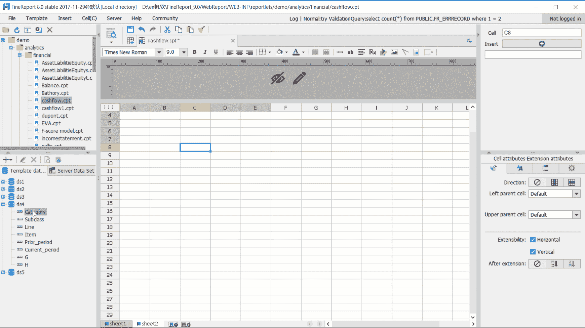
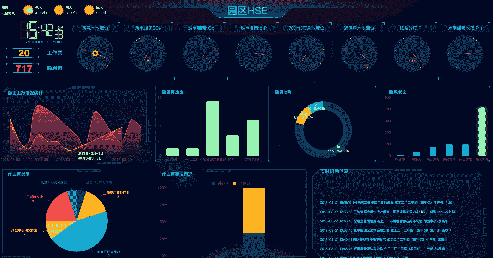

# 新手如何设计酷炫的数据可视化？

> 原文：<https://towardsdatascience.com/how-can-beginners-design-cool-data-visualizations-d413ee288671?source=collection_archive---------9----------------------->

# 1.我们为什么要可视化数据？

在工作中，无论身处哪个场景，都会接触到数据，需要表达出来。数据可视化的作用是通过结合图表和数据来更好地传达业务信息。就目前而言，大多数公司正在逐步从传统的流程管理过渡到基于数据的管理。数据可视化可以帮助分析师更全面地了解数据，并获得更具商业价值的见解。

# 2.什么是数据可视化？

数据可视化是数据分析后的数据展示，包括图表设计、动态组合、二维图表、三维图表、联动、钻取、大屏幕显示等。

**数据可视化的功能主要体现在两个方面:一是数据展示，二是业务分析。**数据显示很好理解。它是将已知的数据或数据分析结果通过直观的图表显示出来。最后呈现的是报表、仪表盘，甚至是现在流行的大屏幕。数据展示的方式越来越被接受和欢迎。业务分析是在看到图表、仪表板和大屏幕后，将要分析的数据和指标有效地转换为具有业务价值的见解，使他们能够基于事实支持决策。

*Dashboard of* [*FineReport*](http://www.finereport.com/en/?utm_source=medium&utm_medium=media&utm_campaign=blog&utm_term=03)

# 3.如何实现可靠的数据可视化？

数据可视化最终还是要回归到“读者”身上。它通过传递方向性数据来帮助“读者”识别问题并做出正确的决策。所以数据的价值不在于它被看到，而在于它被看到后引发的思考和行动。

在这里，企业中的数据不同于普通的应用数据。大部分都没有通过算法程序直接对用户产生价值。而是通过合理的展示对数据进行分析，然后管理者进行思考和判断，最后采取行动，让数据发挥价值。

## 3.1 谁是可视化的受益者？

无论你是做传统的报告、PPT 还是做别的，你首先要搞清楚这是给谁看的，他需要知道什么，他关心什么指标，他会如何在决策过程中使用你呈现的信息和数据。一句话，就是搞清楚数据分析工作的目标:这个报告是用来干什么的？后续数据分析工作和分析报告中的所有内容都将与这一目标主题密切相关。

## 3.2 梳理指标体系

数据可视化就是将繁杂的数据整理成指标，围绕财务、销售、供应链、生产等各个业务形成指标体系。，最后通过可视化的方法展示出来，比如收益率、效率效益等。

可以说，数据分析工作的成功一般是建立在指标的基础上的。这项工作需要数据中心的人员或者 BI 组的人员深入到业务中去调查需求，分析数据，建仓库…

## 3.3 将数据可视化与业务解决方案相结合

如果数据可视化的目的是呈现解决特定的、可测量的、可实施的、相关的和基于时间的问题的数据，那么在生产过程和报告过程中添加这些问题。

规划数据可视化解决方案时，请确保这是为了解决用户特定的问题。所以你的解决方案不仅要能够很好地解释数据分析的结论、信息和知识。但更重要的是，管理者可以沿着你规划的视觉路径快速找到并发现决策。

## 例子

当公司业绩没有达到目标时，可视化方案的设计路径可以是这样的。

**第一步**:从整体运营的角度，你需要明确影响业绩的关键因素。

查看与销售订单、客户价格、客户数量、用户活动、产品产量、质量、成本、交付等关键因素相对应的 KPI 的绩效。这些因素将成为驱动因素，直接影响业绩。这些驱动数据的可视化是找到解决方案的基础。

**第二步**:你需要深究关键因素，找出是哪些因素导致了业绩的失败。

例如，您可以使用比较分析来观察 KPI 上所有关键因素在某一段时间内的表现。针对具体问题，跟踪当前的行动计划是什么，是否调整进度，并探索提高绩效的方法。

# 4.数据可视化工具

数据可视化有很多[工具。像](http://www.finereport.com/en/about-finereport/compare-6-types-and-14-data-visualization-tools.html?utm_source=medium&utm_medium=media&utm_campaign=blog&utm_term=03) [ECharts](https://echarts.apache.org/en/index.html) 、 [Highcharts](https://www.highcharts.com/) 、 [D3.js](https://d3js.org/) 这样的图表插件，功能非常强大。还有类似 [Excel](https://products.office.com/en-us/excel) 、 [Cognos](https://www.ibm.com/products/cognos-analytics) 、 [Tableau](https://www.tableau.com/) 、 [FineReport](http://www.finereport.com/en/?utm_source=medium&utm_medium=media&utm_campaign=blog&utm_term=03) 等工具。对于日常报表制作，这类工具更容易学习和使用，更偏向于业务分析。它们涵盖了数据收集、分析、管理、挖掘和可视化的一组复杂的数据处理过程。

我习惯使用零编码报告工具 [FineReport](http://www.finereport.com/en/?utm_source=medium&utm_medium=media&utm_campaign=blog&utm_term=03) ，它允许您通过简单的拖放操作实现很酷的可视化。我过去常常花两个小时制图或绘图。有了 FineReport，我可以在十分钟内完成一个仪表盘。对数据分析初学者真的很友好。

*Drag-and-drop Operation of* [*FineReport*](http://www.finereport.com/en/?utm_source=medium&utm_medium=media&utm_campaign=blog&utm_term=03)

这里给大家展示一些我用 [FineReport](http://www.finereport.com/en/?utm_source=medium&utm_medium=media&utm_campaign=blog&utm_term=03) 做的仪表盘，让大家对数据可视化有更清晰的认识。

## 实时仪表板

## 3D 动态效果

## 销售分析

如果您想快速开始数据可视化，我建议您从 [FineReport](http://www.finereport.com/en/?utm_source=medium&utm_medium=media&utm_campaign=blog&utm_term=03) 开始。您可以到[官网免费下载](http://www.finereport.com/en/download?utm_source=medium&utm_medium=media&utm_campaign=blog&utm_term=03)并使用。这里是[教程](http://www.finereport.com/en/about-finereport/learning-path-for-finereport-beginners.html?utm_source=medium&utm_medium=media&utm_campaign=blog&utm_term=03)。

*原为 2019 年 5 月 31 日在*[*http://www.finereport.com*](http://www.finereport.com/en/about-finereport/how-can-beginners-design-cool-data-visualizations.html)*发布。*