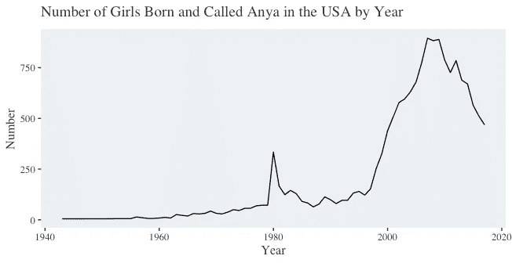
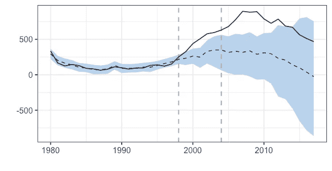

# Bayes 牧师如何帮助你发现你的竞选是否成功？

> 原文：<https://towardsdatascience.com/how-can-i-tell-if-my-marketing-campaign-is-working-41cbf5c7dbc6?source=collection_archive---------8----------------------->

## 因果影响包中使用贝叶斯结构时间序列模型的因果推理简介


Photo by [dylan nolte](https://unsplash.com/photos/RSsqjpezn6o?utm_source=unsplash&utm_medium=referral&utm_content=creditCopyText) on [Unsplash](https://unsplash.com/search/photos/cause?utm_source=unsplash&utm_medium=referral&utm_content=creditCopyText)

如果你从事营销工作，有时你做的事情看起来有点像彩票。这可能不是你想向上级汇报的方式，但你有多大信心认为你的活动真的带来了收入的增长？

在这篇文章中，我们将简要介绍一种技术，这种技术可能会帮助你在这些陈述中用一些数字来支持你的信心:贝叶斯结构时间序列分析。

## 营销因果的结构时间序列分析

如果你的公司有很大的优惠——可能在一月份有 25%的折扣——你可能会有一些预算来进行市场推广活动。如果你不告诉别人，这笔交易有什么用？

交易运行，你在电台和付费搜索上花费预算，当然，你的收入增加了。但是你的营销活动起到了什么效果呢？仅仅因为交易成功，它就推动了销售或收入增长吗？

如果你在互联网上花点时间，你可能会熟悉[虚假相关性](http://tylervigen.com/spurious-correlations):一个提醒我们相关性并不总是意味着因果关系的网站。仅仅因为我们付费搜索支出增加并不意味着我们观察到的收入增加。

> *如需了解商业与数据科学和分析结合的更多信息，* [*在 Twitter 上关注 Chris*](https://twitter.com/chrisBowdata)*。*

## 暂停活动和地理分割测试的替代方法

有时，简单地说“让我们把活动关掉几天，再打开，看看对收入的影响”并不总是可行的。如果收入看起来不错，营销支出在预算之内，那么决定进一步调查的人是勇敢的。

所以，如果你不能进行干预性实验和随机对照试验，有没有一种方法可以让你感觉到你的营销活动是否有效？是的，有，R 的[因果影响](https://google.github.io/CausalImpact/CausalImpact.html)包使它变得非常简单。

## 营销人员的时间序列分析

回归对于营销人员来说是一个非常有用的工具。它是如此有用，以至于我不仅在这里[写了它](https://blog.markgrowth.com/an-introduction-to-regression-analysis-for-marketers-e4ece9dce43a)，我也在这里[写了它](https://blog.markgrowth.com/an-introduction-to-regression-analysis-for-marketers-part-2-857af0b6142e)。[和这里的](https://medium.com/swlh/data-driven-marketer-a-ppc-analytics-lesson-from-simpsons-paradox-5f07d354248d)。哦，还有[这里也有](/animating-regression-models-in-r-using-broom-and-ggplot2-da798e6638be)；我相当确信我会再写一次。

回归是一个很好的工具:它非常容易执行，相对容易正确执行，并且它给你容易解释的结果，这意味着结果容易报告和行动。

间断时间序列分析(ITS)是简单回归的一个有用的扩展。从根本上说，它考察的是一项活动是否对你的兴趣变量有影响。随着时间的推移，输出变量将被跟踪，您可以将何时执行干预作为另一个变量进行编码。关于 ITS 的精彩介绍可以在这里找到。

然而，当涉及数据中的季节性趋势或其他混淆问题时，简单的虚拟变量可能不够，分析可能会变得越来越复杂，需要进一步转换以包括一些额外的趋势。输入贝叶斯结构时间序列。

## 时间序列干预的因果推断

这不是一篇旨在详细讨论贝叶斯结构时间序列(BSTS)建模的文章。如果你对幕后发生的事情感兴趣，[你可以从这里](https://en.wikipedia.org/wiki/Bayesian_structural_time_series)开始，进入之前和之后的兔子洞。

现在，我们只需要把 BSTS 看作是一种观察历史时间序列并预测其未来进程的方法，让我们能够比较干预后实际发生了什么。

统计数据可能不是最直接的，但是 Kay Broderson 和 Alan Hauser 的相当神奇的因果影响包使它变得容易。你可以[在这里阅读论文](https://ai.google/research/pubs/pub41854)，或者[直接阅读文档](https://cran.r-project.org/web/packages/CausalImpact/CausalImpact.pdf)，但是希望这篇文章涵盖了原理，这样你就可以决定它是否适合你。

## 吸血鬼猎人巴菲对婴儿名字的因果影响

这很容易用一个例子来说明 PPC 活动对网站访问量的影响，或者增加一个新的营销渠道来增加收入，但是其中的乐趣在哪里呢？如果您已经读到这里，我假设您有自己的问题和数据要处理，那么我们需要做的就是用一个工作实例来介绍这个概念。

还有什么比用吸血鬼猎人巴菲更好的例子呢？

如果你到了一定的年龄(像我一样)，巴菲将成为偶像。但是——我肯定每个人都在问 BTVS 的成功是否导致了在美国出生的女孩取名为 Anya 的增加？让我们用 BSTS 模型和因果推断来找出…

## R babynames 包与因果推理

伴随本文的[代码在 GitHub](https://github.com/chrisBow/causal-inference-intro) 上，所以我在这里省略细节，直接跳到感兴趣的部分。

使用 R 中的`babynames`包，我们可以访问每年用特定名字注册的孩子的数量。我们感兴趣的是，在 1998 年这个角色出现后，叫做安雅的孩子的数量是如何变化的。让我们快速看一下:



看起来在 1980 年左右有一个高峰(没有与 Buffy 相关的双关语)，但事情似乎真正开始于 90 年代末和 21 世纪。这第一个情节看起来很有说服力，但是这种模式与我们预期的如果《魔法奇兵》没有出现在我们的屏幕上会有很大的不同吗？

我们可以使用`CausalImpact`包对此进行研究。为此，我们指定干预的开始和结束日期(我们将使用 Anya 推出的年份和系列结束的年份)，并将其与一些不应受干预影响的名称进行比较。

在这种情况下，我们将使用十个随机选择的普通女孩的名字，它们不是《魔法奇兵》中的主角，但这是一个需要深思熟虑的决定。如果你想看看付费搜索支出对收入的影响，你会用什么作为对照？

虽然`CausalImpact`函数不需要它们，但是它们很有用，所以值得花时间考虑一下你可以使用什么。你可能会认为有机会议可能会起作用，但你的有机点击量会随着每次点击费用的增加而增加吗？因为顾客会接触到你的品牌，然后再去搜索你的品牌。

在我们的例子中，我们已经构建了一个数据的`xts`时间序列，Anya 作为第一列，是我们感兴趣的变量，下面的名称是算法将用于计算的名称。

使用这些数据，`CausalImpact`将绘制一个输出图，用虚线(蓝色阴影的置信区间)显示每年被称为 Anya 的女孩的预测数量，用实线显示被称为 Anya 的婴儿的观察数量。干预期显示为垂直虚线。



在我们的例子中，我们可以看到实线不仅在虚线之上，而且在置信区间之上。在输出中调用 summary 会得到这样的结果:

```
> summary(buffy_causal)
Posterior inference {CausalImpact}Average       Cumulative 
Actual                   489           2447       
Prediction (s.d.)        285 (71)      1425 (354) 
95% CI                   [143, 400]    [716, 2002]

Absolute effect (s.d.)   204 (71)      1022 (354) 
95% CI                   [89, 346]     [445, 1731]

Relative effect (s.d.)   72% (25%)     72% (25%)  
95% CI                   [31%, 121%]   [31%, 121%]Posterior tail-area probability p:   0.00201
Posterior prob. of a causal effect:  99.79899%For more details, type: summary(impact, "report")
```

告诉我们，我们预计平均每年会有 285 个女孩叫安雅，但我们观察到了 489 个。我们的 95%置信区间上限是 400，因此，由于我们观察到的 489 高于 400，我们的 *p* 值为 0.00201，即被称为 Anya 的女孩人数增加是由于偶然。

很有帮助的是，`CausalImpact`包含了一个对`summary()`有用的论点，我们可以将它包含在给我们的书面报告中:

```
> summary(buffy_causal, "report")
Analysis report {CausalImpact}During the post-intervention period, the response variable had an average value of approx. 489.40\. By contrast, in the absence of an intervention, we would have expected an average response of 285.06\. The 95% interval of this counterfactual prediction is [143.25, 400.32]. Subtracting this prediction from the observed response yields an estimate of the causal effect the intervention had on the response variable. This effect is 204.34 with a 95% interval of [89.08, 346.15]. For a discussion of the significance of this effect, see below.Summing up the individual data points during the post-intervention period (which can only sometimes be meaningfully interpreted), the response variable had an overall value of 2.45K. By contrast, had the intervention not taken place, we would have expected a sum of 1.43K. The 95% interval of this prediction is [0.72K, 2.00K].The above results are given in terms of absolute numbers. In relative terms, the response variable showed an increase of +72%. The 95% interval of this percentage is [+31%, +121%].This means that the positive effect observed during the intervention period is statistically significant and unlikely to be due to random fluctuations. It should be noted, however, that the question of whether this increase also bears substantive significance can only be answered by comparing the absolute effect (204.34) to the original goal of the underlying intervention.The probability of obtaining this effect by chance is very small (Bayesian one-sided tail-area probability p = 0.002). This means the causal effect can be considered statistically significant.
```

## 用因果关系概括营销因果

当然，这篇文章是一个快速的 5 分钟介绍营销因果归因使用贝叶斯结构时间序列模型使用因果影响包 r。

R 包比我在这里讨论的要多得多，因此非常值得阅读本文和文档，以及在线阅读其他一些例子。

然而，对于许多想要了解他们是否把钱花在正确的地方的营销人员来说，这个软件包是一个很好的起点，不需要时间序列分析和贝叶斯统计的广泛知识。

事实上，我要说的是，使用它最具挑战性的方面不是数学、语法或函数参数的选择，而是选择不太可能受所研究的干预措施影响的适当时间序列。

此外，您可能同时在不同的媒体、不同的人口统计数据和不同的地理区域开展一系列营销活动。当然，这将使您的数据分析比这里给出的简单例子更复杂一些。然而，虽然创建适当的数据集可能会带来更多的挑战，但下面的分析可能非常简单。

作为一个数据驱动的营销人员，我非常感谢谷歌的人们开发了这个，现在维护这个非常有用的 R 包。如果您想更详细地探索这种技术和软件包，我建议[阅读论文](https://ai.google/research/pubs/pub41854)并使用这个软件包，使用像这样一个简单的数据集感受一下附加选项。这里还有大量的工作要做，我甚至还没有看柳树或奥兹…

> *关于如何在业务分析中快速使用数据科学工具的进一步介绍，* [*在 Twitter 上关注 Chris*](https://twitter.com/chrisBowdata)*。*