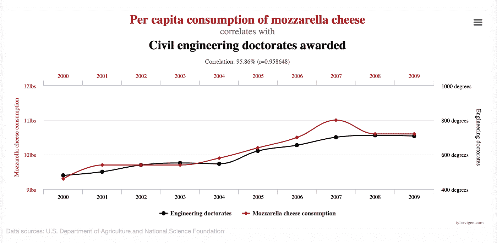

# 人们如何在工作中变得更加数据驱动？

> 原文：<https://towardsdatascience.com/how-can-people-become-more-data-driven-in-their-work-6f38c1121f33?source=collection_archive---------14----------------------->

## 给希望在工作中采用更多数据驱动思维的非数据专业人士的建议

企业和整个世界产生数据的速度正在迅速超过个人装备自己处理数据的速度。

在许多努力的领域，人们已经明确认识到需要发展更好的处理数据的技能，并在决策中变得更加以数据为导向。提供高度智能和洞察力的数据越来越多地被忽视，而倾向于采用“直觉”方法来做出关键的商业决策。在之前的一篇文章中，我概述了在我们的工作人口中更好的普通数学技能的情况。

自从我强调了可用数据量和我们使用数据的能力之间的这种明显且不断增长的差距，我就收到了人们关于*如何让*在工作中变得更加数据驱动的许多问题。这些问题通常来自那些希望更熟练地处理数据的专业人士。他们通常来自那些注意到他们的许多人倾向于回避数据或在处理数据时感到紧张的领导者。

你不必是一个数学天才来处理数据，事实上你根本不需要会做任何数学或统计。但是你确实需要乐于查看数据，并意识到什么时候可能需要数学或统计学。如果你觉得自己没有资格做，你需要找一个能做数学和统计的人。

我举办了许多研讨会，帮助人们发展数据驱动的思维模式。在我的工作室里，我把它归结为三个组成部分，或者说人们在任何有数据的解决问题的情况下都应该采取的“精神行动”。他们来了。

# 1.DTA —不要相信任何没有使用数据的人

变得更加数据驱动的第一步也是最关键的一步是认识到假设和有数据支持的假设之间的差异。为了说明这一点，我经常给我的听众一个假设的情况，他们组织的一个高级成员提出了一个说法，例如:“搬到一个新的总部对我们的销售产生了负面影响”。

在一个数据驱动的组织中，只有当数据证明了它的*表面有效性时，它才会被接受。有人做过分析，认为这个假设值得进一步研究吗？这种不经分析就被接受的说法并不罕见，甚至在某些环境中很常见。数据驱动的专业人员有足够的勇气指出这一点，并要求在数据中建立某种案例，以保证对索赔进行进一步的调查。*

# 2.抛硬币测试

假设现在有数据显示有理由相信搬到新总部已经影响了销售。例如，有人已经表明，对于销售人员的样本人群来说，搬迁前三个月的人均销售额比搬迁后三个月的人均销售额高 10%。

在一些样本数据中看到某种模式或差异并不能证明这种模式或差异实际上普遍存在。我们都凭直觉知道这一点，为了说明这一点，我经常带一枚双头硬币去我的工作室。我逐步翻转硬币，没有告诉我的观众它是双头的，每次翻转我都问观众他们是否相信硬币是假的。我不可避免地看到，相信硬币是假的人的数量随着每一次翻转而增加，这证明人们对统计不确定性的想法有一种直观的感觉，并且他们相信某事变得确定的阈值是不同的。

与手头的问题相关，不确定性在于样本总体是否足够大，或者 10%的差异是否足够大，以自信地宣称该模式普遍存在。“在销售人员的抽样调查中，我们发现在我们搬迁总部之前，人均销售额更高”，这样说是没问题的。但是，如果没有合格人员进行适当的统计测试，你就不能说“在我们搬迁总部之前，人均销售额更高”。

# 3.马苏里拉奶酪测试

现在，让我们假设我们对数据进行了一些(相当简单的)统计测试，他们确定数据满足建立有意义的差异的要求，并且我们实际上可以对总部搬迁前后的销售差异做出一般的断言。我们现在可以说总部搬迁影响了销售吗？看一下这张图表:

是的，在美国，吃马苏里拉奶酪和获得土木工程博士学位之间几乎有着完美的关联。数据中到处都存在暗示性的模式和关系。更多信息请查看[网站](https://www.tylervigen.com/spurious-correlations)。

我们例子中的陈述非常具体——它表明搬到新总部导致*销售额*下降。仅仅证明销量下降并不足以证明这是由移动引起的。

要证明因果关系，还需要做更多的工作。例如，重要的是要消除这种差异不是由其他因素造成的。也许我们每年这个时候都会看到季节性销售下降？也许有一个新的竞争对手进入了市场？同样重要的是要看看是否有因果关系的机制，例如，销售人员平均来说见的客户越来越少，是因为搬迁使他们离他们更远了吗？

因此，变得更加数据驱动并不意味着你必须成为数学天才。作为第一步，当你在工作中听到假设时，试着围绕你提出的问题改变你的行为:

*   有没有支持数据？(差热分析)
*   它是否令人满意地证明了所声称的关系？(抛硬币测试)
*   有明确的因果关系吗？(马苏里拉奶酪测试)

变得更加数据驱动从根本上来说是一个行为改变的问题。拥有数学技能会有所帮助，并且随着时间的推移培养这些技能是个好主意。但是试着从这三个简单的步骤开始。

最初我是一名纯粹的数学家，后来我成为了一名心理计量学家和数据科学家。我热衷于将所有这些学科的严谨性应用到复杂的人的问题上。我也是一个编码极客和日本 RPG 的超级粉丝。在 [*LinkedIn*](https://www.linkedin.com/in/keith-mcnulty/) *或*[*Twitter*](https://twitter.com/dr_keithmcnulty)*上找我。*

