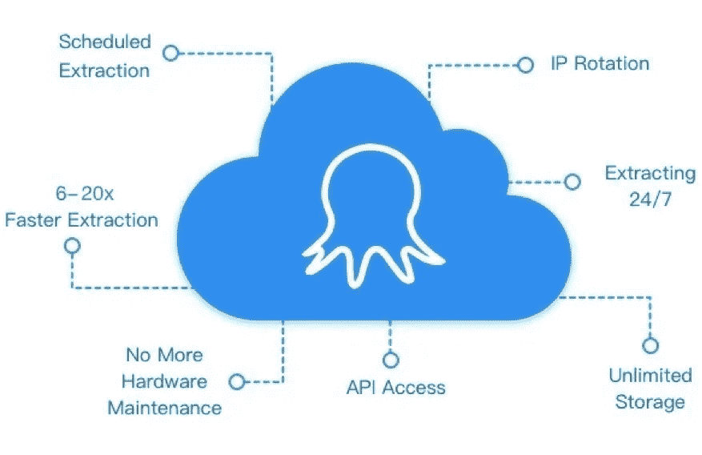

# 我们如何捕捉动态数据并将其可视化？

> 原文：<https://towardsdatascience.com/how-can-we-capture-dynamic-data-and-visualize-it-6f27f265db0a?source=collection_archive---------19----------------------->

利用大动态数据[提高生产力](http://www.finereport.com/en/data-analysis/shorten-the-distance-between-data-and-value-in-data-gravity.html?utm_source=medium&utm_medium=media&utm_campaign=blog&utm_term=How%20Can%20We%20Capture%20Dynamic%20Data%20and%20Visualize%20It%3F)已经成为企业成功的关键因素。我们生活的数字世界正在不断产生不断增长的动态数据流。除了内部数据管理，在线获取公共数据和[可视化数据](http://www.finereport.com/en/features/data-visualization?utm_source=medium&utm_medium=media&utm_campaign=blog&utm_term=How%20Can%20We%20Capture%20Dynamic%20Data%20and%20Visualize%20It%3F)也发挥着重要作用。

这篇文章将解释:

–为什么捕捉动态数据如此重要？

–动态数据如何有效推动业务增长？

–我们如何轻松访问动态数据？

–最后但同样重要的是，我们如何让动态数据变得高效？

# 1.为什么捕捉动态数据如此重要？

一般来说，通过持续监控动态数据流，您可以看得更清楚，行动更快。更具体地说，获取动态数据有助于:

## 1.1 加快数据驱动型决策

捕捉动态数据为您提供了有关市场新趋势和竞争对手的实时信息。将所有更新的信息放在手边，您可以大大减少因果之间的时间间隔。换句话说，您可以获得基于数据的洞察力，并更快、更容易地做出数据驱动的决策。

## 1.2 建立更强大的数据库

为了提高[**数据分析的质量**](/what-data-analysis-tools-should-i-learn-to-start-a-career-as-a-data-analyst-af650b54c9e9) 和决策的有效性，企业需要通过不断提取动态数据来建立一个全面的大容量数据库。

数据是一种时间敏感的资产。信息越老，收集起来越困难。随着信息量在规模和速度上每年翻倍，跟踪不断变化的数据以供进一步分析变得空前重要。

# 2.动态数据如何有效推动业务增长？

## 2.1 产品监控

产品信息，如定价、描述、顾客评论、图片，都可以在网上市场上找到，并不时更新。例如，发布前的市场调查可以通过[在亚马逊](https://www.youtube.com/watch?v=vEGFe6shbac)上检索产品信息或者从易贝那里搜集价格来轻松进行。

提取动态信息还可以让您评估产品的竞争地位，并制定有效的定价和库存策略。这是一种监控市场中竞争对手行为的可靠而有效的方法。

## 2.2 客户体验管理

公司比以往任何时候都更加关注客户体验管理。

例如，提取亚马逊上某个产品的所有评论可以通过分析正面和负面反馈来帮助解读客户对该产品的感受。这有助于了解客户的需求，以及实时了解客户的满意度。

## 2.3 营销策略

动态数据分析让你知道过去哪种策略最有效，当前的营销策略是否有效，以及可以做哪些改进。提取动态数据使您能够实时评估营销策略的成功，并相应地做出精确调整。

# 3.如何才能轻松获取动态数据？

为了及时、连续地收集动态数据，传统的手工复制粘贴已经不再适用。在这种情况下，易于使用的网页抓取工具可能是最佳解决方案，具有以下优点:

## 3.1 免费编码

有了 web 抓取工具，像 [Octoparse](https://www.octoparse.com) 你不需要事先有编程知识。从网上抓取动态数据对每个人和所有企业来说都很容易实现。此外，Octoparse 的一个新功能，称为任务模板，使每个人都可以在点击次数内捕捉数据。

## 3.2 适用于各种网站

不同的网站有不同的结构，所以即使是有经验的程序员，在写脚本之前也需要先研究网站的结构。但是一个强大的网络抓取工具可以用来快速简单地从不同的网站中提取信息，为你节省大量研究不同网站的时间。

## 3.3 计划提取

这就需要网页抓取工具支持云操作，而不是只在本地机器上运行。这样，scraper 可以根据您的首选计划自动运行以提取数据。强烈推荐八分云提取**、**，其中**、**支持根据您的需求随时随地抓取 web 数据。

# 4.如何才能让动态数据富有成效？

现在，我们可以快速高效地获取动态数据。为了最后的成功，我们还需要什么？

## 4.1 快速整合您的数据

很多时候，您的数据分散在不同的数据库中，集成数据变得非常耗时。这时候我们就需要一个像 [**FineReport**](http://www.finereport.com/en/?utm_source=medium&utm_medium=media&utm_campaign=blog&utm_term=How%20Can%20We%20Capture%20Dynamic%20Data%20and%20Visualize%20It%3F) 这样的软件，能够支持各种数据库，将多个数据源的数据组合起来，提取数据进行综合分析。

From FineReport

## 4.2 通过报告或仪表板可视化您的数据

数据可视化的重要性在于，它帮助人们更快地理解数据。图形和图表可以将看不见的信息转化为看得见的图形符号，直接清晰地表达出来，帮助你快速发现临界点。如果你想知道如何制作超酷的仪表板，你可以在这个博客 [*中探索更多制作销售仪表板的分步指南*。](/a-step-by-step-guide-to-making-sales-dashboards-34c999cfc28b)

From FineReport

## 4.3 随时随地更新您的动态数据

记得数据是动态的吗？嗯，我们的仪表板或报告也应该是动态的，如果我们可以在任何地方查看它们的话。此外，如果我们有另一个数据源，并且我们需要将它更新到我们已经构建的仪表板或报告中，该怎么办？同样，您可以使用 FineReport 的[数据输入](http://www.finereport.com/en/features/data-entry?utm_source=medium&utm_medium=media&utm_campaign=blog&utm_term=How%20Can%20We%20Capture%20Dynamic%20Data%20and%20Visualize%20It%3F)功能来实现数据的实时更新。

From FineReport

# 最后的想法

如今，数据是推动业务发展的重要因素之一，有助于利用内部数据进行自我审计，并通过捕捉外部信息来跟踪行业趋势。借助数据捕获工具和数据可视化工具，您将对您的业务乃至整个行业有一个清晰的了解。

立即享受用数据推动业务发展的乐趣！

# 您可能也会对…感兴趣

[*2019 年 6 大数据分析工具*](/top-6-data-analytics-tools-in-2019-4df815ebf82c)

[*初学者财务报表分析指南*](/guide-to-financial-statement-analysis-for-beginners-835d551b8e29)

[*2019 年你不能错过的 9 款数据可视化工具*](/9-data-visualization-tools-that-you-cannot-miss-in-2019-3ff23222a927)

[*数据可视化中前 16 种图表类型*](/top-16-types-of-chart-in-data-visualization-196a76b54b62)

[*数据可视化排名前 10 的地图类型*](/top-10-map-types-in-data-visualization-b3a80898ea70)