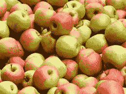
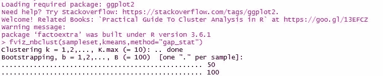
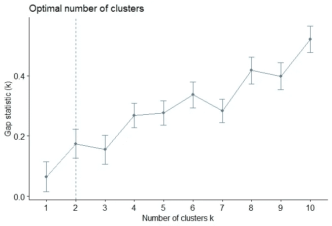
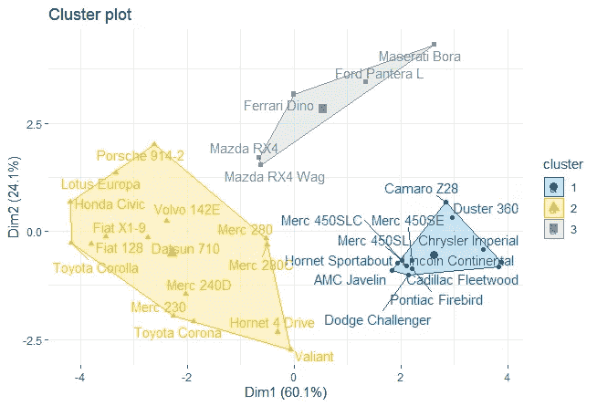

# 用一个关于苹果的类比来理解聚类。

> 原文：<https://towardsdatascience.com/how-can-you-pick-the-oranges-and-apples-separably-from-data-sets-using-r-8219b385e0d1?source=collection_archive---------25----------------------->

多元被定义为两个或更多的变量。这种形式的分析涉及两种算法，即聚类分析和降维。下面的文章将首先关注聚类分析。这种算法方法寻找数据中的自然聚类。一个集群被定义为一组位置相近或发生在一起的相似事物。

考虑一下这个类比。假设你有一盒不同颜色的苹果；红色、绿色和混合颜色。单独挑选每种颜色不仅耗费时间，而且很可能会出现人为错误。



然而，通过聚类分析，我们可以根据颜色对这些不同的苹果进行分类。有了这样的信息，人们可以收获诸如多少苹果属于哪种颜色、哪种颜色质量最好或哪种颜色质量最差的信息。

这种方法可能会应用于互联网上的各种算法，例如基于社交媒体的平台中的定向广告和推荐引擎。

对数据集中的不同变量进行分段或分类的第一步是使用一个称为降维的概念。这包括采用大量的变量，并将其减少到几个新的变量，最好地描述数据集。例如，对于每一个苹果，你可以测量平均质量、体积百分比或者用户能想到的任何东西。但是，如果所有这些变量高度相关，您可以将它们合并成一个新变量。

在这种情况下，如果你测量我们每个苹果的 100 个特征，仅仅通过观察数据很难理解我们苹果的分组。在这种情况下，聚类可以帮助您自动拉出这些组。

同样重要的是要注意，降维可以被认为是变量的减少。同样，如果我们有关于每个客户的 100 个变量，我们可以进行降维，以找到变量中的主要趋势。基于聚类变量而不是原始的 100 个批次，我们将更容易理解我们的苹果的模式。

在我们开始聚类之前，您可能希望删除或估计缺失的数据，并重新调整变量以进行比较。在此基础上，我们将探索几种聚类算法，人们可以使用这些算法来分析精心选择的数据集，因为并不是任何数据集都适合被聚类。

在本次演示中，我们将使用 R 中内置的 *mtcars* 数据集，其中包含汽车趋势道路测试信息。

我们首先从划分或分割聚类开始，这是一种根据相似程度将数据集中的观察值分成几组的技术。这些算法需要分析师具体确定要生成的聚类数。

图书馆需要:

*factoextra* 美化集群的可视化

```
#load data
data(“mtcars”)
sampleset <- mtcars
#remove any missing values
sampleset <- na.omit(sampleset)
#scale variables
sampleset <- scale(sampleset)
#ascertain the alternative number of clusters for k-means clustering
library(“factoextra”)
fviz_nbclust(sampleset,kmeans,method=”gap_stat”)
#compute and visualize k-means clustering
set.seed(123)
km.res <- kmeans(sampleset,3,nstart=25)
```



```
#visualize
library(“factoextra”)
fviz_cluster(km.res,data=sampleset,ellipse.type=”convex”,palette=”jco”,repel=TRUE,ggtheme=theme_minimal())
```



现在，您可以看到数据是如何根据相似性分为三类的。

在下一篇文章中，我们将探索另一种称为分层凝聚的聚类算法。