# 公司如何理解你

> 原文：<https://towardsdatascience.com/how-companies-makes-sense-out-of-you-ab73fcf1e518?source=collection_archive---------41----------------------->

当给定一个关于用户购买咖啡习惯的数据集时，你如何理解这些数据，这些公司能在多大程度上预测你的习惯？

Photo by [Javier Molina](https://unsplash.com/@javier1997mo?utm_source=medium&utm_medium=referral) on [Unsplash](https://unsplash.com?utm_source=medium&utm_medium=referral)

# 背景

在 [Udacity](http://www.udacity.com) 数据科学纳米学位中，我一直在星巴克提供的数据集上进行我的顶点项目。我的目标是利用我在课程过程中学到的东西，并把其中的一部分以网络应用或博客帖子的形式展示出来。很明显，我选择了后者。

这篇文章总结了我与星巴克数据集的遭遇，以及我如何设法将其分解，从大量数字和字符中分辨出一些有用的东西。

## 问题定义和研究问题

星巴克正在提供描述一组用户交易的数据，这些用户在一段时间内接触到不同类型的优惠时，具有一些特征，如年龄、性别和收入。

Udacity 对这项任务的描述是:

> 每隔几天，星巴克就会向手机应用程序的用户发出一次报价。优惠可以仅仅是饮料的广告，也可以是实际的优惠，如折扣或 BOGO(买一送一)。某些用户可能在特定的几周内收不到任何报价。
> 
> 并非所有用户都收到相同的报价，这是这个数据集要解决的挑战。
> 
> 您的任务是将交易、人口统计和优惠数据结合起来，以确定哪些人口统计组对哪种优惠类型做出最佳响应。

你可能会认为，这有点令人生畏。如何对星巴克的顾客说些有用的话？继续下去；我告诉你。

我们需要设计一些研究问题。简单看了一下数据后，我列出了一些例子，如下所示。

*   有什么迹象表明报价有效吗？
*   总的来说，有没有哪种性别对报价反应更好？
*   一般来说，有哪个年龄段的人对报价反应更好？

我一路上还有很多其他的，但是没关系。迭代是过程的一部分，有些路径并没有引导到你期望的地方。你将会看到，在这篇文章中，我可能会介绍我在这个过程中发现的新问题。

我将在下面指导你完成我的过程，然而，代码中的细节可以在我的 [github](https://github.com/dedwardn/udacity_capstone_project) 上找到。我选择主要使用 jupyter 笔记本进行探索和绘图。助手函数放在 python 模块中，以防我以后需要它们，其余的细节可以在 README 中阅读。

# 韵律学

在这个项目中，我选择不建立一个模型，因为我相信它可以给出一个非常合理的客户群摘要，以及哪些人口统计将对每种报价类型做出最佳响应，而不必进入机器学习。

上述研究问题构成了我的衡量标准的基础。我将深入数据的启发式分析，着眼于用户的特点，他们的总体消费习惯，以及每一个提供的分布式。

原则上，我将关注用户在不同优惠和总体上花费的平均值和中间值。

在反复进行分析和功能工程之后，我还决定，对于不同的报价和总体情况，每小时花费*的平均值和中间值会产生有趣的结果，因为它做了两件事。它衡量用户对要约采取行动的时间。因此，我们将持续时间和数量分离。这与这样的假设有关，即用户一完成或过期就忘记了该优惠，并且在看到它之前不知道它。因此，每个用户对报价的感知时间都非常不同，我们应该以某种方式将其规范化。*

# 数据探索和争论

让我们进入数据。星巴克提供的数据在三个不同的表格中给出。

*   portfolio.json:不同报价的数据，比如报价类型、奖励、持续时间和难度
*   关于用户的数据。年龄、收入、性别
*   关于用户行为的所有信息。测试期间所有事件的抄本。哪个用户在什么时间得到什么优惠，他们什么时候观看，他们购买了什么等等。

这些表中的每一个都包含需要组合的信息，以便能够告诉任何关于产品成功或谁应该获得下一个产品的信息。我们将在下面的数据探索部分再次讨论这个问题。

这是最难的部分。首先，您需要了解数据的概况，它是什么类型？给出了哪些值？是不是很多数据点缺失？有没有明显的错别字或者不切实际的价值观？

这很耗时，但不一定是最难的部分。

作为一名数据科学家，你需要详细了解数据。隐藏在数据中的不明显的小细节和因果关系可以帮助您做出建模选择。统计学和机器学习是研究相关性的好工具，但不能解释因果关系。然而，即使是小孩子也能解释许多计算机难以理解的因果关系。因此，作为人类，我们需要尽可能多地了解我们的数据。通常这包括重复、尝试和测试假设。

你做出的这些建模选择可以让数据变得非常有用，或者原则上可以迫使你丢弃大块的数据，仅仅因为你还没有真正理解它的全部含义。

Udacity 和 Starbucks 给出的项目的问题定义解释了数据的一些特殊特征。例如，用户可以完成要约，并且在没有看到给予她的要约的情况下接收奖励。然而，在我们开始分析之前，还有其他几个值得了解的细节和假设需要检查。

在“Starbucks Capstone notebook . ipynb”你可以找到我相对有序的数据探索。我将在这里总结这个过程，讨论我在这个过程中的发现，以及我是如何解决这个问题的。

## 投资组合数据

我从解释报价本身的投资组合数据开始。

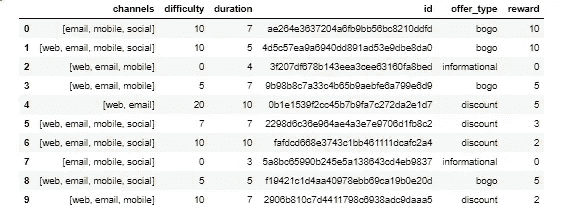

The total portfolio data set

正如我们在上面看到的，只有 10 种不同的报价。该数据具有与渠道、难度、持续时间、报价 id、报价类型和完成时的奖励相关的特征。

没有缺失值，其他方面相对简单。然而，信道数据在列表中，这对于任何类型的分析来说都不是很容易使用。因此，我将该列转换为虚拟列，以指示使用了哪个通道。

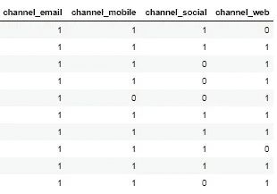

OneHot encoded channel columns

因为我没有预见到我将直接使用这个表进行分析，但是作为支持信息，我没有在这里转换 offer_type 列。我发现在搜索和过滤时能够保留分类值更有用。

关于这个数据没有太多要说的，所以让我们继续讨论概要数据集。

## 剖面数据

简档数据集给出关于每个用户的注册信息。下面是它的一个片段。

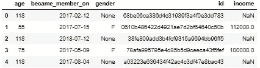

User data

这里列的不多。但是，我们会立即看到 None 和 NaN 值。我们也惊讶地看到许多 118 岁的人！发生了什么事？

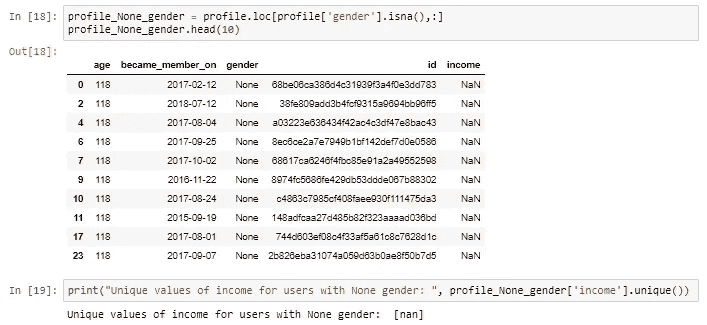

嗯，我们可以看到，如果我们过滤“无”性别，每个用户似乎也有南收入和 118 岁！在最后一行，我们基本上得到了证实，所有的男性都没有收入。这似乎是某种默认值。

但是，默认值并不意味着它没有用。了解的唯一方法是检查他们的交易数据，我们稍后会这样做。如果我们的用户没有任何信息，也没有进行任何交易，他们对我们来说就是一个黑匣子。目前我们将保留奇怪的老用户。

但是让我们看一些好的图表来更好地理解我们用户的分布！

下面我们先看所有用户的年龄分布，然后再看每个注册性别的分布。注意，O 代表“其他”性别。显然，我们所有的 118 岁的人都与未登记的性别有关，因为他们从性别特定的情节中消失了。除此之外，我们可以看到男性、女性和其他性别的人口相对平等。

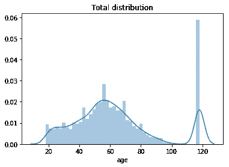

The distribution of age for all users

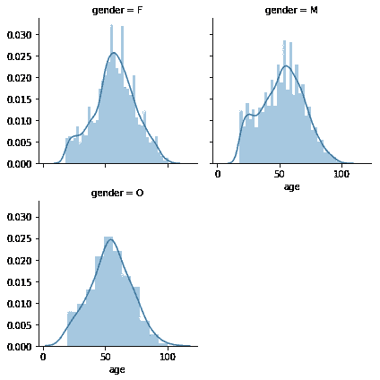

Distribution of users with genders other than None

我做了一个测试，从我的数据中删除了所有与性别无关的用户，看看我们是否还剩下一些缺失的值。正如所料，所有丢失的数据实际上都与某种默认设置有关。

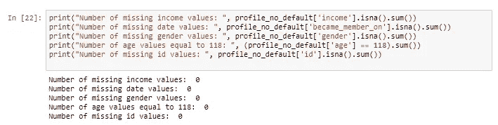

此外，我发现数据集中 17000 个注册用户中有 2175 个用户(12.8%)是默认配置文件。这很重要，但是我仍然有很多数据，即使我最终不能使用它们。然而，目前的想法是将他们视为“第四性别”或一个独立的群体。

我还检查了会员注册日期的默认值是否可以与某个事件联系起来。意味着分布非常集中。尽管下图显示了 2015 年第三季度的增长，但没有单一事件。当我研究绝对注册时，它也显示了同季度的显著增长，这可能与星巴克的营销活动或类似活动有关。

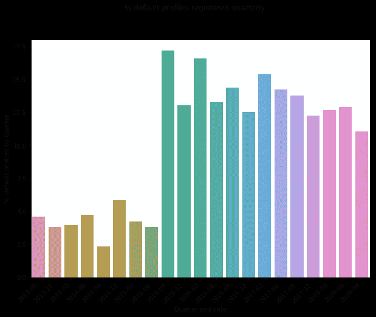

Quarterly distribution of the % of default user profiles registered in that quarter

此外，我们可以看到，男女性别分布相当均匀，只有 1.4%的人有其他性别。

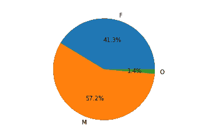

Gender distribution\

从性别的收入分配来看，我们可以看到他们也是相对平等的。女性高收入者的比例比男性高。然而，另一个突出的例子是没有收入超过 102kUSD 的人。

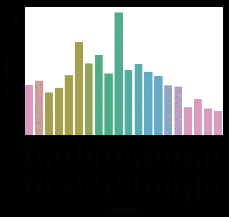

Income distribution for females

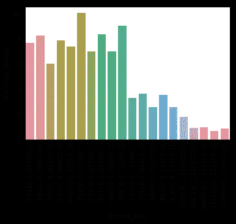

Income distribution for males

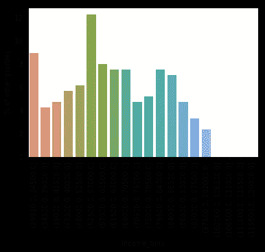

Income distribution for Other

总之，关于用户群最令人惊讶的是默认的配置文件，这使得相当多的用户注册。我们需要深入了解这些用户是我们可以留住的，还是我们应该抛弃他们。不过，我想先看看他们的交易数据。

## 抄本数据

抄本数据本身也是一个非常简单的表格。它有关于事件的信息；发生了什么，用户 id，事件的时间和一个名为 value 的列。这很有意思。

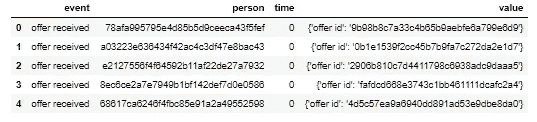

Snippet of transcript data

然而，为了确定这一点，我检查了所有用户是否都出现在脚本数据中。如果用户那里没有数据，我们可以直接删除它们。幸运的是，情况并非如此。所有用户要么收到了报价，要么买了东西。然而，我后来发现，并不是所有的用户都收到了报价，也不是所有的用户都买了东西。

此外，我找不到任何形式为 None 或 Nan 值的缺失数据点。因此，我们可以关注有趣的部分，即值列。

这个专栏从一开始就有点神秘。它被格式化为一个字典，带有一个键/值对。在上面的第一行中，我们只看到关于接收一些 offer 的事件，这些事件似乎都遵循相同的提供 offer id 的模式。然而，隐藏在表面之下的是什么？

我过滤了条目多于 1 的字典的值列。我找到了金子。

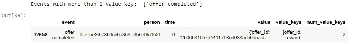

offer types with more than 1 key in the value column

Offer completed 有两个键，一个表示与要约完成相关的要约 id，另一个称为“reward ”,表示用户收到的奖励值！

当展开整个列并将每个键分配给一个单独的列并将值分配给该列时，我用这些额外的列结束。

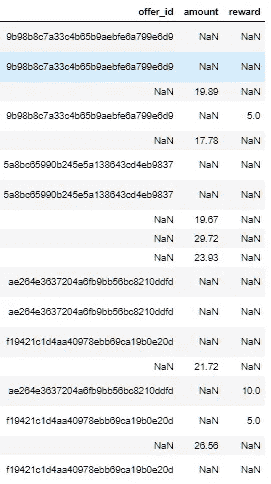

value column converted to separate informational columns with the keys as column names

优惠 id 是不言自明的。amount 列与交易事件相关，表示用户何时花钱买东西。当用户通过完成要约来解锁奖励时，奖励与完成事件相关。

因此，将这些列添加到我的成绩单数据中，我最终得到了一个表格，其中有获得要约的人、给出的要约、发生的时间、任何交易或奖励的金额以及发生的时间。

我们可以开始更深入地了解事件的细节了！

首先，我检查了没有事务的默认配置文件的数量，只有 89 个用户。基本上我们一无所知的用户，他们没有使用这个应用程序购买任何东西。他们是约翰和无名氏。

## 用户消费历史

在做了这个初步的清理后，我想更多地了解我可能面对的模式。

*   报价是如何呈现给用户的，每次总是一个接一个还是多个？
*   完成后，用户可以看到优惠吗？
*   累计支出看起来如何？

为了更深入地了解这些问题，我需要一些视觉效果。我首先做了一个时间表的快速模型，其中我指出了报价的开始时间和结束时间，以及奖励。只是想了解一下我要处理的事情。

如下所示，我们肯定有重叠的报价，而且不是两个而是三个。为了能够理解更多的数据，我需要更好地组织这些数据。

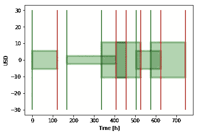

Offer history of one user. Green vertical lines are offers received events, the red are after the indicated duration, and the green boxes span from start to end and the height indicate the reward.

经过检查，我发现任何用户收到的最大报价是 6。因此，我可以将每个报价一个接一个地排列起来，而不必花费太多的空间。我还可以添加关于何时查看和完成报价的信息(如果有的话)。

下面给出了用户报价和消费历史的一个例子。更多的例子在我的 github 的 plots/gantt plots 文件夹中给出。

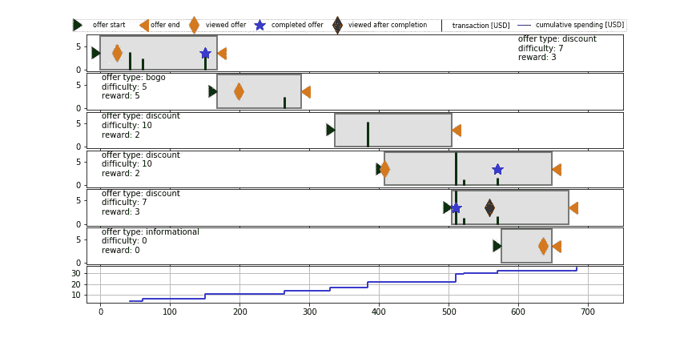

One offer is presented per subplot. The timeline is given along the x-axis, and the bottom plot is the cumulative spendings until that point. For each offer, the start, end, view and completion time is indicated. Transactions are given as black poles, where the height indicate the value (as denoted on the y-axis). The text gives more meta data about the offer like type, difficulty and reward.

这些图对于理解我的数据非常有用。首先，在用户看到报价和完成交易之间可能有相当短的时间。此外，在某些情况下，查看事件发生在完成之后，如上图中倒数第二个报价的情况。

此外，对于许多用户来说，他们会收到许多报价，这些报价的总长度覆盖了他们的大部分时间线。然而，实际的**感知窗口**要小得多。大多数情况下，从收到要约到看到要约需要时间。要约的完成往往发生在到期日之前很久。

我选择在查看报价之前将其定义为无效。这意味着在此期间进行的任何交易都不受要约的影响，因此不能归因于要约的效率。

要约完成后发生的交易的收益率相同。我假设对报价没有后效。一旦完成，它就被遗忘了。

因此**有效窗口是从要约被查看之后直到要约完成或到期。**

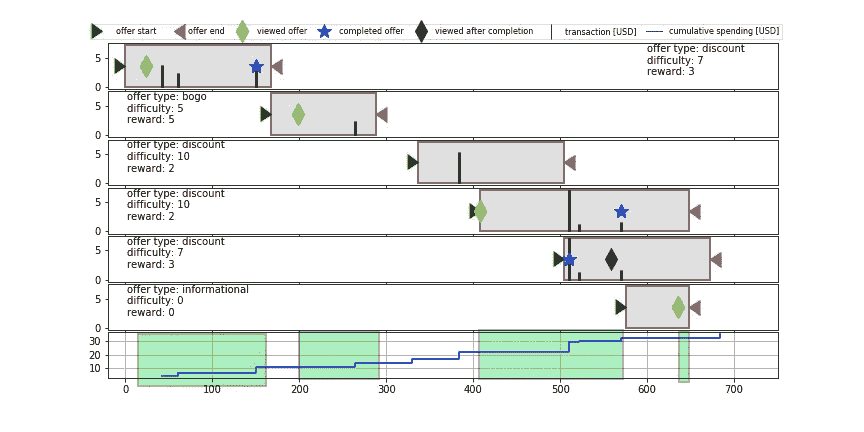

Valid windows shown as green fields

# 用特征工程构建矩阵

经过清理和调查，我决定建立两个独立的矩阵。正如我们最初看到的，数据表本身实际上是简单的数据。它们需要被组合起来，新的特征必须被设计来描述我们想要知道的东西。这是为上面的报价甘特图所做的，其中报价数据与交易数据相结合。

参数的详细信息可以在自述文件中找到。在这里，我将只是总结他们的理由。

## 轮廓扩展矩阵

一个矩阵将基于简档数据。正如我们在上面的图中看到的，用户在不同的窗口内部或外部进行交易。这可以在用户级别上进行汇总，这样我们就可以获得与任何有效窗口内和有效窗口外的总支出相关的特征。我们还可以汇总不同类型优惠的支出。

此外，我们可以总结每个用户的观看率、完成率以及观看和完成的比率。查看率描述了用户查看报价的频率，完成率也是如此。查看和完成要约的比率，或基本上是有意完成的比率，描述了用户在第一次查看要约后完成要约的频率。

然后，扩展的概况矩阵将用于调查总体人口趋势。用户群在花钱方式、对优惠的反应以及没有优惠时有什么趋势吗？

## 报价矩阵

报价矩阵用一条线表示给用户的一个报价。因此，原则上它显示了上面甘特图中显示的数据，以及一些额外的数据。

优惠矩阵将用于调查不同优惠之间以及不同优惠的人口统计群体之间的差异。与用户数据结合使用，我们可以调查哪个人口统计组对给定的优惠类型响应最好，应该向用户提供哪个优惠等。

由于该数据仅包含有效窗口内发生的交易的信息，而非整个优惠期的信息，因此我们无法直接说明与未收到优惠相比，优惠是否特别有效，只能说明优惠的相对有效性以及它们如何相对影响不同的用户群。

# 分析

最后，我们可以开始分析我们的数据，并尝试回答我们要回答的问题。

## 一般用户行为

然而，在我们直接回答这些问题之前，我想先了解一点更普遍的问题:

*   有什么迹象表明报价有效吗？
*   总的来说，有没有哪种性别对报价反应更好？
*   一般来说，有哪个年龄段的人对报价反应更好？

为了回答这些问题，我做了一个汇总表，下面是一些方框图。

下表显示了不同数据特征的中值和平均值结果。它是从概要扩展矩阵中产生的，该矩阵概括了用户的总体情况，而不是单个报价级别。

该表已按性别分列，其中 N 表示无，O 表示其他。None gender 是我们在数据探索阶段发现的默认配置文件的指示。

关于平均值和中值有一点需要注意。如果平均值和中值显著不同，这意味着少数用户具有非常极端的值，使得平均值偏离平均值。

在下面的总结中，我们可以看到，对于所有的支出参数，中值明显低于平均值。因此，与 50%的花钱者相比，确实有少数人在认真花钱。

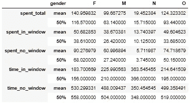

Summary of spending and time spent in and out of valid windows

Spending in a valid window grouped by gender

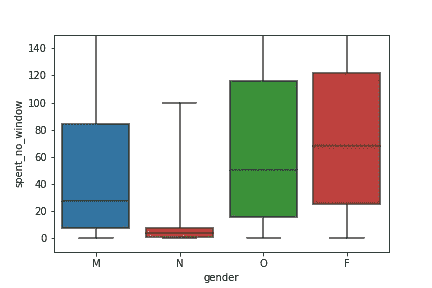

Spending outside of valid windows grouped by gender.

我们看到女性的总支出中值最高。和其他人一起，他们远远领先于男性和默认概况。实际上，这里最大的异常是默认配置文件，它们看起来可能是应用程序的随机用户，而不是真正的经常性大买家。

我们还从这些值中看到，在有效窗口内花费的金额低于在有效窗口外花费的金额。但这是否意味着给予折扣和其他优惠是无效的呢？

根据支出的绝对值来下结论是不公平的。正如我们所看到的，在有效窗口的之外花费的时间**往往比在**有效窗口中花费的时间**高很多倍。**

意识到这一点后，我回去根据每个小组各自的持续时间将花费值标准化。

这导致了下面的表格，其中有每小时美元的单位，而不仅仅是上面的美元。

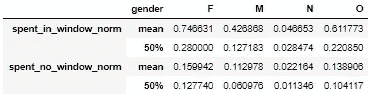

Normalized spending

标准化支出讲述了一个不同的故事。在有效窗口内，即在查看报价后，女性每小时的平均支出是男性的 4.7 倍。男性的花费约为 3.9 倍，默认配置约为 2 倍，其他人约为 4.4 倍。这意义重大！

中值数字要低得多，这进一步支持了这样的观察，即有些用户花费很多，而许多用户花费一些。然而，有效窗口内和有效窗口外的比率仍然很高，所有性别的每小时支出都高出两倍多。

我有问题的价值除以 0，因为许多报价实际上是在同一小时内查看和完成。为了解决这个问题，我在所有持续时间上增加了 1 小时。这是一个很好的近似说法，即花 1 个小时来查看和购买你想买的任何东西。实际上，这个单位可能是几秒，但在我们的例子中这无关紧要。

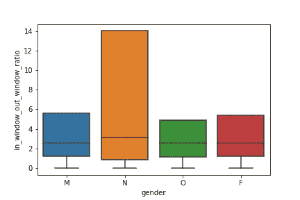

ratio between in a window and outside a window for the normalized values over genders.

看下面不同的年龄组，我们看到默认值实际上是作为一个单独的组分开的。他们的支出中值较高，由方框内的横条表示，但在四分位数上也有相当大的范围。

除了默认配置文件之外，年轻人和老年人的中位数实际上更高，对于 68-78 岁的用户，有效窗口中的支出高 2.5 倍左右，对于 18-28 岁的用户，高 2.6 倍。

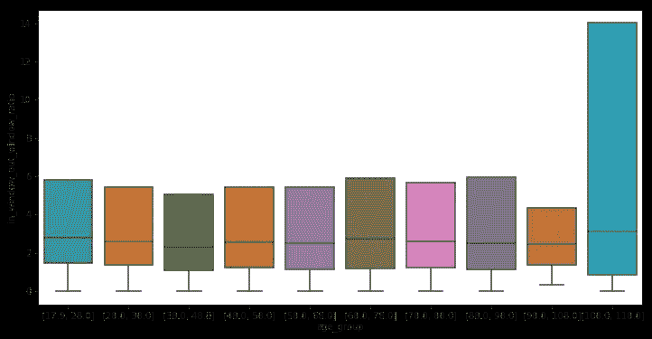

Ratio between in a window and outside a window for the normalized values over age groups

因此，根据上述指标，我们可以说，要约在一般工作！

一般来说，女性似乎对某项提议的反应略高，紧随其后的是其他性别。男性有点落后。

年龄组不那么明显，差异分布更均匀，没有一个群体是突出的。相反，所有群体的反应都很好。每个年龄组的平均花费高出 2.2 到 2.6 倍不等。

## 报价类型

我们可以对报价类型做类似的练习。我设计了一些功能，总结了属于特定优惠类型的有效窗口内的消费以及在相应优惠类型的有效窗口内花费的相应时间。

因为我们无法知道购买是否受到一个或另一个报价的影响，如果有效窗口重叠，我就计算两者的数量。因此，实际支出数字是乐观的，不能用来直接预测数额，但它们可以用来比较反应。

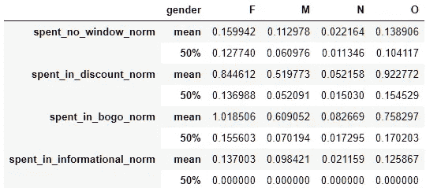

Normalized spending for different offer types

看一下上表，我们看到中间值告诉我们，与完全不在窗口中相比，许多用户只是受到特定报价的轻微影响。并且至少 50%的用户不仅仅基于信息提供来购买任何东西。

然而，平均而言，折扣和 BuyOneGetOne 优惠的每小时支出明显高于没有优惠的每小时支出。这意味着有一些人在特定类型的优惠中随机或受影响地花费更多。

下面我们看到了按性别划分的不同年龄组的不同优惠类型的标准化支出分布。

如果我们把目光从误差棒非常高的子群移开，我们可以看到，在折扣优惠上，其他性别通常比 60 岁以下的女性有更高的标准化支出。然而，在 60 岁到 80 岁之间，趋势发生了变化。其他性别的样本相对较少，因而有较高的估计误差。

显而易见的是，总体而言，所有男性(不包括 98-118 岁的人)都不太可能为任何提议花钱。

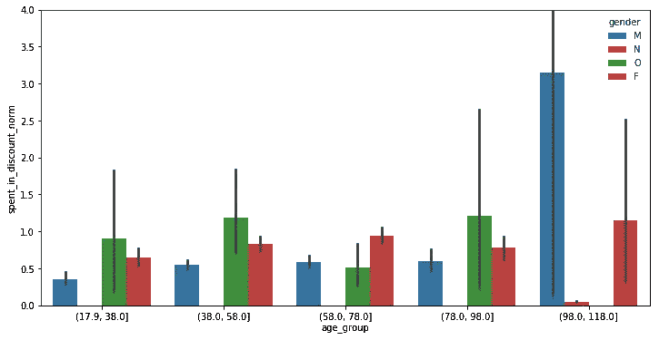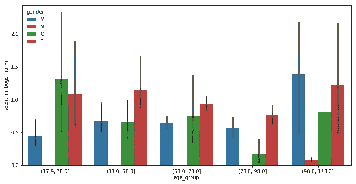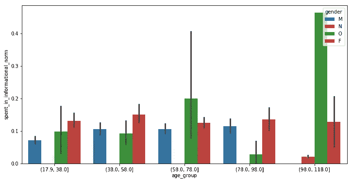

## 摘要

总之，我们可以说，有一种趋势表明，女性每小时花更多的钱，并且至少比男性更容易受到任何报价的影响。另一个性别类别更接近女性。

年龄组更加随机，有迹象表明年轻人和老年人比中年人对报价反应更好。

然而，我们有相当有力的证据表明，人们因为收到的优惠而花费更多！

我发现这特别有趣，但也是最难的部分之一，挖掘数据，并试图设计新的功能，可用于推理。关于如何在我定义的报价或窗口之内/之外处理交易的选择会显著改变结果。数据科学家必须仔细选择定义，并根据这些选择得出结论。

我尝试了不同的设置和数据争论，看看我能找到什么重要的参数，这里显示的结果是基于我对一些要点的理解。可能我的理解是错误的，因此我将需要另一次迭代来微调方法和建模选择。

## 改进和未来工作

利用这些数据可以做更多的事情。报价数据框架不仅可用于绘制图表，还可用于理解报价是如何为用户构建的。

各种优惠类型的支出分布和其他相关数据有助于更好地了解不同用户群对各种优惠类型的反应。我可能会先这样做，以了解更多关于产品和用户组合的信息，并根据学习和发现的缺陷等来改善视觉效果。

此外，通过结合用户一般支出的工程特征、报价表和用户参数，我们可以建立一个机器学习模型，通过无监督学习方法来细分用户群。此外，我们还可以构建一个回归模型，根据用户资料预测用户的预期支出。