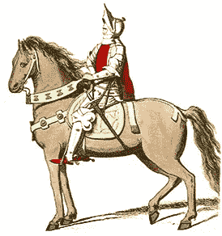
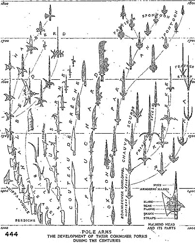
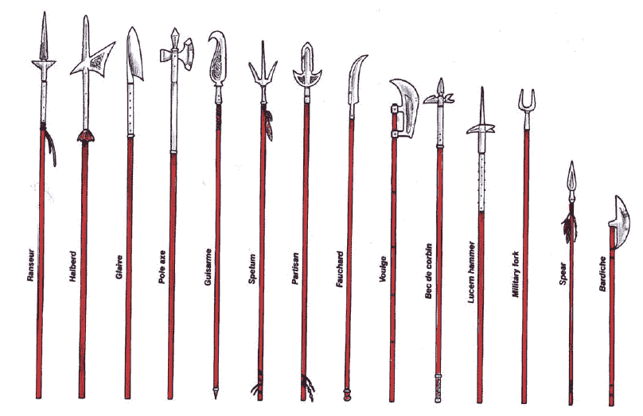
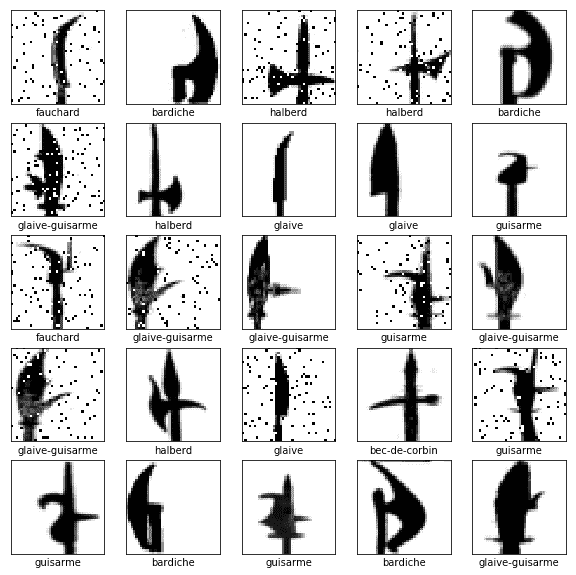
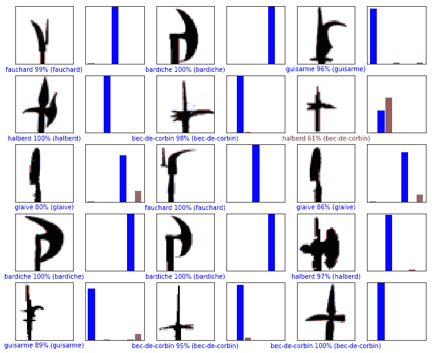
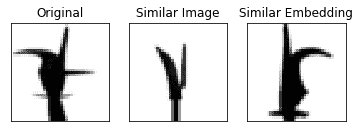
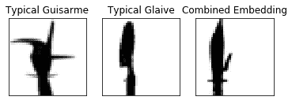

# 计算机如何看:图像识别和中世纪的杆臂

> 原文：<https://towardsdatascience.com/how-computers-see-image-recognition-and-medieval-pole-arms-1c1375a34d38?source=collection_archive---------15----------------------->

他们说，死亡是伟大的均衡器。它最终会降临到我们所有人身上，没有人能逃脱它冰冷的魔爪。这在历史上和今天都是正确的，但在中世纪的战场上，我想这句格言有着特别的辛酸。死亡无时无刻不在，并可能以多种形式出现——在锋利的钢片末端，在狂奔的马蹄下，或者从你因喝了别人刚刚拉屎进去的水而感染的无数疾病中的一种。

然而，中世纪的贵族们，秉承着自古以来富有混蛋的传统，不停地试图让生活的天平向他们倾斜。到了 15 世纪末，贵族们想出了一些非常有效的方法。随着金属加工技术的进步和高质量钢材供应的增加，出现了越来越精致和有效的板甲套装。它们非常沉重，而且价格惊人，主要被骑马的骑士所使用——这些地主非常富有，能够负担马匹和盔甲，以及两者的保养费用。这种盔甲让一个人几乎免疫于刀剑或长矛的攻击，幸运的穿戴者可以纵情于一个下午的屠杀而相对不受惩罚。

What a jerk

当然，农民对这种状况不太满意。从高尚的角度来看，他们开发了一套减轻这种新的战场威胁的工具，这是相当不明智的。这些工具都依赖于一项革命性的技术，这几乎完全抵消了板甲的优势。这一关键创新是你今天会认识到的——我们称之为“非常长的棍子”。在一根六或八英尺长的木杆末端放上一些锋利的钢，你就有了破坏贵族乐趣的完美工具。这些武器被称为“杆武器”。

至于怎样装饰这根长长的棍子最好，有四个主要的学派:

长钉是长棍子末端的一个极好的东西。矛也许是这方面最突出的例子，自从人类出现以来就一直在使用。杆子的后端可以插入地面，利用冲锋骑士的冲力攻击他，把他变成一个全副武装的烤肉串。

**剑刃:**剑或斧对板甲相当无效。但是把同样的刀片放在一根长杆的末端，你能施加的力会突然成倍增加。轻轻一击之前的一击可以变成一记重击，甚至可以劈开最坚固的盔甲。

锤子:突然向某人的头部施加巨大的力量会毁了他们的一天，不管这一击是否穿透他们的头盔。锤子将一击的全部力量集中在一个非常小的区域，通过盔甲将冲击力传递给穿戴者，极大地扰乱他们的计划。

**钩子:**源自各种现存的农具，钩子可以发现盔甲上的裂缝，而直刃可能会遗漏。这些武器也被用来把骑着马的对手从座位上拉起来，或者把步兵从他们的朋友身边拖走，以便更方便地进行谋杀。

在实践中，杆臂通常将这些方法结合成一个单一的多用途工具——一个背部带钩的斧刃，一个顶部带长钉的锤子，或者一个既能刺穿又能砍的长而重的刀片。在中世纪晚期持续不断的战争中，适者生存见证了不同形式的巨大繁荣，所有这些都旨在让可怕的事情发生在一根长杆所能管理的遥远的人身上。事实上，如此多的这种武器被制造出来，以至于追踪它们是一个相当大的挑战。

确定一个特定的钢铁花饰是 glaive、fauchard、brandistock 还是一个[波西米亚耳勺](https://en.wikipedia.org/wiki/Bohemian_earspoon)会让任何人绞尽脑汁。幸运的是，在现代，我们可以调用人工大脑的力量。是的，这是另一种迫切需要应用机器学习的情况。

我们想要的是一种工具，可以简单地通过观察其形状来识别杆臂属于哪一类。我们希望将一个杆臂的图像转换成对其专有名称的预测。这是一个分类问题，就像我们在这个系列的第一篇文章中遇到的一样，根据某些身体特征，我们将恐龙分为食草动物或食肉动物。

但是有一个非常重要的区别。以我们的恐龙为例，我们的数据被非常方便地编码为每种生物的一组相关“特征”——重量、长度、是否有羽毛等等。对于我们的电极臂，我们的数据只是一组图像——电极臂的形状以每个像素的颜色值进行编码。

让我们想想这意味着什么。以下是我们关于恐龙的数据:

有了这些数据，算法可以确定恐龙的特征和饮食之间的关系:用四条腿走路使恐龙很可能是食草动物；体重轻更有可能是食肉动物，等等。通过结合这些因素，算法创建了一套规则，非常准确地将恐龙归入正确的群体。

但我们的极臂数据是一组图像——而不是定义的特征和类别，我们所有的是一行又一行的像素。如果我们将这些数据表示为行和列，它看起来像这样:

第一行:白色、灰色、黑色、非常黑、再次变灰、白色、灰白色、白色…

**第二排:**灰黑色、微黑灰色、黑色、黑色、更黑、灰色、浅灰色、白色…

特征(特定像素的内容)和类(图中的极臂类型)之间不存在明确的关系。顶行中左起第三个像素是黑色而不是白色，这一事实与图像是 bardiche 还是 bec-de-corbin 有任何明确的关系吗？不，不是的。对于传统的分类算法来说，这些信息完全没有意义。找到这些关系需要一种不同的、更复杂的方法。我们将深入这些文章中尚未涉及的机器学习领域:“神经网络”，或所谓的“深度学习”。

神经网络所做的，将它们与其他机器学习算法区分开来，不仅仅是学习如何将有意义的特征转化为对一行数据的预测，而是学习如何将复杂的非结构化信息转化为有意义的特征。神经网络采用多阶段或“分层”方法进行分类。我们的极臂识别器首先准备数据，将像素的原始值转换为图像的抽象信息。只有在最后阶段，它才会将这些信息转化为每一个职业所属的极臂的可能性——也许有 80%的可能性是戟，15%的可能性是贝克-德-科尔宾，5%的可能性是格莱夫-吉萨尔姆。最有可能的类别成为我们的最终预测。

该过程的最后一步与最简单的分类算法完全相同。真正使神经网络与众不同的是早期的“准备数据”步骤。他们是怎么做到的？对于大多数神经网络来说，答案是一个叫做“反向传播”的过程。之所以这么叫，是因为它涉及到最后一层，预测类“反馈”信息给第一层。第一层由一组非常简单的算子组成，称为“神经元”。它们得到这个名字是因为它们的运作方式在基本层面上模仿了大脑神经元的运作方式。但是不要被听起来复杂的名字所迷惑——它们的操作非常简单。神经元查看图像中的像素，并基于这些像素的值，传递自己的单一信号。

当神经网络第一次创建时，神经元完全随机地选择它们的阈值——它们进行猜测。网络对一整套训练数据进行预测，然后检查它做得如何。提供有用信息的神经元可以保持它们的值，但是那些将网络引入歧途的神经元的值会被调整。经过多次迭代，神经元被慢慢训练，以辨别哪些信息要保留，哪些要丢弃。在训练过程结束时，他们已经学会了将什么特征传递给最后一层，以最大化预测正确类别的机会。

为了实现我们的杆臂，我们需要一个非常大的杆臂图像集，每个都标有正确的名称。我们还需要各种不同的杆臂。我们希望确保网络正在学习区分例如 fauchard 和 bardiche 的一般原则，而不仅仅是学习识别我们选择的特定图像的细节。

收集这个数据集被证明是一项巨大的工作，不仅仅是因为我不得不费力地手工搜索、裁剪和过滤数十张图像，还因为事实证明对这些东西的名称没有达成共识。普通的中世纪农民似乎更关心如何生存，而不是帮助他们生存的武器的正确名称。一位消息人士自信地将“fauchard”定义为“glaive”的表亲，外加一个朝后的尖钉或钩子。另一个同样权威的消息来源声称同样的武器是一把改良的大镰刀——一把在杆子末端向前弯曲的刀刃。

我需要一个权威的来源，正如我以前多次做的那样，我转向了高级龙与地下城第二版玩家手册(修订版)。下面是这本庄严的大部头如何定义我的模型将分类的七类武器:

*长斧:最简单的长杆武器之一，长斧是一把加长的战斧。一个大的弯曲斧头安装在轴的末端 5 到 8 英尺长。*

*贝克·德·科尔宾:一种早期的开罐器，专门用来对付板甲。镐或喙用来刺穿金属板，而锤面可以用来用力击打。末端装有短刃，用于对付无甲或无助的敌人。*

*浮屠:是镰刀和长柄大镰刀的衍生物，浮屠是一种长而向内弯曲的刀刃，安装在六到八英尺长的柄上。*

*Glaive:Glaive 是最基本的杆臂之一，是安装在 8 至 10 英尺长的轴上的单刃刀片。*

*圭萨尔姆:被认为源自一种修剪钩，这是一种精心制作的弯曲沉重的刀刃。*

另一种组合武器，这种武器采用了基本的剑刃，并在剑刃后面增加了一个长钉或钩子。

戟:固定在一根五到八英尺长的轴上的是一把巨大的斧刃，倾斜角度以获得最大的冲击力。刀刃的末端逐渐变细，形成一个长长的矛尖或锥状长枪。背面是用于攻击装甲或下马骑手的挂钩。

我确信，这些定义会激怒许多军事历史学家，但对我来说，它们已经足够了。

除了收集每种武器类型的几十个例子，我还以另一种方式扩展了我的数据集，即“合成”额外的图像。这意味着拿起我现有的图像，翻转和拉伸它们，左右移动它们，并用随机噪声点缀它们。这意味着我收集的每一张图片都可以多次包含在我的数据集中。通过使用拉伸、处理、特别是翻转的图像，我们帮助算法关注图像中的一般形状和关系，而不是特定的细节。最后，图像被去饱和(所有的颜色都被去除)，每边缩小到只有 40 像素。这减少了算法必须考虑的数据量，并大大提高了它的学习速度。

像机器学习中的许多事情一样，需要一点点修补才能让它正常工作。神经网络采用一系列参数和设置，控制其操作的几个深奥方面。例如，一个网络可以有两层以上，将原始数据浓缩成越来越丰富的有意义的特征。我就不告诉你细节了。

选择这些价值仍然是一种有点神秘的实践，更像炼金术而不是化学。但是测试过程与任何其他分类算法完全相同。在我们训练模型之前，我们留出一部分图像，从我们的模型中隐藏它们。这些坚持不需要经历拉伸、斑点和翻转的过程。相反，我们用它们来检查我们神经网络的准确性。在从一组训练图像中学习了它可以做的事情之后，它可以正确地预测它从未见过的一组图像的类别吗？对于每张图片，我们要求网络猜测其类别。它返回一个概率列表——每张图像属于给定类别的可能性。

*Predicted classes for each of 25 test images — the image is shown next to the predicted probabilities of it belonging to each class. The correct class is in blue, and the label is red if the class was incorrectly predicted. In most cases, the model predicts the correct class with close to 100% probability.*

我们的算法极其精确！除了四十张左右的测试图像中的一张之外，它对所有的图像都做出了正确的预测——将 bec-de-corbin 识别为戟。有了这些简单的类，以及如此清晰和小的图像，识别任务对于我们的算法来说是非常简单的。

有了如此好的准确性，很难相信网络真的学会了识别极臂，而不仅仅是记忆我们提供给它的图像的一些琐碎方面。有没有一种方法可以让我们深入了解算法的内部工作原理，从而更好地理解它是如何做出预测的？

你会想起以前的一篇文章，关于从文本中提取意义，我们可以使用一系列的数学运算将描述一部电影的单词集合转化为一组数值，这些数值包含了这部电影的“意义”的一些表示。通过我们的神经网络，我们已经做了一些非常类似的事情——拍摄一张极臂的图像，并将其转化为关于该图像的一些有意义信息的数字表示。它只是一系列数字，但它包含了图像中形状的一些信息。事实证明，我们极臂的这些数字表示具有一些非常有趣的性质，它们可以帮助我们更多地了解网络如何进行分类，以及它到底学到了什么。

就像我们的电影一样，我们可以计算我们的极臂表示(或“嵌入”)之间的相似性。我们可以测量数值之间的差异，并使用它来找到最相似或最不相似的图像。这揭示了一些有趣的东西。如果我们简单地测量图像中像素之间的差异，我们会发现表面上相似的图像，但它们可能代表完全不同的极臂。相比之下，找到相似的*嵌入*可以找到非常不同的图像，但它们代表了武器的相似设计。

在上面的图像中，我们选取了一个典型的 guisarme，并根据*图像*相似性，即它们有多少像素是相同的，以及根据*嵌入*相似性，即它们的数字表示之间的差异，找到了最相似的图像。基于图像相似性，最接近的匹配根本不是 guisarme，而是 fauchard，它恰好在帧中占据了相似的空间。但是嵌入的相似性找到了另一个 guisarme。有趣的是，它发现了这个 guisarme，尽管事实上它面对着与原来相反的方向。这证明了一种叫做*的旋转不变性*。因为我们训练我们的模型对我们的源图像进行翻转、拉伸和斑点变换，所以它学会了忽略这些因素——它已经知道，无论 guisarme 是面向左还是面向右，它都是 guisarme。

我们可以对这些嵌入的图像做的另一件事是计算平均值。例如，我们可以为我们的 glaives 取所有的嵌入，并取它们的平均值。这给了我们一个新的嵌入，它代表了“最华丽的”可能的华丽——“ur-华丽”。但是我们真的看不到那个 glaive 是什么样子——它只是一串数字。我们能做的是找到最接近理想的生活方式。我们可以从我们的测试集中选择 glaives，并从最“glaivy”到最“glaivy”对它们进行排序。我已经在下图中完成了，最相似的在左边，最不相似的在右边。左侧的 glaive 非常简单，没有什么特别的功能。相比之下，右边的 glaive 有各种奇怪的功能——挂钩和长钉。它几乎可以被当作伏尔加或巴尔迪什。

不过你会注意到，图片的顺序与你我可能的排序方式并不完全匹配。例如，第四个 glaive 在我看来与第一个非常相似，尽管嵌入显然不那么相似。这是一个重要的提醒——网络以神秘的方式运作。虽然它的结果有时可能与我们的期望一致，但有时也会使我们的期望落空。它不是人类，我们也不应该指望它能得出类似人类的结论。

我们可以对这些嵌入做其他的数学运算。我们可以把它们加在一起。如果我们把“glai vest”glaive 和“GUI sarmiest”guisarme 放在一起，然后把它们的嵌入相加，我们就能找到最能代表 glaive 和 GUI sarme 组合的图像。令人高兴的是，这个操作的结果是一个 glaive-guisarme——一个用类似 GUI sarme 的钩子修饰过的 glaive。

我们学到了什么？我们已经学会尊重中世纪农民的创造力，我们也学到了一些关于神经网络的知识。通过使用“隐藏层”，神经网络能够从非常复杂的来源中提取有意义的数据——在这种情况下是简单的图像，但也包括声音、电影和——我们将在未来的文章中看到——文本。他们可以使用这些有意义的信息对新数据进行分类(通常非常准确)。面部识别软件、更复杂的推荐算法、文档分类和许多其他系统都以这种方式利用神经网络。但是神经网络生成的嵌入也非常有用，并推动了一系列其他应用:谷歌的图像搜索部分使用了神经网络从图像中提取的信息。聊天机器人利用神经网络对问题和答案的含义进行编码。

人们很容易将类似人类的品质归因于神经网络的智能。毕竟，它们在某些方面是对人类大脑结构的模仿。如果它们能够模仿类似人类的行为，这一点也不奇怪。但重要的是要记住，这些系统的知识领域非常狭窄——它们被训练只做一件事——而且它们不关心如何去做。我们的极臂识别器非常擅长它的工作，我们对它生成的嵌入进行的实验表明，它在某种程度上识别了图像中与我们相同的一些特征。但我们也看到，它的一些结果相当令人惊讶。它做出了人类不会做出的选择。它很可能像关注更大的结构一样关注图像中的微小细节；它的程序中没有告诉它“应该”识别图像中的什么特征，所以它只关心什么有效。这是所有人工智能共有的特征，也是让它们既迷人又有时令人恐惧的品质。通过以一种有时非常不寻常的方式执行类似人类的任务，他们可以感觉像是洞察到一种真正陌生的思维方式——如果他们可以被称为“思考”的话。

*感谢阅读！本系列上一篇文章《* [*一万次约会:强化学习演义*](/ten-thousand-first-dates-reinforcement-learning-romance-c75992beab10) *》此处可用***。这篇文章的所有代码可从*[*my github*](https://github.com/SimonCarryer/polearms/blob/master/Recognition%20Model.ipynb)*[*这里*](https://github.com/SimonCarryer/polearms/blob/master/Recognition%20Model.ipynb) *获得。本系列的下一篇文章——关于文本生成——可以在* [*这里*](https://medium.com/@simoncarryer/i-fed-a-bot-eight-hundred-burgers-and-this-is-what-it-threw-up-b78202ca39f9?sk=f15d6e5c025f00ea30023e49459f0fd2) *找到。***