# 计算机如何看

> 原文：<https://towardsdatascience.com/how-computers-see-intro-to-convolutional-neural-networks-8f67d28fa86a?source=collection_archive---------14----------------------->

## 卷积神经网络简介

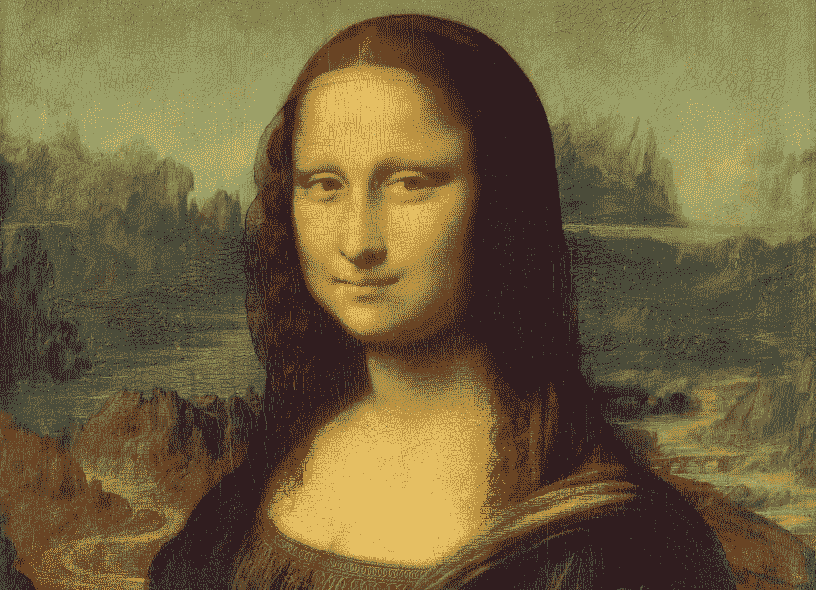

[自动驾驶汽车如何阅读路牌](https://www.wired.com/story/the-know-it-alls-how-do-self-driving-cars-see/)？脸书如何在图片中自动标记你？一台电脑如何实现[“皮肤科医生级别”的皮肤病分类](https://www.nature.com/articles/nature21056)？

在所有这些应用中，计算机必须“看到”世界:它接收电磁辐射的数字表示(例如照片)，并计算出该辐射意味着什么。

计算机视觉是一个广泛的领域，它结合了人工智能、工程、信号处理和其他技术，使计算机能够“看”卷积神经网络(“CNN”)是一种计算机视觉模型。

在过去的几年里，由于在许多有用的任务上的出色表现，CNN 的受欢迎程度激增。CNN 用于第一段中描述的所有计算机视觉应用，从照片的标记方面到医学图像解释。这篇文章将概述 CNN 如何实现许多令人兴奋的现代计算机视觉应用。

**背景**

*   [卷积神经网络简史](https://glassboxmedicine.com/2019/04/13/a-short-history-of-convolutional-neural-networks/)
*   [神经网络简介](https://glassboxmedicine.com/2019/01/17/introduction-to-neural-networks/)

**CNN 输入:图片在电脑中是如何表现的**

对于计算机视觉应用，CNN 的输入是图像或视频。(CNN 也可以用在文本上，但是我们将把它留到另一篇文章中。)

在计算机中，图像被表示为像素值的网格——即正整数的网格。这里有一个简单的例子，像素颜色“白色”用 0 表示，黄色用 2 表示，黑色用 9 表示。(为了便于可视化，颜色仍然显示在“图片表示”侧，即使在计算机中只保存数字):

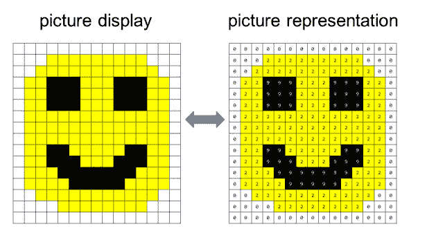

实际上，彩色图像是用三个数字网格相互叠加来表示的:一个网格代表红色，一个网格代表绿色，一个网格代表蓝色。每个网格的元素使用 0 到 255 之间的数字指定每个像素的红色、绿色或蓝色的强度。关于如何表现彩色图像的更多细节，参见[RGB 颜色模型](https://en.wikipedia.org/wiki/RGB_color_model)。

在这篇文章的剩余部分，我们将使用上面显示的简化的笑脸示例。

**CNN 输出**

CNN 的输出取决于任务。以下是针对各种分类任务的 CNN 输入和输出示例:

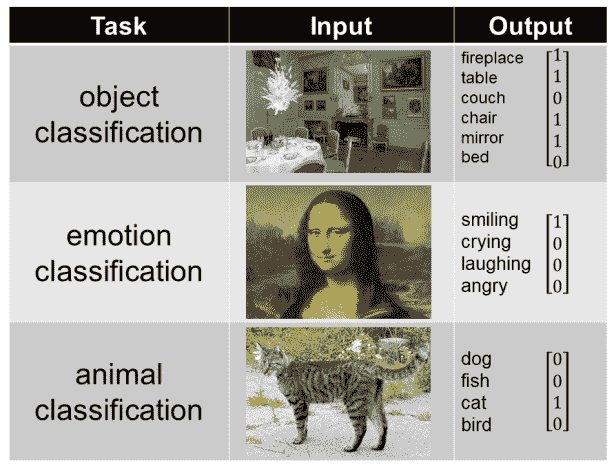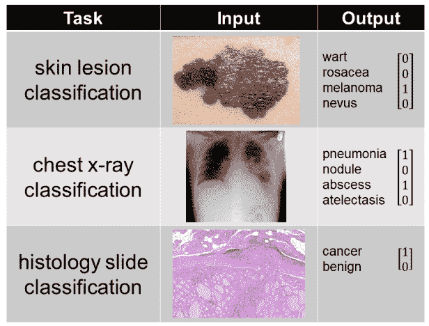

图片来源:[蓝色餐厅](https://commons.wikimedia.org/wiki/File:Blue_Dining_Room_at_Waddesdon_Manor.jpg)，[蒙娜丽莎](https://upload.wikimedia.org/wikipedia/commons/e/ec/Mona_Lisa%2C_by_Leonardo_da_Vinci%2C_from_C2RMF_retouched.jpg)，[猫咪](https://en.wikipedia.org/wiki/List_of_domesticated_animals#/media/File:Jammlich_crop.jpg)，[黑色素瘤](https://en.wikipedia.org/wiki/Melanoma#/media/File:Melanoma.jpg)，[胸片](https://commons.wikimedia.org/wiki/File:XR_chest_-_pneumonia_with_abscess_and_caverns_-_d0.jpg)，[滤泡状甲状腺癌](https://en.wikipedia.org/wiki/Follicular_thyroid_cancer#/media/File:Follicular_thyroid_carcinoma_2_--_low_mag.jpg)

当针对任何任务训练 CNN 时，需要许多训练示例。例如，如果您要训练 CNN 进行动物分类，您将需要一个由数千张动物图片组成的数据集，其中每张图片都与一个二进制向量配对，指示哪些动物出现在该图片中。有关训练和测试神经网络的更多信息，请参见本文。

**大意**

在 CNN 中，不同的“过滤器”(数字的小网格)滑过整个图像，计算卷积运算。不同数量的不同过滤器将检测图像的不同方面，如水平与垂直边缘。CNN 中使用许多不同的过滤器来识别图像的许多不同方面。

此动画显示了一个 2 x 2 滤镜滑过笑脸图像的顶部:

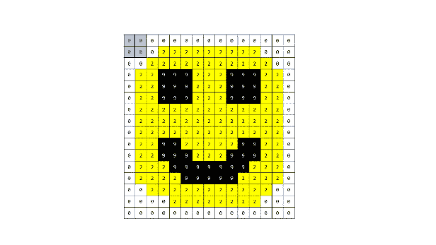

**CNN 的部分内容**

像前馈神经网络一样，CNN 由“层”组成

CNN 中的单个层包括三种计算:

*   **卷积**:这是 CNN 的心脏。卷积运算只使用加法和乘法。卷积滤波器扫描图像，执行卷积运算。
*   **非线性**:这是一个应用于卷积滤波器输出的等式。非线性允许 CNN 学习输入图像和输出类之间更复杂的关系(曲线而不是直线)。
*   **汇集**:这通常是“最大汇集”，即从一小袋数字中选择最大的数字。池化减少了表示的大小，从而减少了所需的计算量，使 CNN 更有效。

这三种计算——卷积、非线性和汇集——用于构建 CNN 模型的“卷积”部分。仅使用这些操作来获得最终预测的 CNN 被称为“完全卷积网络”这与 CNN 形成对比，CNN 在卷积部分之后使用一些全连接层(全连接层是[前馈神经网络](https://glassboxmedicine.com/2019/01/17/introduction-to-neural-networks/)的构建模块)。)

**什么是“博学”**

CNN 是一种机器学习算法。CNN 到底在学什么？

它学习在卷积滤波器中使用什么值，以便预测所需的输出。包含不同值的过滤器检测图像的不同特征。我们不想告诉模型它需要寻找什么特征来确定图片中是否有猫；该模型自己学习在每个过滤器中选择什么值，以便找到猫。

如果在末端有完全连接的层，CNN 也将学习在完全连接的层中使用什么数字。

**卷积滤波器**

CNN 过滤器是一个正方形的数字网格。过滤器的大小是在构建 CNN 时指定的。一些常用的过滤器大小为 2 x 2、3 x 3 和 5 x 5，但它们可以是您选择的任何大小。

当 CNN 在任何训练发生之前被初始化时，滤波器的所有值被设置为随机数。通过训练过程，CNN 调整滤波器中的值，以便滤波器检测图像的有意义的特征。以下是一些随机初始化的不同大小的卷积滤波器示例:

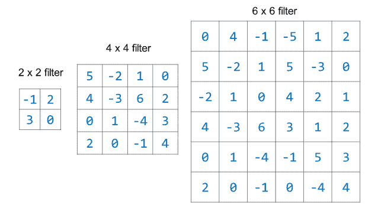

注意，在实践中，为随机初始化选择的数字会更小，并且它们不会都是整数(例如，随机初始化的过滤器值可能是-0.045、0.234、-1.10 等)。)

**卷积运算**

卷积是这样工作的。让我们取一小块笑脸图像，并对其应用卷积，使用值为(1、2、3 和-1)的 2 x 2 过滤器:

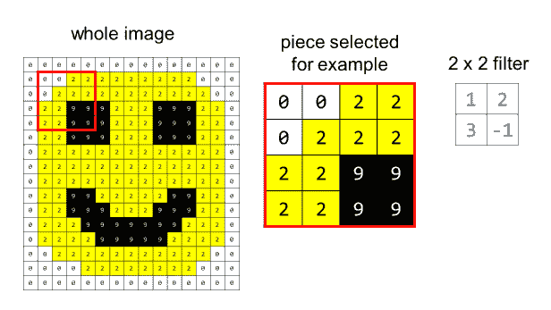

示例的设置:

*   我们正在使用的过滤器显示在左侧，以供参考，其值以蓝色字体显示。
*   与过滤器进行卷积的图像的 2 x 2 部分的值以红色突出显示。
*   中间的计算显示了卷积运算，我们将滤镜的元素与图片的元素进行匹配，将相应的数字相乘，然后求和得到卷积输出。

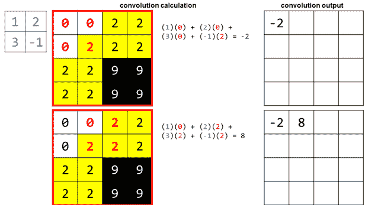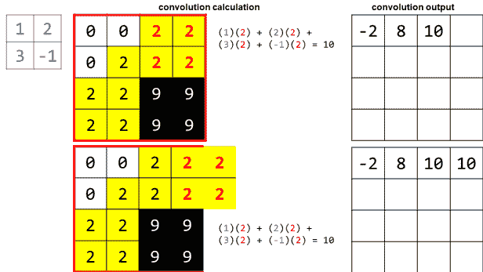

在最后一部分，你可以看到，为了得到最后的卷积值，过滤器滑出了我们的原始区域。我展示这一点是因为在实践中我们将卷积应用于整个图像，所以在我们为了示例的目的而选择聚焦的小区域之外仍然有真实的像素。然而，将图像作为一个整体来考虑，我们最终会用我们的过滤器达到一个“真正的边缘”,我们将不得不停止。这意味着我们卷积的输出会比原始图像稍小。

这是红色区域和我们选择的滤波器的卷积输出:

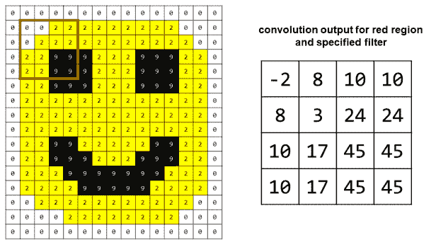

**非线性**

一旦我们完成了卷积，我们应用一个“非线性”这是一个非线性方程，它将允许 CNN 从整体上学习更复杂的模式。一种流行的非线性是 ReLU，或“[整流线性单元](https://en.wikipedia.org/wiki/Rectifier_(neural_networks))这听起来很奇怪，但很简单:你用一个零代替每个负值。

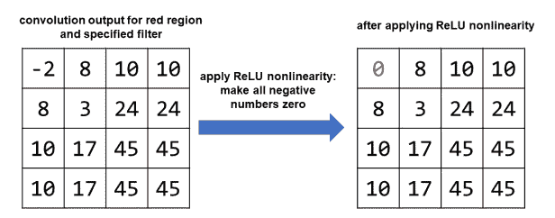

**统筹**

最后一步是汇集。这一步会缩小表示的大小。通常，我们选择与过滤器相同维度的池窗口。我们选择了一个 2 x 2 的过滤器，所以我们选择了一个 2 x 2 的池窗口。

这里，我们将执行“最大池化”，在每个池化窗口中选择最高值。

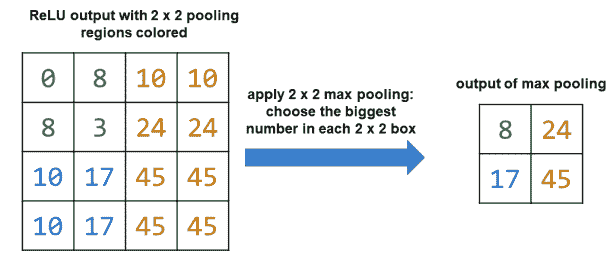

也可以执行其他类型的池，比如平均池，我们取池窗口中所有值的平均值。池是有用的，因为它减少了表示的大小，从而减少了整体所需的计算量。

**在一个卷积层中有许多滤波器**

在上面的例子中，我们应用了卷积、非线性和池化，从 4 x 4 的像素平方变为 2 x 2 的表示，只关注单个滤波器。然而，实际上，一个卷积层使用许多不同的滤波器，所有滤波器大小相同，但值不同。

假设在第一个卷积层中，我们应用了 32 个不同的滤波器，每个滤波器的大小为 2 x 2。那么整个层的总输出大小是 2×2×32。每个滤镜检测图像的不同方面，因为每个滤镜包含不同的数字。

**一个 CNN 有很多层**

一旦我们有了 2 x 2 x 32 的表示，我们就不会停止。相反，我们可以进行另一轮卷积、非线性和合并，这一次将运算应用于 2 x 2 x 32 表示，而不是原始图像。第二轮是第二个“卷积层”现代 CNN 可能有 8 层或 99 层，或者设计者选择的任何层数。

具有许多层的 CNN 背后的关键思想是，较低层(更接近输入图像)的过滤器将学习简单的特征，如边缘在哪里，而较高层(更抽象)的过滤器将学习复杂的特征，如照片中的人脸或胸部 x 光片上的肺炎。

**可视化卷积滤波器**

有不同的方式来形象化 CNN 用不同的滤镜看到的东西。[本文图 1](http://cs231n.github.io/understanding-cnn/)展示了一家名为 AlexNet 的 CNN 的第一层滤镜在看一张猫的图片时是如何点亮的。[这篇文章](https://jacobgil.github.io/deeplearning/filter-visualizations)和[这篇文章](https://blog.keras.io/how-convolutional-neural-networks-see-the-world.html)包含额外的过滤器可视化。Jason Yosinski 的视频[“深度可视化工具箱”绝对值得观看，以便更好地理解 CNN 如何将低层的简单特征(如边缘)与高层的过滤器结合起来检测复杂特征(如人脸或书籍)。](https://www.youtube.com/watch?v=AgkfIQ4IGaM)

**结论**

CNN 是理解图像的一个强有力的框架，并且涉及许多层上简单操作的重复应用。它们在工业和学术界广泛使用，并已经开始影响依赖图像的医学领域，包括放射学、皮肤病学和病理学。

**特色图片**

特色图片是列奥纳多·达芬奇的《蒙娜丽莎》，我借用它作为“情感分类”的例子(具有讽刺意味的是，因为人们对《蒙娜丽莎》表达了什么样的情感有不同意见，也因为我在车里一直在听[莱纳德·达芬奇的传记](https://www.amazon.com/Leonardo-Vinci-Walter-Isaacson/dp/1501139150)。)以下是一些关于《蒙娜丽莎》的有趣事实:

*   蒙娜丽莎曾经有眉毛和睫毛，但很可能是在馆长清洗蒙娜丽莎的眼睛时被意外移除了。
*   艾尔沃斯蒙娜丽莎被认为是达芬奇蒙娜丽莎的早期版本，描绘了同样的主题。这是一幅比著名的《蒙娜丽莎》更宽的画，画的两边都有柱子。
*   《蒙娜丽莎》目前的色调是黄褐色。然而，各种研究表明，《蒙娜丽莎》曾经色彩更鲜艳，有明亮的红色和蓝色。她也可能[腿上有一件毛皮大衣](http://www.lumiere-technology.com/Pages/News/news3.htm)。

**附加资源**

在过去的几年里，我整理了一份与 CNN 相关的特别有用的资源清单。他们来了！

*   [“卷积神经网络(CNN):图解说明”](https://blog.xrds.acm.org/2016/06/convolutional-neural-networks-cnns-illustrated-explanation/)是计算机械协会(ACM)的一篇优秀博文，提供了 CNN 设计和实现的细节。
*   [“理解卷积神经网络的初学者指南”](https://adeshpande3.github.io/A-Beginner%27s-Guide-To-Understanding-Convolutional-Neural-Networks/)是另一个很棒的帖子，特别是用鼠标的图画来解释 CNN 过滤器如何工作的部分。
*   [卷积神经网络(CNN/conv nets)](http://cs231n.github.io/convolutional-networks/):本文来自斯坦福的一门课程，CS 231n。
*   [vdumoulin/Github 上的 conv 算术](https://github.com/vdumoulin/conv_arithmetic)包含了令人惊叹的动画，展示了不同种类的卷积滤波器如何应用于图像。它包括一些“花式卷积”技术，如转置卷积和扩张卷积。有关扩张卷积的更多信息，请查看[“通过交互代码了解 Numpy 和 Tensorflow 中的示例了解 2D 扩张卷积运算”](/understanding-2d-dilated-convolution-operation-with-examples-in-numpy-and-tensorflow-with-d376b3972b25)
*   [亚伦·c·库维尔、伊恩·古德菲勒和约舒阿·本吉奥合著的深度学习书籍](https://www.deeplearningbook.org/contents/convnets.html)的第 9 章提供了对 CNN 的更技术性的讨论。
*   [Hvass-Labs/TensorFlow-Tutorials/02 _ convolution _ Neural _ network . ipynb](https://github.com/Hvass-Labs/TensorFlow-Tutorials/blob/master/02_Convolutional_Neural_Network.ipynb)是一个 Python 笔记本，带有 CNN 的 tensor flow 代码，解决了 MNIST 手写数字分类任务。
*   本文[On Deep Learning for Medical Image Analysis(JAMA Guide to Statistics and Methods，2018)](https://jamanetwork.com/journals/jama/article-abstract/2702856) 是为医疗专业人士撰写的 CNN 综述。它还包含一个伟大的 CNN 的视频解释。这篇文章在付费墙后面，所以如果你在大学，你必须登录到你大学的图书馆资源才能访问它。

*原载于 2019 年 5 月 5 日*[*【http://glassboxmedicine.com*](https://glassboxmedicine.com/2019/05/05/how-computers-see-intro-to-convolutional-neural-networks/)*。*