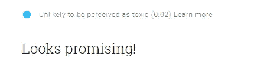
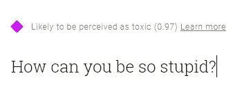

# 对话式人工智能如何改善社交讨论！

> 原文：<https://towardsdatascience.com/how-conversational-ai-is-improving-social-discussions-9c8dd2b5122b?source=collection_archive---------43----------------------->

Photo by [William Iven](https://unsplash.com/photos/DfMMzzi3rmg?utm_source=unsplash&utm_medium=referral&utm_content=creditCopyText) on [Unsplash](https://unsplash.com/search/photos/facebook?utm_source=unsplash&utm_medium=referral&utm_content=creditCopyText)

在脸书、推特、博客和 WhatsApp 的世界里，你永远不知道什么会出错。你甚至不知道你分享的内容是对还是错。但你需要知道的是，每个分享的帖子都在产生影响——积极的或消极的。在某些国家，一些病毒内容的影响可能是毁灭性的。

考虑到所有这些现在或未来的挑战，这项研究工作由 [Jigsaw](https://jigsaw.google.com/) 和谷歌反滥用技术团队发起。许多有趣的项目正在进行中—

## [对话式人工智能](https://conversationai.github.io/)

> Conversation AI 是一个合作研究项目，旨在探索将 ML 作为更好的在线讨论工具。

在这个项目中，研究人员一直在试图解决这样的问题—

*   机器学习方法如何帮助在线对话？
*   机器学习可以理解对话的哪些方面？
*   使用机器学习辅助在线对话的风险和挑战是什么？

该团队建立了一个名为**“透视 API”**的 API，可以实时分析某些内容的“毒性”。它也可以给内容制作者一个更好的视角(有人发表评论)，警告他们关于毒性。开发正在进行中，可以根据要求进行预览。

## 我在哪里可以读到更多这方面的信息？

你可以在[https://www.perspectiveapi.com/#/](https://www.perspectiveapi.com/#/)和[https://conversationai.github.io/](https://conversationai.github.io/)上阅读更多关于对话式人工智能的内容

Jigsaw 有一个博客也谈到了这个问题——[https://medium.com/the-false-positive](https://medium.com/the-false-positive)

## 这些都可以用在哪里？

该 API 有许多潜在的用例，其中一些将在下一页中提到—[https://github . com/conversationai/perspective API/wiki/perspective-hacks](https://github.com/conversationai/perspectiveapi/wiki/perspective-hacks)

## 还有谁参与了这件事？

正如网站上提到的，有来自**维基百科**、**纽约时报**、**《经济学家》**和**《卫报》**的团队。

## 我如何尝试这个？

你可以从[https://www.perspectiveapi.com/#/](https://www.perspectiveapi.com/#/)申请 API

## 你能给我看一些样品吗？

是的，这是一些样品

Experiment -1

还有一些，

Experiment -2

希望这一发展顺利，我们应该看到这些正在实施，以避免任何后果！

总的来说，这些努力是值得称赞和赞赏的。

# 嘿，如果你喜欢这个故事，看看[中级会员](https://deshpandetanmay.medium.com/membership)！只要 5 美元/月！

*你的会员费直接支持我和你阅读的其他作家。你也可以在媒体上看到所有的故事。*

# [现在就成为中等会员吧！](https://deshpandetanmay.medium.com/membership)