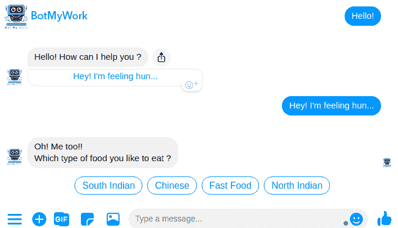
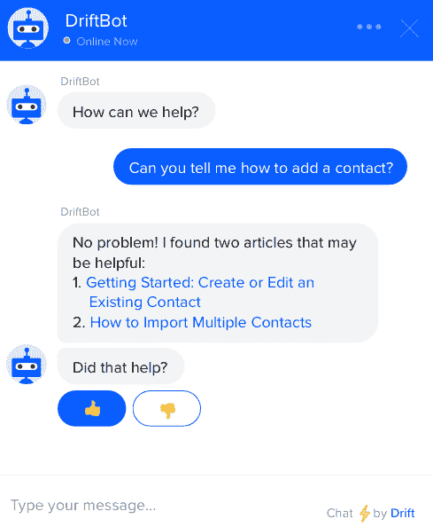
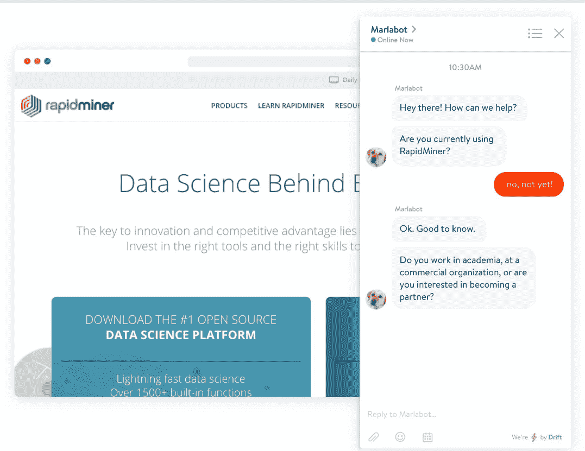
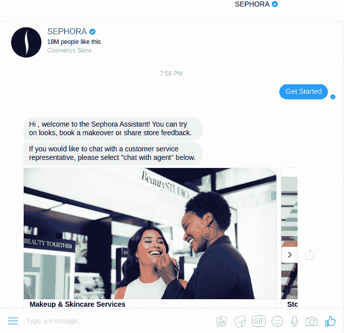
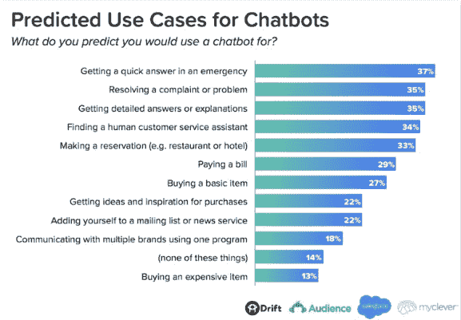
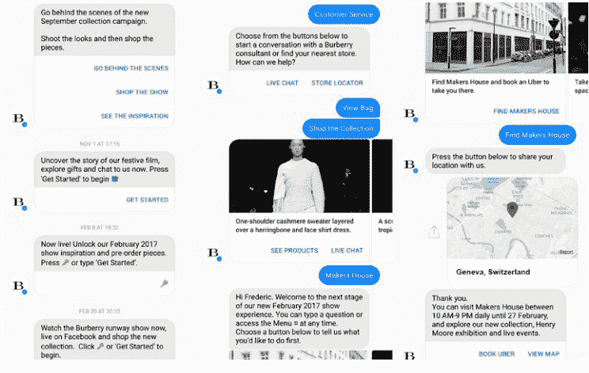
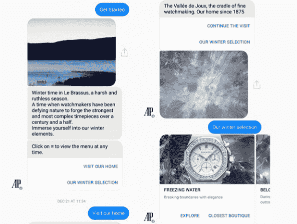
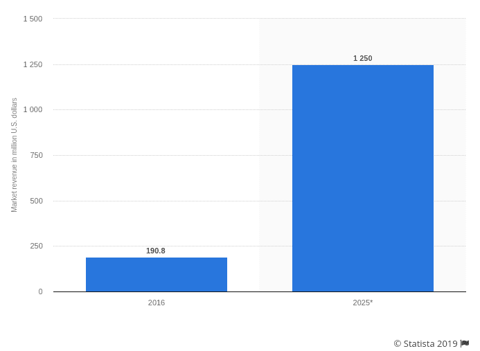

# 对话聊天机器人营销如何成为电子商务的未来

> 原文：<https://towardsdatascience.com/how-conversational-chatbots-marketing-is-the-future-of-ecommerce-6743268caa11?source=collection_archive---------13----------------------->

## 对话聊天机器人营销如何成为电子商务的未来

如果你最近没有生活在岩石下，那么你一定熟悉最新的营销趋势- **聊天机器人**。他们无处不在。 [**品牌正在使用聊天机器人完成几乎每一项可能的任务**](/how-can-you-use-chatbots-to-help-your-business-8c7f56577504) 在客户服务、更好的销售和营销、有效的团队沟通等方面。结果是富有成效的，可以肯定地说，机器人将会继续存在。

来自不同行业的不同投资者对聊天机器人的潜力充满信心，因此他们全心全意地为我们的机器人朋友的成长和发展做出贡献。随着技术进步推动增长，bot 技术确实取得了长足的进步。从简单的基于菜单/按钮的聊天机器人到上下文相关的人工智能聊天机器人，我们有丰富的选项可供选择。

在这篇文章的最后，我会让你了解聊天机器人的基本知识和它们的工作流程，聊天机器人在电子商务中的重要性，以及它们如何塑造营销的未来。

# 聊天机器人:基础知识

虽然我们经常使用聊天机器人并与之互动，但我们可能不知道它的基本术语和工作原理。让我们澄清一下聊天机器人的流言蜚语。

什么是聊天机器人？

*聊天机器人是一种小型计算机程序，用于模拟人类对话的方式，并自动与真人互动，以帮助他们解决问题并完成任务。*

聊天机器人营销可能在过去几年里蓬勃发展，但机器人已经存在了一段时间。这个概念可以追溯到 1950 年，当时艾伦·图灵发表了他关于人工智能的开创性论文**计算机器和智能**。这个概念的发展和进步导致了 ELIZA，一个由 Joseph Weizenbaum 在 1966 年设计的简单程序。从那以后，聊天机器人技术的发展只看到了上升，并以其在改善销售和营销方面的潜力让我们感到惊讶。

*什么是聊天机器人脚本？*

*聊天机器人脚本可以被定义为预先计划好的对话消息，机器人对用户的查询做出响应。根据用户的选择和意图，机器人将遵循特定的对话流程。流中的所有响应组合起来组成脚本。*

聊天机器人脚本对对话至关重要。聊天机器人的脚本取决于商业目标和购买者的旅程。编写聊天机器人脚本时，需要考虑以下几点:

> **专注于你的目标
> 保持简洁明了
> 表达清楚
> 自然而不机械
> 改变你的回答**

您的聊天机器人脚本和响应还取决于您正在实现的聊天机器人的类型，这将带我们进入下一部分…

# 聊天机器人:类型

认为所有聊天机器人的工作流程和处理过程都相似是不正确的。由于对机器人的深入和广泛的研究，我们现在有许多聊天机器人类型可供选择。一些业务任务可以由基本的机器人轻松完成，而一些则需要高级机器人。

让我们来看看市场上有哪些不同类型的机器人:

# 基于按钮/菜单的聊天机器人

顾名思义，这些聊天机器人为用户提供了多个菜单或按钮供选择。根据用户选择的按钮，机器人会列出下一组按钮选项供用户选择。这形成了聊天机器人响应的多级分层结构。

[**来源**](https://botmywork.com/chatbot-builder/)

这些是最广泛使用的聊天机器人，因为它们简单且不复杂。这些工具适合回答售前咨询和多个常见问题，并引导用户浏览您的在线商店或网站。当涉及到包含许多变量的复杂方程时，这些就变得无效了。

# 基于关键词的聊天机器人

这种聊天机器人使用人工智能(AI)来挑选和捕捉用户查询中的关键词。使用和处理这些关键字，机器人回答客户的查询。它的工作就像一些过时的搜索引擎，充分利用输入的关键字，并相应地回复。

[**来源**](https://www.drift.com/chatbots/)

这样做的好处是，机器人只会回答预先加载的内容，不会跑题。它们的局限性和它的优势是有联系的。这些将无法捕捉拼写错误，是高度相关的。

# 自然语言处理聊天机器人

这些都是最先进的，使用机器学习和人工智能为用户提供最佳体验。对于非技术人员来说，对话式人工智能聊天机器人的架构有点复杂，但它提供了它所承诺的东西。记住用户的偏好和特定的用户对话，随着时间的推移随机应变是他们的亮点。自然语言处理聊天机器人本质上是高度上下文相关的，采用以数据为中心的方法与用户进行交互。

他们甚至理解并考虑拼写错误的用户查询，以提供出色的用户体验。

[**来源**](https://rapidminer.com/)

在上面的例子中，你可能会注意到机器人在提问、初始化对话和继续流程方面相当聪明。

# 聊天机器人变革电子商务的不同方式

理解聊天机器人并没有看起来那么难 。它们易于与其他应用程序集成，这使它们成为不同行业的首选。在聊天机器人的众多使用案例和相关行业中，有一个明显的商业领域正在发生革命性的变化，那就是电子商务。世界各地的网店店主认为聊天机器人是解决他们共同问题的终极方案。

让我们来看看机器人是如何为店主和顾客改善电子商务游戏的:

# 更好的用户体验

在你的电子商务计划中加入对话机器人的最大优势可能是简化用户体验，并提供值得记住的独特客户体验。

我们举个例子来理解这一点。

[**来源**](https://www.messenger.com/t/sephora)

作为顶级美容产品品牌之一，**丝芙兰**发布了其个人助理机器人，集成了 Kik 和 Facebook Messenger 等即时通讯应用。他们的助手的突出特点是，它允许用户尝试该品牌的新外观和美容产品。使用者可以清楚地知道一种新的口红或睫毛膏会给他们的面部外观和整体形象带来什么样的效果。用户提供他们的图像，剩下的由机器人负责。

这让顾客免去了去实体店试戴产品的麻烦。虽然机器人模拟不能取代自然的外观，但它无疑将用户体验带到了一个新的高度。

与丝芙兰类似，有许多品牌正在使用聊天机器人来增强在线用户体验，并使他们的在线商务变得更好。

# 改善客户服务

*“只赚钱的生意是糟糕的生意”——亨利·福特*

我们都明白，提供令人惊叹的客户支持是所有企业的头等大事。没有顾客就没有生意，品牌努力实现百分之一的顾客满意率。

聊天机器人在帮助客户方面找到了它们最重要的用例。事实上，许多公司将机器人纳入他们的商业战略，仅仅是为了这个唯一的目的。

[**来源**](https://www.drift.com/wp-content/uploads/2018/01/2018-state-of-chatbots-report.pdf)

客户服务中最大的挑战之一是为我们的客户提供全天候服务。机器人永远解决了这个问题。

考虑一个公司和支持团队，他们可以在一周的任何一天的任何时间为您服务！

许多人都像我们的支持代表一样，在典型的工作日朝九晚五的工作时间从事工作。在深夜或周末联系支持人员的想法从未有过，有了聊天机器人为我们服务，我们就有了巨大的竞争优势。

这无疑会给用户留下印象并建立信任。他们被确保有好的伙伴，并传播正面的口碑。

# 数据驱动的产品推荐

语音搜索智能设备和人工智能的兴起已经超出了全球营销人员和客户的预期。越来越多的人选择亚马逊 Echo、谷歌 Home 等智能音箱。人工智能和语音搜索等技术的结合正在改变人们在线购物的方式。

这方面的一个进步是将聊天机器人整合到家用设备和电器中，这已经在我们周围发生了。LG 的 SmartThinQ 家庭自动化中心就是一个完美的例子。它与亚马逊 Alexa [**的集成将让你对你的家用电器**](https://www.usatoday.com/story/tech/news/2016/09/02/amazons-alexa-now-works-lg-smart-home-tech/89783856/) 有很大的控制权。例如，它会自动估计您洗衣时使用的洗涤剂数量，并在需要时自动重新订购。

当技术彼此重合时，就会有无穷无尽的用例与可能性。对话机器人和电子商务也是如此。

# 自动化销售线索生成和确认

对于电子商务企业来说，中型到大型库存非常常见，客户有时会迷失在寻找所需商品的过程中。聊天机器人可以成为您的解决方案，轻松引导客户找到他们想要的东西，让他们的生活更轻松。

聊天机器人的高可扩展性使它们能够发起与网站用户的对话，并隔离感兴趣的用户。当我们将自然语言处理和人工智能添加到机器人的工作流程中时，它们实际上比我们常规的实时代理在线索生成方面表现得更好。

随着时间和技术的顺利发展，一些聊天机器人特别针对销售支持。随着时间的推移，这些系统会收集和存储客户信息，并自动将信息传输给销售团队以达成交易。

[**聊天机器人引导一代**](https://botmywork.com/blog/chatbot-for-lead-generation-strategies/) 慢慢被证明是营销人员最喜欢的聊天机器人应用，因为它为全球企业带来了大量的引导。

# 客户数据的宝库

尽管这一切都归结于使用数据来改善消费者互动和销售，但这是聊天机器人的最大用例之一。我们倾向于在交谈时分享大量信息，而不管对方是人还是机器人。对话式营销具有这种独特的优势，即学习和利用消费者的习惯以取得良好的效果。

聊天机器人存储了大量消费者数据，如过去的购买历史和一段时间内的购买习惯。下一次同一顾客访问商店时，这些数据被用来提供无缝的用户体验，并更容易地转换他们。

这些丰富的消费者数据也可以用来向这些客户做广告。了解客户的习惯并跟踪他们的购买历史就像是对未来有所了解。你可以在正确的时间向他们展示正确的广告，这将带来更好的转化率和销售额。

# 奖励客户忠诚度

企业在客户忠诚度项目上花费了大量的资金来奖励他们的忠诚客户，并把他们转化为品牌拥护者。这种做法没有错，但聊天机器人也发现了它们在奖励客户忠诚度方面的应用之一。

领先的时尚品牌正在树立使用对话聊天机器人与精通技术的客户互动的典范。英国奢侈品牌博柏利允许它的顾客和粉丝使用它的机器人做很多事情。

[**来源**](https://ch.burberry.com/)

从查看时装秀的“幕后”外观到直接从应用程序购买服装，从向之前与机器人互动的用户发送推送通知到提供与公司代理的实时聊天，博柏利通过其先进的聊天机器人真正提高了标准。

另一个尝试聊天机器人增强用户体验的领先品牌是奢侈手表公司**爱彼**。

[**来源**](https://www.audemarspiguet.com/en/)

该公司是首批使用机器人的手表公司之一，最近推出了聊天机器人，允许用户浏览最佳手表系列，包括最受欢迎的手表。顾客可以评估一只手表的所有功能，或者找到并参观最近的商店，在现实生活中试用手表。

聊天机器人是一种独特而有效的方式，可以联系到老客户和忠诚的客户，并让他们感到受到重视。

# 完成交易

虽然许多企业仍然喜欢一个活生生的代理人或代表来完成销售，但这种情况正在逐渐改变。机器人有能力直接销售并为用户下订单，而不需要一些人类的接触。

早些时候，一些人曾批评机器人无法完成订单和销售。如今，风水轮流转。越来越多的人喜欢聊天机器人，因为他们知道他们将能够通过机器人完成购买。

一种被称为**销售聊天机器人**的特定类型的机器人正在被公司实施，以改善他们的销售漏斗。这些还提供了对第一次尝试没有转换的客户进行跟进的选项。

# 聊天机器人:统计

聊天机器人，甚至是电子商务聊天机器人，已经出现了。这不是什么新鲜事。聊天机器人的使用呈指数级增长，而且似乎不会很快放缓。

**2016 年和 2025 年全球聊天机器人市场的规模(百万美元)**

[**来源**](https://www.statista.com/statistics/656596/worldwide-chatbot-market/)

*   关于电子商务，34%的受访者表示，他们更愿意通过聊天机器人或虚拟助理[**——聊天机器人杂志**](https://chatbotsmagazine.com/chatbot-report-2018-global-trends-and-analysis-4d8bbe4d924b)
*   实时聊天软件作为客户与企业互动的一种方式，有 73%的满意度——G2 的 [**脸书聊天机器人指南**](https://learn.g2.com/facebook-chatbots)
*   聊天机器人可以节省高达 30%的客户支持成本— [**Invespcro**](https://www.invespcro.com/blog/chatbots-customer-service/)
*   21%的消费者认为聊天机器人是联系企业最简单的方式——[**ubi send**](https://blog.ubisend.com/optimise-chatbots/chatbot-statistics)

上述统计数据足以证明聊天机器人在包括电子商务在内的不同商业行业中的统治地位。这些还强调了一个事实，即人们如何容易地习惯于对话式商务，以及世界各地精通数字的观众如何接受对话式机器人。

# 结论

我们生活在这样一个数字时代，竞争激烈，顾客的购买决定完全取决于他/她获得的体验。顾客的期望是无限的，品牌每次都越来越难以实现。单靠人力是不可能提供无缝的用户体验的。

*进入:对话聊天机器人*

从一项完全引进的令人生畏的技术，到突破人们的日常日程，聊天机器人已经取得了一些有价值的进展。聊天机器人与其他应用程序集成的便利性以及它们的多种用例使它们被广泛接受。电子商务已经将聊天机器人纳入其核心营销战略。聊天机器人对电子商务网站的登陆页面转换和搜索引擎优化也有影响。

就像这个星球上的任何其他技术一样， [**伴随着我们的 AI 机器人朋友**](/understanding-ai-chatbots-challenges-opportunities-beyond-fb657fa3e0da) 也有挑战和机遇。如果你还没有探索充满希望的对话聊天机器人世界，现在是时候了。如果你是世界上任何地方的网店店主，这就更重要了。

*你对聊天机器人作为营销和商业的未来有什么看法？你已经在使用聊天机器人了吗？为什么不呢？*

请发表你的意见。我在听。