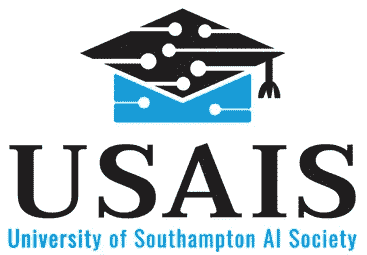
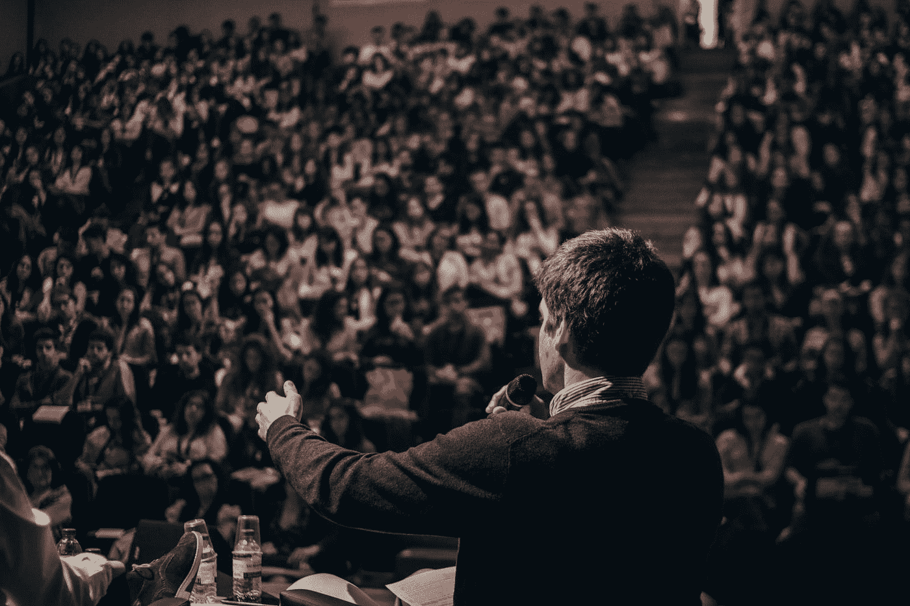

# 创建人工智能学习小组如何提高我的技能并让我找到工作

> 原文：<https://towardsdatascience.com/how-creating-an-ai-study-group-boosted-my-skills-and-got-me-a-job-b231c666a1ae?source=collection_archive---------15----------------------->

这个想法是在人工智能专家亚历杭德罗·绍切多在我大学的一次演讲中出现在我脑海中的。这感觉真的很令人兴奋:有大量的学生对人工智能感兴趣，而在我的大学里没有这样的学习小组。那时我在等什么？

Photo by [Kane Reinholdtsen](https://unsplash.com/@kanereinholdtsen?utm_source=medium&utm_medium=referral) on [Unsplash](https://unsplash.com?utm_source=medium&utm_medium=referral)

这就是创建一个学习小组如何提高我的人工智能知识并帮助我获得机器学习暑期实习的故事的开始。我从来没有怀疑过，它会对我和加入这个团体的同学产生如此大的影响。我不得不投入大量的时间来组织人工智能协会，这让我有时睡眠不足，但这绝对是值得的。这也是我最终获得机器学习工作的主要原因之一。希望这篇文章能启发你创建自己的 AI 学习小组！

我喜欢数据科学的原因是，它吸引了许多对人工智能和数据科学充满热情的志同道合的人。这就是为什么我想在 [Linkedin](http://www.linkedin.com/in/kacperkubara?source=post_page---------------------------) 上与你联系！您也可以通过我的[个人网站](http://www.kacperkubara.com/?source=post_page---------------------------)留下任何反馈和问题😉

## 它是如何开始的

[University of Southampton AI Society](https://www.facebook.com/UniversityofSouthamptonAISociety) logo

就在人工智能演讲结束后，我问了几个学生，他们对创建一个[人工智能社会的想法有什么看法。他们似乎都很感兴趣，所以我决定进一步探讨这个想法。我联系了我的几个朋友来帮助我创建人工智能协会。他们很乐意帮忙，所以与此同时，我们开始准备发布活动。这是一大块要处理的工作，因为我们也在为即将到来的研讨会创建材料。启动活动非常成功:大约 60 名学生参加了我们的第一次活动。在本学期中，我们成功地保持了研讨会的高出席率，我们还聘请了 8 位不同的演讲者来主持研讨会！](https://www.facebook.com/UniversityofSouthamptonAISociety/?)

## 你和他们一起学习

Photo by [Priscilla Du Preez](https://unsplash.com/@priscilladupreez?utm_source=medium&utm_medium=referral) on [Unsplash](https://unsplash.com?utm_source=medium&utm_medium=referral)

就我个人而言，我从我的朋友那里学到了很多新的人工智能概念，我甚至不知道他们的存在。他们向我展示了许多有用的、不太受欢迎的 Python 库，并向我介绍了更多 AI 方面的小众主题。我还看到了许多不同的编码风格，它们帮助我适应更好的编程实践，并教会我如何审查代码。

学习小组的美妙之处在于它带来了一个对某个主题充满热情的社区。让自己负责和他人一起学习新概念和新技术要容易得多。如果你在代码中有 bug 或者你很难理解某个主题，你可以交流你的想法，让自己了解来自行业的最新消息或者互相帮助。我们都同时成为老师和学生。与在大学里的普通讲座相比，研讨会还能让你在会议期间更加投入和专注。通过行动学习更加有效，因为它也测试你的理解能力。

## 同龄人的压力有所帮助

Photo by [Matt Lee](https://unsplash.com/@mattlee?utm_source=medium&utm_medium=referral) on [Unsplash](https://unsplash.com?utm_source=medium&utm_medium=referral)

我在图书馆呆了很多个晚上，为即将到来的研讨会准备代码和幻灯片。这绝对是一项耗时的任务，但我很感激这小小的推动帮助我扩大了知识面。没有不准备材料的选择，因为学生在等待下一次研讨会。

当你致力于某事时，你经常会发现自己要走出舒适区去实现它。它可以采取多种形式:举办研讨会，介绍演讲者或为学习小组编写代码。人们期望你会做到你所承诺的，这可以给你一点“踢屁股”来按时交付。从我的经验来看，这只是一个惊人的个人成长机会。

## 它显示了你的激情

Photo by [Ian Schneider](https://unsplash.com/@goian?utm_source=medium&utm_medium=referral) on [Unsplash](https://unsplash.com?utm_source=medium&utm_medium=referral)

有什么比创建一个学习小组来证明你的热情更好的呢？这表明你在努力扩展你在这个话题上的知识，并证明你可以采取主动。

在上个学期，我注意到在我更新了关于那个学习小组的详细信息后，我开始收到更多的面试邀请。最后，我得到了一家公司的暑期实习机会，面试中的一个主要问题是关于人工智能协会的😅

## 它让你被认可

Photo by [Miguel Henriques](https://unsplash.com/@miguel_photo?utm_source=medium&utm_medium=referral) on [Unsplash](https://unsplash.com?utm_source=medium&utm_medium=referral)

有几次，我发现自己处于这样一种情况:我第一次见到的人已经认识我了，因为我是人工智能协会的主席。他们有时候也会假设我一定是 AI 方面的专家，这是不真实的(我相信你只有完成 P.h.D，或者有了几年的工作经验，才能称自己是 AI 专家)。

领导一个学习小组可以扩大你对同一件事充满热情的人际网络！谁知道它什么时候会变得无价:也许你会找另一份工作，或者你会为你的生意争取第一批客户？

## 如何创建学习小组？

Photo by [Jon Tyson](https://unsplash.com/@jontyson?utm_source=medium&utm_medium=referral) on [Unsplash](https://unsplash.com?utm_source=medium&utm_medium=referral)

一点也不难！问问你的同事、学生或朋友，他们是否想创建一个学习小组。它可能有多种形式:从组织每周一次的非正式会议，到与演讲者或会议一起创造更大的事件。想想你和你的朋友能投入多少时间，找一个你能举办活动的地方。开始时可能会很难，但是请你的朋友帮忙并听取反馈，这将有助于你扩大你的学习小组！

感谢您阅读文章。如果你对创建学习小组的想法感到兴奋，请通过 Linkedin 联系我。我很乐意给你一些建议！