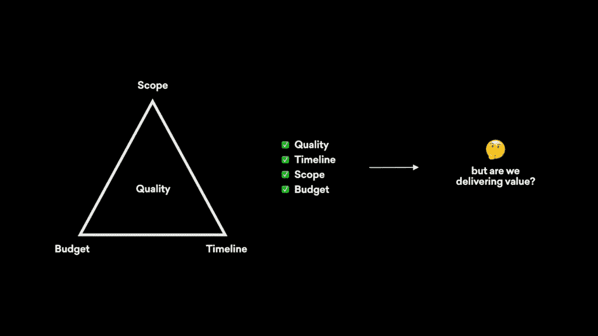

# 数据可能如何破坏您的项目计划，以及为什么这实际上是一件好事

> 原文：<https://towardsdatascience.com/how-data-might-blow-up-your-project-plan-and-why-thats-actually-a-good-thing-e5cf87a2c188?source=collection_archive---------43----------------------->

*YML 高级项目经理詹姆斯·麦卡沃伊*

数据。

这个词让所有项目经理、scrum 大师和项目团队都感到恐惧和兴奋。

我们知道我们想要它，但我们不能 100%确定一旦我们得到了它该做什么。

我们请求、提醒、追踪、测试并最终收到这些宝贵的数据，只是为了提出这些熟悉的问题:

*   我们在项目生命周期的什么地方适应它？
*   我如何使这些数据具有可操作性？
*   谁吃了我办公室冰箱里明明贴着标签的鸡肉沙拉三明治？(我知道是你，杰夫)

虽然回答这些问题是重要的一步，但我们必须首先探究为什么要问这些问题。

# 1.对数据的恐惧

当涉及到数据时，我们必须处理的主要问题是恐惧。

从根本上说，数据的固有性质会迫使我们重新思考我们的方向，否定我们的假设，或者让我们意识到我们正在试图解决错误的问题。

这些结果中的任何一个都会迫使你的项目方向发生重大转变。特别是对于项目经理来说，他们通常不喜欢看到他们的项目计划被冲进厕所，乍一看，数据可能会成为一个问题。

关于数据在项目中的含义以及我们如何减轻潜在的问题，数据确实提出了一个项目管理中常见的问题。事实是，这些问题比开发一个对用户完全无用的产品更容易回答。

正如 [Shayna Stewart](https://www.linkedin.com/in/shaynastewart/) 在她的[文章](https://www.linkedin.com/pulse/people-dont-talk-way-need-consumer-centric-kpis-shayna-stewart/)*中所问的，消费者在我的产品中找到价值了吗？“数据——不管它有多可怕——允许我们在我们的产品可能被消费者接受之前回答这个问题。*

# 2.项目管理生命周期

标准项目管理生命周期通常包括:

启动、计划、执行、绩效监控和结束。

在一个典型的数字项目中，如果我们合并数据，那么它通常在规划阶段。然后，通常在较小的程度上，性能监控阶段，甚至更糟，通常与一个没有历史知识的全新团队。

为了有效地交付以消费者为中心的产品，为我们的用户增加价值，我们需要在整个项目生命周期中整合数据的使用。

这意味着我们需要不断地回顾我们的方向，对照任何学到的见解，以及继续测试来验证我们的假设和我们通过项目做出的决策。

此外，我们在运行项目时所做的考虑将需要重新考虑。

作为项目经理，按时、按预算交付符合所有范围要求的项目是我们根深蒂固的理念。

我们都见过项目管理的限制三角——并且可能见过当其中一个限制受到影响时，项目的整体质量就处于危险之中。

# 3.交付的价值

在三角约束中通常没有考虑的是项目质量的不完整画面:除了这些约束，我们应该考虑价值。

我们都交付过超出预算或晚于计划的项目。所有这些情况都不好玩，但更糟糕的情况是交付消费者认为没有价值的产品。如果我们这样做了，那么它是否超出预算或延迟真的无关紧要，因为它已经是一个失败。

一个合理的论点可能是，价值已经被纳入质量因素，这在某种意义上是正确的。但是大多数情况下，项目领导对质量的关注是基于需求，或者至少是项目纲要。没有必要的数据，这些需求可能是错误的。

在这种情况下，我们如何计算质量只是我们需要考虑的一部分。当我们考虑对客户的总体价值时，我们对质量的定义会积极地改变，这是应该的。

# 但是有希望…

我们上面讨论的大部分内容都围绕着对恐惧和不确定性感到舒适。

我们必须知道和理解，数据提供的信息越多，就越有可能改变我们最好的计划。

此外，我们将数据整合到传统项目管理方法和流程中的越多，我们就越有可能看到这些担忧变成现实。

然而，作为项目领导，我们有办法避免上述潜在的陷阱。如果我们将数据整合到项目管理生命周期的每个阶段，并为这些新信息可能导致的潜在中断做好计划，那么当这种中断发生时，我们就不太可能感到惊讶。

我们知道项目总会有变化，但只要我们不忽略我们可能拥有的所有信息，不管有多可怕，我们都可以提前应对风险，并最大限度地减少最初导致这种恐惧的原因。

训练我们自己去理解改变是好的，颠覆是好的，最终为消费者的生活增加价值是最好的。