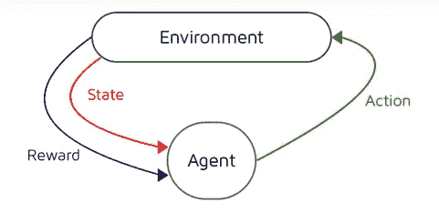
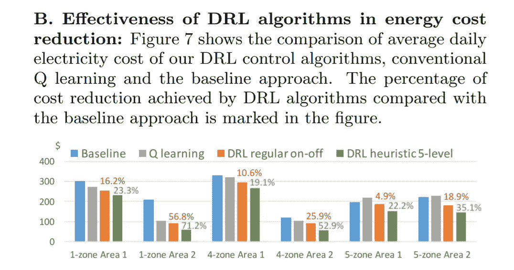
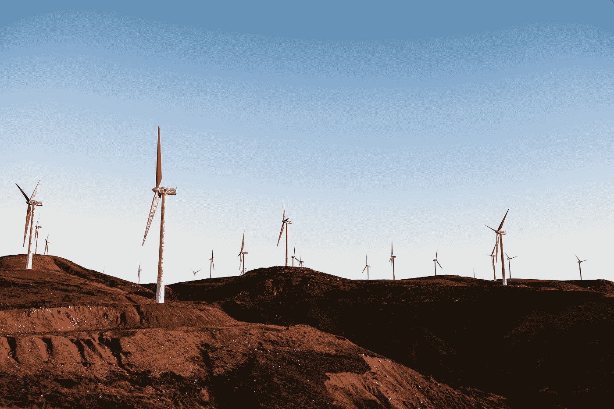

# 数据科学如何帮助解决气候变化

> 原文：<https://towardsdatascience.com/how-data-science-can-help-solve-climate-change-12b28768e77b?source=collection_archive---------9----------------------->

## 数据驱动的解决方案将引领向清洁能源的过渡

Photo by [Bogdan Pasca](https://unsplash.com/@bogdipasca?utm_source=medium&utm_medium=referral) on [Unsplash](https://unsplash.com?utm_source=medium&utm_medium=referral)

> 气候变化是真实的。

尽管许多科学家同意我们已经为时过晚的事实，但是人们才开始意识到这个问题。人民带来了**政治**，政治带来了**金钱**。

这就是为什么在接下来的几年里，能源领域的研究将会受到重大推动，而数据科学将会在这场大战中扮演重要角色。在数据中发现新的模式是为我们渴求能源的世界获得强有力的解决方案的一条清晰的道路。

在这篇文章中，我们将看看一些有问题的案例，在这些案例中，机器学习和数据驱动技术被证明可以提供很好的解决方案，这可能使该领域成为对抗气候变化的**战争中的主要角色之一**。

Photo by [Bob Blob](https://unsplash.com/@bob_blob?utm_source=medium&utm_medium=referral) on [Unsplash](https://unsplash.com?utm_source=medium&utm_medium=referral)

# 对能量的渴望

降低二氧化碳排放量的最简单的解决方案之一是**消耗更少的能源**，这些能源通常是通过燃烧化石燃料**产生的**。

但是从过去几年的趋势来看，电力需求似乎并没有减缓:随着电动汽车的兴起(尽管它们对环境的影响肯定低于化石燃料汽车)，这种日益增长的需求不太可能很快停止。

此外，现在我们倾向于把电池放在任何地方:自行车里，衣服里，甚至鞋子里。而电池**需要**的电力。很多电。因此，减少我们日常生活中需要能量的场合的数量远不是一个简单的解决办法。

终于到了引入**能效**概念的时候了。

Photo by [Vlad Tchompalov](https://unsplash.com/@tchompalov?utm_source=medium&utm_medium=referral) on [Unsplash](https://unsplash.com?utm_source=medium&utm_medium=referral)

# 数据科学创造一个更节能的世界

> 是真的，清洁能源来了。

但不幸的是，100%的能源来自可再生能源的时间并不那么近。我们需要**用有效利用不洁能源的方式来弥合我们向清洁能源过渡的差距。此外，即使在一个理想的绿色社会，确保效率处于最高水平也不是一项无用的任务。**

但是为什么一个数据科学家会对能源效率感兴趣呢？应该是机械、土木工程师、建筑师的工作，不是吗？

嗯，**有**，但是**没有**。

查看**数据**并找出模式可以极大地帮助在每个领域(包括能源效率)找到通常**现成的**解决方案。

Photo by [Stephen Dawson](https://unsplash.com/@srd844?utm_source=medium&utm_medium=referral) on [Unsplash](https://unsplash.com?utm_source=medium&utm_medium=referral)

# 数据中心:为什么它们很重要

让我们来看一个案例:世界各地的**数据中心**使用**地球**产生的 **3%** **能量。太多了！**

这种巨大能量使用的原因是需要**将**保持在某个**温度**，避免**过热**和电子元件故障。因此，如果不使用清洁能源来运营数据中心，就会对二氧化碳排放产生重大影响。让我们不要忘记经营这些地方的成本。

这就是为什么 2016 年 **Deepmind** (谷歌收购的一家人工智能公司)成功地**将谷歌一个数据中心**的**能耗降低了 40%** [(来源)](https://deepmind.com/blog/article/deepmind-ai-reduces-google-data-centre-cooling-bill-40)。把这个告诉任何一个 IT 工程师，你就会**而不是**被**相信**。

Photo by [imgix](https://unsplash.com/@imgix?utm_source=medium&utm_medium=referral) on [Unsplash](https://unsplash.com?utm_source=medium&utm_medium=referral)

令人难以置信的结果是通过将**机器学习算法**应用于一个由**传感器数据**组成的数据集而实现的，这些数据是在该中心多年的运营中获得的。该算法的目标是基于许多**参数**，如温度、功率和冷却设定点，预测**未来 PUE** (功率使用效率，即总建筑能耗与 IT 能耗的比率)。

最终训练出来的预测模型，对整个环境有**【意识】**，能够做出**更聪明的**、非线性的决策，并且能够以一种实质上**更高效的**方式操作数据中心，同时保持温度在可控范围内。

虽然传统的**工程师**拥有制造**单个组件**的专业知识，可能是更高效的冷却风扇，**数据科学家**能够着眼于**全局**，通常会找到更简单、更强大的**解决方案**来解决问题。

# 强化学习:一个更广泛的解决方案

> 为什么止步于数据中心？

我们的**学校、办公室、房子**呢？

众所周知,**供暖**和**制冷**占据了任何建筑的**电费**的很大一块:[2011 年的一项**研究**](https://www.tandfonline.com/doi/abs/10.1080/09613210701325883) 显示，提高建筑效率代表着降低温室气体排放的**最大机会**。

如果我们能找到一种方法**创造一种算法**使 **HVAC** 系统**更加有效**总的来说，二氧化碳排放量将**大大减少**，连同能源账单。最大的障碍是**缺乏获取数据的传感器**和**每个不同建筑的独特性**。

> 强化学习可以解决这个问题。

许多**最近的研究**提出了强化学习(RL，机器学习的一个分支，其中**代理**与**环境**交互，在奖励函数定义的特定**目标**处变得越来越好)作为解决方案:应用这种算法来提高不同建筑的效率显示出令人难以置信的和**有希望的结果**，其中**高达 70%** **(！！！)减少 HVAC 能源使用量**([来源](https://ywang393.expressions.syr.edu/wp-content/uploads/2016/07/Deep-reinforcement-learning-for-HVAC-control-in-smart-buildings.pdf))。

**RL 中不需要**传感器**数据**。

在实际建筑的**计算机模拟**中，一个代理被给予**对加热和冷却的自由控制**，在那里它可以自由探索其决定的后果，并且**学习**如何消耗**更少的能量**同时保持期望的温度。由于安装了简单的智能恒温器，这使得解决方案**灵活**适用于各种建筑、**经济高效**和**易于**实施。

Results from [the paper](https://ywang393.expressions.syr.edu/wp-content/uploads/2016/07/Deep-reinforcement-learning-for-HVAC-control-in-smart-buildings.pdf)

但那是**不是全部**。

向 **100%可再生**能源的过渡伴随着**的缺点，**数据科学可能会再次提供解决方案。

# 电网的不稳定性

**太阳能**和**风能**都是高度**不可预测**的:这就是为什么专门向电网供应这些种类的可再生能源可能会对整个电网的稳定性**产生**负面影响****。此外，我们还必须考虑到街上越来越多的电动汽车，以及它们随之而来的对大量电力的需求，这也是一个问题。

因此，我们可以将一个**“值”**与产生的清洁能源相关联，这与特定时刻电网的**电力需求**相关联。如果该值很高，这意味着将电力输入电网会使电网更加稳定和可靠。

Photo by [Jason Blackeye](https://unsplash.com/@jeisblack?utm_source=medium&utm_medium=referral) on [Unsplash](https://unsplash.com?utm_source=medium&utm_medium=referral)

对于特定的风力发电场或太阳能发电场，有没有办法最大化这个【价值】？

这是 **Deepmind** 在[最近的一项研究](https://deepmind.com/blog/article/machine-learning-can-boost-value-wind-energy)中再次试图回答的问题:研究人员对可用的**天气预报数据**和风电场的**涡轮机数据**应用了**神经网络**来预测 36 小时后的电力输出。然后，经过训练的网络允许**提高所产生的能量的值**(大约 **20%** ，从而在最需要的时候**为电网做出贡献**。

# 该行动了

正如本文所述，一些**数据驱动的解决方案**正在接受测试，以帮助降低温室气体**排放**并引导我们走向完全可再生的未来。而且**现在有更多的**正在被研究。

非常需要这些发现的真实实施:如果你感兴趣，这个领域的机会比以往任何时候都多。

> 现在是时候了。

**数据科学**有能力为这场**战役**出力，而且知道它能做多少，**它绝对应该**。