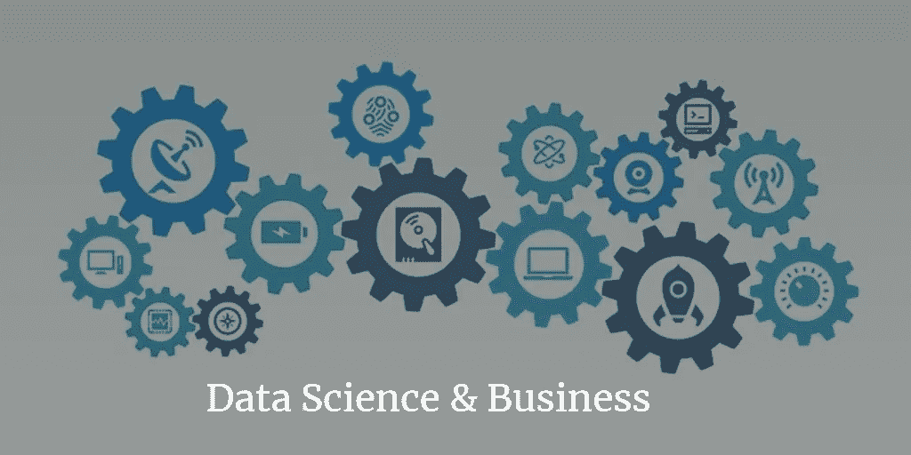

# 数据科学如何帮助您的企业增加收入

> 原文：<https://towardsdatascience.com/how-data-science-helps-to-grow-revenue-to-your-business-4f4b36956cb4?source=collection_archive---------23----------------------->

知识是商业中的终极力量，而数据是创造这种力量所需的燃料。许多报告估计，全球的数据量将上升到 44 万亿千兆字节，使用数据科学来利用这些数据的力量是非常有价值的。

数据科学利用现代科学方法、算法、流程和系统从数据中提取知识，并利用这些数据做出重大决策，这对于任何企业来说都是一项关键的战略实践。

如果我们采取一种基于数字、事实和统计的分析方法，它可以提供一个合理的解决方案，这种解决方案起初可能并不明显。这是因为数据提供了洞察力，使越来越多的企业利用 it 的力量做出基于证据的决策，促进员工培训和了解他们的客户。

在本文中，我们将探讨一些有意义的方式，通过这些方式，您可以投资于数据科学技术或数据科学专家，从而为您的业务增加宝贵的经验。

# 提高决策技能

对公司的每个决策者来说，指尖上有数据是强制性的。如果您不遵循这一策略，那么非结构化数据很有可能会出现问题，这需要高度预测性的分析工具来从中获得深刻的见解。

通过在数据科学的帮助下获得数字和统计数据，您的企业可以创建预测模型来模拟许多可能性。这样，企业就可以了解哪种解决方案最合适，并帮助他们获得准确的结果。此外，通过记录绩效指标并随着时间的推移对其进行分析，您的企业在决策时会变得更加明智和高效。

# 接触潜在受众

随着数据量的不断增长，收集重要数据对于您的客户和企业来说可能是一项实时任务。由于贵公司从客户处收集的每一份数据——无论是来自社交媒体，还是网站访问或电子邮件调查——都包含重要的机密数据，需要对这些数据进行分析，以便更有效地了解您的客户。

借助数据科学，您可以将数据点与从客户处获得的信息相结合，以获得更深入的见解，并更有效地锁定受众。这是指你可以为特定的群体量身定制你的服务和产品。

# 寻找最优秀的人才

招聘可能是最累人的工作之一，但有了数据科学，这个过程会变得更快、更准确。由于社交媒体、公司数据库和招聘网站的存在，人才网站上有了所有的数据点，公司正在研究这些数据点，并利用分析方法来寻找最适合组织的候选人。

挖掘现有的求职者数据表明，要寻找完全符合你公司文化的员工，而不仅仅是看上去不错。如果你收到一堆申请人，并且希望尽快填补这个职位，这一点尤其正确。在数据科学方法的帮助下，你往往会更聪明地工作，而不仅仅是更努力地工作，这可以确保你用准确的匹配来填补组织中的空缺。

# 影响产品/服务的相关性

据说，数据科学方法可以探索过去的见解，与竞争对手进行比较，并分析市场，从而建议何时何地销售你的产品或服务最好。这非常有助于公司理解他们的产品如何帮助他人，并质疑现有的业务流程。

这种通过数据科学进行的持续分析和思考有助于深入了解市场对贵公司产品和服务的反应。当你认真审视你的产品是如何被使用最多的，并允许重新思考你的模式，以确保你提供以客户为中心的解决方案。

# 培训你的员工

让您的员工随时了解最新的更新可能是一项艰巨的任务。在这种情况下，数据科学可以获得员工需要了解的见解，因为从中获得的知识可以用于增加在线知识或文档软件，这些软件包含重要的知识供员工参考。

通过提取我们所有的硬数据，并为员工提供他们可以随时访问的适当统计数据和事实，您可以创建一个聪明的团队，他们可以使用这些见解来推动更多的业务。

# 结束了！

将所有数据科学方法整合到您的业务中可以以不同的方式增加重要的价值，包括决策、招聘、培训、营销等等。数据分析可以帮助您做出明智的决策，让您的组织以明智和战略性的方式进行投资。因此，尽最大努力使用数据科学并发现绩效背后的洞察力是每个企业都应该发现的有价值的强大工具。继续学习！

**作者简介:**

*维卡什·库马尔在 Tatvasoft.com**软件外包公司* [*担任经理。有时，他在管理活动时确实有空闲时间，在此期间，他喜欢写作和探索新的技术趋势和主题。Vikash 还在各大平台上发表了他的署名，并从 2014 年开始写博客。你可以在 Twitter 和 LinkedIn 上关注他。*](https://www.tatvasoft.com)