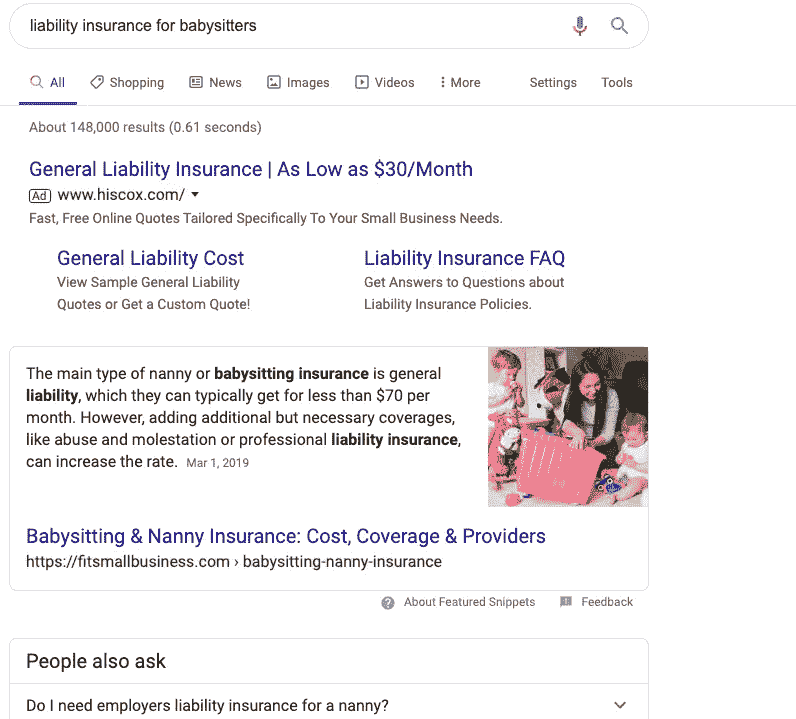
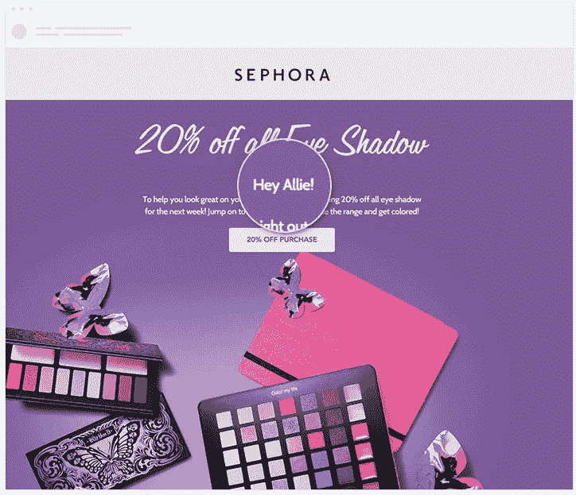
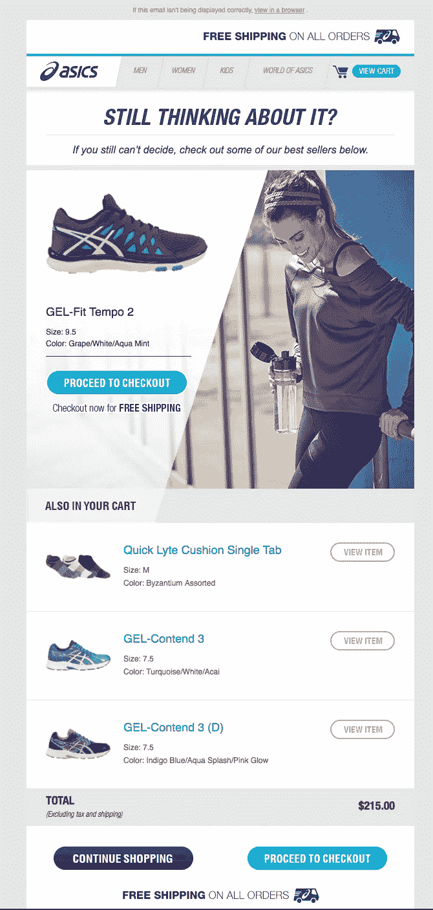
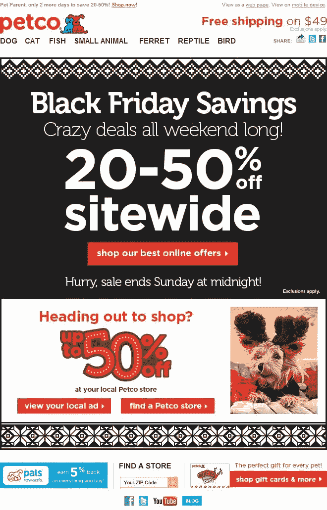

# 用数据科学优化数字营销

> 原文：<https://towardsdatascience.com/how-data-science-is-shaping-digital-marketing-5a149443f90a?source=collection_archive---------7----------------------->

# **什么是数字营销？**

数字营销是利用数字技术，主要是在互联网、手机和任何其他数字媒体上进行的产品或服务营销。作为一名数字营销人员，你的战略是一系列行动，通过精心选择的在线渠道帮助你的公司实现目标。具体的营销渠道包括付费媒体、收入媒体和自有媒体。

在这篇博客中，我想分享我过去在数字营销领域的经验，以及我目前在数据科学领域的经验，以及数字营销可以从数据科学成果中受益的方式。

数据科学让营销人员能够访问通过各种渠道整理的有用数据组，包括有机(网站分析/SEO)、电子邮件营销、社交媒体等。

# **网站流量(SEO 和 SEM)**

有机流量是数字营销的最大渠道之一，并在数据科学和人工智能领域不断增长。有机营销是一种数字方法，包括所有来自谷歌、雅虎和必应等搜索引擎的网站流量。

> “89%的美国互联网用户在购物前会在网上搜索，即使最终购买的是当地的商店”——HubSpot

与付费搜索或 SEM 不同，有机流量(SEO)包括许多因素，这些因素与让您的网站位于搜索引擎结果页面的顶部有关。这些因素是:

*   页面标题(70 个字符以下)
*   元描述(155 个字符以下)
*   H1 和 H2 标题文本(通过描述来分解主要内容)
*   替代文本(每个图像需要一个标题)
*   内容中的关键字(至少一次，粗体)

一个网站从搜索引擎优化(SEO)中获得免费的“有机”流量。这是提高网站流量的质量和数量以及品牌曝光率的做法。当我们在谷歌上搜索“DC 的酒店”时，你会注意到谷歌搜索页面显示了可以点击的 DC 主页。

**SEM** ，或搜索引擎营销，是使用**付费**策略来增加搜索可见性的行为。品牌付费让广告作为搜索结果出现在搜索引擎结果页面上。有了 SEM，品牌付费让广告作为搜索结果出现在搜索引擎结果页面上。

自从谷歌建立通用搜索以来，搜索引擎结果页面的“SERPs”已经不仅仅是十个蓝色链接了。搜索结果现在包括图片、视频、购物广告、本地搜索结果以及最近的**特色片段**。

**数据科学与搜索引擎优化？**

数据科学正在迅速改变我们优化网站流量的方式。数据科学家通过数据积累、解释和反应来增加搜索引擎的功能。

> “数据科学专注于消除 SEO 中的猜测。不要假设什么有效，特定的行动如何影响你的目标，而是使用数据科学来了解什么给你带来了想要的结果，以及你如何量化你的成功。Airbnb 等品牌已经在这么做了，你也可以。”—搜索引擎观察

**机器学习与搜索引擎优化**

机器学习是在分析搜索引擎优化时使用算法来计算趋势、价值或其他特征。

**模式检测:**搜索引擎正在使用机器学习进行模式检测，帮助识别垃圾邮件或重复内容。

**基于特定查询的定制信号:**此时显示的结果类型主要基于查询类别或短语。这意味着机器学习可以在某些查询中对变量或多或少地赋予更多权重。

这可能是因为搜索引擎正在“学习”特定用户的偏好，并可以基于过去的查询提供最感兴趣的信息。例如，如果你在谷歌上第一次搜索“大都会人寿体育场”，然后在第二次搜索“喷气机”。电脑会根据你之前的成绩输出足球队。

总体而言，研究发现，由机器学习定制的个性化搜索将结果的点击率(CTR)提高了约 10%。

**图片搜索了解照片**

用户与这些结果交互的方式可以在未来塑造他们的 SERPs。

# **电子邮件营销**

电子邮件营销是使用电子邮件向一群人发送商业信息的行为。发送给潜在或当前客户的任何电子邮件都可以被视为电子邮件营销。

数字营销人员使用从数据科学项目中积累的信息来估计买家喜欢什么，他们喜欢如何购物，以及他们未来最有可能购买的时间。以下是电子邮件营销的几个例子:

**发送个性化电子邮件:**电子商务网站使用数据科学来生成有针对性的电子邮件，其中包含迎合客户独特风格的产品建议。个性化电子邮件作为高度相关的定制材料在收件箱中脱颖而出。个性化电子邮件使电子邮件更容易被打开和点击。

个性化电子邮件通过在正确的时间向正确的人发送正确的内容来增强客户体验。

丝芙兰对 VIP 身份的顾客使用私人邮件。见下图，他们个性化的电子邮件，把一个客户的名字。

阿迪达斯按性别个性化:

**通过有针对性的电子邮件推动购买，或重新吸引一段时间没有购买的客户:**数据科学家根据客户过去的购买情况推动电子邮件营销的未来销售。使用数据根据客户以前连续购买同一产品的情况，确定客户何时需要补充产品。

**发送将潜在客户转化为客户的电子邮件:**对于来自某公司的潜在客户促销电子邮件，他们通常会收到一系列旨在鼓励他们购买的欢迎电子邮件。例如黑色星期五销售、样品销售和新客户交易的 10%。

数据科学家收集**人口统计数据，**营销人员可以分离和测试电子邮件营销的各种前景，以确定哪种效果最好。可以发送关于多个消息和优惠的测试电子邮件，然后可以观察点击率来确定电子邮件活动的表现。

将销售线索转化为客户需求是专门的营销活动……其中电子邮件活动根据客户行为进行学习、调整和改进。这些营销工具有 ***算法，可以自动调整时机、内容和个性化。***

**发送相关产品建议:**预测分析有助于确定分析师发送给个人客户的电子邮件内容和报价。您可以确定客户购买的频率，以便营销人员可以找到发送有关其产品的电子邮件的最佳时间和频率。

## **对客户进行细分:**

您可以根据客户的偏好、地区、性别、年龄和购买选择将他们分成不同的类别。作为一名数据科学家，您可以创建一个电子邮件板块，向他们发送独家优惠、新产品、公司新闻和其他个性化信息。

[https://towardsdatascience.com/how-to-automatically-segment-customers-using-purchase-data-and-a-few-lines-of-python-36939fb587a4](/how-to-automatically-segment-customers-using-purchase-data-and-a-few-lines-of-python-36939fb587a4)

**借助数据科学的电子邮件营销，消费者可以收到根据其偏好定制的相关活动。**

## 聚类—客户细分示例:

Kimberly Coffey 执行了一个客户细分项目，该项目举例说明了数据科学在购买行为中的作用。她使用无监督聚类技术(K-means、潜在类别分析、层次聚类等)进行客户细分。她指出，“当细分可以与具体的东西联系起来时(例如，**客户终身价值、产品倾向、渠道偏好、**等)，客户细分结果往往对企业最具可操作性。).

主要原因是聚类从连续变量(通常)创建组，所以如果您想要创建组，聚类可以很好地为您找到组之间的界限。在存在感兴趣的因变量的情况下，它通常作为输入变量包含在聚类分析中，因此可以根据该结果变量来解释聚类。聚类也可用于探索性目的——它可能有助于在不同的结果变量级别上了解典型的客户特征。"

总的来说，在数据科学和机器学习的帮助下，谷歌已经能够根据以前搜索和点击率收集的数据来改善用户体验。电子邮件营销人员已经能够根据购买力改进他们的内容和信息。