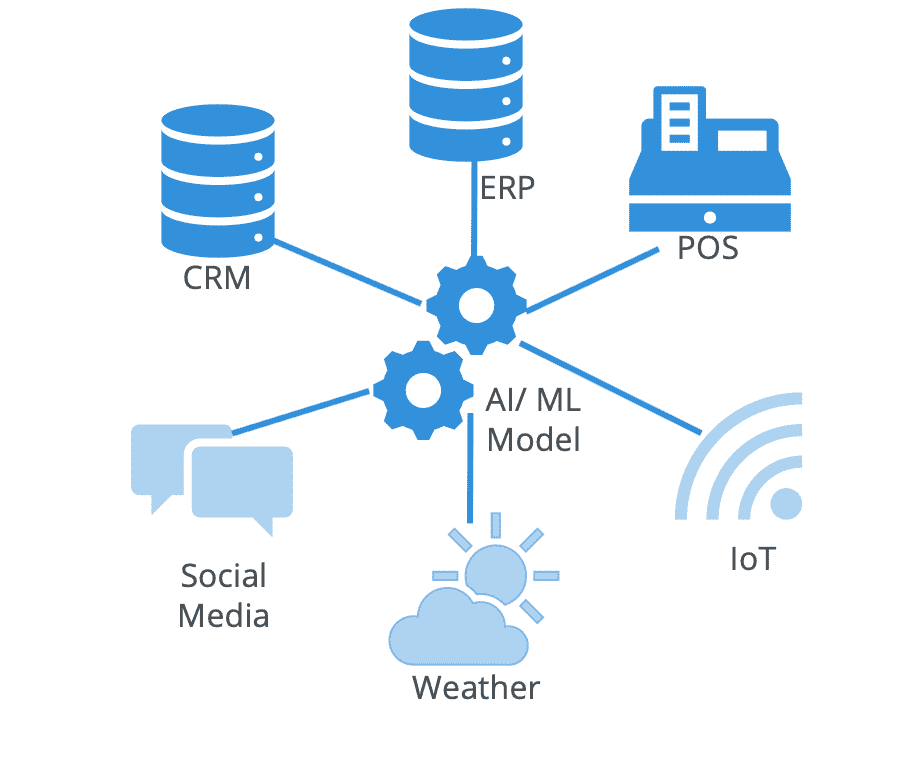
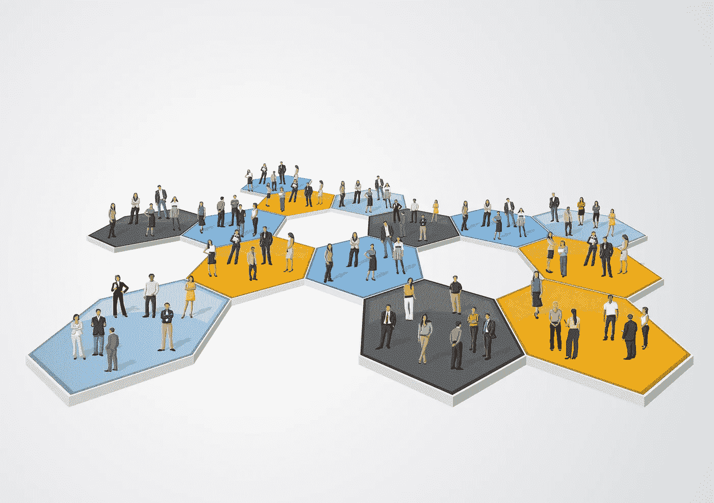
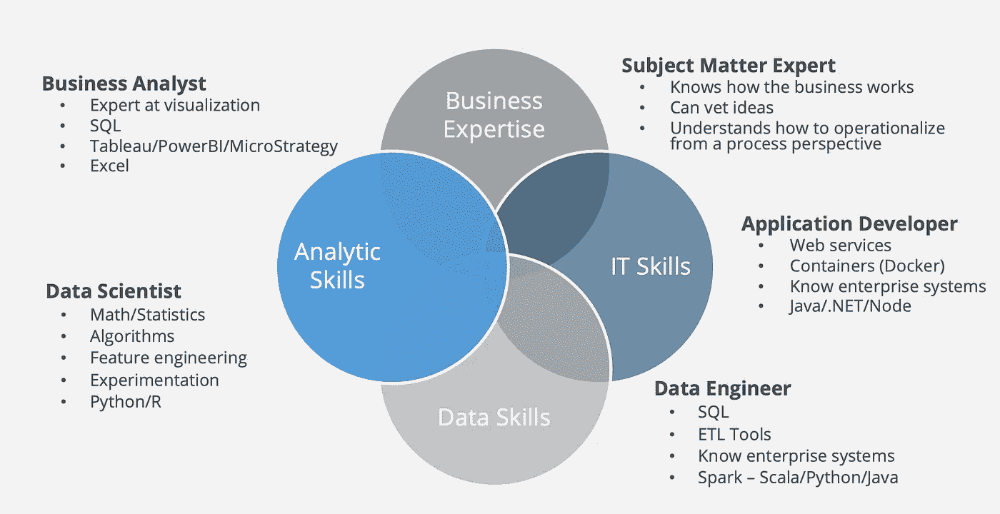

# 数据科学孤岛如何破坏应用程序现代化

> 原文：<https://towardsdatascience.com/how-data-science-silos-undermine-application-modernization-14cee5ff3047?source=collection_archive---------30----------------------->

拼接机的蒙特·兹韦本和赛义德·马哈茂德

# **是时候重塑现代化了**

我经常与那些在其组织中管理定制应用程序的企业高管交谈。当话题集中在现代化这些定制且通常是传统的应用程序时，他们通常会自豪地声称现代化正在进行中，并向我解释他们正在向云迁移，可能会将应用程序容器化，如果雄心勃勃，还会重新设计应用程序以利用微服务。

虽然这些努力是有价值的，但我很少观察到这些努力对业务成果产生了影响。在云上并不能提高营销应用的个性化，或者减少保险系统中的欺诈性索赔，或者优化制造商的供应链。应用程序肯定会更加敏捷。是的，这些容器编排和自动化的进步以及微服务重用因素可能能够让开发人员更有效率，但它们很少(如果有的话)最终从根本上改变或改进应用程序本身。因此，虽然云迁移和容器化很重要，但什么样的现代化更有影响力，能够真正推动业务成果呢？

为此，我认为有必要利用丰富的可用数据源，用新的外部数据来增强应用程序，然后使用这些数据来训练机器学习模型，使应用程序能够根据经验进行调整。这种下一代现代化将预测模型注入到应用程序中，以预测特定的未来结果，这样应用程序就可以相应地采取行动。

Apps need to incorporate data from enterprise apps as well as new sources outside the enterprise

# **构建智能应用需要智能团队建设**

但是困难就在这里。当公司试图用人工智能和人工智能实现现代化时，他们往往很难组织他们的团队。

事实上，当你向 IT 应用团队中的任何人提到 AI 或 ML 时，他们会立即把你带到数据科学团队或数据湖团队。这是发射井的第一个迹象。这通常意味着那些能够管理大量数据并“计算”机器学习的人坐在他们的筒仓里。他们远离应用程序与客户、供应商、员工等交互的活动。他们离生意只有一步之遥。最近，当我会见一家保险公司的数据科学团队负责人时，他们说阻碍他们工作运作的一个因素是缺乏应用程序团队的参与。

这对现代化产生了深远的负面影响。我们最近从技术角度讨论了其中的一些内容(参见我们的博客[Hadoop 发生了什么？](https://medium.com/@mzweben/what-happened-to-hadoop-what-should-you-do-now-2876f68dbd1d))。但是这里我想把重点放在人和过程上。从人员和流程的角度来看，孤岛如何影响现代化？

我的观点是，将 AI 注入应用的现状通常是由 AI 团队发起的。他们从一些数据湖中获取数据。他们创建了一个论题，并用许多模型进行实验。有时，他们根据现有的数据在真空中创建这些模型。他们运行许多特征、算法和参数的排列，如果做得好，他们用准确性度量来适当地测量实验，准确性度量可以客观地测量模型在测试集中预测新示例的程度。关于机器学习的实验性最佳实践的最佳读物之一是吴恩达的新书，[机器学习向往](https://www.deeplearning.ai/machine-learning-yearning/)。

但这是笑点。人工智能或数据科学团队不具备独立完成工作的能力。他们只是对业务或应用程序没有足够深入的了解，而这些业务或应用程序将部署模型以导致交付业务成果的生产操作。这一点也不轻视数据科学家。我就是其中之一。但是成功团队的秘诀是多样性。数据科学是一项团队运动。数据科学家需要与了解业务和应用程序的人并肩工作。原因如下。

# **合适的团队可以创造合适的功能**

我多年来的观察是，许多 ML 问题没有像图像、声音、视频和其他信号处理问题那样的大量训练示例，如果是这样，预测信号来自数据科学家对数据的争论，以找到产生一些预测信号的真正好的属性。通常，数据科学家以独特的方式组合数据元素，或者最重要的是聚合数据。这些转换后的数据属性就是数据科学家所说的特征，它们共同形成了特征向量，这些向量是监督或分类算法或非监督聚类算法的输入。这整个过程被称为特征工程，在我看来，这是处理公司结构化数据的实际 ML 项目的关键成功因素。

许多数据科学家撰写关于决策树、随机森林、boosting 算法、贝叶斯算法或深度学习替代方案等算法的中型文章，尽管这些算法确实会对模型精度产生影响，但获得更好预测信号的最有效方法是获得正确的数据。例如，RFM 变换是关键—新近性、频率和货币价值。这是将交易或行为数据转换为某人最近交易或访问的时间、频率或平均花费(时间或金钱)的过程。在媒体个性化方面，公司通常使用特定用户访问特定网站(如奢侈鞋品牌)的事实作为特征。但这是骗人的。事实证明，如果你利用最近访问某个特定网站的时间(例如，48 小时内)，你可以获得明显更好的广告转化率。你必须表现出正确的特征，才能让一个模型表现出来！

新近是一个简单的转换例子。今年夏天，我们很幸运地收到了多发性硬化症国际会议([electr IMS](https://www.ectrims-congress.eu/2019.html))的摘要，以表彰我们与客户[Precision Innovative Network](http://www.pin.care/)(PIN)的合作，该网络将独立的神经病学诊所联系在一起，以创建一个关于身份不明患者的人口数据平台。该公司将向制药公司、机器学习顾问和预测疾病轨迹的诊所本身提供宝贵的临床研究数据。在这个项目中，我们组建了一个跨学科团队，由准备数据的数据工程师、进行实验的数据科学家和作为主题专家的 PIN 创始人之一的神经学家[Mark gudes blatt](http://www.southshoreneurologic.com/our-providers/physicians)博士组成。Gudesblatt 博士能够将深奥的医学知识翻译成我们可以用来描述工程师的语言。一个我们作为数据科学家永远不会想到的特征的例子是受患者负面影响的认知域(例如，记忆、注意力、执行功能、视觉空间)的数量的聚合(通过平均值的标准偏差来测量)。当残疾跨越功能网络时，它与疾病的轨迹高度相关。

如上所述，我们与 PIN 的合作体现了不同团队合作的价值。最初，数据科学家、数据工程师和主题专家推动项目，而应用程序开发人员和业务分析师将大量参与项目的后期阶段。

# **尽早让您的应用开发人员参与进来**

当然，应用程序开发人员是一个重要的团队成员。没有它们，您永远也不会知道如何将模型注入到业务逻辑中。它们将帮助您回答重要的问题，如:

1.  应用程序将如何使用预测分数来改变业务逻辑？
2.  从应用程序中提取数据并用于重新训练模型以保持其新鲜并反映当前状况的频率如何？
3.  重新培训的模型何时以及如何取代旧的模型？
4.  如何监控模型行为的准确性？
5.  有必要恢复到旧型号吗？
6.  如何将最新的数据用作模型的输入，以便它不会对陈旧的数据做出决策？

不要等到建模项目结束时才让应用程序开发人员参与进来。从一开始就让他们成为项目的一部分，以确保考虑到所有的操作细节，并从整个过程中消除尽可能多的延迟，以便模型准确地反映真实世界。

# **通过功能工厂创造一种实验文化**

我将在以后的帖子中更多地讨论这一点，但是关于 ML 项目，可能有比仅仅将主题专家和应用程序开发人员包括在数据科学和数据工程团队中更重要的一点。这一点就是，要做好 ML，你必须在公司创造一种 ***的实验文化*** ，你必须意识到 ML 项目没有一个可以说是上线的日期，也没有一个移交给运营部门以保持活力。这是一个持续实验的过程。事实上，团队需要保持专注来创建我喜欢称之为 ***的功能工厂*** *。*功能工厂不断寻找增强信号的新功能。不幸的是，市场在变，坏人在创新，气候在变，竞争对手在变，等等。上线时的完美特征向量可能会在两个月后产生噪音，甚至更糟——明天。因此，秘诀是保持多样化团队的完整，经常评估已部署的模型，最重要的是保持他们尽可能多产以试验新特性。

商业公告(如果冒犯了你，跳过):我们公司制作了一个软件平台，帮助团队创建这种具有生产性特征工厂的实验文化，使他们能够用 ML 模型更新定制应用程序。[自从我的同事 Ben Epstein 撰写本文以来，他写了这些关于特性工厂的文章:[数据科学特性工厂的终极工具](https://medium.com/@ben.epstein97/the-ultimate-tool-for-data-science-feature-factories-55aed0f70974)和[特性工厂 pt 2:ML flow 简介](/feature-factories-pt-2-an-introduction-to-mlflow-873be3c66b66?source=friends_link&sk=f6194169c3e8b5f9a9ae91ed701ab146) ]要查看我们的 ML 管理器的演示，[点击这里](https://info.splicemachine.com/operationalize-ml-webinar-recording.html)。

总之，在现代化您的定制应用程序时，不要停留在容器化或迁移到云上。将机器学习的智能注入到应用程序中，目标是不断改善业务成果。本质上不要创建数据科学组织。创建由数据工程师、数据科学家、应用程序开发人员和操作员、主题专家和分析师组成的“现代化特警队”。采用使这些团队能够构建实验文化的工具和过程。