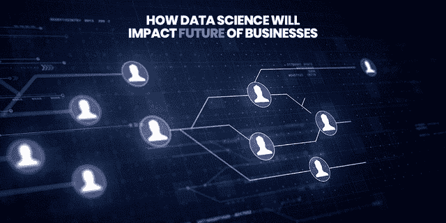
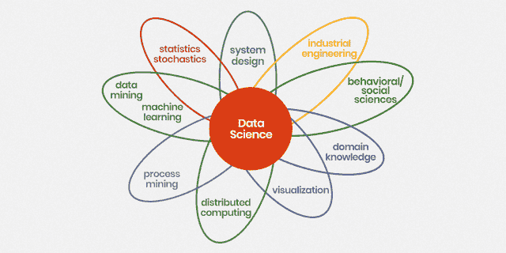
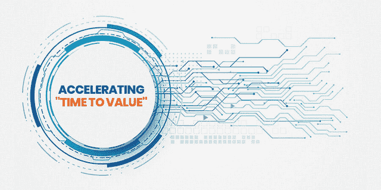
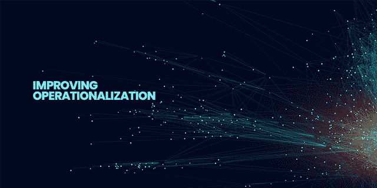
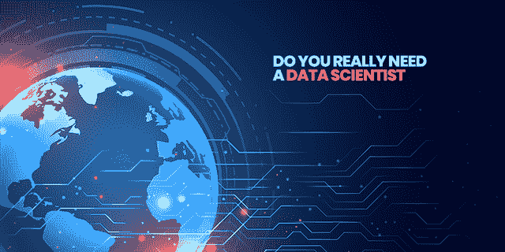
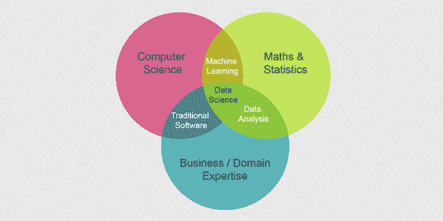

# 数据科学将如何影响企业的未来？

> 原文：<https://towardsdatascience.com/how-data-science-will-impact-future-of-businesses-7f11f5699c4d?source=collection_archive---------16----------------------->

## 随着超过 60 亿台(并且还在不断增加)设备连接到互联网，每天都会产生大约 250 万 TB 的数据。到 2020 年，预计将有数以百万计的新设备联网，每天将产生约 3000 万兆兆兆字节的数据。这个数字绝对会让你着迷。

How Data Science will Impact Future of Businesses?

我相信你知道世界各地不同科技巨头的大规模裁员。所以，这个时候，有一点变得至关重要，那就是需要把技能重新练到更有权威和回报的东西 ***—数据科学*** 。

[***据 forrester***](https://www.datascience.com/resources/white-papers/forrester-data-science-platforms) ***称，到 2020 年，数据驱动的企业将“总价值 1.2 万亿美元，高于 2015 年的 3330 亿美元。*** 数据科学家通常被雇佣来帮助不同的公司采用各种以数据为中心的方法。

由于数据科学家对数据有着深入的理解，他们在推动组织走向深度学习、机器学习和人工智能采用方面工作得非常好，因为这些公司通常有着相同的数据驱动目标。他们还帮助为包含大量数据和分析的软件提供软件开发服务。

[Image source](https://medium.com/@rinu.gour123/future-of-data-science-data-science-careers-prospects-f4692bba8e0c)

数据科学家帮助各种规模的公司找出从海量数据中提取有用信息的方法，以帮助根据这些发现优化和分析他们的组织。数据科学家专注于提出以数据为中心的问题，分析数据，并应用统计学和数学来找到相关的结果。

数据科学家拥有统计学和高等数学、人工智能和高级分析和机器学习的背景。想要运行基于人工智能的项目的公司，团队中有一名数据科学家是至关重要的，以便定制算法，充分利用他们的数据，并权衡以数据为中心的决策。

> 为了帮助企业为数据科学的光明未来做好准备，我们概述了塑造数据科学行业未来的以下 5 个关键因素。

## **1。为数据科学提供可操作的数据**

Making data actionable for data science

制作拙劣的数据是数据科学取得成功的最大障碍之一。为了加快数据科学项目并减少失败，首席数据官和首席信息官必须专注于提高数据质量，并向团队提供与手头项目相关且可操作的数据

## **2。数据科学人才短缺**

虽然数据科学仍然是新毕业生增长最快的领域之一，但需求远远超过了供应。该解决方案继续加快招聘，同时也在为分析和 BI 等领域的其他专业人员寻找替代方法，以加快数据科学流程并实现数据科学访问的民主化。这就是自动化对数据科学产生影响的地方。

## **3。加速“价值实现时间”**

Accelerating “time to value”

数据科学是一个迭代的过程。它包括创建一个“假设”，然后测试它。这种向前向后的方法涉及许多专家，从数据科学家到主题专家和数据分析师。无论企业规模大小，都必须找到加快这一“努力、重复测试”过程的方法，并加快数据科学的进程，以实现更好的预测。

## **4。对商业用户透明**

采用数据科学应用的最大障碍之一是业务用户缺乏信任。虽然机器学习模型可能非常有用，但许多业务用户并不依赖于他们不理解的流程。数据科学需要找到不同的方法来建立机器学习模型，以说服商业用户，并使用户更容易信任。

## **5。提高可操作性**

Improving operationalization

数据科学采用增长的另一个障碍是它的可操作性有多难。在实验室中运行良好的不同模型在生产环境中并不适用。即使成功部署了模型，随着时间的推移，生产数据的持续变化和增加也会对此模型产生负面影响。这意味着“微调”ML 模型成为一种有效的后期制作方法——是这一过程的关键部分。

## **6。数量惊人的数据增长**

人们每天都在产生数据，但大多数人可能根本不会去想它。[根据一项关于当前和未来数据增长的研究](https://www.seagate.com/gb/en/our-story/data-age-2025/)，每天有 50 亿消费者与数据交互，到 2025 年，这一数字将增加到约 60 亿，占世界人口的四分之三。

> **除此之外，2018 年全球数据总量为 33 zettabytes，但预计到 2025 年将增加到约 133 zettabytes。数据生产正在增加，数据科学家将站在最前沿，帮助各种规模的企业有效地发展。**

# **你真的需要数据科学家吗？**

Do you really need a data scientist?

仅仅因为一家公司无法发现一个数据科学家团队，也不意味着它将不得不放弃数据科学的目标或失去高级人工智能或机器学习的机会。取决于一家公司是否有兴趣推进其人工智能战略，它可能需要一个熟练的数据科学家团队。

具有复杂用例或大规模方法和大型数据集的公司，很可能肯定需要不止一名数据科学家来在合理的时间内完成项目。

虽然，如果一家公司计划进行几项工作，但每个团队中只有几名数据科学家与其他团队成员合作可能是有价值的。根据需求，数据科学家可以与[**软件开发人员**](https://www.xicom.biz/offerings/hire-software-developers/?utm_source=SM15) 密切合作，帮助团队中的每个人实现目标，而不需要任何特定的技能组合。数据科学家可以与现有团队成员一起工作，以公民数据科学家的身份开展工作。

随着人工智能的相关性增加，数据科学家周围的专家越来越短缺，许多公司都在想，如果没有人工智能，他们是否可以继续下去。此外，很难找到有才华的数据科学家，他们的工资通常是固定的。董事会中没有数据科学家也有可能走向人工智能的未来，但这真的取决于你想要运行的项目。

随着人工智能的不断普及，许多公司正在创造工具来帮助减少对数据科学家的依赖。一个这样的工具是 **AutoML** ，由许多创建自动化部分数据科学工作流的仪表板的供应商提供。

自动化机器学习工具旨在消除算法选择、迭代建模、超参数调整、模型评估甚至数据准备的元素，以便加速整个过程和一些复杂的设置。

首先需要熟练的数据科学家。一旦组织的数据通过 AutoML 系统运行，它就会产生一个可以直接使用或由工人分析的机器学习模型。通常，这些 AutoML 后的活动可以由受过比数据科学家更少培训的员工完成，或者由几个受过最新技能培训的现有员工完成。

除此之外，组织可以使用已经针对该问题训练过的机器学习模型。他们可以直接使用这些模型，或者使用迁移学习来扩展它们。这需要明显更少的资源，否则，这些需要从头开始构建。预训练模型已经根据相关数据进行了训练，并提供最终用户所需的分类、聚类、回归或预测。基于机器学习的 [**手机 app 开发解决方案**](https://www.xicom.biz/offerings/mobile-app-development/?utm_source=SM15) 也因之而有需求。

[Image source](https://blog.intact-systems.com/data-science-the-future-is-now/)

[**系列软件开发人员**](https://www.xicom.biz/offerings/hire-software-developers/) 和对机器学习专业知识有限的业务分析师可以为他们的业务需求训练最佳质量的模型。随着可见的预训练模型列表的不断增长，公司能够将其用于情感分析、图像分类和文本，而不需要训练复杂模型所需的大型标签数据集和数据科学资源。

*然而，供应商正在提供模型即服务，可在私有或公共云基础设施上使用，允许小公司访问复杂、大型且训练有素的模型，而无需他们自己的数据集。所有这些都减少了公司内部对数据科学角色的需求。*

随着数据科学家的人才缺口不断扩大，毫无疑问，我们将会看到新的工具——出于需要——允许企业员工和非技术人员测试、运行和分析关键数据。业务经理和首席执行官将开始学习基础数据科学，以帮助他们管理和追求人工智能项目。传统的数据科学家仍然需要运行复杂的数据分析，但在大多数情况下，由于工具越来越易于使用，基本数据分析将成为民用数据科学家的角色。

# **让我们总结一下:**

因此，在未来的数据科学中，我们学习了数据科学所需的技能和培训。毫无疑问，数据科学有着非常光明的未来。对数据科学家的需求将呈指数级增长。机器学习或人工智能将成为数据科学的重要组成部分。因此，未来人工智能开发公司的需求将会增加，印度的 [**移动应用开发服务**](https://www.xicom.biz/offerings/mobile-app-development/) 也将以同样的方式增加。