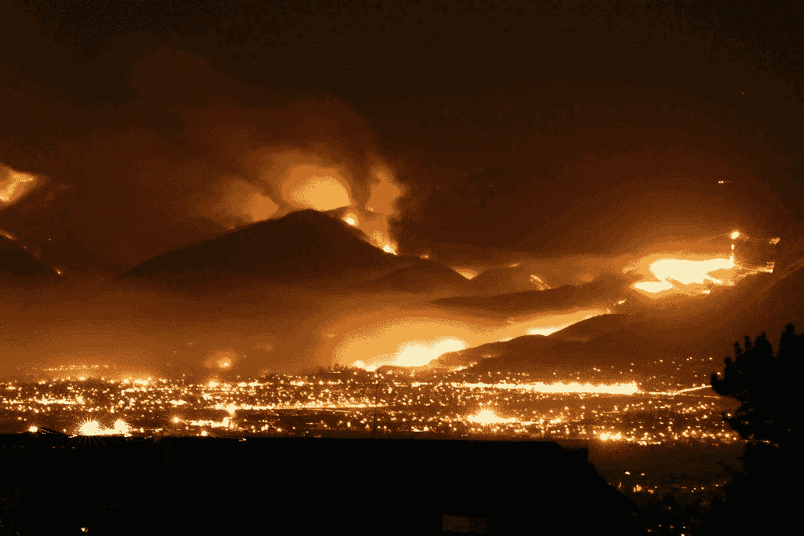
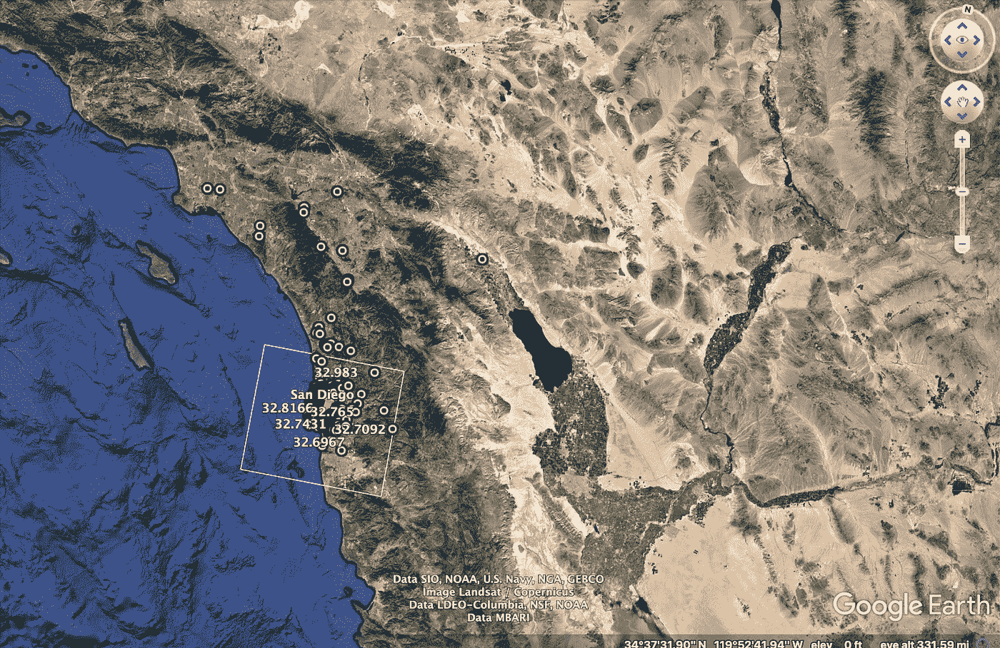
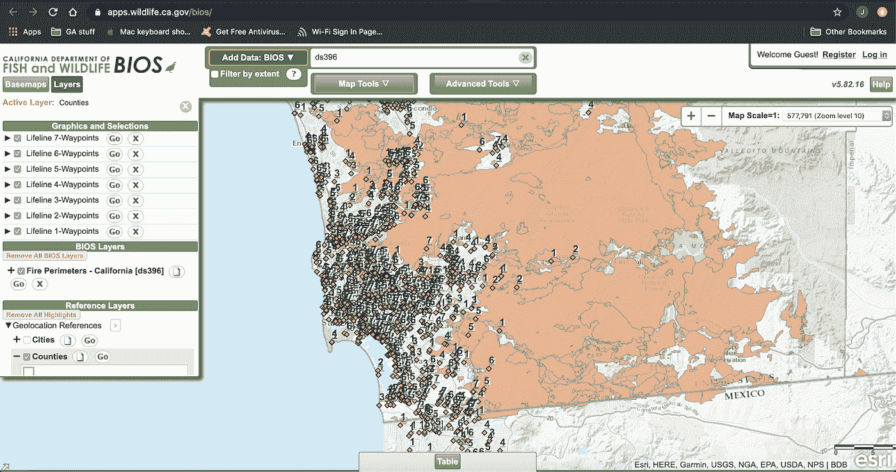
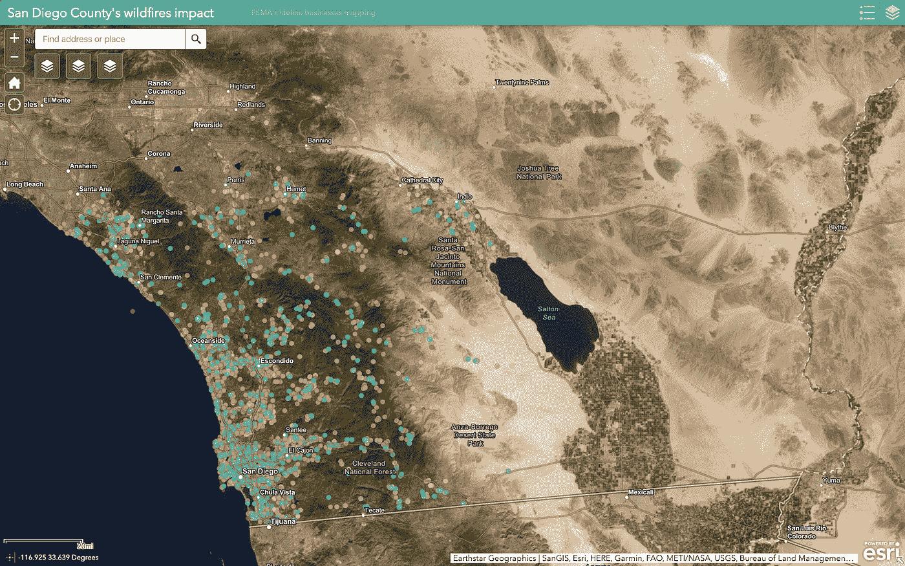
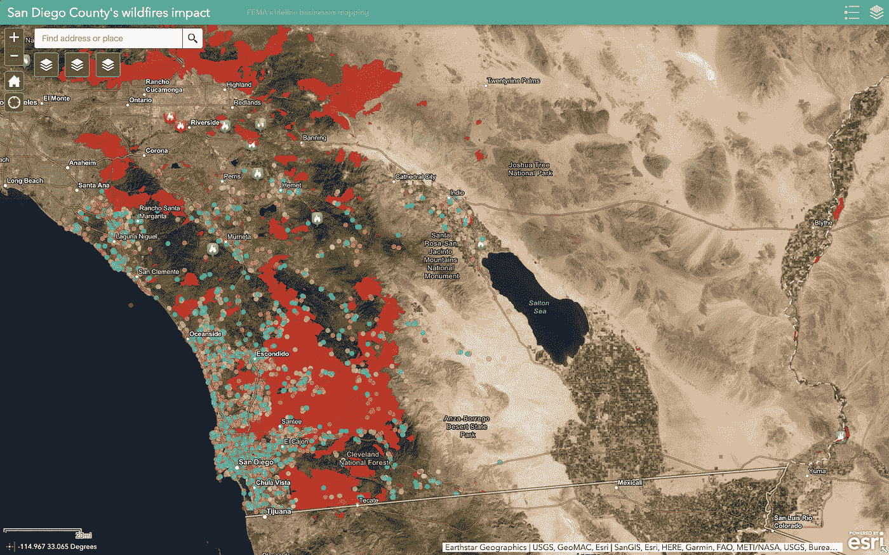
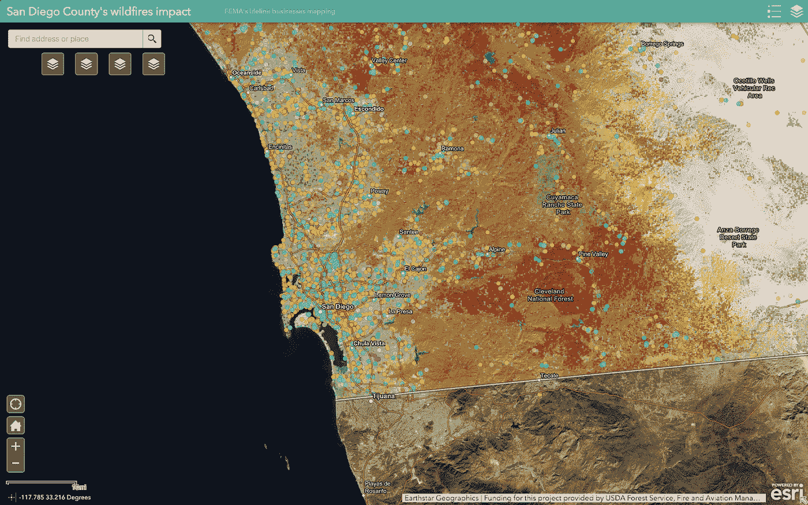

# 数据科学家如何帮助政府机构有效应对自然灾害

> 原文：<https://towardsdatascience.com/how-data-scientists-can-help-government-agencies-effectively-respond-to-natural-disasters-c2978da932ee?source=collection_archive---------42----------------------->

## 圣地亚哥县野火影响的案例研究

*本博客由* [*布伦达·哈利*](https://www.linkedin.com/in/brenda-hali/)*[*杰西·欧文斯*](https://www.linkedin.com/in/jessieowens/)*[*拉里·柯伦*](https://www.linkedin.com/in/larry-curran-b37291195/) *和* [*约翰·科比*](https://www.linkedin.com/in/john-kirby-80701a121/) *共同撰写并交叉发布。找到我们的 GitHub 资源库* [*这里*](https://github.com/k10jo01/fema_lifeline_impact) *。***

**用于灾难准备、恢复和响应的信息的可用性在不断变化。社交媒体和其他在线平台拥有免费提供的数据，可以帮助地方和联邦响应机构了解自然灾害的潜在和实际影响。此外，这些数据可用于在需要减轻这些影响时准备和部署资源。我们的团队试图创建一个可复制的过程，用于识别给定地理区域的企业，并根据 FEMA 生命线协议标记和显示它们。我们使用了 Yelp 和谷歌数据，以及多种不同的地图技术。我们建立了一个可重复的流程，可用于根据历史信息绘制潜在风险图，并允许 FEMA 和其他机构绘制当前灾害图，以实时显示灾区将需要哪些类型的资源。**

# **灾难会对圣地亚哥产生怎样的影响？**

**当灾难发生时，快速了解对响应工作的潜在影响的能力对于资源分配至关重要。美国每年发生 80 多起自然灾害，造成大量财产损失和生命损失。联邦紧急事务管理局(FEMA)与第一响应者合作，支持公民对这些自然灾害的准备、响应、保护和恢复。本联合会经常面临的挑战是，如何有效、及时地应对灾害，以及预测和满足当地机构和民众的需求。**

**联邦应急管理局的部分工作目标是确定哪些企业和组织必须获得优先援助，以便在危机时刻为公民提供最佳帮助。联邦应急管理局制定了生命线框架，以更好地应对灾害，通过生命线框架，联邦应急管理局官员可以确定应对工作的优先次序和重点，利用通用词汇，促进目标的统一和更好的沟通，并澄清灾害的哪些组成部分需要跨部门协调。七条生命线分别是:安全&安全、食物、水、避难所、健康&医疗、能源(电力&燃料)、通讯、运输、危险物质。**

**近年来，美国野火的频率和影响呈指数增长，加利福尼亚州是受影响的主要州之一。2018 年，加利福尼亚州发生了 8，054 起火灾，烧毁了 1，823，152 英亩，而 2010 年发生了 6，502 起火灾，烧毁了 108，742 英亩。此外，这些火灾造成了重大的经济和人员损失。仅在 2018 年，就有 85 人丧生，对国家造成 4000 亿美元的影响。在过去的二十年中，圣地亚哥及其周边社区尤其受到了一些最大的冲击性火灾的影响。2003 年 10 月的雪松火灾夺走了圣地亚哥县 273，246 英亩土地、2，820 座建筑物和 15 条生命。同样是在圣地亚哥县，2007 年 10 月的女巫大火吞噬了 197，990 英亩土地，1，650 座建筑，并夺去了 2 条生命。雪松火灾和女巫火灾都是加州有记录的野火历史上十大最具破坏性的火灾之一。**

# **问题是**

**我们着手解决的挑战是，我们如何帮助联邦应急管理局确定在灾区可能受到影响的企业，以及这些企业可能与哪条生命线保持一致。利用这些信息，我们旨在创建一个交互式地图，用于可视化这些生命线位置与历史上受灾害影响的区域和未来有受影响风险的区域的关系。我们将这种技术应用于圣地亚哥县，但是我们的想法是创建一种可以在美国任何其他地方实施的方法和结果。该方法和结果被直接提交给新光技术，联邦应急管理局的承包商之一，通过大会。**

# **工具**

**我们在准备本分析和技术报告时使用的工具包括:**

*   **谷歌应用编程接口**
*   **Yelp 融合 API**
*   **计算机编程语言**
*   **ArcGIS**
*   **（舞台上由人扮的）静态画面**
*   **谷歌网站**

# **数据描述**

**我们的分析包括以下数据来源:**

*   ****Google Places** :使用 Google Places API 找到的企业和组织、企业的类别或类型、纬度、经度和格式化地址。**
*   ****Yelp** :使用 Yelp API 找到的企业和组织、企业的类别或类型、纬度、经度和格式化地址。**
*   ****圣地亚哥县灾难**:来自联邦应急管理局网站的圣地亚哥县发生的灾难类型和日期的历史数据。**
*   ****火灾周界**:受野火灾害影响的区域的周界。**
*   **野火风险:圣地亚哥县目前处于高火险区。**
*   ****生命线信息**:由 FEMA 定义的生命线描述和企业和组织分类类别。**

# **问题方法**

**在为 FEMA 和新光技术解决这个问题时，我们采用了以下方法:**

**1.数据的收集和清理**

**2.对齐生命线**

**3.绘图**

**4.结论和后续步骤**

# **数据的收集和清理**

**我们最初的提示建议使用 Yelp API 数据，我们开始这样做了。通过查看我们收到的数据和咨询以前 GA 学生的项目，我们很快了解到，这些数据不是很可靠，并且没有包括足够的信息来单独依赖 Yelp。我们决定利用他们的 API 整合来自 Google Places 的数据。除了位置数据，我们还必须使用联邦应急管理局网站上的定义和描述来描述真正的联邦应急管理局生命线。这构成了我们用于制图的数据基础。**

**为了给地图添加背景信息，我们收集了影响圣地亚哥县地区的历史灾害数据。我们发现了该县受一些历史上最具破坏性的火灾影响的地区的具体周界。我们还发现了来自美国农业部的数据，显示了当前的野火高风险区，这也被添加到我们的地图上。**

# **对齐生命线**

**什么样的企业或组织符合联邦应急管理局的生命线？利用带有“附近搜索”和“文本搜索”的 Google Places API“地点类型”和 Yelp Fusion“类别”，我们将圣地亚哥县发现的所有地点映射到 FEMA 的七条生命线之一。我们将搜索术语如“执法”与安全、患者运动与健康和医疗等联系起来。我们使用的搜索词的完整列表以及我们将它们与哪条生命线对齐可以在我们的 [GitHub Repo](https://github.com/k10jo01/fema_lifeline_impact) 中找到。**

# **绘图**

**一旦我们的数据被收集并与联邦应急管理局的生命线一致，我们就将这些位置与历史受灾地区和当前的高风险区一起绘制出来。我们希望提供一个直观的、能提供最大价值的地图，所以在决定最终选项之前，我们测试了一些不同的工具。**

# **谷歌地球专业版**

**虽然这很容易映射，但图像不是很清晰，也不太具有交互性。也不可能绘制生命线业务地图，然后添加火灾周界层或当前火灾风险区。**

****

# **基本输入输出系统**

**我们可以使用 csv 绘制生命线数据，但是我们不能清楚地区分生命线。**

****

# **ArcGIS**

**最终，我们认为 ArcGIS 提供了最佳的可用性、交互功能和视觉效果。我们可以在这张地图上应用许多图层，并简单有效地更新这些图层。我们包括了所有企业的图层，这些图层用生命线、历史野火灾难的边界和当前的高风险火灾区域进行了颜色编码。接下来的几张图片展示了 ArcGIS 的一些功能。**

****

**We started by mapping out the businesses, color coded according to what Lifeline they aligned with.**

****

**This shows the Lifelines in relation to perimeters of previous disastrous fires.**

****

**This shows the Lifelines in relation to current (November 2019) high risk of fire zones.**

**有关我们创建的 ArcGIS 地图的完整功能的视频演示，请查看以下视频:**

# **结论**

**使用来自谷歌、Yelp、联邦应急管理局和美国农业部的数据，我们能够创建一个地图，显示圣地亚哥县的企业以及这些企业与联邦应急管理局的哪条生命线保持一致。此外，我们还能够将图层添加到先前受野火灾难影响的区域或未来可能受影响的高风险区域的周边地图中。这些信息可以帮助 FEMA 决策者在灾难期间动员和预测资源需求。**

**地图是一种工具，可用作确定疏散计划或估计灾难潜在或实际影响的起点。了解位置和它们映射到的生命线，可以帮助灾难响应团队更快地帮助这些位置或在灾难期间向需要的人提供援助。**

# **改进和后续步骤**

**我们建议新光科技和联邦应急管理局投资于公共和私人技术合作。利用我们找到的完成这一分析的有价值的工具，我们能够描绘出灾难会如何影响企业和生命线的使用。由于障碍较少(刮擦限制/延迟、软件成本)，我们的流程可以在最短的时间内在美国的任何地方重现。技术伙伴关系将大大提高识别和测绘灾害以评估其影响的效率。**

**此外，如果与 Yelp 或谷歌等平台建立合作伙伴关系，他们可以添加新功能，以更好地帮助 FEMA 做出回应。在他们的网站上添加可视字段，注明企业是否在受灾难影响的地区，以及企业是否因灾难而开业，这可以进一步简化我们的方法。**

**额外的技术投资将有助于联邦应急管理局及其应对和解决灾害的挑战。这些投资可能包括对我们在此测试的工具(ArcGIS)的扩展或对新工具的投资。用于创建地图的 ArcGIS 工具是通过免费试用构建的。对于接下来的步骤，我们建议投资这种类型的软件来增强该地图，并将其应用于受灾害影响的其他地区。它的软件使用费是每年 500 美元。**

**该地图是一个例子，可以用于美国任何可能受灾难影响的地区。为了使这一过程对联邦应急管理局及其承包商来说更容易，我们建议投资和收购新技术，以帮助高效和有效地绘制出我们在这一分析中绘制的信息。此外，与谷歌这样的科技公司合作，让企业有机会在灾难发生后将自己的开放状态放在谷歌上，这有利于响应团队更快地评估灾难的状态。目前，联邦应急管理局评估损失的一个众所周知的方法是通过华夫饼屋指数。实施技术合作伙伴关系，使所有企业更容易交流他们的状态，可以更好地描述灾难后的状态。**

# **来源**

**在准备本项目时，以下资源是必不可少的:**

*   **在我们之前的大会学生已经研究过这个问题，如果不参考他们的工作，我们就不可能走得这么远:**
*   **[ATL](https://github.com/awharmon/FEMA-Lifelines-Categorization-for-Disaster-Response)**
*   **[ATX](https://github.com/adriancampos1/GA_DSI8_FEMA_Lifelines)**
*   **[书斋](https://github.com/meldev00/FEMA_disaster_tool)**
*   **[FEMA 生命线框架](https://www.fema.gov/media-library-data/1544469177002-251a503b3717f0d6d483bae6169f4106/Revised_Community_Lifelines_Information_Sheet.pdf)**
*   **[FEMA 生命线响应工具包](https://www.fema.gov/media-library-data/1550596598262-99b1671f270c18c934294a449bcca3ce/Tab1b.CommunityLifelinesResponseToolkit_508.pdf)**
*   **[保险信息研究所事实&统计:野火](https://www.iii.org/fact-statistic/facts-statistics-wildfires#Wildfires%20by%20year)**
*   **[美国农业部概率野火风险](https://apps.fs.usda.gov/arcx/rest/services/RDW_Wildfire/ProbabilisticWildfireRisk/MapServer)**
*   **[FEMA 历史灾难声明](https://www.fema.gov/openfema-dataset-disaster-declarations-summaries-v1)**
*   **[加州政府关于火灾周界的数据](https://map.dfg.ca.gov/metadata/ds0396.html)**
*   **[Yelp 融合 API](https://www.yelp.com/fusion)**
*   **[Google Places API](https://cloud.google.com/maps-platform/places/?utm_source=google&utm_medium=cpc&utm_campaign=FY18-Q2-global-demandgen-paidsearchonnetworkhouseads-cs-maps_contactsal_saf&utm_content=text-ad-none-none-DEV_c-CRE_315916117679-ADGP_Hybrid+%7C+AW+SEM+%7C+BKWS+~+Google+Maps+Places+API-KWID_43700039136946201-aud-543033638149:kwd-301485308762-userloc_9061285&utm_term=KW_%2Bgoogle%20%2Bplaces%20%2Bapi-ST_%2Bgoogle+%2Bplaces+%2Bapi&gclid=Cj0KCQiAtf_tBRDtARIsAIbAKe2R2vm_LUh1w7EmpAMzDouKnI7fKGonY279Baz_lOh0LnA5Gd9M1rsaAooVEALw_wcB)**
*   **[2018 年野火的预计经济影响](https://www.accuweather.com/en/weather-news/accuweather-predicts-2018-wildfires-will-cost-california-total-economic-losses-of-400-billion/70006691)**

**此外，我们用这些信息创建了一个静态站点:[https://sites . Google . com/view/FEMA-lifeline-business-lines/home](https://sites.google.com/view/fema-lifeline-business-lines/home)**