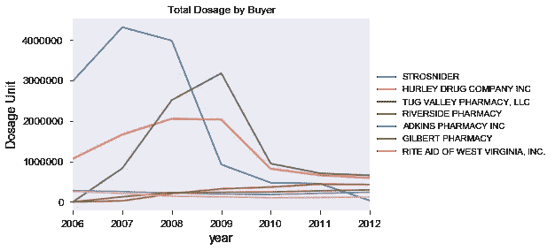
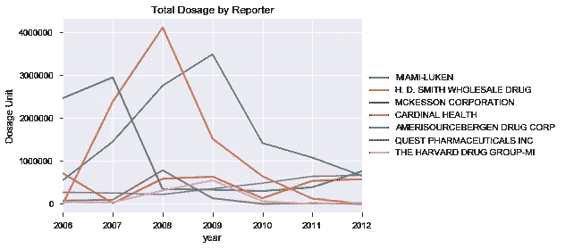
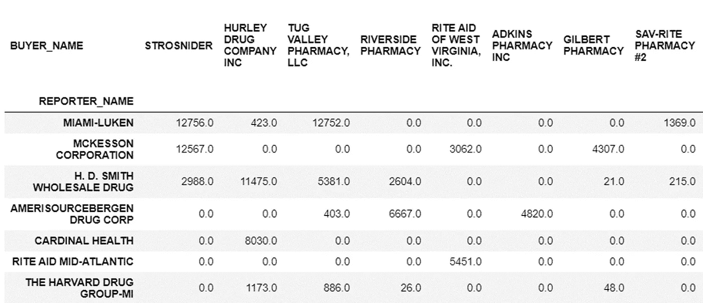
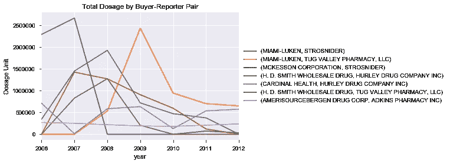
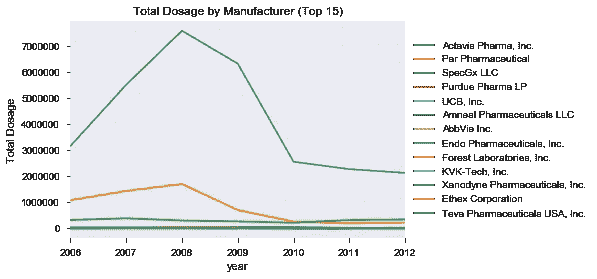
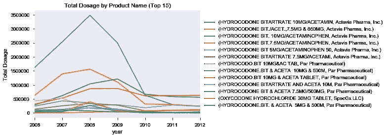

# 数据如何揭示西弗吉尼亚州明戈县阿片类药物流行背后的供应链

> 原文：<https://towardsdatascience.com/how-data-shed-light-on-the-supply-chain-behind-the-opioid-epidemic-in-mingo-county-wv-9e60b18c9d68?source=collection_archive---------35----------------------->

华盛顿邮报[做了一件伟大的工作](https://www.washingtonpost.com/health/how-an-epic-legal-battle-brought-a-secret-drug-database-to-light/2019/08/02/3bc594ce-b3d4-11e9-951e-de024209545d_story.html)获得了曾经由药物执行机构(DEA)维护的秘密数据库 ARCOS(自动报告和综合订购系统),该数据库跟踪每一种受管制物质是如何从制造商转移到患者手中的。通过挖掘数据库，我们可以一窥那些摧残了许多美国人的阿片类药物都是从哪里来的。

在本文中，我将重点关注西弗吉尼亚州的明戈县，这是一个位于肯塔基州边界的农村县，人口只有 3000 人。它是全国新闻报道的焦点，主要是因为那里发生了不好的事情。从 2006 年到 2012 年，超过 3800 万剂阿片类药物被运往那里，足以满足每人每年 1800 多剂药物的需求。虽然《华盛顿邮报》有一个非常好的[交互式仪表盘](https://www.washingtonpost.com/graphics/2019/investigations/dea-pain-pill-database/)来快速显示各县的初步调查结果，但我已经决定深入挖掘明戈县的数据，看看能不能发现什么有趣的东西。如果你也想玩玩这些数据，可以从华盛顿邮报的[网站](https://www.washingtonpost.com/graphics/2019/investigations/dea-pain-pill-database/)下载。

让我们直接进入它。

因此，在每个条目中，它都包括有关转让的药物(品牌名称、类型和剂量)、购买者(通常是零售药店，但有时是连锁药店或执业医师)和提交报告者(药物转让者，在这种情况下，总是分销商)的信息。有了这些信息，我们可以追溯到制造商→分销商→零售商的环节。

首先，让我们看看零售商层面:

首先映入眼帘的是，三家零售药店销售了 70%的阿片类药物，Strosnider 在 2007 年销售了 400 万剂，相当于该县每人 1300 剂。Strosnider 是一家控制着两家 Sav-rite 药房的公司(Sav-rite 药房#2 在该名单中排名第四),其所有者在 2012 年被判处 6 个月监禁和 5000 美元罚款。即使在 2012 年，Strosnider 仍然向 DEA 报告购买了成千上万的阿片类药物。联邦调查局表示，他们的调查重点是 2006 年的交易，但我们只能推测调查实际上是何时开始的。但我们确实观察到 Strosnider 的业务从 2008 年到 2009 年急剧下降，在这么短的时间内，他们在第二家店下提交了一些报告。Tug Valley 的剂量计数在此期间也有所上升，可能从 Strosnider 那里抢走了一些销售额。自[于 2018 年](https://www.williamsondailynews.com/news/tug-valley-pharmacy-to-close/article_47a78b3f-73f0-54bf-ae9b-c17397718337.html)关闭以来，该地点现由 CVS 运营。与此同时，赫尔利药物公司仍在营业。

现在让我们看看分销商:

与我们在零售层面看到的情况类似，三家分销公司占据了市场，销售了超过 70%的剂量。迈阿密-卢肯，俄亥俄州斯普林博罗的中间人，宣布今年早些时候[将关闭](https://www.daytondailynews.com/news/rise-and-fall-miami-luken-local-firm-blamed-for-opioid-shipments/vRP21oJE9JhFPkKNmiEfeK/)。H.D. Smith 曾渴望打入 Mckesson、Cardinal Health 和 Amerisource Bergen 这三大药品批发商，但后来被 Amerisource Bergen 收购。Mckesson 排在第三位，但大部分销售是在 2006 年和 2007 年初。也许他们注意到了其他经销商没有注意到的东西？

通过观察记者-买家配对的年度趋势，我们可以看到 Mckesson 和 Miami-Luken 都是 Strosnider 的主要供应商。然而，Mckesson 在 Strosnider 的参与大部分在 2008 年结束。同时，迈阿密-卢肯公司也是 Tug Valley 的最大供应商。H.D. Smith 给 Tug Valley 和 Hurley 药品公司供货。

正如我们所见，排名前 6 位的产品都是由 Actavis Pharma 生产的，它们都是氢可酮产品，浓度为 7.5 毫克至 10 毫克。公司收购了 Allergan，合并后的公司又被 Teva 收购。因此，Actavis 占 Mingo 县出售的阿片类药物剂量的 77%,其中 75%是前 6 名产品。由 Endo Pharmaceutical 拥有的 Par Pharmaceutical 拥有 14.8%的市场份额，销售的主要是 7.5 毫克和 10 毫克氢可酮。Mallinckrodt Pharmaceuticals 的子公司 SpecGx 拥有 5.6%的市场份额。许多诉讼的焦点普渡制药公司仅排在第四位，市场份额不到 1%。

这里没有直接显示供应链中的一个环节，即开药的医生。在像明戈县这样的农村地区，通常很容易跟踪谁在开处方，因为患者通常在医生和药房方面没有多少选择。在 Strosnider 一案中，Justice Medical 及其医生早些时候因滥用药品管理局注册号而被起诉。在城市地区可能更难追踪，因为患者可以进入许多其他药店。

虽然阿片类药物处方的激增现在已经结束，但损害已经造成，因为这些患者现在对阿片类药物上瘾。随着普通、合法的阿片类药物变得越来越少，他们不得不转向更强的阿片类药物，如海洛因和芬替尼，这些药物占 2017 年美国大约一半或大约 30，000 例[阿片类药物死亡](https://www.drugabuse.gov/related-topics/trends-statistics/overdose-death-rates)。有人想知道是否可以在 ARCOS 中内置一个异常检测系统来标记可疑的供应商。

*你可以在我的* [*Github*](http://www.github.com/tsofoon/) *找到我的代码，在*[*LinkedIn*](https://www.linkedin.com/in/matttso/)*上和我联系。*