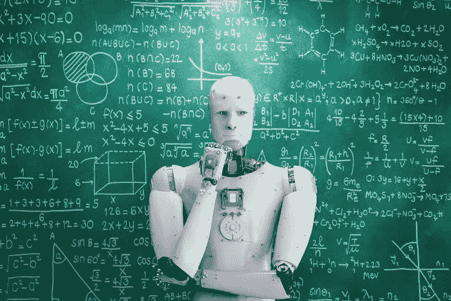

# 数据将如何赋能未来的人工智能教师

> 原文：<https://towardsdatascience.com/how-data-will-empower-ai-teacher-of-the-future-193e83c9514f?source=collection_archive---------28----------------------->

Image Source: [https://geneticliteracyproject.org/wp-content/uploads/2018/09/AI-9-25-18.jpg](https://geneticliteracyproject.org/wp-content/uploads/2018/09/AI-9-25-18.jpg)

传统教室在一两个世纪里没有太大变化。孩子们来到教室，老师给他们讲课，然后通过测验和考试对他们进行严格的评估。今天的教育在两个主要方面辜负了我们:

*   它没有认识到每个学生都是不同的，需要学习不同的东西。难怪，学校和大学的教育环境对今天的学生来说压力如此之大。
*   它不允许学生按照自己的速度学习。我们的课程是根据班上的一般学生来设置的，这使得成绩优秀和成绩差的学生都处于不利地位。

人工智能(AI)和数据授权的虚拟教师(或机器人教师)都将改变未来人类学生的学习方式。以下是人工智能教师将在教育领域带来变革的一些方式:

## 处理招生，维护出勤记录，并评分考试

每个老师都会同意，他或她的四分之一的时间和精力都花在了最平凡、最无聊的任务上，比如考勤、管理入学和注册程序、评分测试和考试。

人工智能教师可以被编程为以无错误的方式快速完成所有这些任务。由于它们可以在定义的参数内处理大量数据，人工智能可以用更少的人力完成更多的工作。

现在，计算机已经被用来给客观题、选择题和单选题评分。随着时间的推移，自然语言处理(NLP)的进步将很快使人工智能教师像人类教师一样给论文评分成为可能。

## 让每个人都能学习

虚拟人工智能教师使弥合各种教育差距成为可能。Smiletutor.sg 的顶级地理老师 Timothy Lim 先生评论道:“我经常使用有趣的基于网络或手机的游戏和应用程序来让学生参与学习。例如，谷歌地球和邦扎国家地理应用程序是地理学生[保持兴趣的绝佳学习资源。](https://smiletutor.sg/9-best-apps-to-motivate-your-childs-interest-in-geography/)

基于人工智能的学习应用程序也使优秀的教师能够接触到偏远地区的学生。在面临教师严重短缺或网络连接问题的地区，有可能使用人工智能教师为儿童提供教育。

未来的人工智能教师可以以不同的形式提供教育——文本、音频和视频——并且可以跨越语言障碍。甚至今天还有智能的自动化翻译系统可以将一种语言的句子翻译成另一种语言。未来可以对它们进行改进，以允许人工智能教师以最适合个体学生的语言和格式提供教育(包括那些有身体和精神障碍的学生，这些障碍阻碍了他们的学习过程)。

## 提供个性化课程

有一件事会让未来的人工智能教师比人类教师更好，那就是数据的力量。它们可以被设计成使用各种心理测量量表来评估学生的能力和兴趣。然后，他们可以根据自己的个人资料提供教育模块。

与今天不同的是，当每个孩子以同样的顺序学习同样的科目时，未来的人工智能教师将能够教授学生将实际用来实现他们全部潜力的知识和技能。此外，人工智能教师将能够根据个人的需要定制自己。这意味着，虽然人类教师在一对多的教学方式中有局限性，但人工智能教师将能够轻松地在一对一的基础上传授知识，就像每个学生有一个老师一样！

## 永远不要疲倦或沮丧

为什么你觉得 AI 老师会很酷？因为他们永远不会疲倦或沮丧。他们可以一遍又一遍地回答同样的问题，而不会感到恼怒或厌烦。事实上，许多使用自然语言处理(NLP)技术的聊天机器人仍然会为用户检索相关的内容(基于他们所提问题中的关键词)。

学生们认为机器人老师会更加平易近人。如果像 Siri 一样的老师可以获取每门学科的信息，他们的成绩肯定会提高。即使是内向的学生，如果在班上不好意思问学生，也会发现向他们的个人 AI 导师提问很容易。

## 在课堂之外提供教育支持

人工智能教师甚至可以在放学后为学生提供支持。学生可以随时随地向他们提问，他们可以在几微秒内就任何给定的话题获取深入的信息。

通过分析学生数据，人工智能教师将能够确定学生最感兴趣的主题，并为他们提供关于这些主题的越来越具有挑战性的课程。使用推荐引擎机制(这有助于 YouTube 推荐你喜欢的艺术家或流派的新歌，或者脸书推荐你可能感兴趣的产品)，人工智能教师将能够推荐学生可能喜欢探索的下一个主题。

人工智能教师可以利用视听媒体来教学生。这意味着这些老师不仅会开书，还会向学生展示图片、动画、视频，甚至是与主题相关的活动和会议。

## 提供体验性和沉浸式虚拟环境

Oculus Rift 和类似的 VR(虚拟现实)和 ar(增强现实)设备已经在改变我们看待世界的方式。在吸收了成千上万组数据后创建的场景有时是如此强大，以至于你感觉自己好像是其中的一部分。

现在，想象一下在探索身体内部的同时研究生物学，或者法国大革命的历史，在那里你可以看到当时发生的事情，就好像你穿越到了那个时代。这是 AI 老师能为下一代做的。

信息图表和虚拟实地考察将使教育变得更加有趣和容易记忆。枯燥的教科书将被有趣而灵活的沉浸式体验所取代，学生可以在实践中学习(如进行实践，或设计机器原型并想象它们是如何工作的)。

人工智能教师将拥有前所未有的数据和信息能力。他们将在有能力的“人类”教师手中制造出优秀的工具，并彻底改变教育领域。