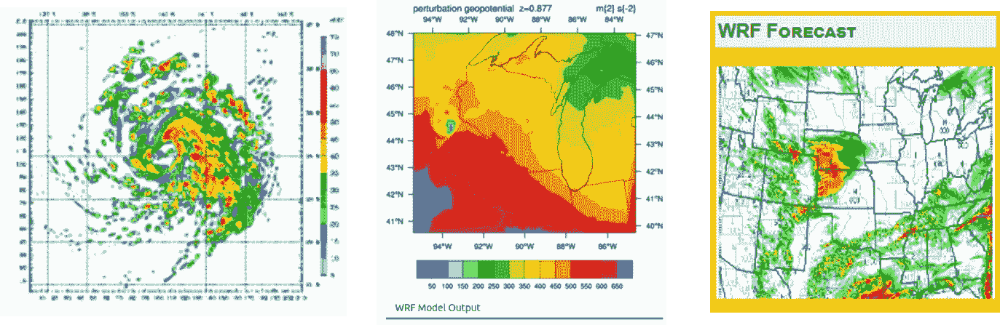
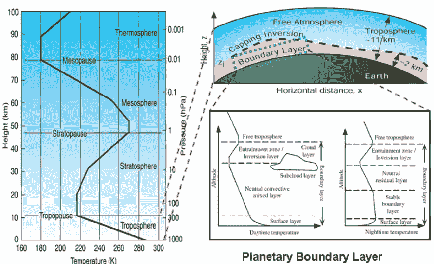
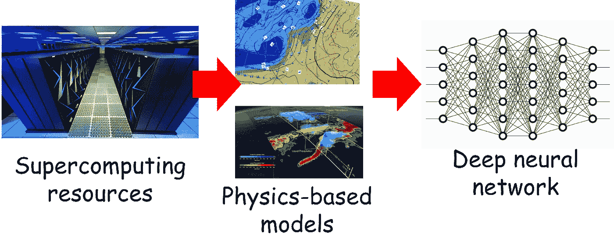

# 深度学习如何帮助天气预测和气候模型

> 原文：<https://towardsdatascience.com/how-deep-learning-is-helping-weather-predictions-and-climate-models-389ba226b7ab?source=collection_archive---------12----------------------->

## 深度学习模型正在帮助加速计算最密集的任务之一——天气和气候建模。

# 介绍

《时代》杂志选择了[格蕾塔·图恩伯格](https://en.wikipedia.org/wiki/Greta_Thunberg)，她 16 年来充满活力，致力于拯救我们的星球，作为 2019 年的“[年度人物”。格里塔一直在](https://time.com/person-of-the-year-2019-greta-thunberg/)[勇敢地在世界各地发表演讲](https://www.ted.com/talks/greta_thunberg_the_disarming_case_to_act_right_now_on_climate_change)，讲述我们人类作为一个物种，以[气候变化和环境破坏](https://climate.nasa.gov/)的形式共同面临的迫在眉睫的危险(有些人甚至称之为生存危机)，这主要是由于人类活动而加速的。

为了理解这一划时代的全球事件的影响，我们需要大量的科学数据、高保真的可视化能力和强大的预测模型。

**因此，天气预测和气候建模处于人类对抗气候变化的最前沿**。但是，他们不是容易的企业。至少，对于大数据分析和科学模拟能力的所有进步来说，这些地球规模的问题对于当今的硬件和软件栈来说是难以解决的。

我们能否借助人工智能的力量，尤其是深度神经网络的力量，来帮助我们完成这项事业？

> 为了理解这一划时代的全球事件的影响，我们需要大量的科学数据、高保真的可视化能力和强大的预测模型。

# 深度学习加速了这项复杂的任务

## WRF 模式

在美国，大多数天气预报服务都是基于一个名为天气研究和预报(WRF)的综合中尺度模型。

该模型适用于从几十米到几千公里的大范围气象应用。正如美国能源部阿贡国家实验室的环境科学家王佳莉所言，[言简意赅地说](https://www.sciencedaily.com/releases/2019/11/191112164947.htm)——*它描述了你在窗外看到的一切，从云到太阳辐射，到雪到植被——甚至是摩天大楼扰乱风的方式。*

Weather Research and Forecasting (WRF) model

开发 WRF 的努力开始于 20 世纪 90 年代后期，主要是各种政府机构和大学之间的合作伙伴关系——国家大气研究中心(NCAR)、国家海洋和大气管理局(NOAA)、空军气象局(AFWA)、海军研究实验室(NRL)、俄克拉荷马大学(OU)和联邦航空管理局(FAA)。该模型的大部分工作是由 NCAR、NOAA 和 AFWA 完成或支持的。

它已经成长为一个[大型全球用户社区](https://en.wikipedia.org/wiki/Weather_Research_and_Forecasting_Model)(超过 150 个国家的 30，000 多名注册用户)，由全年举行的研讨会和教程提供支持。事实上，WRF 在全世界被广泛用于研究和实时预报。它具有[两个动态内核](https://www.mmm.ucar.edu/weather-research-and-forecasting-model)，一个数据同化系统，以及一个支持并行计算和系统可扩展性的软件架构。

> 在美国，大多数天气预报服务都是基于一个被称为天气研究和预报的综合中尺度模型。

## 无数变量的结合

也许这并不奇怪，这样一个综合模型必须处理无数与天气相关的变量及其高度复杂的相互关系。用一套统一的解析方程来描述这些复杂的关系也是不可能的。相反，科学家们试图使用一种叫做参数化的方法来近似方程，在这种方法中，他们在比实际现象更大的尺度上模拟关系。

虽然在许多情况下，这种方法产生足够的预测精度，但它以计算复杂性为代价。因此，扩展成为一种负担。

深度学习的神奇力量能解决这个问题吗？来自阿贡国家实验室的环境和计算科学家当然充满希望。他们正在合作使用深度神经网络(DNN)来取代 WRF 模型中某些物理方案的参数化，希望在不牺牲保真度和预测能力的情况下大幅减少模拟时间。

> 虽然在许多情况下，这种方法产生足够的预测精度，但它以计算复杂性为代价。

## 深度学习取代了复杂的基于物理的模型

Argonne 的团队使用了 20 年来自 WRF 的基于物理的模型生成的数据来训练神经网络，并使用了两年的数据来评估经过训练的深度学习模型是否可以提供足够准确的替代方案来替代[基于物理的参数化](https://www.aer.com/science-research/climate-weather/physical-parameterizations-climate-simulations/)。

如果成功，**这将使他们能够创建一个密集的网格(想象成地球和大气的三维地图)，在这个网格上可以计算感兴趣的量，如风速或湿度**。这种地图的密度越高，可视化的质量就越高，就有可能更准确地预测特定地点。只有快速计算如此密集的网格，即从数学 DNN 模型得出的结果，而不是从详细的模拟模型得出的结果，才能使这个梦想成为现实。

特别是，科学家们试图将他们的研究集中在所谓的[行星边界层(PBL)](http://www.theweatherprediction.com/basic/pbl/) ，或大气的最低部分，人类活动对其影响最大。它仅在地球表面上方几百米处延伸，这一层中的气象动态，如风速、温度和湿度分布，对于确定大气其余部分和地球上的许多物理过程至关重要。

PBL: [**Source**](https://www.researchgate.net/figure/The-vertical-structure-of-the-atmosphere-including-the-planetary-boundary-layer-modi-fi_fig2_269463321)

> 他们正在合作使用深度神经网络(DNN)来取代 WRF 模型中某些物理方案的参数化，希望在不牺牲保真度和预测能力的情况下大幅减少模拟时间。

[两个数据流，总计 10，000 个数据点，跨越 8 天时间](https://www.alcf.anl.gov/news/deep-neural-networks-speed-weather-and-climate-models)，一个来自堪萨斯州，另一个来自阿拉斯加州，被输入 DNNs。结果表明，根据输入和输出变量的相互关系训练的 DNNs 可以成功地模拟风速、温度和水汽随时间的变化。

结果还显示，来自一个位置的经过[训练的 DNN 可以预测附近位置](https://www.alcf.anl.gov/news/deep-neural-networks-speed-weather-and-climate-models)的行为，相关性高于 90%。这意味着，如果我们有大量高质量的堪萨斯州数据，我们也可以希望加快密苏里州的天气预测活动，即使在该州收集的数据不多。

> 如果成功，这将使他们能够创建一个密集的网格，在这个网格上可以以高保真度和合理的精度计算感兴趣的量，如风速或湿度。

## 用于深度学习的千兆字节大小的操场

DNNs 对数据的胃口永远不会满足。对于这种天气建模研究，他们有很多东西可以大嚼特嚼。[阿贡领导计算设施](https://www.alcf.anl.gov/) (ALCF)是能源部科学用户设施办公室的一部分，这里的大型超级计算机总是嗡嗡作响，从复杂的模拟中产生气象数据。再加上劳伦斯柏克莱国家实验室[国家能源研究科学计算中心](https://www.nersc.gov/about/)的高性能计算(HPC)资源，你可以将近 1pb 的描述北美 300 年天气数据的数据馈送给 DNNs。

> 来自一个位置的训练有素的 DNN 可以预测附近位置的行为，相关性高于 90%。

# 摘要

气候变化正在降临到我们头上，也许这是人类有史以来面临的最大的生存危机。另一方面，人工智能等变革性技术，加上云和大数据分析，有望为人类带来难以想象的财富和繁荣。

我们能用后者来解决前者吗？这篇文章描述了一个深思熟虑的科学努力的使命。有很多这样的努力，在这篇文章中作为一个总结。

 [## 人工智能如何应对气候变化

### 气候变化是地球面临的最大挑战。它需要所有可能的解决方案，包括技术…

www.nationalgeographic.com](https://www.nationalgeographic.com/environment/2019/07/artificial-intelligence-climate-change/) 

如果您有任何问题或想法要分享，请联系作者在[**tirthajyoti【AT】Gmail . com**](mailto:tirthajyoti@gmail.com)。此外，您可以查看作者的 [**GitHub**](https://github.com/tirthajyoti?tab=repositories) **资源库**中的代码、想法和机器学习和数据科学方面的资源。如果你和我一样，对人工智能/机器学习/数据科学充满热情，请随时[在 LinkedIn 上添加我](https://www.linkedin.com/in/tirthajyoti-sarkar-2127aa7/)或[在 Twitter 上关注我](https://twitter.com/tirthajyotiS)。

 [## Tirthajyoti Sarkar - Sr .首席工程师-半导体、人工智能、机器学习- ON…

### 通过写作使数据科学/ML 概念易于理解:https://medium.com/@tirthajyoti 开源和有趣…

www.linkedin.com](https://www.linkedin.com/in/tirthajyoti-sarkar-2127aa7/)