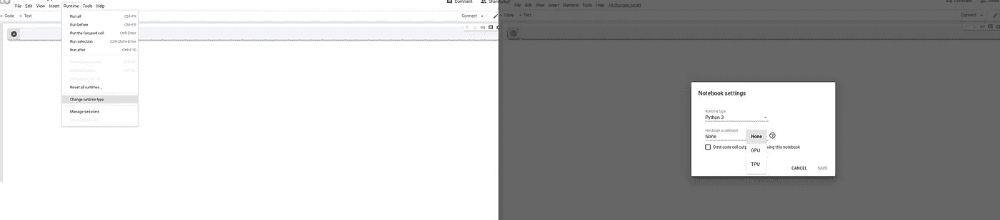
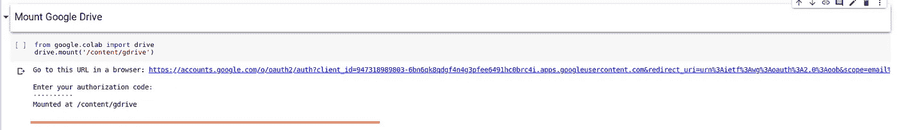
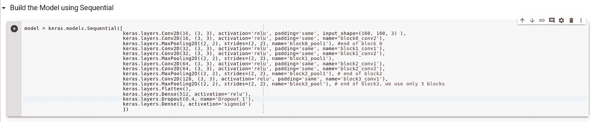
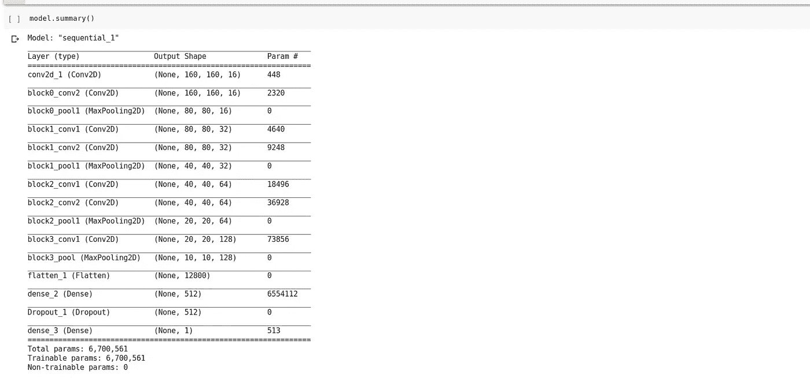
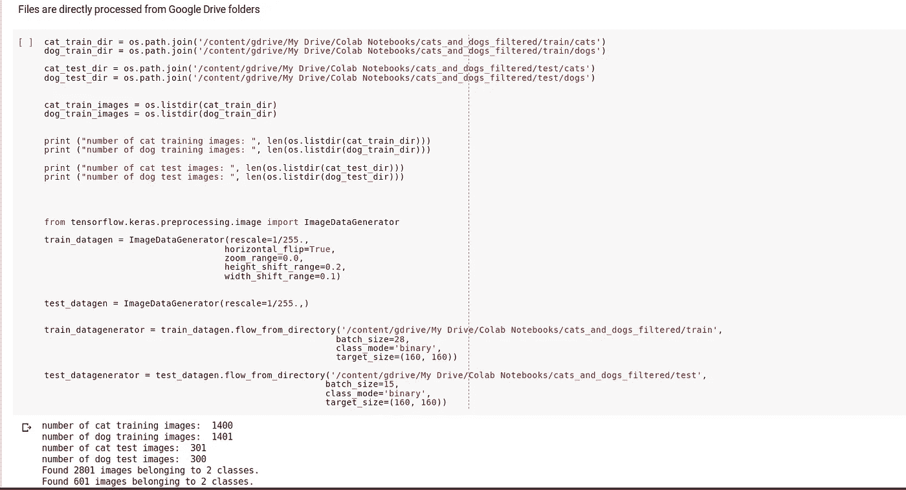
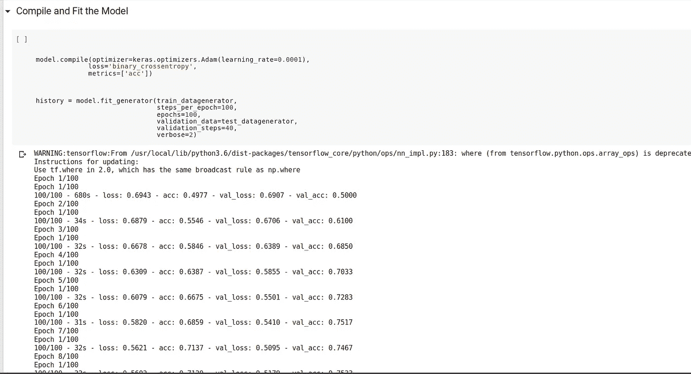
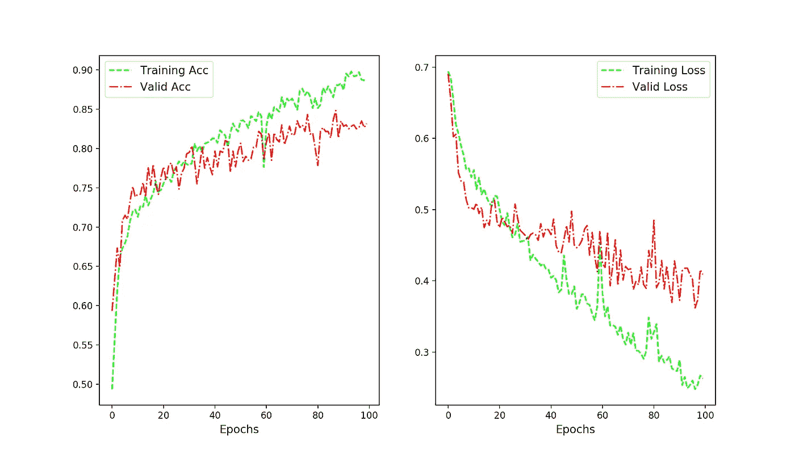
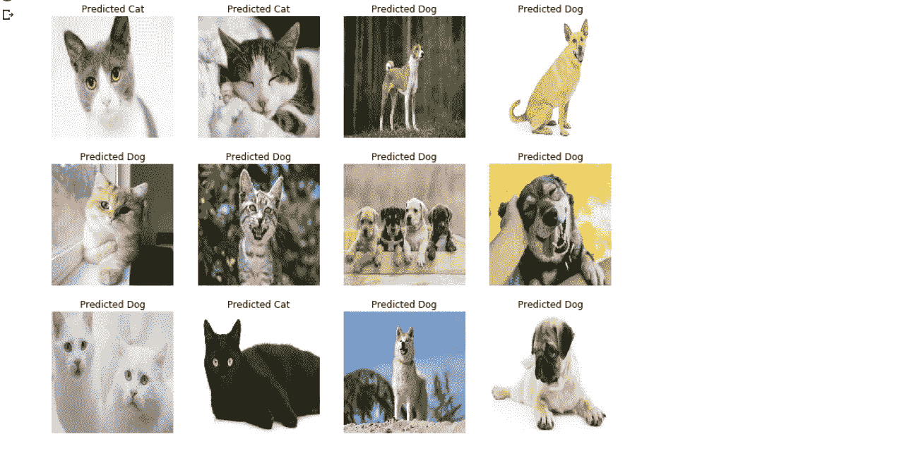
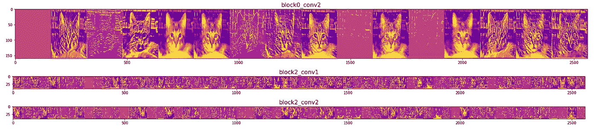
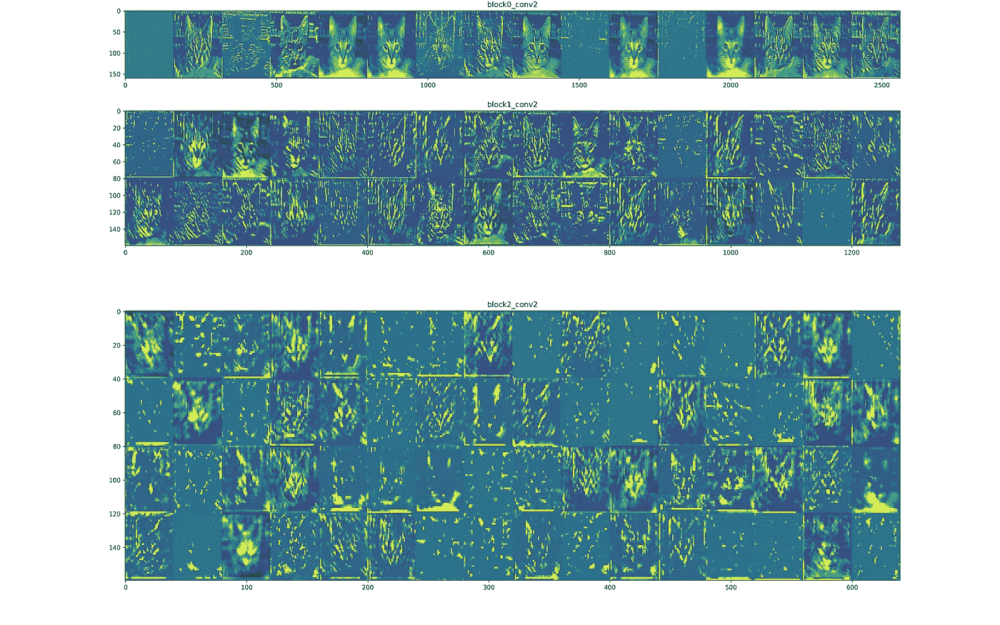

# 神经网络在图像中寻找特征有多深？有了 Keras 和 Google Colab

> 原文：<https://towardsdatascience.com/how-deep-neural-network-look-for-features-in-images-with-keras-and-google-colab-28209d57f771?source=collection_archive---------15----------------------->

## 从隐藏图层中提取 Conv 图层输出


What’s in the net? ([Source: Pixabay](https://pixabay.com/users/mac231-5473271/))

当我第一次开始从学习标准的机器算法(如逻辑回归、支持向量机)走向深度学习和神经网络时，我常常着迷于网络中的深层是一种“黑盒”。后来，这种错误的理解消失了，一旦我学会绘制中间卷积层的输出，随机选择图像并查看每一层中发生的事情几乎成了一种痴迷。今天，我想一步一步地描述你如何从隐藏的 conv 中提取特征。使用 Keras 的层(运行在 TensorFlow 之上)。为了简单起见，我采用了[狗与猫的数据集](https://www.kaggle.com/c/dogs-vs-cats)，我将构建一个类似 VGG16 的模型，因此，这个问题本质上归结为一个二进制分类问题。

你可以从这篇文章中学到什么—

*   学会使用[谷歌 Colab](https://colab.research.google.com/notebooks/welcome.ipynb) 部署你的深度学习模型。我发现这非常有用，因为你可以免费使用云 GPU，12.72 GB 内存和 350 GB 磁盘空间。
*   提取隐藏的 conv。使用 Keras 的图层输出。
*   两种不同的方法平铺这些输出以形成紧凑的图像。

因此，让我们立即开始吧！

# 设置 Google Colab 环境:

如果你没有 GPU 和大量的 CPU 资源，Google Colab 可以帮助你训练中度到重度的深度网络。目前，Colab 提供 12 GB Nvidia Tesla GPU，可以连续使用长达 12 小时。如果你习惯于在 Jupyter 环境下工作，你可以很容易地适应 Google Colab。查看 Google 提供的关于使用 Colab 的详细教程，在这里，我描述了完成教程的两个必要步骤。

1.  *使用 GPU:* 要访问 GPU，您需要更改运行时类型。下图显示了 Colab 环境。



2.安装你的硬盘:你需要安装你的谷歌硬盘来访问硬盘上的文件。为此，您需要运行以下命令—

```
from google.colab import drive
drive.mount('/content/gdrive')
```



URL 将为您提供一次性授权码，将其复制并粘贴到下面的框中，然后按 enter 键。你会得到确认——

```
Mounted at /content/gdrive. 
```

之后，您就可以直接使用驱动器中的文件和文件夹了。现在让我们深入教程。

# 用 Colab 内部的 Keras 训练深度神经网络

让我们使用 [Keras Sequential](https://keras.io/models/sequential/) 来构建我们的模型



为了更快地完成训练，我使用了一个更像迷你版 VGG16 架构(2 层 conv)的模型。层，后跟一个池层)，输入大小设置为(160，160)。让我们检查一下模型摘要—



我猜你们大多数人都知道计算参数。但是让我们先来回顾一下前几层。对于第一层，输入图像大小为(160，160)3 个通道 *(n_c)* 。滤波器尺寸 *(f)* 为(3，3)，滤波器数量 *(n_f)* 为 16。所以总重量数(f× f × n_f × n_c) = 432。偏差数= n_f = 16。参数总数= 448。同样，对于第二层，权重= (3× 3 × 16 × 16) = 2304，偏差= 16，因此，参数总数= 2320，依此类推…

*数据预处理:*在使用[*Keras imagedata generator*](https://keras.io/preprocessing/image/)类之前，我们要记住这里我们会直接从 google drive 中使用文件和文件夹。所以我们必须精确文件路径。让我们看看修改后的代码块—



为了节省时间，我只用了 2800 张图片进行训练，用了 600 张图片进行验证。接下来不可避免的是编译和拟合模型——



我使用了 100 个历元，通过参数设置，在训练和验证数据上实现了 89%和 83%的准确度。在使用 GPU 的 Google Colab 中，训练这个模型大约需要 75-80 分钟。



我试着预测从互联网上下载的一些随机图片上的类别标签



我看到 3 张图片包括一只愤怒的猫被预测为狗。我们的重点不是提高精确度，而是检查隐藏 conv 的输出。层，并了解层中的不同滤镜如何试图在图像中找到不同的特征。让我们这样做

## 可视化 Conv 图层输出:

我将描述两种可视化 conv 的方法。图层输出，它们非常相似，但是平铺图像的过程不同。你可以根据你的喜好来选择…

*第一种方法:水平叠加层输出*

让我们检查图层名称:

```
from keras.preprocessing.image import load img_to_array, load_img
import random layer_names_list = [layr.name for layr in model.layers]
print ("layer names list: ", layer_names_list) >>> layer names list: ['conv2d_1', 'block0_conv2', 'block0_pool1', 'block1_conv1', 'block1_conv2', 'block1_pool1', 'block2_conv1', 'block2_conv2', 'block2_pool1', 'block3_conv1', 'block3_pool', 'flatten_1', 'dense_2', 'Dropout_1', 'dense_3']
```

我会选择几个 conv。我希望看到输出的图层，

```
selected_layers = [‘block0_conv2’, ‘block2_conv1’, ‘block2_conv2’]matched_indices = [i for i, item in enumerate(layer_names_list) if item in selected_layers]print (matched_indices)>>> [1, 6, 7]
```

为了从选定的层中获得输出，我们将使用[*Keras layer . output*](https://keras.io/layers/about-keras-layers/)方法。然后将输出附加到一个列表上，让我们看看:

```
selected_layers_outputs = []for lr in range(len(matched_indices)): outputs = model.layers[matched_indices[lr]].output 
   #output from selected layers selected_layers_outputs.append(outputs)
```

下一步是重要的，因为我们将实例化一个新的模型，它将采取一个随机的图像(猫或狗)作为输入，输出将是选定的 conv。层输出。查看 [Keras 模型 API](https://keras.io/models/model/) 了解更多详情。

```
visual_model = keras.models.Model(inputs = model.input, outputs = selected_layers_outputs)
```

如果你记得我们的原始模型(VGG 喜欢)的输入，它是输入大小(无，160，160，3)的图像批次。我们将选择相同的输入尺寸维度，但是因为我们只想一次只处理 1 个随机选择的图像，所以我们的批量大小将是 1。首先，让我们随机选择一个图像，我们将使用 [random.choice，](https://docs.python.org/3/library/random.html)从非空序列中返回一个随机元素。

```
dog_files = [os.path.join(dog_train_dir, f) for f in dog_train_images]cat_files = [os.path.join(cat_train_dir, g) for g in cat_train_images]random_cat_dog = random.choice(dog_files + cat_files)print (“random file name: “, random_cat_dog)
```

在下一步中，我们希望调整这个图像的大小，并将这个图像转换为一个 numpy 数组，最后，将其重新整形为一致的格式(批量大小、高度、宽度、通道)。让我们使用 [Keras load_img、](https://www.tensorflow.org/api_docs/python/tf/keras/preprocessing/image/load_img) Keras [img_to_array](https://www.tensorflow.org/api_docs/python/tf/keras/preprocessing/image/img_to_array) 和 numpy 模块来实现。

```
rand_img = load_img(random_cat_dog, target_size=(160, 160))rand_img_arr = img_to_array(rand_img)print ("shape of selected image :", rand_img_arr.shape)x_in = np.reshape(rand_img_arr, (1, 160, 160, 3)) # batch size 1>>> shape of selected image : (160, 160, 3)
```

一旦我们以适合作为模型输入的格式处理了图像，让我们从模型中为所选层生成预测。

```
selected_feature_maps = visual_model.predict(x_in)
```

现在是以这种方式安排这些预测的部分，这样就有可能可视化每个过滤器对那些选定层的影响。这部分有点棘手，我们需要用 numpy 来释放我们的游戏性。让我简单介绍一下我们如何进行。如果你回头看 model.summary()，那么你将得到形状的概述，元组的最后一个元素是过滤器的数量，元组的第一/第二个元素是图像的高度/宽度。首先，我们创建具有形状(高度，高度*过滤器数量)的零网格，以便稍后我们可以水平堆叠输出。接下来，我们对过滤器的数量进行循环。我们需要记住，批量大小为 1，因此，要从选定的层中选择特定的滤波器输出，我们需要这样做(稍后查看详细代码)—

```
for i in range(n_filters):
  y = feat_map [0, :, :, i]
```

然后，我们对过滤器的输出进行标准化和后处理，使其在视觉上可识别。最后，我们将过滤器输出堆叠在我们之前创建的显示网格中(零网格)。使用[*matplotlib imshow*](https://matplotlib.org/3.1.1/api/_as_gen/matplotlib.pyplot.imshow.html)，我们可以将图像并排堆叠的特定图层上的每个滤镜的效果可视化。如下图所示。我发现了一个关于[如何使用 *imshow* 方法](https://stackoverflow.com/questions/49434754/how-does-the-pyplot-imshow-function-work)的非常详细的答案；请检查一下，以便更好地理解下面代码中第二个 for 循环的最后一行发生了什么。

```
for lr_name, feat_map in zip(selected_layers, selected_feature_maps): n_filters = feat_map.shape[-1] n_size = feat_map.shape[1] display_grid = np.zeros((n_size, n_size * n_filters)) for i in range(n_filters): y = feat_map[0, :, :, i] y = y - y.mean() y = y/y.std() y = y*64 y = y + 128 y = np.clip(y, 0, 255).astype('uint8')# value only between 0, 255\.    display_grid[:, i * n_size : (i+1) * n_size] = y scale = 20./n_filters plt.figure(figsize=(scale * n_filters * 1.4, scale * 2)) plt.title(lr_name, fontsize=16) plt.grid(False)plt.imshow(display_grid, aspect='auto', cmap='plasma')plt.savefig('/content/gdrive/My Drive/Colab Notebooks/cat_dog_visual_%s.png'%(lr_name), dpi=300)
```



Figure 1: Stacking output from each filter horizontally from 3 different convolutional layers.

在这里，我们可以看到模型的第二层 *(block0_conv2)* 中的滤波器看到完整的输入(160，160)，主要是寻找一些基本的边缘。但是，*随着我们深入*输入尺寸减小，例如在 *block2_conv2* 层中，图像的形状是(40，40)，这里视觉信息几乎无法识别，但是与图像类别相关的*特征被过滤器捕获。*您还可以看到，随着我们深入网络，稀疏过滤器的数量也在增加，因为随着每层中过滤器数量的增加，前一层过滤器编码的模式在当前层中看不到。这就是为什么几乎总是你会看到，在第一层所有的过滤器被激活，但从第二层稀疏性增加。

我发现前面的水平堆叠输出的方法很合理，但在视觉上并不引人注目，所以我给出了我在 Francois Chollet 的书[用 Python 进行深度学习](https://www.amazon.co.jp/Deep-Learning-Python-Francois-Chollet/dp/1617294438)中找到的第二种方法。这与第一个非常相似，但我们不是水平堆叠所有过滤器的输出，而是将它们放在一个数组中。这里的主要概念是确定阵列的形状，并像前面一样堆叠滤波器输出。

*第二种方法:*这里我们从每层中使用的过滤器数量中获益，即它们都是 16 的倍数。因此，每个网格的列数将是 16，行数将取决于所选卷积层中使用的滤波器数量。因此，列数(ncols)由=滤波器数/16 给出。这里，我们的零网格将有形状(高*ncols，16 *宽)。考虑图像的高度和宽度在每一层中都是相同的。

```
images_per_row = 16for lr_name1, feat_map1 in zip(selected_layers1, selected_feature_maps1): n_filters1 = feat_map1.shape[-1] n_size1 = feat_map1.shape[1] n_cols = n_filters1 // images_per_row display_grid1 = np.zeros((n_size1 * n_cols, images_per_row * n_size1)) for col in range(n_cols): for row in range(images_per_row): chan_img = feat_map1[0, :, :, col*images_per_row + row] chan_img = chan_img — chan_img.mean() chan_img = chan_img / chan_img.std() chan_img = chan_img * 64 chan_img = chan_img + 128 chan_img = np.clip(chan_img, 0, 255).astype(‘uint8’) display_grid1[col * n_size1 : (col+1) * n_size1, row * n_size1 : (row+1) * n_size1] = chan_img scale1 = 1./n_size1 plt.figure(figsize=(scale1 * display_grid1.shape[1]*1.4, scale1 * display_grid1.shape[0] * 2.)) plt.title(lr_name1) plt.grid(False) plt.imshow(display_grid1, aspect=’auto’, cmap=’viridis’) plt.savefig(‘/content/gdrive/My Drive/Colab Notebooks/cat_dog_visual2_%s.png’%(lr_name1), dpi=300)
```



Figure 2: Arranging the same images as in Figure 1 more cleanly so that they are easy to interpret and understand.

有了这个表示，你可以清楚地看到我们的模型中更深层的过滤器如何集中在猫的特定特征上，如眼睛、鼻子、眉毛区域等的形状。

在这篇文章中，我们看到了如何使用 Google Colab 来构建和训练你的相当大的深度学习网络。我们的主要焦点是通过深层神经网络的几个层来可视化图像的旅程，我们已经学会了两种方法来做到这一点。此外，可视化应该帮助我们更好地看透和理解它们，而不是将深层视为黑盒。

## 参考资料:

[1] [用于大规模图像识别的极深卷积网络](https://arxiv.org/pdf/1409.1556.pdf)；k .西蒙扬 a .齐塞曼。

[2] [谷歌的 Colab 教程](https://colab.research.google.com/notebooks/welcome.ipynb)。

[3] [Tensorflow 专业化课程:深度学习. ai](https://www.deeplearning.ai/tensorflow-in-practice/)

【4】[用 Python 进行深度学习；](https://www.amazon.co.jp/Deep-Learning-Python-Francois-Chollet/dp/1617294438)弗朗索瓦·乔莱。第 160-177 页。

[5][Colab 中处理文件的资源](https://neptune.ai/blog/google-colab-dealing-with-files) : Neptune.ai

[6] [链接到本帖使用的笔记本！](https://github.com/suvoooo/Learn-TensorFlow/blob/master/Transfer_Learning/building_VGG16_visualization.ipynb)