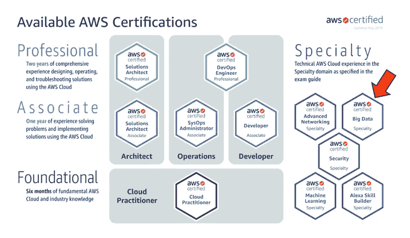
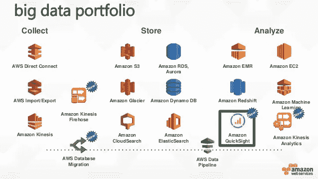

# 我是如何获得 AWS 大数据专业认证的

> 原文：<https://towardsdatascience.com/how-did-i-get-certified-with-aws-big-data-specialty-e26f20114d3c?source=collection_archive---------10----------------------->

Photo by Fernando Hernandez on Unsplash

一般来说，没有直接的规则来获得任何认证。这完全取决于你在考试前的作业中探索了多少。我必须完成在 Cloud Guru、Linux Academy 和 Udemy 等学习服务网站上创建的关于 AWS cloud 的多门课程，还必须阅读各种 AWS 白皮书，以建立参加这次考试的信心。

我已经从我的同龄人和朋友那里听到了他们对考试感到多么困难的故事，以及他们离开大学 10 多年后坐 3 个小时是多么困难。他们中的少数人不得不再次出现，因为他们无法完成，不是为了吓唬你，而是让你做好准备。这些故事让我做好准备，而不是放弃。

以下是我准备这个认证的旅程。

Photo from aws.amazon.com

1.  如果您有一些大数据背景，那么遵循概念和云背景会非常有帮助。
2.  建议您在开始学习 AWS BigData 专业知识之前，先完成 AWS 解决方案架构师助理课程或认证。乍一看，我忽略了它，直接开始学习课程，并认为有必要完成解决方案架构师助理课程，因为对主要的 AWS 服务有基本的了解是非常必要的。
3.  然后在下面的学习平台中学习 AWS 认证大数据专业课程。

Courtesy : google

[https://learn . a cloud . guru](https://learn.acloud.guru/)—作者:Sanjay Kotecha，将为您提供该认证所需的 AWS 服务的所有基础知识。我经历了两次，但第二次是以两倍的速度。

Courtesy : google

【https://linuxacademy.com[——作者:Fernando Medina Corey，你可以快速跟踪课程，但 IOT 概念和服务对服务的集成解释得很好，这对考试来说是非常必要的。课程结束时有一次模拟考试。随着问题的不断变化，尝试至少完成 3 次。](https://linuxacademy.com/)

Courtesy : google

【https://udemy.com】—作者:弗兰克·凯恩&夏羽·马瑞克，不要跳过或忽略本课程，因为像安全性、每个服务用例以及反用例等最重要的概念都得到了很好的解释。

完成上述课程后，请阅读 AWS 发布的白皮书和文档。

1.  AWS 大数据分析白皮书

[https://D1 . AWS static . com/white papers/Big _ Data _ Analytics _ Options _ on _ AWS . pdf？did=wp_card & trk=wp_card](https://d1.awsstatic.com/whitepapers/Big_Data_Analytics_Options_on_AWS.pdf?did=wp_card&trk=wp_card)

**请不要跳过阅读此白皮书**，因为您肯定能够回答 2-3 个问题，并且会从 AWS 的角度让您对服务有更深入的了解。

2.AWS kine sis 白皮书:[https://aws.amazon.com/kinesis/whitepaper/](https://aws.amazon.com/kinesis/whitepaper/)

3.确保电子病历安全的最佳实践:[https://AWS . Amazon . com/blogs/big-data/best-practices-for-securing-Amazon-EMR/](https://aws.amazon.com/blogs/big-data/best-practices-for-securing-amazon-emr/)

4.关注亚马逊在 youtube 上的“这是我的建筑”视频——https://www.youtube.com/playlist?[list = plhr 1 kzpdzukdex 8 MQ 2 qo 73 BG 6 ukqhyshb](https://www.youtube.com/playlist?list=PLhr1KZpdzukdeX8mQ2qO73bg6UKQHYsHb)

5.AWS 准备的样本测试:[https://D1 . AWS static . com/training-and-certification/docs-big data-spec/BD-S % 20 sample % 20 questions % 20 for % 20 web . pdf](https://d1.awsstatic.com/training-and-certification/docs-bigdata-spec/BD-S%20Sample%20Questions%20for%20Web.pdf)

考试试图在以下主题上测试您:

aws.amazon.com

1.  AWS S3 几乎回答了所有关于存储的问题。
2.  红移是考试中你会看到的第二高的时间。诸如复制快照或从快照中只重新生成一个表等问题。,
3.  Kinesis 流和消防软管也非常频繁地出现。
4.  安全服务，如 VPC、安全令牌服务等。,
5.  在 AWS S3、静态/传输中、客户端/服务器端、HSM，对象是如何加密的？
6.  发电机 DB 和加速器
7.  机器学习和 Sage Maker，GPU 单元
8.  EMR 概念和 HIVE、HBASE、spark、spark streaming 等技术
9.  兰姆达斯
10.  关于数据管道、本地数据迁移服务、DirectConnect 的几个问题。
11.  更多关于 QuickSight 和图表类型，如气泡图、热图等。,
12.  雅典娜，管道，胶水(目录/爬虫)

你准备得越充分，就越有可能通过认证。

祝你好运！！！！