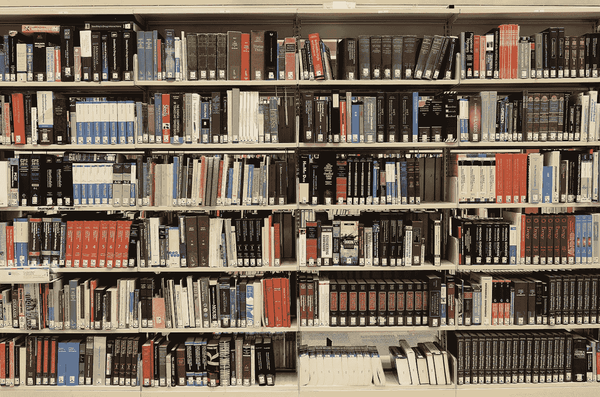
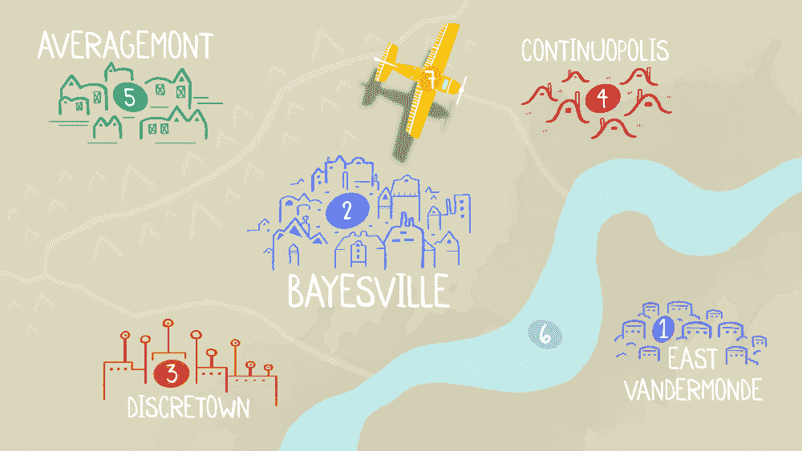
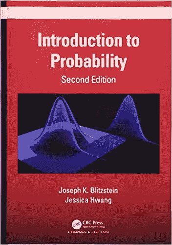
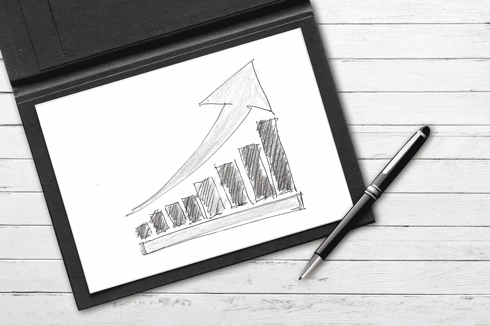
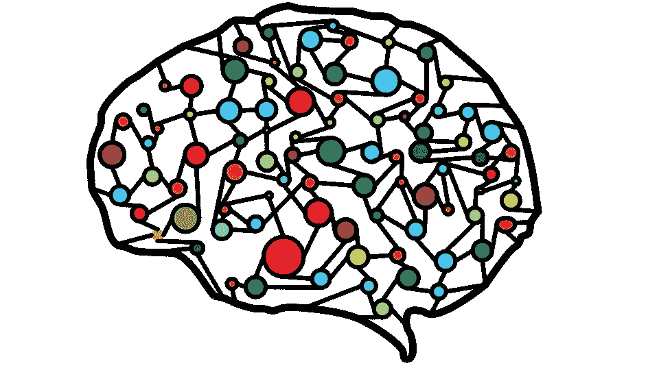

# 我是怎么学数据科学的？

> 原文：<https://towardsdatascience.com/how-did-i-learn-data-science-d5f7fc477997?source=collection_archive---------1----------------------->

Image by [ElasticComputeFarm](https://pixabay.com/?utm_source=link-attribution&amp;utm_medium=referral&amp;utm_campaign=image&amp;utm_content=1147815)

## 自学、MOOCs 和努力

我是一名机械工程师。我的职业生涯始于钢铁行业的一份核心工作。

但是我不喜欢它，所以我离开了。

我的目标是在 2013 年左右进入分析和数据科学领域。从那以后，我经历了很多失败，也付出了很多努力。

现在，社交网络上的人问我是如何开始进入数据科学领域的。所以我想到了给一个确定的答案。

> 做到这一点并非不可能，但这需要花费大量的时间和精力。幸运的是，我两者都有充足的供应。

下面给出的是我走的路，任何有抱负的人都可以选择成为一名自学成才的数据科学家。

有些课程和我以前学的不一样，因为有些已经不存在了，有些已经被合并成更大的专业。但我已经尽量让它和我的经历保持尽可能的相似。

还有，希望你看到长长的名单后不要失去希望。你必须从一两门课程开始。其余的将随着时间的推移。记住我们有充足的时间。

按顺序来。我试着把我想到的所有东西都包括进来，包括一些我认为可能有益的帖子链接。

# 概率统计导论

[***Stat 110***](https://www.awin1.com/cread.php?awinmid=6798&awinaffid=633074&clickref=&p=%5B%5Bhttps%3A%2F%2Fwww.edx.org%2Fcourse%2Fintroduction-to-probability-0%5D%5D)***:***你要上的概率统计精粹课程。所有的讲座和笔记都可以在 Youtube 和他的网站上免费获得。另一方面，如果你正在寻找一个认证证书和一个正在进行的课程，你也可以参加加州大学圣地亚哥分校的这个课程。我这样做是作为数据科学领域 [MicroMasters 专业化](http://www.awin1.com/cread.php?awinaffid=633074&awinmid=6798&platform=dl&p=%5B%5Bhttps%3A%2F%2Fwww.edx.org%2Fmicromasters%2Fuc-san-diegox-data-science%5D%5D)的一部分。

所以回到 STAT110。你应该选这门课，如果不是为了内容，而是为了约瑟夫·布利茨坦教授的幽默感。上图就是一个证明。

我上这门课是为了增强我对概率分布和统计的理解，但这门课教给我的远不止这些。

除了学会有条件地思考，这也教会了我如何用一个故事来解释困难的概念。

对于初学者来说，这是一门具有挑战性的课程，但绝对有趣。 重点不仅在于获得数学证明，还在于理解它们背后的直觉，以及直觉如何帮助快速推导证明。有时同样的证明用不同的方式来帮助学习一个概念。

我最喜欢这门课的一点是在解释抽象概念的同时关注具体的例子。

***包含赌徒破产问题、匹配问题、生日问题、蒙蒂霍尔、辛普森悖论、圣彼德堡悖论等。使这门课程比任何普通的统计学课程都更加令人兴奋和愉快。***

***它将帮助你理解离散(伯努利、二项式、超几何、几何、负二项式、FS、泊松)和连续(均匀、正态、expo、Beta、Gamma)分布。***

他还得到了一本基于本课程的[教材](https://www.amazon.com/Introduction-Probability-Chapman-Statistical-Science/dp/1138369918/ref=sr_1_2?keywords=joseph+blitzstein&qid=1565280669&s=gateway&sr=8-2)，是一本优秀的课文，是任何书架的必备。

Link

# Python 和数据科学简介:

> 先做，后理解

在完全理解机器学习之前，我们需要先体验一下。这一部分由三部分组成。这些并不是我学习 Python 和数据科学入门的确切课程。但是它们非常相似，而且都是为目的服务的。

## Python 中的数据科学简介

[这门课](https://coursera.pxf.io/LPyWGV)是关于学习使用 Python 和自己创造东西的。您将了解到用于数据科学的 *Python 库*，如 **Numpy、Pandas** 。我也喜欢这个来自数据科学[微大师](http://www.awin1.com/cread.php?awinaffid=633074&awinmid=6798&platform=dl&p=%5B%5Bhttps%3A%2F%2Fwww.edx.org%2Fmicromasters%2Fuc-san-diegox-data-science%5D%5D)专业的[课程](https://www.edx.org/course/python-for-data-science-3)。

在学习本课程的过程中，你可能还会喜欢我关于[数据科学家最小熊猫](/minimal-pandas-subset-for-data-scientists-6355059629ae)和高级 python 小短片的帖子。

 [## 数据科学家的最小熊猫子集

### 您需要的所有熊猫功能

towardsdatascience.com](/minimal-pandas-subset-for-data-scientists-6355059629ae)  [## Python 短片——走向数据科学

### 阅读关于 Python 的文章，了解数据科学。分享概念、想法和代码。

towardsdatascience.com](https://towardsdatascience.com/tagged/python-shorts) 

网站上的课程描述:

> 本课程将向学习者介绍 python 编程环境的基础知识，包括基本的 python 编程技术，如 lambdas、读取和操作 csv 文件以及 numpy 库。本课程将使用流行的 python pandas 数据科学库介绍数据操作和清理技术，并介绍作为数据分析中心数据结构的系列和数据框架的抽象，以及如何有效使用 groupby、merge 和 pivot 表等函数的教程。在本课程结束时，学生将能够获取表格数据，清理它，操作它，并运行基本的推断统计分析。

## Python 中的应用机器学习

[本课程](https://coursera.pxf.io/QOvWga)介绍了许多你应该知道的现代机器学习方法。不是彻底的打磨，但你会得到工具来建立你自己的模型。您将学习 scikit-learn，它是创建各种模型的 python 库。

这里的重点是尽快开始创造东西。没有人喜欢等太久才能得到有用的东西，学完这门课你就变得有用了。

> **本课程将向学习者介绍应用机器学习，更侧重于技术和方法，而不是这些方法背后的统计数据。**本课程将首先讨论机器学习与描述性统计有何不同，并通过教程介绍 scikit learn 工具包。

你可能还想看一看这个机器学习基础[课程](https://www.edx.org/course/machine-learning-fundamentals-4)来更彻底地钻研数学。

## c)可视化

> 一个制作精良的视觉效果比任何 PPT 都有价值

你还需要学习的一件事是可视化。这是一个不断发展的领域，许多新的库不断出现。我最常用的库是 Seaborn 和 Plotly。

你可以看看下面的帖子，开始学习基本和高级可视化。

 [## Python 的一行图形创建库，带有汉斯·罗斯林风格的动画

### 动画，单线图。它拥有一切

towardsdatascience.com](/pythons-one-liner-graph-creation-library-with-animations-hans-rosling-style-f2cb50490396)  [## 针对每个数据集的 3 种出色的可视化技术

### 同时学习一些关于足球的知识

towardsdatascience.com](/3-awesome-visualization-techniques-for-every-dataset-9737eecacbe8) 

# 机器学习基础

完成上述课程后，你将获得我称之为**“初学者”的地位**

恭喜你。！！。*你懂东西；你知道如何实现事情*。

然而，你并没有完全理解所有这些模型背后的数学和计算。

你需要理解`clf.fit`背后的含义

> 如果你不理解它，你就不能改进它

游戏改变者[机器学习课程](https://coursera.pxf.io/NKERRq)来了。包含许多机器学习算法背后的数学。

我会把这门课作为*你必须上的一门课*，因为这门课激励我进入这个领域，而吴恩达是一位伟大的导师。还有，这是我刚开始的时候自己上的第一门课。

这门课程什么都有——回归、分类、异常检测、推荐系统、神经网络，还有很多很棒的建议。

在这之后，你就和这个行业的三个火枪手玩完了。

您知道 Python，您理解统计学，并且您已经尝到了 ML 方法背后的数学滋味。现在是新成员登场的时候了。达达尼昂。这孩子有技术。虽然三个火枪手都是各自行业的大师，但这个家伙带来的品质为我们的数据科学之旅增添了新鲜感。

大数据来了。

# 使用 Spark 的大数据分析

> 大数据无处不在。处理好它。

自从我学习 Hadoop 以来，整个大数据生态系统已经发生了很大的变化。那时斯帕克是街区里的新人。那些日子…

到目前为止，我所学的课程相当多余，所以我会试着推荐一些适合这个时代的课程。我能找到的最能体现我从分散资源中学到的东西的课程是使用 Spark 的[大数据分析。](https://www.awin1.com/cread.php?awinmid=6798&awinaffid=633074&clickref=&p=%5B%5Bhttps%3A%2F%2Fwww.edx.org%2Fcourse%2Fbig-data-analytics-using-spark-2%5D%5D)

完成本课程后，您将从课程网站了解到:

> 使用 Pyspark 编程 Spark
> 
> 确定 Spark 应用程序中的计算权衡
> 
> 使用 Spark 和 Parquet 执行数据加载和清理
> 
> 通过统计和机器学习方法对数据建模

你也可以看看我最近在 Spark 上的帖子。

 [## 使用 Spark 处理大数据的指南

### 不仅仅是介绍

towardsdatascience.com](/the-hitchhikers-guide-to-handle-big-data-using-spark-90b9be0fe89a) 

# 了解 Linux Shell

不是硬性要求，但有技能是件好事。壳牌是数据科学家的大朋友。它允许您在终端本身执行简单的数据相关任务。我无法强调 shell 每天为我节省了多少时间。

你可以阅读我下面的帖子来了解这一点:

 [## 用你新获得的壳技能打动旁观者

### 数据科学家的 10 分钟外壳/终端技能

towardsdatascience.com](/impress-onlookers-with-your-newly-acquired-shell-skills-a02effb420c2) 

如果你想参加一门课程，你可以看看 Coursera 上的 UNIX 工作台课程。

恭喜你现在是“黑客”了。

> 你已经掌握了成为数据科学家的所有主要工具。

转到更高级的话题。从这里开始，就看你想学什么了。

你可能想采取一种完全不同于我现在所采取的方法。没有特别的顺序。**“条条大路通罗马”**只要你在动。

# 学习统计推断

mine etinkaya-Rundel 教授关于[推断统计学](https://coursera.pxf.io/DVZ13d)的课程。没有比这更简单的了。

她是一个很好的老师，并且很好地解释了统计推断的基础——这是一门必修课。

您将学习假设检验、置信区间和数字和分类数据的统计推断方法。

# 深度学习

> 这都是关于层次的

[**简介**](http://www.fast.ai/) —让神经网络再次变得不酷。这是神经网络的代码优先类。Kaggle 大师杰瑞米·霍华德的精彩深度学习课。寓教于乐。

**高级** —你可以再试试吴恩达的这个[深度学习专精](https://coursera.pxf.io/7mKnnY)。纯金的。

[**高等数学书**](http://amzn.to/2npItnM)——由 Yoshua Bengio & Ian Goodfellow 所著的一本数学密集型书籍

如果你想学习 Pytorch，看看下面的帖子。

 [## 从喀拉斯到皮托尔彻

### 为什么？怎么会？没那么难。

towardsdatascience.com](/moving-from-keras-to-pytorch-f0d4fff4ce79) 

# 学习 NLP，对文本使用深度学习并创建聊天机器人

> 读书被高估了。让机器去做吧。

不久前，自然语言处理引起了我的注意。

我在上面写了 6 篇系列文章。如果你愿意，你可以看看。

 [## Nlp 学习系列—走向数据科学

### 阅读《走向数据科学》中关于 Nlp 学习系列的文章。分享概念、想法和代码。

towardsdatascience.com](https://towardsdatascience.com/tagged/nlp-learning-series) 

# 算法、图形算法等等

> 算法。是的，你需要它们。

除此之外，如果你想学习 Python 和这种语言的潜在复杂性，你也可以参加莱斯大学的计算机科学迷你专业。

这是一系列 6 门短而好的课程。

我参加这些课程是因为数据科学需要你做大量的编程工作。学习编程的最好方法就是实践。

讲课很好，但是问题和作业很棒。如果你学习这个，你将学习面向对象编程，图形算法，以及用 Python 创作游戏。很酷的东西。

你也可以看看:

 [## 每个数据科学家都应该知道的 5 种特征选择算法

### 额外收获:是什么让一个优秀的足球运动员变得伟大？

towardsdatascience.com](/the-5-feature-selection-algorithms-every-data-scientist-need-to-know-3a6b566efd2)  [## 每个数据科学家都需要知道的 5 种采样算法

### 或者至少应该听说过

towardsdatascience.com](/the-5-sampling-algorithms-every-data-scientist-need-to-know-43c7bc11d17c) 

# 一些高等数学题目

> 数学——这一切背后的力量

我最后写在这里，但是不要低估数学在数据科学中的重要性。如果你想更新你的概念，你可能想看一看这些课程。

吉尔伯特·斯特朗的线性代数——一个伟大老师的伟大课。我肯定会向任何想学习线性代数的人推荐这门课。

[**多元微积分**](https://ocw.mit.edu/courses/mathematics/18-02sc-multivariable-calculus-fall-2010/) —麻省理工学院开放课件

**——斯坦福大学的一门关于最优化的 MOOC，由该学科的权威 Steven Boyd 主讲。**

# **结论**

****

**机器学习领域正在发展，每天都有新的进步。这就是我没有放第三层的原因。**

> **我最多可以称自己为“黑客”，我的学习还在继续。**

**每个人都有自己的道路，在这里我提供了我的道路来成为一名数据科学家。这绝不是完美的，因为很明显，有很多东西可以添加进去。**

**虽然我没有完成任何专业培训，但由于上述课程，我认为自己现在更像一名计算机科学工程师，而不是机械工程师。**

**希望他们也能帮到你。**

**谢谢你的阅读。将来我也会写更多初学者友好的帖子。在 [**媒体**](https://medium.com/@rahul_agarwal?source=post_page---------------------------) 关注我或者订阅我的 [**博客**](https://mlwhiz.ck.page/a9b8bda70c) 了解他们。一如既往，我欢迎反馈和建设性的批评，可以通过 Twitter[**@ mlwhiz**](https://twitter.com/MLWhiz?source=post_page---------------------------)联系。**