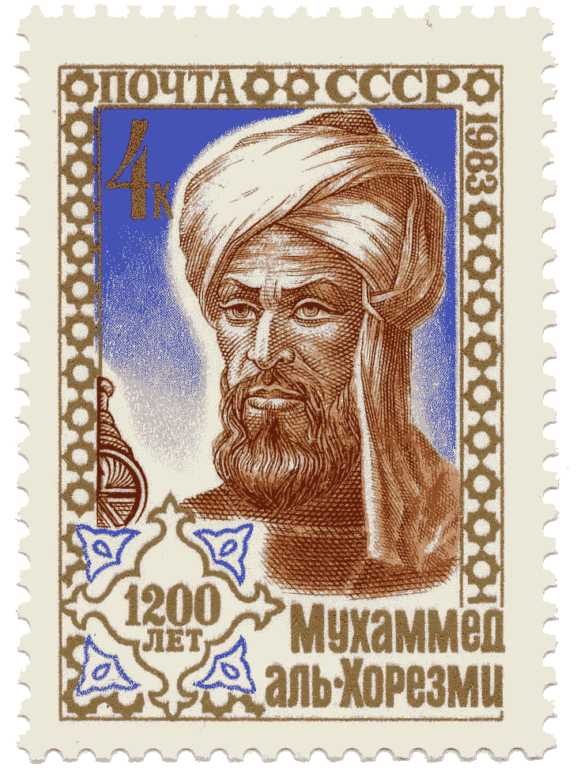
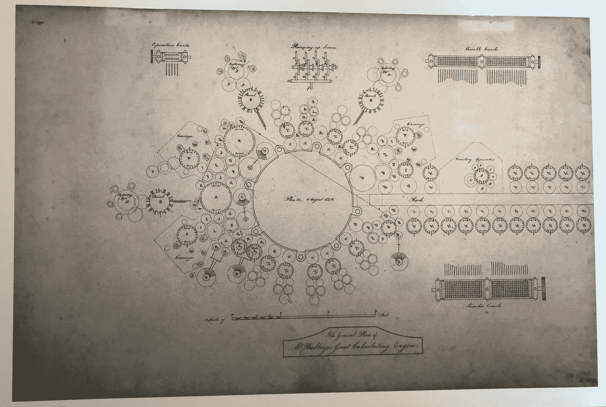
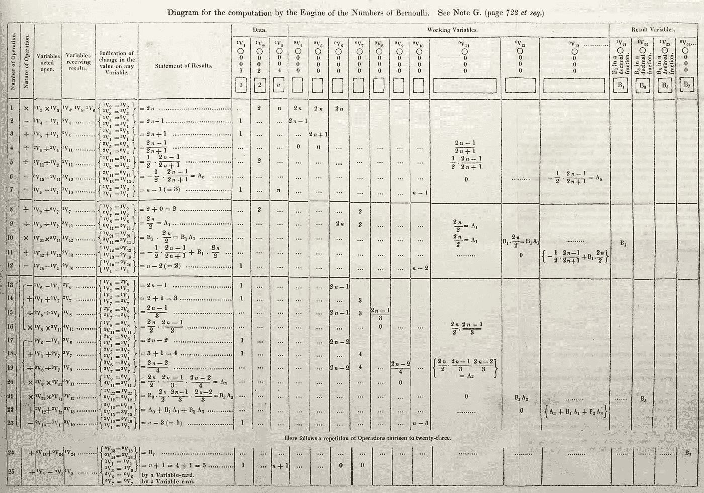

# 我们是怎么到这里的？算法的故事。

> 原文：<https://towardsdatascience.com/how-did-we-get-here-the-story-of-algorithms-9ee186ba2a07?source=collection_archive---------7----------------------->

Image by mehaniq41 (Adobe Stock Photos)

直到最近，算法还是计算机科学家的领域。但是现在，它们已经进入了我们的生活，并且正在变得无孔不入。*算法*已经不是外来词了。算法交易、算法偏见、脸书算法，甚至算法战争——所有这些术语在最近几年已经成为我们词汇的一部分。有些人甚至声称我们生活在一个新时代:算法时代。但是算法并不是那么新。我们有意或无意地使用它们已经有几百年甚至几千年了。算法仅仅是*对实现特定结果所需发生的逐步动作的具体描述*[***【1】***](#_ftn1)。它们是最常见的知识共享工具之一。

> 实际上，任何教人如何做某事的过程都使用算法。

不过，在过去的几十年里，算法的某些方面已经发生了变化。特别是，计算机的引入意味着今天的许多算法比我们过去想象的要复杂得多。今天的算法是如何进化到比过去复杂得多的？让我们简单看看他们的历史。

**指导人类行动的算法**

A stamp issued September 6, 1983, in the Soviet Union, commemorating al-Khwārizmī’s (approximate) 1200th birthday; via Wikimedia Commons

算法一词源自九世纪波斯数学家穆罕默德·伊本·穆斯哈勒·卡瓦·里兹姆的名字。他的拉丁名 Algoritmi，意思是“十进制数系统”,几个世纪以来一直沿用这个意思。算法的现代概念在 19 世纪出现在英语中[【2】](#_ftn2)，自 20 世纪 50 年代以来，随着第一台商用计算机的出现，这一概念变得更加普遍。

> 然而，在算法有了现代名称之前很久，它们就已经被普遍创建和使用了。

第一个算法在古希腊被记录在纸上。学者们，如 Gerasa 的 Nicomachus 或 Euclid，当时正在创建现代数学的基石。为了便于理解和应用他们的想法，他们将许多想法表述为一步一步的行动。

Gerasa 的 Nicomachus 介绍了厄拉多塞的筛子。学习编写高效计算机代码的学生至今仍在使用这个筛子。它有助于简化识别质数的过程。质数是大于 1 的自然数，不能由两个较小的自然数相乘得到。例如，四不是一个质数，因为它可以由二乘二形成。相比之下，五是一个质数，因为没有比五小的自然数可以相乘得到五。虽然识别最初的几个质数并不太难(例如 2、3、5、7、11、13、17、19、23 和 29)，但寻找大质数要花很多时间。[【3】](#_ftn3)而大素数在密码学中是必不可少的。厄拉多塞筛给出了一步一步的指示，用于从一组确定的数(例如 1 到 10，000)中快速去除所有非质数，直到只剩下质数。今天，有许多算法可以简化识别这些数字的任务。厄拉多塞的筛子开创了一整个算法家族，它们有着相同的目标，并且在检测素数方面变得更好(更快，或者需要更少的步骤)。

Sieve of Eratosthenes by SKopp at German Wikipedia [CC BY-SA 3.0 ([http://creativecommons.org/licenses/by-sa/3.0/](http://creativecommons.org/licenses/by-sa/3.0/))]

欧几里德，上面提到的另一位学者，现在比尼科马科斯更有名，他介绍了一种识别两个数的最大公约数的算法。同样，这并不总是一件容易的事，但在许多情况下是必不可少的。欧几里德的算法有助于使这种计算变得容易。欧几里德的算法为什么有帮助？假设你有一个 612 乘 2006 厘米的房间，需要一个新地板。欧几里德的算法将帮助你找到能整齐地覆盖地面的最大方块瓷砖的尺寸。由算法给出的答案是 34 厘米乘 34 厘米，结果得到 18 乘 59 块的布局。当然，每个瓦工都会告诉你，答案是错误的，你根本不知道自己在做什么，因为算法没有考虑灌浆宽度，没有为它留出空间。不要担心:这也可以计算，并巧妙地表达为一种算法。

**指导机器动作的算法**

在接下来的几百年里，更多的算法被创造出来并记录在纸上。然后，他们被个人使用，并按部就班地跟进。第一个打算在机器上执行的算法是由阿达·洛芙莱斯(née Byron)创造的，并于 1843 年发表。

Ada Byron, aged four. Soon, she will become the world’s first computer programmer. By Artist: Alfred, Comte d’Orsay. Digital image; Somerville College, Oxford — Somerville College, Oxford, Public Domain, [https://commons.wikimedia.org/w/index.php?curid=44246375](https://commons.wikimedia.org/w/index.php?curid=44246375)

阿达是一个迷人的人物。她生于 1815 年，是诗人拜伦的独生子。她在数学方面很有天赋。由于对诗歌的热爱显然存在于她的基因中，她设法发展并平衡了对科学和诗歌的热爱。阿达自称她的心态是“诗意的科学”。作为一名熟练的数学家，她认识了查尔斯·巴贝奇，由于他的发明，他通常被称为“计算机之父”。他们都发展了工作关系和友谊。艾达对查尔斯的一项设计非常感兴趣——分析引擎。

A diagram for the Analytical Engine. By ArnoldReinhold — Own work, CC BY 4.0, [https://commons.wikimedia.org/w/index.php?curid=69497631](https://commons.wikimedia.org/w/index.php?curid=69497631)

分析引擎是一台机械计算机——一台自动计算的机器。她为分析引擎编写了第一个算法。她的工作是一个公式，显示如何配置引擎来计算一个特殊的复杂的数字序列，称为伯努利数。这个公式现在被广泛认为是历史上第一个计算机算法。

> Ada 不仅仅局限于纯数学计算。鉴于她生活在十九世纪，她是一个真正的梦想家。

当她的许多同时代人将第一台机械计算机主要视为数字处理器时，她问的是除了执行计算之外还有什么。她对机械计算机作为协作工具的广泛潜力感到好奇。她希望看到计算机能够赋予人类更多的能力，而不仅仅是通过自动化计算。

Lovelace’s diagram from “note G”, the first published computer [algorithm](https://en.wikipedia.org/wiki/Algorithm), by Ada Lovelace — [http://www.sophiararebooks.com/pictures/3544a.jpg](http://www.sophiararebooks.com/pictures/3544a.jpg), Public Domain, [https://commons.wikimedia.org/w/index.php?curid=37285970](https://commons.wikimedia.org/w/index.php?curid=37285970)

不幸的是，分析引擎的构建在 Ada 去世前没有完成，所以她永远无法看到她的算法在运行。可悲的是，分析引擎至今也没有造出来。伦敦科学博物馆在 1991 年才建造了查尔斯·巴贝奇的另一个设计，差分机№2。利用查尔斯·巴贝奇现有的材料和技术，它被证明是可行的。看来巴贝奇只是运气不好，没能完成他的设计。查尔斯工作的其他部分实现存在于其他地方，但不幸的是，我们无法在真正的分析引擎上运行 Ada Byron 的算法。

> 十九世纪成为一个“嵌入机器的算法”的时代。

有很多这样的机器人，可以自动完成各种各样的人类动作。如果你需要在织物上绣出复杂的图案，法国纺织商约瑟夫·玛丽·贾卡有一个解决方案:提花织机。它允许织物制造商使用一系列指示织机如何编织的穿孔卡片来生产复杂的图案。同样，早期的电话交换机使用复杂的机械设备来连接电话。他们自动按照一步一步的指示，最终让两个人互相交谈。这些机器，无论是织机还是交换台，在当时都是开创性的，直到今天仍然令人印象深刻。很难不佩服其中一些机器的复杂程度。然而，所有这些设备仍然是纯机械的。它们由杠杆、开关、轴组成。他们制造了很多噪音。他们离我们现在所说的电脑非常远。

**通用计算机上的算法**

直到 20 世纪 30 年代，我们才第一次看到电子(非机械)计算机中的算法。艾伦·图灵是最早正式记录个人如何进行计算的科学家之一。图灵的目标是捕捉一个一般的过程，而不是一个特定于特定任务的过程，比如识别素数或计算最大公约数。然后，可以使用一般流程来执行特定任务。图灵的概念性工作导致了现在所知的图灵机的发展。图灵机反过来导致了通用计算机的出现。*通用*前缀在这里至关重要。与以前的机器相反，新的计算机可以执行任意组指令。他们可能被用于他们的创造者甚至没有预料到的目的。换句话说:图灵的工作导致了计算机的发展，我们可以在计算机上安装和运行应用程序。

> 如果没有图灵机的概念，你的智能手机上就不会有 Flappy Bird。

几十年后，算法变得极其复杂。事实上，它们是如此复杂，以至于我们常常无法解释它们是如何工作的。在二十世纪，许多人更愿意将计算机算法视为黑盒。你不需要理解它们到底是如何工作的。你所关心的只是输入——什么进入了黑盒——和输出——什么出来了。这种简化是一种选择。在二十一世纪，对于一些算法来说，这不再是一个选择:人类无法准确解释算法如何达到特定的输出，因此我们被迫将这些算法视为黑盒子，或者也许是神奇的盒子。一组这样的算法是一些人工智能算法。我们可以解释它们的原理。例如，我们可以说算法使用人工神经网络。我们还可以解释网络是如何创建的，以及输入如何产生特定的输出。然而，我们无法解释的是*为什么*这个特定的结果是算法的输出，超出了纯机械的解释。[埃里克·l·卢米斯的监禁时间取决于一种算法](https://www.nytimes.com/2017/05/01/us/politics/sent-to-prison-by-a-software-programs-secret-algorithms.html)，他试图理解*为什么*COMPAS 算法将他评定为高风险罪犯。这简直是不可能的。算法的复杂程度往往令人难以招架。而这仅仅是开始。

我们生活在一个算法无处不在的世界——不仅仅是在纸上或我们的脑海中，而是控制着机器、计算机和机器人。

> 它们很小，无处不在，而且——至少在某些情况下——令人费解。

[【1】](#_ftnref1)一个更正式的算法定义是“如何解决一类问题的明确规范”或者“要执行的一套独立的逐步操作”【来源:维基百科算法】

[【2】](#_ftnref2)[www.oed.com/view/Entry/4959](http://www.oed.com/view/Entry/4959)

[【3】](#_ftnref3)截至 2018 年 10 月，已知最大的素数是 277232917-1，一个有 23249425 位数的数。仅仅是检查这个数字是否是质数，就需要在一台当代家用电脑上不间断地计算六天。(https://www.mersenne.org/primes/press/M77232917.html)