# 不同的因素如何影响你的预期寿命

> 原文：<https://towardsdatascience.com/how-different-factors-have-an-influence-on-your-life-expectancy-7b807b04f33e?source=collection_archive---------15----------------------->

## 与你的原籍国相关的属性如何定义你的预期寿命？

在这个星球上，每个人都有自己的截止日期。这一天过后，他们被埋在地下六英尺深的地方腐烂。人类死于多种原因，如事故、疾病、战争和其他形式的死亡。

一个有趣的趋势是，不同国家的人的死亡年龄有所不同。在一些国家，平均死亡年龄约为 50 岁，而在其他一些国家，平均死亡年龄高达 85 岁。

这种巨大差异背后的原因源于这样一个事实，即一些国家已经建立了一个旨在防止除自然/意外死亡以外的任何死亡案例的系统。他们竭尽全力建造桥梁和道路以防止事故发生，他们还使用一些人类可用的最先进的医疗工具。

虽然这些国家正在为延长其公民的预期寿命做出巨大努力，但预期寿命较低的国家没有足够的资源来长期维持其人民的生命。

为了找出决定不同国家预期寿命的因素，进行了一项研究，以找出哪些因素在很大程度上决定了预期寿命。

# 数据收集

用于研究的数据集可以在 [**这里**](https://www.kaggle.com/kumarajarshi/life-expectancy-who) 找到，它是直接从 Kaggle 收集的。该数据集包含不同国家的不同信息，直到最近的 2015 年。

然后，所有关于 2015 年的信息被用来建立一个代表每个国家信息的新数据集。根据预期寿命从高到低排列的国家如下:

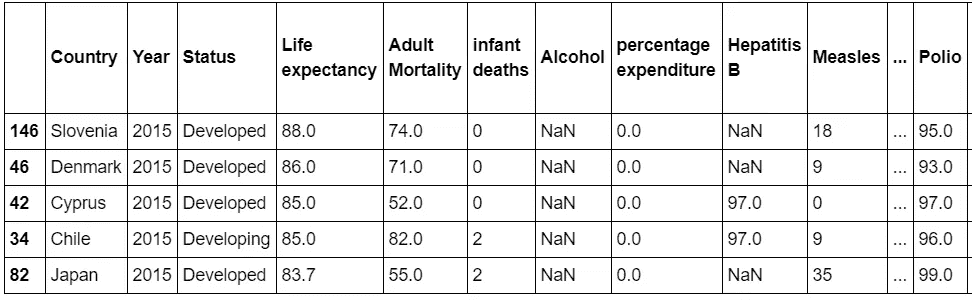

Top five countries with the highest life expectancy.

斯洛文尼亚以 88 岁的预期寿命高居榜首。丹麦位居第二，预期寿命为 86 岁。塞浦路斯和智利位居第三，平均寿命为 85 岁。

# 数据探索

该数据集被进一步研究，以了解某些变量如何随预期寿命而变化。首先，创建了一个表格，以查看发展中国家相对于发达国家的表现。

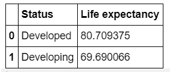

Developing vs Developed countries’ life expectancy

发展中国家和发达国家在预期寿命方面的差距是惊人的。发展中国家的平均预期寿命为 69.69 岁，而发达国家的平均预期寿命为 80.7 岁。

这是一个相关系数表，显示了其他特征与预期寿命的关系。

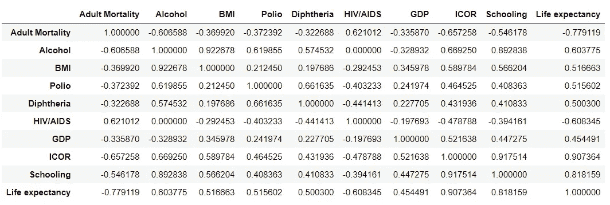

Correlation coefficient table of all the features in the truncated dataset.

此外，还绘制了多个散点图，以显示发展中国家和发达国家在预期寿命方面的差异，这些差异基于其他因素，如受教育程度(受教育年限)、国内生产总值(人均国内生产总值)、成人死亡率(每 1000 名成人的死亡人数)、艾滋病毒/艾滋病(每 1000 名活产婴儿的死亡人数)和资源收入构成(生产资源的使用情况)。下面是散点图:

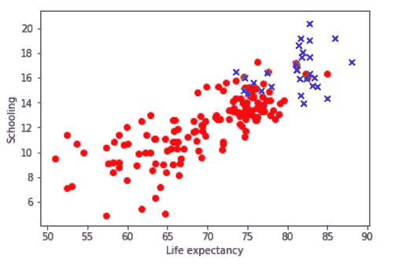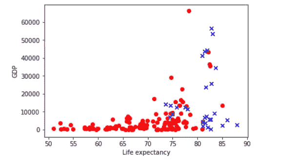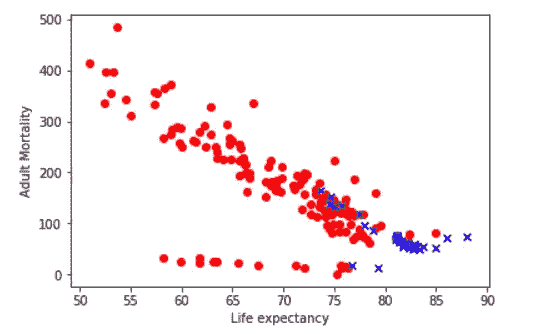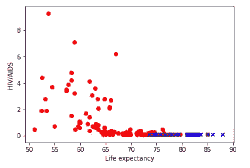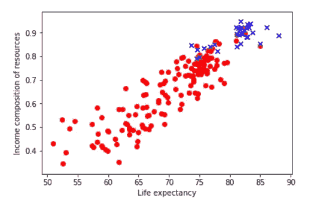

Scatter plots showing how Schooling, GDP, Adult Mortality, HIV/AIDS and Income composition of resources vary with life expectancy.

蓝色 x 标记代表发达国家，而红色圆点代表发展中国家。

学校教育散点图具有很强的正相关性，这表明人们在学校学习的年数可以增加他们的预期寿命。其与预期寿命的相关系数为 0.82。

国内生产总值散点图呈中度正相关，这意味着人均国内生产总值对预期寿命没有太大影响。其与预期寿命的相关系数为 0.45。卡塔尔是散点图中人均 GDP 最高的国家。

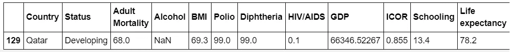

成人死亡率和艾滋病与预期寿命呈负相关，其中成人死亡率的负相关更强。这意味着，随着一个国家艾滋病毒/艾滋病死亡率和成人死亡率的上升，该国人民的预期寿命将会缩短。艾滋病毒/艾滋病和成人死亡率与预期寿命的相关系数分别为-0.6 和-0.78。

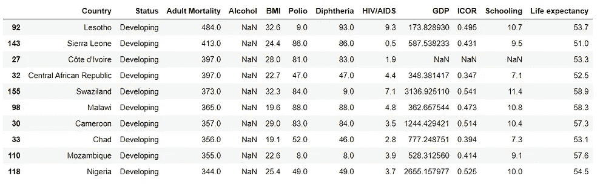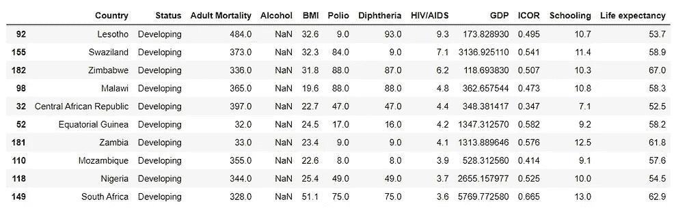

Tables showing top ten countries with the highest Adult Mortality and HIV/AIDS death rates.

从表中可以看出，在成人死亡率和艾滋病毒/艾滋病死亡率高的国家中，这种情况很常见。这些国家大多是发展中的非洲国家，它们的 ICOR 值很低，这意味着它们没有有效地利用现有资源。

资源的收入构成具有最高的相关系数 0.91，这意味着如果一个国家有效地利用其资源，它更有可能看到其公民比预期寿命更长。

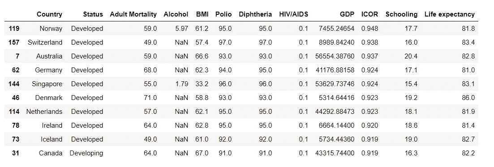

Top ten countries with the highest ICOR value

ICOR 值从 0 到 1 分级。表现最好的十个国家的 ICOR 值从 0.92 到 0.95 不等，它们的公民预期寿命都在 80 岁以上。一个共同的趋势是，除了排在第十位的加拿大之外，所有这些国家都是发达国家。

# 结论

每个人都希望过上美好的生活，过上健康的生活，减少压力。作为人类，我们有责任利用我们在这个星球上拥有的资源来实现这一目标。我们需要创造一个世界，让人们在以最有意义的方式生活的同时，充分发挥自己的潜力。

用于运行这个项目的代码可以通过这个[**链接**](https://github.com/MUbarak123-56/DataBEL/blob/master/LIFE%20EXPECTANCY%20PROJECT.ipynb) 找到。