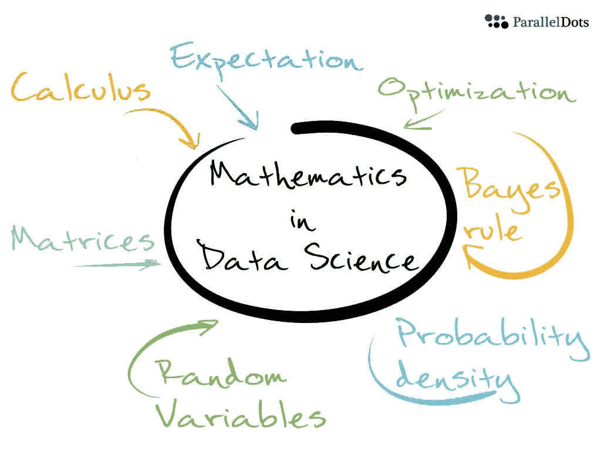
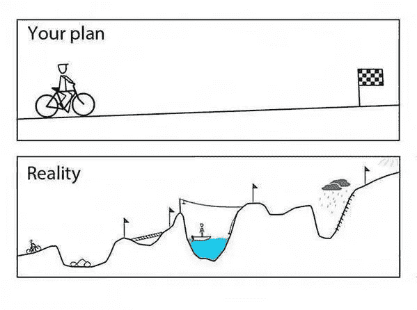

# 我如何开始学习数据科学？

> 原文：<https://towardsdatascience.com/how-do-i-get-started-in-data-science-c4d38010ced?source=collection_archive---------35----------------------->

## 如果你希望在 2020 年开始数据科学之旅，请阅读本文。

Photo by [Tim Mossholder](https://unsplash.com/@timmossholder?utm_source=medium&utm_medium=referral) on [Unsplash](https://unsplash.com?utm_source=medium&utm_medium=referral)

过去几年，开启数据科学之旅引起了广泛关注。有几门课程和大学项目可供选择，许多有抱负的学生或职业转型者认为这是他们梦想的工作。

根据哈佛商业评论，数据科学是 21 世纪最性感的工作。此外，企业年复一年地增加数据科学家的雇佣比例。

如果您对涉足数据世界感兴趣，本文将在您的旅程中为您提供帮助。所以保持领先！

以下是对任何有抱负的数据科学家的一些重要建议:

> 不要为了钱去做数据科学。

当考虑一份工作或追求一个新的职业时，钱通常是一个关键因素。虽然钱是必不可少的，但记住你会花更有价值的东西，那就是你的时间。

> 根据 2015 年 LinkedIn 对 1 万多人的调查，员工给出的最常见的离职原因包括对工作的多个方面缺乏工作满意度。

如果你不喜欢你正在做的事情，你就在拿工作和家庭的幸福冒险。

此外，不同国家和不同公司的工资水平也有很大差异。

***所以，不要把收入看得比工作/职业满意度更重要。如果你投资于你的激情，你总能赚到很多钱。***

> 数学是你的朋友。

Mathematics in DS by ParallelDots.

这不应该让你气馁，但事实上，要成为一名数据科学家，你确实需要了解一些数学基础。

范围从线性代数，概率，统计等。这些将帮助你掌握不同机器学习算法背后的逻辑。

如果你想赢得一场战斗，带上你的武器，掌握你的技术。如果你要解决一个数据科学问题，你也想做同样的事情，让数学成为你的盟友。

> 多编程。

虽然有一个神话说数据科学家不编码，但事实远非如此；你将需要写干净和高质量的代码。

随着数据科学实践的成熟，数据科学项目将需要自动化、可再现性、可伸缩性、可移植性和可扩展性。

我应该用 R 还是 Python 编程？选择你熟悉的语言，并开始发展你的编程技能。编程语言只是解决问题的工具。你的项目带来的价值才是最重要的。

> 发现问题的商业层面。

> 苏格拉底说:“**理解一个问题是半个答案”**。

当然，我们在大学期间都听过这句话。数据科学也不例外。

为了建立成熟和强大的数据科学能力，您必须学会如何针对数据提出正确类型的问题。这植根于对业务以及业务挑战如何产生的深刻理解。

构建一个有效的业务案例包括确定几个与业务流程直接相关的重要元素，这些元素易于理解和量化。

***业务理解为有效的解决方案铺平了道路。***

> 不要期待直接的结果。

在找到最终解决方案之前，有许多工作要做:收集数据、清理数据、探索数据、设计特征并在训练模型之前选择重要的特征，等等。每一步都会对结果产生重大影响，每一步都会引导你走向下一步。此外，一些快速的假设可能会误导你。 ***需要耐心！***

The road might seem complicated, but it is absolutely worth it!

> 每天都要学习。

数据科学是一个多学科领域，每天都有新技术和技巧发布。不要对现有的信息量感到沮丧。努力找到共同的逻辑；这将有助于你将点点滴滴联系起来，快速学习。此外，实践理论知识对你的学习也至关重要。所以， ***发现，阅读，练习，重复！***

# 最后的想法

如果你对数据科学充满热情，不要因为你需要学习的东西而气馁。把它分解成小步骤，因为学习是一个旅程。总是练习你所知道的，因为熟能生巧。

> 投入你的热情，你的努力总会有回报。