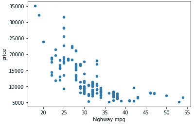
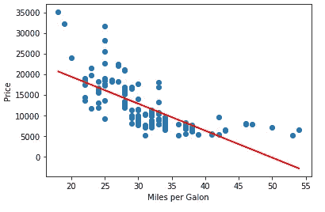
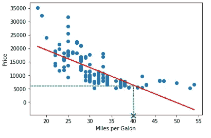
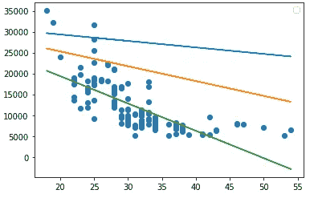
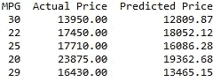

# 机器是如何学习的？

> 原文：<https://towardsdatascience.com/how-do-machines-learn-561181ed209a?source=collection_archive---------16----------------------->

## 为非计算机科学人士解释机器学习概念


Photo by [Franck V.](https://unsplash.com/@franckinjapan?utm_source=medium&utm_medium=referral) on [Unsplash](https://unsplash.com?utm_source=medium&utm_medium=referral)

# 介绍

最近关于**学**这个词闹得沸沸扬扬。我们总是听说*机器学习*、*深度学习*、*学习算法*等等。但是这到底意味着什么呢？科学家是否找到了一种方法来创建一个类似大脑的组件，并在机器中实现它？仅仅是用来卖软件和服务的营销词吗？机器会接管世界吗？或者这到底是怎么回事？

嗯…不要担心，我们还没有到那一步… **还没有！在这篇文章中，我将介绍什么是真正的学习，以及科学家如何教会计算机完成类似人类的任务，或者在某些情况下，甚至超越人类。这篇文章完全没有技术含量。它是这样写的，任何领域的任何人都可以理解它的思想。因此，这个概念将被解释得过于简单。其他概念丰富的主题将在以后的文章中讨论。**

# 我们为什么需要学习？

在学习发生之前，解决问题的任务依赖于编写算法。算法就是一组规则，它接受输入并返回输出作为问题的解决方案。

请考虑以下情况:给定一个数字列表，要求您按升序对它们进行排序。这个问题用算法解决。其实有很多[算法](https://en.wikipedia.org/wiki/Sorting_algorithm)来解决这个任务。它们的工作方式是获取列表，应用一些规则和操作，并以排序的方式返回列表。这个问题和其他类似的问题对计算机科学家来说“不知何故”很容易。他们只需要思考并想出一个算法来解决给定的任务。

另一方面，有些问题不太容易用算法解决。人们开始对计算机提出更多的要求。他们希望机器具有解决非常困难的任务的超强能力。科学家完全不知道如何编程的任务。例如:如何编写一个算法，获取一个动物的图像并输出它的类型？对于人类来说，这是一项非常容易的任务，但用算法解决它是一项非常复杂的任务，如果不是不可能的话。人类知道如何对动物照片进行分类，但他们不知道如何描述他们获得答案的步骤。这里出现了一个重要的问题。如何解决连人类都不知道如何描述的问题？

> **学习可以拯救一切！人类从经验中学习，机器也是如此。**

想象一个房间，里面有一个漂亮的壁炉，一个小孩在玩耍。孩子的头脑完全是新鲜的，根本不知道什么是壁炉。他总是想探索和学习东西。他看到了红色的火焰，对他来说，这是一种新奇、迷人、有趣的研究。在他看来，这就像让我们去触摸它！不幸的是，痛苦来了，孩子从有害的**经历中学会了**以后不要碰火。这里我强调一下**体验**，因为这就是学习的意义所在。

# 学习的类型

学习背后的理念非常简单直观。为了让计算机学习一项任务，我们给它一组问题，后面跟着一个答案。注意，我们不知道如何描述从一个问题到一个答案的步骤，所以我们把这个任务交给我们可怜的伙伴**——机器**。这是一种叫做**监督学习**的学习。例如:考虑一个程序，它获取一幅图像并回答它是否包含一只猫。教授这个程序的方法是给它许多标记为**“是猫吗”**或**“不是猫吗”**的图像。机器的责任是学习从输入到标签的方法。怎么会？我们稍后会看到一个例子。

还有其他类别，如**无监督学习**，我们不给出问题的答案，模型必须找到找到答案的方法。有一种**强化学习**，就像视频游戏中使用的那种，模型通过选择最佳动作并从糟糕的动作中学习来获得高分。为了保持这篇文章的简单，我不会进入细节，但我猜你已经得到了大致的想法。

# 它是如何工作的？

是时候解开谜团，知道学习背后的魔力了。我们将用一个非常简单的问题来说明这个想法。让我们说，你想开始一个新的职业生涯，销售旧车。不幸的是，你在这个领域的经验非常有限，很难定价。

为了解决这个问题，你四处寻找并从一个汽车经销商那里收集了以下信息:

1.  *马力，*
2.  *燃料类型，*
3.  每加仑英里数
4.  *门的数量，*
5.  还有最重要的*售价。*

这被认为是你的经验或背景知识，你的目标是从中学习。

为了简单起见，我们先拿 *mpg* 来说，其他功能我们以后再加。现在，让我们开始思考。*价格*必须与 *mpg* 有关系。让我们画一张图，显示*价格*相对于 *mpg:* 的变化



图表显示 mpg 越多，汽车越便宜。也许这是因为 mpgs 更多的车更经济，因此比强劲的车便宜。

现在我们有了一个基本的解决方案，当一辆类似 *mpg* 的新车到来时，我们简单地指定和以前一样的价格。但是，如果我们买了一辆价值未知的新车呢？这是学习背后的主要目标，**我们想知道这些值是如何计算的…**

为此，我们首先提出一个可能的计算模型。我们认为两者之间存在线性关系。这种关系可以描述为一条直线，如下图所示:



我们使用这条线作为我们的参考，当我们得到一个新的值时，我们把它映射到这条线上，得到我们的价格。例如:当我们得到一辆每加仑跑 40 英里的车时，我们假设价格在 6000 美元左右。很公平…



但是如何找到这条直线呢？直线由以下等式表示:

```
*price = a + b * mpg*
```

我们从数据集中知道了*价格*和 *mpg* ，但是什么是 ***a*** 和 ***b 呢？*** 简单来说， ***a*** 和 ***b*** 都是直线的参数。*****不同的值 a******b***表示不同的直线。**

****

# ****如何找到哪条线最好？****

**最佳线是更好地拟合数据点的线。所以最重要的问题是如何选择 ***a*** 和 ***b*** 的最佳值来得到最佳拟合线？为什么这个问题如此重要？嗯，因为**这是机器必须学习的全部内容……**这是每个学习模型的核心。**

**这个过程就像给吉他调音一样。我们从旋转不同的键开始，直到我们得到完美的音调。**

****

**Photo by [Marcin Nowak](https://unsplash.com/@marcin?utm_source=medium&utm_medium=referral) on [Unsplash](https://unsplash.com?utm_source=medium&utm_medium=referral)**

**在我们的例子中，情况是这样的……我们要求机器尝试不同的*和 ***b*** 值，然后将我们得到的价格与我们先前已知的数据进行比较。例如，我们从数据中得知，当 *mpg = 30，*价格=1390。我们计算所有价格的预测价格，并与实际价格进行比较。***

****

**如果给定的*和*的价格相差很大，我们改变*和 ***b*** 以达到更好的估计。我们继续这样下去，直到模型找到最佳设置。幸运的是，有一些算法可以加速和减少寻找最佳参数的搜索空间，例如[梯度下降](https://en.wikipedia.org/wiki/Gradient_descent)。*****

**用单个特征拟合一条直线并不难。这就像一个**山上的盲人**，在山下寻找一个球。但是考虑添加其他功能:**

```
****price = a + b * miles + c * horsepower + d * fuel type + e * number of doors****
```

**在这里，我们不再处于二维空间，我们的大脑甚至无法想象这种情况。所有这一切，我们仍然使用我们的模型的线性表示。更复杂的模型呢？例如拟合多项式线而不是直线。更复杂的模型需要拟合大量的参数。在这种情况下，学习过程需要大量的计算和时间。嗯，我们需要多复杂来定义我们的模型？这完全取决于数据，以及机器学习工程师的经验。**

# ****最后的想法****

**希望这篇文章解开了学习背后的谜团。学习就是发现给定模型的最佳参数值( ***a，b，c* …** )。这些值使模型能够在先前的基础上输出良好的结果。**

**由于计算机硬件的进步和价格的下降，机器学习现在成为可能。有很多机器学习模型。它们的复杂程度不同，能够解决的任务也不同。我们在本文中介绍的一种叫做**线性回归**，这是最简单但非常强大的算法之一。**

**如果你喜欢这篇文章，请点击“鼓掌”按钮，我将不胜感激👏所以可能会传染给他人。也可以在 [*推特*](https://twitter.com/alimasri1991) *，* [*脸书*](https://www.facebook.com/alimasri91) *，* [*上关注我直接发邮件给我*](mailto:alimasri1991@gmail.com) *或者在*[*LinkedIn*](https://www.linkedin.com/in/alimasri/)*上找我。***