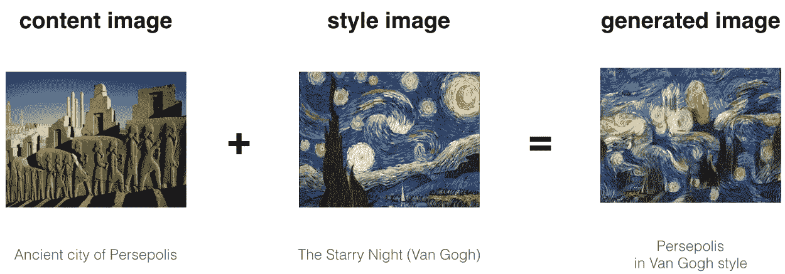
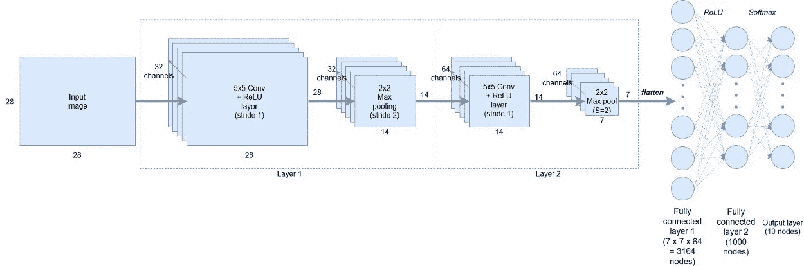
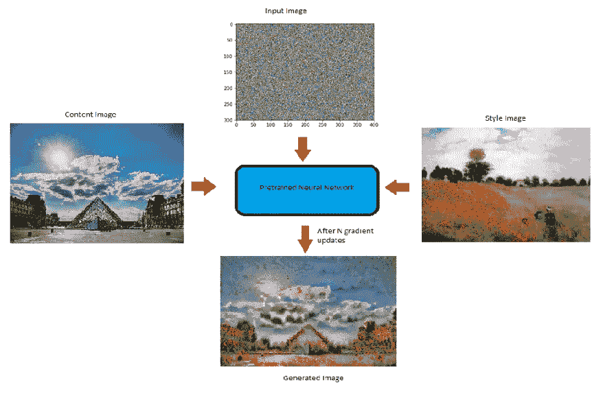
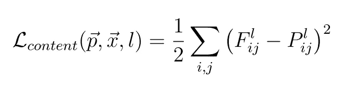
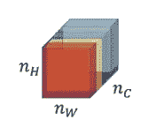
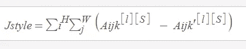
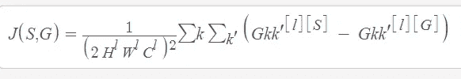

# 神经类型转换是如何工作的？

> 原文：<https://towardsdatascience.com/how-do-neural-style-transfers-work-b76de101eb3?source=collection_archive---------13----------------------->

## #InsideNST

## 深度学习可以捕捉一幅图像的内容，并将其与另一幅图像的风格相结合。这种技术被称为神经风格转移。但是，神经风格转移是如何运作的呢？在这篇博客文章中，我们将探讨神经风格转移(NST)的潜在机制。

# 高级直觉

神经类型转换概述

正如我们所看到的，生成的图像具有内容图像的内容和样式图像的样式。可以看出，上述结果不能简单地通过重叠图像来获得。现在，问题仍然是，我们如何确保生成的图像具有内容图像的内容和风格图像的风格？我们如何捕捉各自图像的内容和风格？
为了回答上述问题，我们来看看卷积神经网络(CNN)实际在学习什么。

# 卷积神经网络捕获了什么？

看下面的图片。

卷积神经网络的不同层次

现在，在第 1 层，使用 32 个过滤器，网络可以捕捉简单的模式，比如一条直线或一条水平线，这可能对我们来说没有意义，但对网络来说非常重要，慢慢地，当我们向下移动到有 64 个过滤器的第 2 层时，网络开始捕捉越来越复杂的特征，可能是狗的脸，也可能是汽车的轮子。这种对不同简单和复杂特征的捕捉称为特征表示。
这里需要注意的是，中枢神经系统不知道图像是什么，但它们学习对特定图像所代表的内容进行编码。卷积神经网络的这种编码性质可以帮助我们进行神经风格转换。让我们再深入一点。

# 如何使用卷积神经网络来捕获图像的内容和风格？

VGG19 网络用于神经类型转换。VGG-19 是一个卷积神经网络，它是在来自 ImageNet 数据库的 100 多万幅图像上训练的。该网络有 19 层深，基于数百万幅图像进行训练。因此，它能够检测图像中的高级特征。
现在，CNN 的这种“编码本质”是神经风格转移的关键。首先，我们初始化一个有噪声的图像，这将是我们的输出图像(G)。然后，我们计算此图像与网络中特定层(VGG 网络)的内容和样式图像的相似程度。由于我们希望输出图像(G)具有内容图像(C)的内容和风格图像(S)的样式，因此我们计算生成的图像(G)相对于相应的内容(C)和风格图像的损失。
基于以上的直觉，我们来定义随机生成的噪声图像的内容丢失和风格丢失。

Working of NST model

# 内容丢失

计算内容丢失意味着随机生成的有噪声图像(G)与内容图像(C)的相似程度。为了计算内容损失:

假设我们在预先训练的网络(VGG 网络)中选择一个隐藏层(L)来计算损失。因此，设 P 和 F 是原始图像和生成的图像。并且，F[l]和 P[l]是层 L 中各个图像的特征表示。现在，内容损失定义如下:

Content Cost Function

这就结束了内容损失函数。

# 风格丧失

在计算风格损失之前，让我们看看“**图像风格**是什么意思，或者我们如何捕捉图像的风格。

# 我们如何捕捉图像的风格？

Different channels or Feature maps in layer l

该图像显示了在特定选择的层 l 的不同通道或特征图或过滤器。现在，为了捕捉图像的风格，我们将计算这些过滤器彼此的“相关”程度，即这些特征图的相似程度。**但是相关性是什么意思呢？**

让我们借助一个例子来理解它:

让上面的图像中的前两个通道是红色和黄色。假设，红色通道捕捉一些简单的特征(比如垂直线)，如果这两个通道相关，那么只要图像中有一条垂直线被红色通道检测到，就会有第二个通道的黄色效果。

现在，让我们看看如何计算这些相关性(数学上)。

为了计算不同滤波器或通道之间的相关性，我们计算两个滤波器的激活向量之间的点积。这样得到的矩阵称为**克矩阵**。

但是我们如何知道它们是否相关呢？

如果两个滤波器激活的点积很大，那么两个通道被认为是相关的，如果它很小，那么图像是不相关的。**从数学上来说:**

样式图像的 Gram 矩阵:

这里 k 和 k '代表层 l 的不同滤波器或通道，我们称之为 Gkk'[l][S]。

样式图像的 Gram 矩阵

生成图像的 Gram 矩阵(G):

这里 k 和 k '代表层 L 的不同滤波器或通道，我们称之为 Gkk'[l][G]。

Gram Matrix for generated Image

现在，我们可以定义风格损失了:

样式和生成图像之间的成本函数是样式图像的 Gram 矩阵和生成图像的 Gram 矩阵之间的差的平方。

Style cost Function

现在，让我们定义神经类型转移的总损失。

# 总损失函数:

总损失函数是内容和风格图像的成本之和。数学上，它可以表示为:

Total Loss Function for Neural Style Transfer

你可能已经注意到了上式中的α和β。它们分别用于衡量内容和风格成本。通常，它们定义了生成的输出图像中每个成本的权重。

一旦损失被计算出来，那么这个损失可以通过使用**反向传播**来最小化，这反过来会优化我们的**随机生成的图像**成为一个**有意义的艺术品**。

这总结了神经类型转移的工作。

# 使用张量流实现神经类型转换；

在我的 Github 账号上实现:[https://Github . com/Blackburn 07x/convolutionary-Neural-network/tree/main/Neural % 20 style % 20 transfer](https://github.com/blackburn07x/Convolutional-Neural-network/tree/main/Neural%20Style%20Transfer)

# 结论

在这篇博客中，我们深入了解了神经风格转移是如何工作的。我们还研究了 NST 背后的数学原理。我很想在评论区和你聊聊。希望这有助于你理解**神经类型转移**

我很乐意在# I[insta gram](https://www.instagram.com/ayushsingh.__/?source=post_page---------------------------)上与您联系。谢谢你与我分享你的时间。