# 人们对拯救海龟有什么感受？

> 原文：<https://towardsdatascience.com/how-do-people-feel-about-saving-sea-turtles-8e723d10e8e0?source=collection_archive---------22----------------------->

## 使用 VADER 对# savetheturtles 推文的情感分析

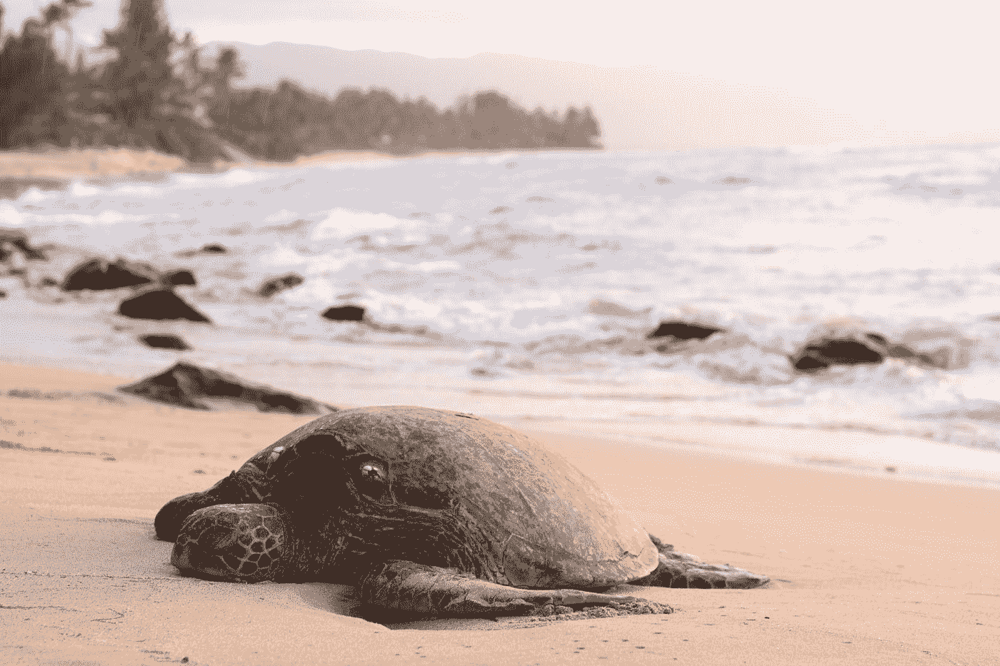

Photo by [Jeremy Bishop](https://unsplash.com/@jeremybishop?utm_source=medium&utm_medium=referral) on [Unsplash](https://unsplash.com?utm_source=medium&utm_medium=referral)

像我的许多同龄人一样，气候变化和环境可持续发展是我一直知道并关心的事情，但直到我看到一个从海龟鼻孔中提取塑料吸管的视频后，我才付诸行动。

(听起来很恐怖)。

从那以后，我被迫更多地考虑我的塑料消费，并热衷于使用金属吸管来减少我的废物足迹。

吸管特别危险，因为它们体积小，重量轻，不仅更容易卡在不幸的海龟鼻孔里，而且吸管更难回收利用。

事实上…

> “B [因为由相对较薄的材料制成，吸管可以更快地分解成更小的塑料颗粒，即微塑料。在大多数设施中，它们也不容易回收。](https://www.eater.com/2018/7/12/17555880/plastic-straws-environment-pollution-banned-alternatives-ocean-sea-turtle-viral-video)[据 EcoCycle](http://www.ecocycle.org/bestrawfree/faqs) 报道，美国人每天大约使用 5 亿根一次性吸管

谢天谢地，这个视频已经对#停止吮吸运动产生了重大影响。早在 7 月，西雅图成为美国第一个禁止塑料餐具和吸管的城市，星巴克宣布计划到 2020 年在其所有门店逐步淘汰塑料吸管！

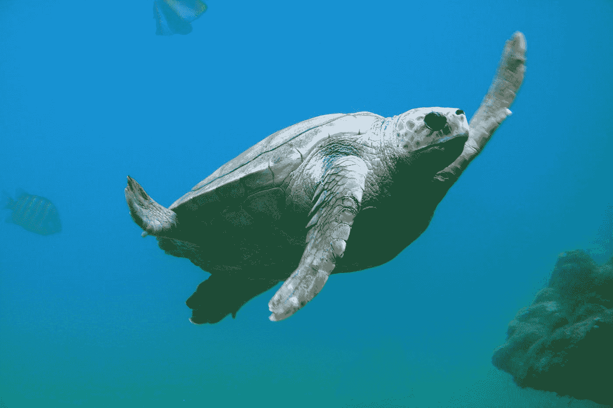

High five! // Photo by [Tanguy Sauvin](https://unsplash.com/@tanguysauvin?utm_source=medium&utm_medium=referral) on [Unsplash](https://unsplash.com?utm_source=medium&utm_medium=referral)

但这也让我想知道——病毒式传播 6 个月后，#SavetheTurtles 运动还有多大影响？围绕稻草运动的普遍情绪是什么？我决定刮掉 Twitter 标签#savetheturtles，看看我能找到什么。

*所有代码都可以在我的 Github 页面上找到。*

[](https://github.com/helenashi95/savetheturtles_sentimentanalysis) [## Helena Shi 95/savetheturtles _ sensitive analysis

### 中间文章的代码“人们对海龟有什么感觉？使用…对# savetheturtles 推文进行情感分析

github.com](https://github.com/helenashi95/savetheturtles_sentimentanalysis) 

# 假设

总的来说，我认为随着时间的推移，我会看到兴趣下降。下面的谷歌趋势搜索“塑料吸管”和“海龟”的截图显示，在 6 月至 7 月期间，“塑料吸管”的搜索量出现了高峰，这也是该视频迅速传播的时间。然而，我认为推文中的总体情绪是积极的，并支持这场运动。

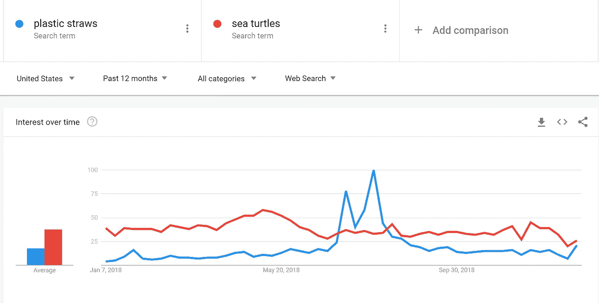

As you can see, sea turtles have generated pretty consistent searches across the year, but plastic straws spiked around June — July, which is when the video went viral.

# 数据和探索性分析

我使用了非常有用的 [TwitterScraper](https://github.com/taspinar/twitterscraper) 来抓取# savetheturtles 标签。从 2018 年 1 月到 2019 年 1 月，我能够获得大约 1500 条推文。

我在 Jupyter 笔记本上通过预处理代码开始了我的分析。使用 NLTK，我将文本转换成小写，去掉标点符号，并删除停用词。

从那里，我找到了这些推文中使用频率最高的词。

```
#Calculate frequency.
fdist = nltk.FreqDist(filtered_stopwords)
fdist.most_common(10)
```

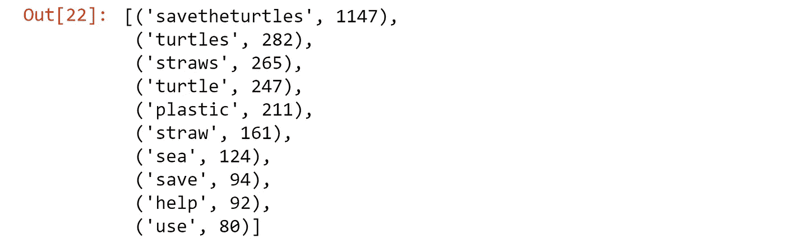

但是，也有一些冗余，比如“稻草”和“吸管”。因此，我对单词进行了词条化，以找到单词的词根(例如，“running”和“runs”都被简化为“run”)。

```
#try again with lemmatized words
**from** nltk.corpus **import** wordnet#create a function that would return WORDNET POS compliance to WORDENT lemmatization (a,n,r,v) 
**def** get_wordnet_pos(treebank_tag):
 **if** treebank_tag.startswith(‘J’):
      return wordnet.ADJ
 **elif** treebank_tag.startswith(‘V’):
      return wordnet.VERB
 **elif** treebank_tag.startswith(‘N’):
      return wordnet.NOUN
 **elif** treebank_tag.startswith(‘R’):
      return wordnet.ADV
 **else**:
      # As default pos in lemmatization is Noun
      return wordnet.NOUN

wnl = WordNetLemmatizer()
#create an empty list to store lemmatized words
des_lem = []**def** wn_pos(filtered_pos):
 **for** word,pos **in** filtered_pos:
      des_lem.append(wnl.lemmatize(word,get_wordnet_pos(pos)))
      #print pos
      #print get_wordnet_pos(pos)
 **return** des_lem# Get the 10 most common words
fdist_2 = nltk.FreqDist(wn_pos(filtered_pos))
fdist_2.most_common(10)
```

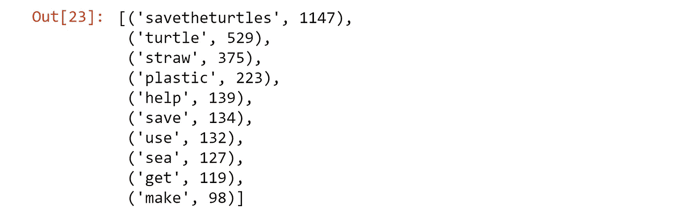

正如我们所看到的，词汇化将单词带到了根短语，允许我们绕过像“吸管”和“吸管”这样的重复单词。这也揭示了围绕这些推文的更多一般主题，包括“拯救”和“帮助”

```
bigrm = nltk.bigrams(filtered_stopwords)
fdist = nltk.FreqDist(bigrm)
fdist.most_common(10)
```

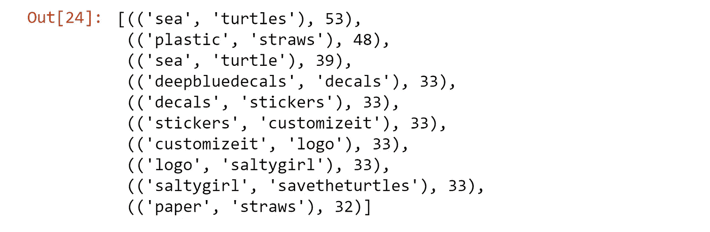

看看最常见的双字母组合，它甚至揭示了支持这项运动的企业周围的一点市场，如深蓝贴花和咸味女孩！

此外，我还想看看 6 个月后，视频的病毒式影响是否仍在影响推文。为了做到这一点，我绘制了从年初到年底每天的数字或推文。

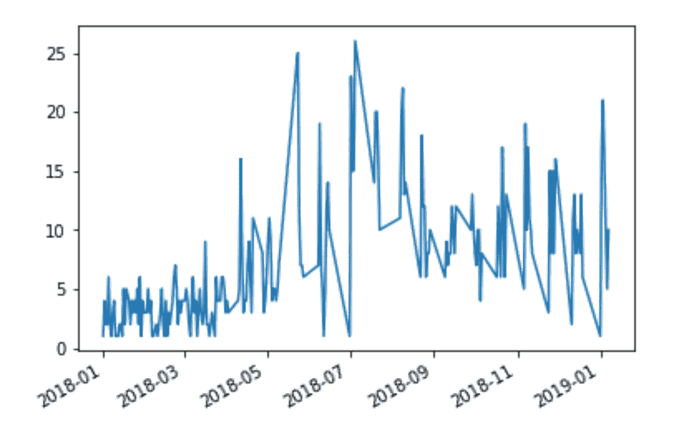

推文数量在 6 月、7 月和 8 月大幅飙升，反映了病毒式视频的影响。然而，我们也可以看到一个明确的趋势，即从接下来的几个月到今天，推文的数量总体上在增加！

# 现在谈谈情绪分析…

基于各种文章，我决定尝试 NLTK 模块 VADER 来分析每条推文的积极、消极和中性情绪。

我发现这些文章特别有帮助:

*   [http://www.nltk.org/howto/sentiment.html](http://www.nltk.org/howto/sentiment.html)
*   [https://medium . com/@ Sharon woo/情操分析-with-nltk-422e0f794b8](https://medium.com/@sharonwoo/sentiment-analysis-with-nltk-422e0f794b8)
*   [http://t-redactyl . io/blog/2017/04/using-Vader-to-handle-sensation-analysis-with-social-media-text . html](http://t-redactyl.io/blog/2017/04/using-vader-to-handle-sentiment-analysis-with-social-media-text.html)
*   [http://datameetsmedia . com/Vader-情操-分析-解释/](http://datameetsmedia.com/vader-sentiment-analysis-explained/)

```
nltk.download(‘vader_lexicon’)
**from** nltk.sentiment.vader **import** SentimentIntensityAnalyzersid = SentimentIntensityAnalyzer()#showing the sentiment scores for each tweet
**for** tweet **in** df[‘text’]:
   **print**(tweet)
   ss = sid.polarity_scores(tweet)
   **for** k **in** sorted(ss):
      print(‘{0}: {1}, ‘.format(k, ss[k]), end=’’)
      print(“\n”)
```

结果输出如下所示。

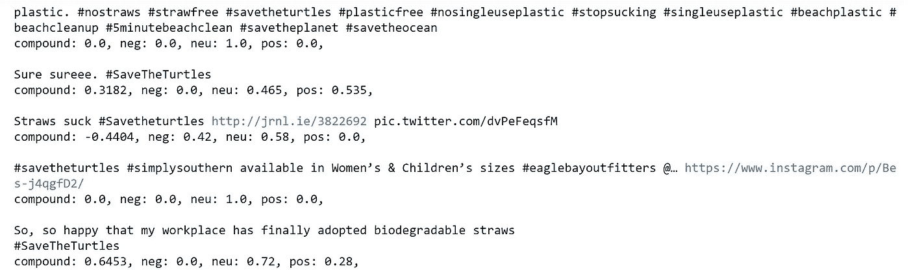

看到这个输出真的很爽。VADER 情感分析器输出四个分数:

*   阴性:阴性
*   neu:中性
*   位置:正
*   复合:复合(即综合得分)

neg、neu 和 pos 分数基于输入文本返回情感强度的浮动值。VADER 情绪分析还会为每条微博返回一个复合情绪分数，范围从-1 到 1，从最负面到最正面。

通过查看复合得分，我们可以将每条推文分为“正面”、“负面”或“中性”(分别为> 0.0、< 0.0 和== 0.0)。我们可以通过下面的代码看到分数的总体分布。

```
summary = {“positive”:0,”neutral”:0,”negative”:0}
**for** tweet **in** df[‘text’]: 
   ss = sid.polarity_scores(tweet)
   **if** ss[“compound”] == 0.0: 
      summary[“neutral”] +=1
   **elif** ss[“compound”] > 0.0:
      summary[“positive”] +=1
   **else**:
      summary[“negative”] +=1**import** matplotlib.pyplot **as** pyplot
keys = summary.keys()
values = summary.values()#add colors
colors = [‘#99ff99’, ‘#66b3ff’,’#ff9999']pyplot.axis(“equal”) # Equal aspect ratio ensures that pie is drawn as a circle
pyplot.pie(values,labels=keys,colors=colors, autopct=’%1.1f%%’, shadow=True, startangle=90)
pyplot.show()
```

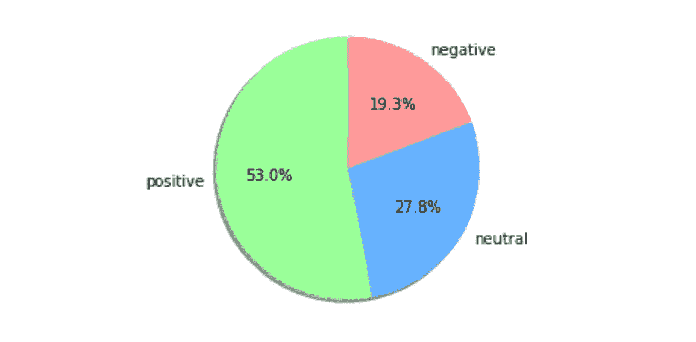

Positive: 788; Neutral: 413; Negative: 287

通过查看所有推文的复合得分的总分布，我们可以看到，总体而言，超过 50%的推文是正面的，28%是中性的，19%是负面的。

尽管 VADER 一揽子计划是一个强有力的一揽子计划，但它并不完美。仔细看还是有分类错误的。我相信这是因为许多情感分析器中使用的训练词典来跟踪积极/消极以及英语语言的持续微妙之处。

VADER 有许多有用的审查方法。它可以成功地解释积极情绪的强度，例如当“优秀”被视为比“好”更积极时。然而，这些推文并不是明确的“评论”，积极的推文可能不会使用这样的词。例如:

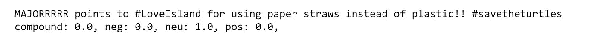

拼写错误的“MAJOR”和使用俚语，如“props ”,意味着这条推文中令人兴奋的批准在我们的分析器中丢失了。或者在这种情况下…

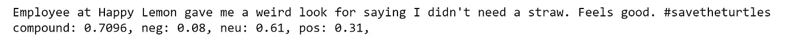

很遗憾没有检测到讽刺！

# 总之…

总的来说，这个项目表明# savetheturtles 运动仍在强劲发展！随着时间的推移，意识和推文的总量有所增加，其中绝大多数是正面推文。

诚然，有几个警告。抓取# savetheturtles 标签意味着大多数人都在转发/发推文，以示对可持续发展的支持；讨厌稻草运动的人会使用这个标签是没有道理的。回想起来，更好的做法可能是将几个标签的推文结合起来，或者在 twitter 主页面上查看标签的出现情况。

更多下次尝试！

也许在将来，我还可以在分析中使用转发和喜欢列，作为积极支持的一种衡量标准。我将非常感谢任何意见或建议，或者你可能有的其他建议！

*喜欢这篇文章？请留下评论，让我知道你对吸管、文字分析和其他方面的看法！*